# Day 26 — DT Inside Agile

> **Today's one idea:** Design Thinking discovery and Agile delivery are not competitors — DT runs upstream of Agile, feeding it validated problem statements and tested concepts instead of assumptions.
> **Reading time:** ~38 min · **Prereqs:** Days 3–4, 25
> **Primary source for today:** Liedtka, Jeanne. "Why Design Thinking Works." *Harvard Business Review*, vol. 96, no. 5, September–October 2018, pp. 72–79.
> **Before you start:** Recall Day 25's load-bearing idea — one sentence, no looking. *What are the three post-test options, and what is the primary signal that determines which to choose?*

---

## The hook *(spaced callbacks to Days 4 and 3)*

Day 4 introduced the relationship between DT and Agile at a conceptual level: DT finds the right problem; Agile builds it right. That was Day 4. You now have 21 more days of tools and practice behind you.

The question Day 4 deferred is the practical one: *exactly where in your sprint cadence does DT fit?*

This is not a theoretical question. Teams that understand the concept but can't answer the practical one never actually use DT. They run one workshop, generate HMW questions on sticky notes, and then go back to their regular backlog. The DT work doesn't connect to anything that ships.

Today you build the connection — precisely, with named hand-off points and specific artifacts.

---

## Building the intuition

There are three integration patterns, each appropriate for a different organizational context. Know all three; choose the one that matches your team's current cadence.

**Pattern 1 — Discovery Track (the cleanest integration)**

A dedicated DT discovery track runs 2–4 weeks ahead of the delivery track. The discovery track produces validated POV + HMW + tested concept. The delivery track consumes that output as Sprint 0 input — seeding the backlog with user stories that have a researched need behind them.

This requires a team willing to invest 2–4 weeks before Sprint 1. Best for: new product areas, new user segments, features with high uncertainty.

**Pattern 2 — Sprint-Embedded Discovery (the pragmatic integration)**

DT research and definition activities are embedded inside the Scrum calendar:
- **Sprint N-1's "definition" work** = running 3–5 user interviews and building an empathy map
- **Sprint N's planning** = turning the POV + HMW into the sprint's problem statement
- **Sprint N** = building the prototype in days 1–3, testing in days 4–7, iterating or reframing in days 8–10

This compresses the DT loop into one sprint and is the most common integration in product teams. Best for: feature development where user context exists but needs validation.

**Pattern 3 — Design Sprint (the intensive integration)**

A dedicated 5-day Design Sprint (Knapp's *Sprint* method) runs as a standalone event, typically quarterly or at major product decision points. It compresses the entire DT loop (minus deep empathy research) into 5 days with a cross-functional team.

Best for: high-stakes decisions, new directions, situations where the team needs to align quickly across functions. We cover this in detail on Day 27.

---

## The formal picture

**Pattern 1 — Discovery Track timing:**

```mermaid
gantt
    title DT Discovery Track + Agile Delivery Track
    dateFormat  D
    axisFormat  Week %W

    section Discovery Track
    Empathize (interviews + observation)   :a1, 1, 5d
    Define (insight + POV + HMW)           :a2, after a1, 3d
    Ideate + Prototype                     :a3, after a2, 4d
    Test + synthesize + decide             :a4, after a3, 3d

    section Delivery Track
    Sprint 0 (backlog seeding from DT output) :b1, after a2, 5d
    Sprint 1                                   :b2, after b1, 10d
    Sprint 2                                   :b3, after b2, 10d
```

**The hand-off artifacts — what DT passes to Agile:**

| DT artifact | Agile equivalent it replaces or enriches |
|------------|------------------------------------------|
| POV statement | Epic-level description ("who we're building for and why") |
| HMW question | Feature-level challenge statement (replaces vague feature requests) |
| Tested concept sketch | User story acceptance criteria (the concept defines "what done looks like") |
| Synthesis statements from testing | Definition of ready (preconditions the team has verified before sprint commitment) |

**The hand-off is not a document — it is a conversation.** The DT practitioner (PM, designer, researcher) walks the development team through the empathy research, the insight, the POV, and the concept sketch. The development team asks technical questions; the DT practitioner provides context. User stories are written collaboratively from this conversation — not handed over as a spec.

**Where DT output replaces assumptions in the backlog:**

Before DT: "As a nurse, I want real-time medication updates so I can trust the record." — *assumed user, assumed need, assumed solution.*

After DT: "As a charge nurse managing a 16-bed ward during peak census, I need to feel confident that the medication record reflects the current state because the 3-minute lag creates a safety window I can't see. (Validated by: 5 interviews + 2 observation sessions. Tested concept: visible 'last updated' timestamp + variance alert. Test confirmed: users understood the timestamp format and felt more confident during the simulated handoff.)" — *researched user, validated need, tested concept direction.*

The second version is not longer because of bureaucracy. It is longer because it contains evidence. That evidence is what prevents the development team from building the wrong thing.

---

## Where it breaks / what it is not

**DT is not a phase gate.** Some organizations implement DT as a mandatory hurdle that every feature must pass before engineering begins. This creates bottlenecks and incentivizes teams to fake the research to get through the gate. DT should be applied proportionally to uncertainty — high-uncertainty decisions deserve deep DT; low-uncertainty changes don't need it.

**Agile user stories are not DT output.** The user story format ("As a [user], I want [feature]...") is a placeholder for a conversation — not a validated research output. DT produces the evidence that makes that conversation worth having. The user story is a container; DT fills it with real content.

**"We don't have time for discovery" is a budget problem, not a time problem.** The question is not "do we have 2 weeks for discovery?" but "is 2 weeks of discovery worth more than 6 weeks of building the wrong thing?" In most cases of genuine user uncertainty, the answer is yes. The framing that makes this compelling to stakeholders: *"We're spending 2 weeks to decide what to build in the next 6. Without those 2 weeks, we're spending 6 weeks guessing."*

---

## Try it yourself

> **Close this page before attempting Exercise 1.**

**Exercise 1 — Retrieval.** Without looking: name the three DT-Agile integration patterns and state in one phrase when each one is most appropriate.

Compare to this

**Discovery Track** — most appropriate for new product areas or new user segments with high uncertainty; runs 2–4 weeks ahead of Sprint 1. **Sprint-Embedded Discovery** — most appropriate for feature development where user context exists but needs validation; embeds DT activities within a single sprint. **Design Sprint** — most appropriate for high-stakes decisions or major product pivots; a dedicated 5-day intensive that compresses the full DT loop.

---

**Exercise 2 — Direct application.** Your team is planning a new feature: a "team health check" dashboard for engineering managers. Write the enriched user story that DT output would produce — assuming you have completed the empathy research, written a POV, and tested a prototype. Make up realistic DT findings to fill it in.

A strong enriched user story

**"As an engineering manager responsible for 2–3 teams at a 150-person company, I need a weekly signal that tells me which team is trending toward burnout or disengagement — because our empathy research (4 manager interviews + 2 retrospective observations) revealed that managers currently have no leading indicators of team health; they find out about problems only when someone quits or files an HR complaint. (Validated by: 5 prototype test sessions. Tested concept: a single 'team pulse' score derived from PR cycle time, after-hours commit frequency, and eNPS delta. Test result: 4/5 managers understood the score without explanation; 3/5 said they would check it weekly. Riskiest assumption confirmed: managers want a composite score, not raw metrics. Next riskiest assumption untested: whether teams trust management to use the data constructively.)"**

The last sentence — the untested assumption — is what prevents the team from treating this as finished. Every DT-informed user story should name what was confirmed *and* what still needs to be validated in production.

---

**Exercise 3 — Stretch (spaced callbacks from Days 4 and 3).** Day 4 said DT is "upstream of Agile." Day 3 said the DT loop has backward arrows. Now that you have completed both arcs: what happens when production data from Sprint 5 sends you *back* into a DT loop? Describe the trigger, the entry point in the DT loop, and the artifact that initiates the new cycle.

The full loop-back scenario

**Trigger:** Production analytics show that 70% of engineering managers never return to the "team health check" dashboard after the first week. The feature works technically; the engagement is near zero.

**Entry point:** Return to Empathize — not Ideate or Define. The low engagement signal is ambiguous: is it a usability problem (fixable in Refine)? A POV problem (the need wasn't real)? Or a deeper wicked problem (managers want the data but their organizational context doesn't let them act on it, making the dashboard feel futile)? Only new empathy research — specifically, interviews with non-returning users — can distinguish between these.

**Initiating artifact:** A new research question, not a new HMW. "Why do managers not return after the first visit?" This question is the entry point into a new Empathize phase. The answer will produce a new insight, which may require a new POV, which generates a new HMW. The DT loop begins again — this time with production behavior as the empathy data source rather than pre-build interviews. This is the backward arrow from Day 3's loop diagram working at the product lifecycle level, not just the sprint level.

---

**Transfer — apply it:**

> Identify the next feature or product decision on your team's roadmap that carries meaningful user uncertainty. Write one sentence: which integration pattern (Discovery Track, Sprint-Embedded, or Design Sprint) would you recommend, and why?

---

## Connect it back

Day 4 planted the seed: DT and Agile belong together, not in competition. Day 26 makes it operational: three named integration patterns, specific hand-off artifacts, and the language to make the business case to your team. Tomorrow you assemble everything into a runnable plan for your first mini-sprint.

**Sharp question you should be able to answer now:** What specifically does a DT-informed user story contain that a standard user story does not — and why does that difference matter to the development team?

---

## Suggested readings for today

**Required if you have 15 extra minutes:**
Liedtka, Jeanne, "Why Design Thinking Works," *HBR*, September–October 2018, pp. 72–79 (the section "Embedding DT in the Organization," pp. 76–79). Liedtka's discussion of how organizations make DT a systemic practice — not a one-off workshop — is the most concise practitioner-level treatment of integration available.

**Free video — watch today:**
AJ&Smart, *"How to Use Design Thinking in an Agile Team"* — Search YouTube: `AJ Smart design thinking agile team`. ~9 min. AJ&Smart's practical walk-through of the Sprint-Embedded pattern with a real product team example. Directly applicable to today's page.

**Free video — companion:**
IBM Design Thinking, *"Enterprise Design Thinking — Loop"* — Search YouTube: `IBM design thinking loop`. ~5 min. IBM's version of the DT-Agile integration, which they call "The Loop" — useful for seeing how a large organization operationalizes the integration at scale.

**If you want the deep version:**
Gothelf, Jeff and Josh Seiden. *Lean UX: Applying Lean Principles to Improve User Experience.* O'Reilly, 2013 (3rd ed. 2021). Chapter 3 "Outcomes, Assumptions, and Hypotheses" and Chapter 5 "Collaborative Design." Lean UX is the most mature framework for embedding user research into Agile sprints — it is a direct bridge between DT and Agile at the team-practice level. Reading time for two chapters: ~50 additional minutes. Strongly recommended for practitioners who will be running DT inside an existing Agile organization.

---

## Navigation

← **Previous:** [Day 25 — Iteration: When to Pivot vs. Persevere](../../06-test-and-iterate/days/day-25-iteration-pivot-vs-persevere.md)
→ **Next:** [Day 27 — Planning Your First DT Sprint](./day-27-planning-your-first-dt-sprint.md)
