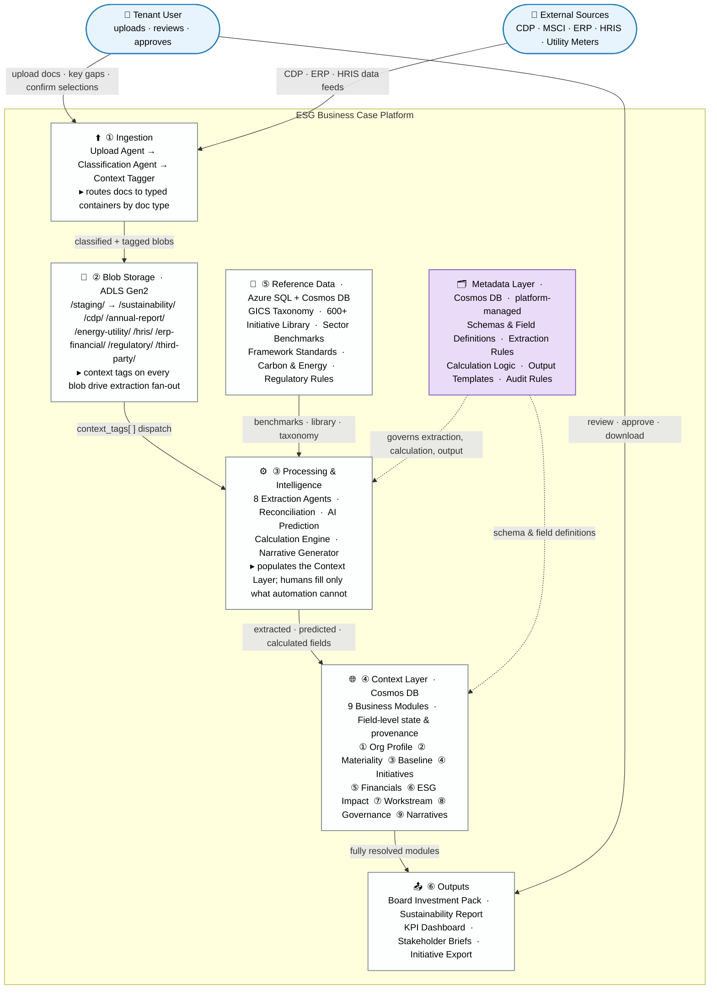
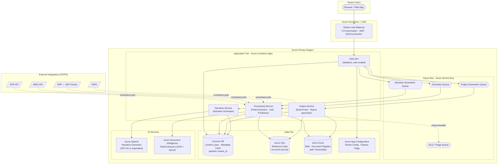
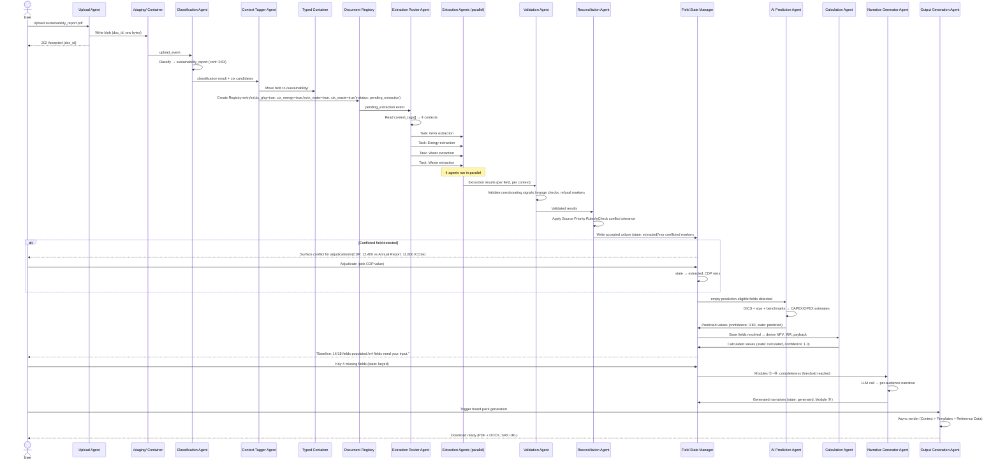

# ESG Business Case Platform — Refined Data Architecture

**Aligned to:** Functional Specification v1.0 (May 2026)
**Core design principle:** Humans key as little as possible. Documents and integrations populate fields by default; AI predictions fill gaps from sector benchmarks; manual entry is reserved for what neither source can provide.

---

## 1. What Changes vs. the Previous Architecture

The previous refinement introduced **context-tagged ingestion** — documents bound to one or more context types at upload, with targeted extraction per context. The spec confirms that direction but pushes it further:

| Dimension | Previous (context-tagged) | Refined (spec-aligned) |
|---|---|---|
| Extraction granularity | Doc → Context (e.g., "feeds ESG Baseline") | **Doc → Field** (e.g., "yields `scope1_emissions` into Baseline") |
| Context Layer shape | Free-form per context (markdown) | **Structured per Module Schema** matching the 9 spec modules |
| Reference Data role | Lookup tables for benchmarks | **Drives application logic** — Initiative Library, GICS taxonomy, sector benchmarks are first-class |
| Population sources | Extraction only | **Extraction + AI Prediction + Calculation + Manual** (in priority order) |
| Per-field metadata | Implicit | **Mandatory:** value · state · source · confidence · 3 version axes |
| "What's missing" UX | Not modeled | **Field State Manager** is a named component |
| AI's role | Document understanding | Document understanding **+ sector-benchmark inference** for CAPEX/OPEX/benefits/KPIs |
| Extraction governance | Implicit (lived in extractor code) | **Explicit Metadata components** — Doc Type Recognition, Locate / Normalise / Validate rules, all platform-governed and version-tracked |

---

## 2. Architecture Diagrams

### 2.1 High-Level Overview

Seven layers, three actor types, one design principle: humans key as little as possible.



---

### 2.2 Detailed Architecture

Full internal structure of every layer, all agents named, all data flows and governance arrows shown.

```mermaid
flowchart TB

    %% ============ METADATA LAYER ============
    subgraph META["🗂️ Metadata Layer · Platform-Managed · Cosmos DB"]
      direction LR

      subgraph META_SCHEMA["📐 Schema &amp; Catalog"]
        MS["Module Schemas<br/><i>9 modules from spec §5</i>"]
        FD["Field Definitions<br/>type · unit · required · validation ·<br/>extraction_eligible flag"]
      end

      subgraph META_EXTRACT["📥 Extraction Governance"]
        DTR["Doc Type Recognition Rules<br/>patterns to classify uploads"]
        DFM["Doc → Field Mapping<br/>per doc type &amp; integration source"]
        ERL["Extraction Rules · Locate<br/>section hints · table patterns ·<br/>exclusion zones · page targeting"]
        ERN["Extraction Rules · Normalise<br/>unit conversions · canonical units ·<br/>temporal selection · scope/boundary"]
        ERV["Extraction Rules · Validate &amp; Refuse<br/>corroborating signals ·<br/>forward-looking / illustrative filters"]
        CTH["Confidence Thresholds<br/>auto-accept vs review queue"]
        SPR["Source Priority Rules<br/>CDP > sustainability rpt > annual rpt"]
      end

      subgraph META_CALC["🧮 Calculation &amp; Logic Rules"]
        BSR["Business Size Rules<br/>premises × employees → category"]
        SWR["Stakeholder Weighting<br/>1.1× – 1.6× per group"]
        MCR["Materiality Calc Rules<br/>incl. double materiality"]
        FCR["Financial Calc Logic<br/>NPV · IRR · Payback · DCF 5yr"]
        SCP["Scenario Parameters<br/>base · ±20%/±10% · TCFD 1.5/2/3°C"]
      end

      subgraph META_OUT["📤 Output &amp; Audit"]
        OTM["Output Templates<br/>board pack · sustainability rpt · briefs"]
        ARG["Audit &amp; Provenance Rules"]
      end
    end

    %% ============ 1 · INGESTION ============
    subgraph ING["⬆️ 1 · Ingestion Layer"]
      direction TB
      DOCS["📄 Uploaded Docs<br/>Sustainability Report · Annual Report ·<br/>CDP Response · Energy Bills · HR Exports"]
      INTGR["🔌 Integration Sources<br/>CDP · MSCI · ERP (SAP/Oracle) ·<br/>HRIS · Utility Meters · M365 SSO"]
      MANUAL["⌨️ Manual Entry<br/><i>only for gaps the system cannot fill</i>"]
      UPLOAD_AGENT["🤖 Upload Agent<br/>format validation · virus scan ·<br/>write to staging container"]
      CLASS_AGENT["🏷️ Classification Agent<br/>doc_type · confidence · candidate<br/>extraction contexts (ctx:*)"]
      CTX_TAGGER["🔖 Context Tagger Agent<br/>applies blob index tags ·<br/>routes to typed container"]
      DOCS --> UPLOAD_AGENT
      INTGR --> UPLOAD_AGENT
      UPLOAD_AGENT --> CLASS_AGENT
      CLASS_AGENT --> CTX_TAGGER
    end

    %% ============ 2 · BLOB STORAGE — TYPED CONTAINERS ============
    subgraph BLOB["💾 2 · Blob Storage · ADLS Gen2 · Typed Containers · Source of Truth"]
      direction TB
      STAGING["📥 /staging/<br/><i>raw uploads · pre-classification</i>"]

      subgraph TYPED["Typed Containers (post-classification)"]
        direction LR
        C_SUST["📊 /sustainability/<br/><b>ctx:</b> ghg_emissions · energy ·<br/>water · waste · diversity · safety"]
        C_CDP["📋 /cdp/<br/><b>ctx:</b> ghg_emissions · energy ·<br/>regulatory · esg_ratings"]
        C_AR["📰 /annual-report/<br/><b>ctx:</b> org_profile · financial_baseline ·<br/>regulatory"]
        C_ENERGY["⚡ /energy-utility/<br/><b>ctx:</b> energy · carbon"]
        C_HRIS["👥 /hris/<br/><b>ctx:</b> diversity · health_safety"]
        C_ERP["💰 /erp-financial/<br/><b>ctx:</b> financial_baseline · capex_opex"]
        C_REGUL["⚖️ /regulatory/<br/><b>ctx:</b> regulatory_compliance"]
        C_3P["⭐ /third-party/<br/><b>ctx:</b> esg_ratings"]
      end

      REG["📑 Document Registry<br/>tenant · doc_id · container · doc_type ·<br/>context_tags[] · target_fields[] ·<br/>extraction_status_per_field · source_priority_rank"]
    end

    %% ============ 3 · PROCESSING & INTELLIGENCE ============
    subgraph PROC["⚙️ 3 · Processing &amp; Intelligence Layer"]
      direction TB
      ROUTER["🔀 Extraction Router Agent<br/>reads context_tags[] from Registry ·<br/>fans out to relevant extraction agents only"]

      subgraph EXT_AGENTS["🧬 Extraction Agents (invoked per context tag)"]
        direction LR
        EA_GHG["GHG Agent<br/>ctx:ghg_emissions"]
        EA_EN["Energy Agent<br/>ctx:energy · ctx:carbon"]
        EA_WW["Water &amp; Waste Agent<br/>ctx:water · ctx:waste"]
        EA_DIV["Workforce Agent<br/>ctx:diversity · ctx:health_safety"]
        EA_FIN["Financial Agent<br/>ctx:financial_baseline · ctx:capex_opex"]
        EA_ORG["Org Profile Agent<br/>ctx:org_profile"]
        EA_REG["Regulatory Agent<br/>ctx:regulatory_compliance"]
        EA_CDP["CDP Agent<br/>ctx:esg_ratings<br/><i>structured questionnaire parser</i>"]
      end

      RECON["🔄 Reconciliation Agent<br/>cross-doc · cross-context conflict resolution<br/>Source Priority Rules · tolerance check"]
      AIP["🤖 AI Prediction Engine<br/>GICS + size + geo → CAPEX · OPEX ·<br/>benefits · ESG KPIs (±20% @ p80)<br/><i>confidence fixed at 0.80</i>"]
      CALC["🧮 Calculation Engine<br/>business_size · NPV · IRR · payback ·<br/>scenarios · prioritisation quadrant<br/><i>state: calculated · confidence: 1.0</i>"]
      FSM["📋 Field State Manager<br/><b>empty / extracted / predicted / calculated<br/>keyed / overridden / conflicted / generated</b><br/>completeness gates · review queue · conflict UI"]
      NG["🗣️ Narrative Generator<br/>LLM (Azure OpenAI)<br/>field-verified input only · fail-open<br/><i>state: generated</i>"]
      DLQ["🗑️ DLQ / Triage Queue<br/>3-strike retry · tenant notification<br/>ops escalation for infra errors"]
      ROUTER --> EXT
      EXT --> RECON
      RECON --> FSM
      AIP --> FSM
      CALC --> FSM
      NG --> FSM
      ROUTER -.-> DLQ
    end

    %% ============ 4 · CONTEXT LAYER ============
    subgraph CTX["🌐 4 · Context Layer · Per-Tenant · Field-Versioned · Cosmos DB"]
      direction LR
      M1["① Organisation Profile<br/>GICS · premises · employees ·<br/>size [derived] · geo · maturity"]
      M2["② Materiality Assessment<br/>stakeholder weights · topic ranks ·<br/>double-materiality scores · in-scope topics"]
      M3["③ Baseline Measurements<br/>energy · GHG (S1/2/3) · water · waste ·<br/>fleet · suppliers · diversity · safety"]
      M4["④ Selected Initiatives<br/>refs to library + per-initiative overrides"]
      M5["⑤ Business Case Financials<br/>CAPEX · OPEX · NPV · IRR · payback ·<br/>3 financial + 3 TCFD scenarios"]
      M6["⑥ ESG Impact Profile<br/>tCO2e · MWh · ML · % per initiative"]
      M7["⑦ Workstream Plan<br/>5-stream model · owners · duration · milestones"]
      M8["⑧ Governance Structure<br/>sponsor · cost centre · delivery lead ·<br/>KPI custodian · reporting cadence"]
      M9["⑨ Generated Narratives<br/>per audience (board, investor, customer, ...)"]
      PROV["📌 <b>Every field carries:</b><br/>value · state · source_ref · confidence ·<br/>extractor_version · schema_version · extraction_rules_version ·<br/>calculation_rule_version · timestamp · author<br/><i>state: empty|extracted|predicted|calculated|keyed|overridden|conflicted|generated</i><br/><i>source.type: document|integration|ai_prediction|calculation|user|ai_generation</i>"]
    end

    %% ============ 5 · REFERENCE DATA ============
    subgraph REF["📖 5 · Reference Data · Platform-Managed · Read-Only"]
      direction LR
      GICS["🏷️ GICS Taxonomy<br/>11 sectors · 69 sub-industries"]
      LIB["🏛️ ESG Initiative Library<br/><b>600+ initiatives · 80+ structured records</b><br/>ESG cat → component → subcomponent<br/>refs: ECC.4, ESS.12, etc."]
      BENCH["📊 Sector Benchmarks<br/>financial &amp; ESG KPIs by GICS sub-industry<br/>peer averages · best-in-class"]
      REG_RULES["⚖️ Country Regulatory Rules<br/>CSRD · modern slavery · emissions targets"]
      FRAMEWORKS["📚 Framework Standards &amp; Mappings<br/>GRI · SASB · TCFD · ISSB S1/S2 · UN SDG"]
      CARBON["🌍 Carbon &amp; Energy<br/>emission factors · price curves"]
      TECH["🛠️ Technology Cost Curves"]
      AUD["🎯 Audience Templates<br/>board · investor · customer ·<br/>employee · regulator tone profiles"]
      RATINGS["⭐ ESG Rating Targets<br/>MSCI AAA · Sustainalytics thresholds"]
    end

    %% ============ 6 · OUTPUT ============
    subgraph OUT["📤 6 · Output Data Store"]
      direction LR
      MATRIX["Prioritisation Matrix<br/>quick wins · strategic · nice-to-have · deprioritise"]
      BPACK["Board Investment Pack<br/>PDF · DOCX"]
      ESGR["Sustainability Report<br/>PDF · DOCX (GRI/ISSB aligned)"]
      XPORT["Initiative Data Export<br/>XLSX"]
      BRIEF["Stakeholder Briefs<br/>per audience"]
      DASH["KPI Dashboard"]
      VERS["📦 Version History<br/>full output snapshots"]
    end

    %% ============ DATA FLOWS ============
    CTX_TAGGER -->|"write to typed container"| TYPED
    UPLOAD_AGENT -->|"write to staging"| STAGING
    TYPED --> REG
    REG -->|"dispatch: doc + context_tags[]"| ROUTER
    ROUTER -->|"fan-out per ctx:* tag"| EXT_AGENTS
    EXT_AGENTS --> RECON
    MANUAL -->|"validated gap-filling"| FSM
    FSM --> CTX
    LIB -->|"initiative metadata"| AIP
    BENCH -->|"sector inference base"| AIP
    GICS -->|"size category lookup"| CALC
    FCR -.->|"NPV/IRR/payback formulas"| CALC
    SCP -.->|"scenario deltas"| CALC
    CTX -->|"resolved fields (modules ①–⑧)"| NG
    AUD -.->|"tone + metric-emphasis"| NG
    FRAMEWORKS -.->|"disclosure tags"| NG
    CTX --> OUT
    FRAMEWORKS -.->|"disclosure mapping"| OUT
    OTM -.->|"document templates"| OUT
    FSM -.->|"what's still missing"| MANUAL

    %% ============ GOVERNANCE ============
    DTR -.->|"doc type patterns"| CLASS_AGENT
    META_EXTRACT -.->|"locate · normalise · validate rules"| EXT_AGENTS
    META_CALC -.->|"formulas + parameters"| CALC
    META_SCHEMA -.->|"field structure"| CTX
    META -.->|"catalog discipline"| REF
    META_OUT -.->|"templates &amp; audit"| OUT

    %% ============ STYLING ============
    classDef metaStyle fill:#EADCF8,stroke:#7E57C2,stroke-width:2px,color:#000
    classDef ingStyle fill:#FFF4CC,stroke:#D4A82C,stroke-width:2px,color:#000
    classDef blobStyle fill:#D6E8F5,stroke:#4A90C2,stroke-width:2px,color:#000
    classDef procStyle fill:#FFE0CC,stroke:#E07B3F,stroke-width:2px,color:#000
    classDef ctxStyle fill:#D6F5DD,stroke:#5BA670,stroke-width:2px,color:#000
    classDef refStyle fill:#FFD6D6,stroke:#C25B5B,stroke-width:2px,color:#000
    classDef outStyle fill:#FFE0B3,stroke:#D4881C,stroke-width:2px,color:#000
    class META metaStyle
    class ING ingStyle
    class BLOB blobStyle
    class PROC procStyle
    class CTX ctxStyle
    class REF refStyle
    class OUT outStyle
```



---

## 3. Refined Metadata Layer

The Metadata Layer expands from a small set of governance documents into the **active rules engine** that drives extraction, calculation, validation, and output. All items remain platform-managed. Components are grouped into four logical buckets matching the diagram subgraphs.

### 3.1 Schema & Catalog

These describe *what data exists* in the platform.

| Component | Purpose | Notes |
|---|---|---|
| **Module Schemas** | Defines field shape per module (Org Profile, Materiality, Baseline, Initiative Selection, Business Case, Workstream, Governance, Stakeholder Comms) | One schema per module from spec §5 |
| **Field Definitions** | Per-field: name, type, unit, required/optional, validation regex/range, display label, help text, **`extraction_eligible` flag** | Drives both extraction and UI form rendering; the eligibility flag prevents the system from trying to extract inherently subjective fields like ESG maturity self-assessment |

### 3.2 Extraction Governance

These describe *how documents become field values* in the Context Layer. This is the bucket that grew significantly — the previous architecture left most of these implicit.

| Component | Purpose | Storage shape |
|---|---|---|
| **Doc Type Recognition Rules** | Patterns and heuristics that identify uploaded files as CDP response / sustainability report / annual report / energy bill / HRIS export | YAML/JSON (structured patterns) |
| **Doc → Field Mapping** | For each doc type and integration source, the candidate fields it can populate | YAML/JSON (per doc-type field lists) |
| **Extraction Rules · Locate** | Per field: where to find the value — section headers, table caption patterns, page-targeting hints per doc type, exclusion zones (forward-looking statements, illustrative appendices, methodology notes) | Markdown (human-authored guidance) + structured patterns |
| **Extraction Rules · Normalise** | Per field: unit conversion map (kt↔t, ML↔m³, GJ↔MWh), canonical unit, number-format handling (commas, parentheses for negatives, scientific notation), **temporal selection rule** (most recent FY / TTM / as-of date), **scope/boundary rule** (consolidated vs. operational vs. equity-share) | YAML/JSON (unit tables) + markdown (temporal/scope policy) |
| **Extraction Rules · Validate & Refuse** | Per field: required corroborating signals (e.g., GHG values must come from a table with unit and period nearby), language markers that force refusal ("may", "expected to", "target", "illustrative"), minimum source quality floors | Markdown (refusal heuristics) + structured patterns |
| **Confidence Thresholds** | Per-field auto-accept threshold; below threshold routes to user review | Structured (per field) |
| **Source Priority Rules** | When multiple docs yield the same field, the authoritative source wins; ±tolerance for declaring conflict | Structured (priority lists per field) |

A worked example for a single field shows how these compose:

```yaml
field: baseline.scope1_emissions_tco2e
extraction_eligible: true
locate:
  doc_types: [cdp_response, sustainability_report, annual_report]
  section_hints:
    cdp_response: ["C6.1", "C6.5", "GHG Inventory"]
    sustainability_report: ["GHG Inventory", "Climate Performance", "GRI 305-1"]
    annual_report: ["Sustainability", "Environmental Performance"]
  prefer: table_over_prose
  exclusions: ["forward-looking", "target", "illustrative", "restated for comparison"]
normalise:
  canonical_unit: tCO2e/yr
  conversions: { ktCO2e: 1000, MtCO2e: 1000000 }
  temporal: most_recent_complete_fy
  boundary: operational_control  # tenant policy override allowed
validate:
  require_nearby: [unit_label, reporting_period]
  forbid_nearby: ["pro forma", "estimate", "target"]
  range: { min: 0, max: 100000000 }
confidence_threshold: 0.85
source_priority: [cdp_response, sustainability_report, annual_report]
conflict_tolerance: 0.05  # 5% delta before flagging
```

### 3.3 Calculation & Logic Rules

These describe *how derived values are computed* from base fields. No AI — pure deterministic logic.

| Component | Purpose | Notes |
|---|---|---|
| **Business Size Rules** | Premises × employees → micro/small/medium/large/enterprise (spec §5.1.2) | Drives project length and default workstream durations |
| **Stakeholder Weighting Rules** | Multipliers per stakeholder group (1.1× – 1.6× per spec §5.2.1) | Drives materiality re-ranking |
| **Materiality Calc Rules** | How topic scores combine; double-materiality threshold logic | CSRD-mode toggle (OQ-03) |
| **Financial Calc Logic** | NPV (5yr DCF), IRR, payback, ROI formulas; discount rate defaults | Used by Calculation Engine |
| **Scenario Parameters** | Base / Optimistic (+20% benefit, –10% cost) / Conservative; TCFD 1.5°C / 2°C / 3°C assumption sets | Spec §5.5.4 |
| **Prioritisation Matrix Rules** | X-axis (implementation ease) and Y-axis (financial impact) formulas; quadrant labels & actions | Spec §5.6.1 |
| **Framework Mappings** | KPI → GRI / SASB / TCFD / ISSB S1/S2 / UN SDG disclosure tags | Spec §5.8.2 |

### 3.4 Output & Audit

These describe *how outputs are produced and what gets logged*.

| Component | Purpose | Notes |
|---|---|---|
| **Output Templates** | Layouts for board pack, sustainability report, briefs, dashboard | Spec §5.9 |
| **Audit & Provenance Rules** | What gets logged at extraction, calculation, override, output generation; retention; change-tracking format | Spec §6.2 |
| **Tenant Config** | Per-tenant feature flags (e.g., CSRD mode on/off, scenario set, branding, scope/boundary policy override) | Azure App Configuration |

### 3.5 Three version axes for governed rule changes

Because Metadata Layer rules drive extraction behaviour, every Context Layer field needs to know *which version of which rules* produced its value. The field envelope now carries three independent version axes:

| Axis | What it covers | When it changes |
|---|---|---|
| `schema_version` | Module Schema + Field Definitions — i.e., *what fields exist and their shape* | New fields added, units canonicalised, validation tightened |
| `extractor_version` | The extractor code/model that ran | Model retrained, code deployed |
| `extraction_rules_version` | The Locate / Normalise / Validate rules applied to this field (extraction sources only) | Content team tunes section hints, refusal patterns, unit conversions |
| `calculation_rule_version` | The Calculation & Logic Rules version used to derive this field (calculated fields only) | Finance team updates NPV discount rate defaults, scenario deltas, or Business Size Rules |

Without all four, a stale value is ambiguous — you can't tell whether it's stale because the model changed, the rules changed, the formula changed, or the schema changed. With all four, targeted re-run queues become precise: "the 412 baseline fields whose `extraction_rules_version` is older than v3.2 need re-extraction"; "the 38 NPV fields whose `calculation_rule_version` is older than v2.1 need recalculation."

**Not all axes apply to all fields.** `extraction_rules_version` is null for `calculated` and `keyed` fields. `calculation_rule_version` is null for `extracted` and `predicted` fields. This is intentional — carrying a null axis is cheaper than querying for the axis only when relevant.

### 3.6 Ownership and storage

| Component group | Owner | Recommended storage |
|---|---|---|
| Schema & Catalog | Product + Engineering | Cosmos DB (markdown + structured fields) |
| Extraction Governance — structured parts (patterns, units, thresholds) | ESG Custodian content team | Cosmos DB or Git-backed JSON/YAML for diffable change control |
| Extraction Governance — narrative parts (refusal heuristics, section guidance) | ESG Custodian content team | Cosmos DB markdown |
| Calculation & Logic Rules | Finance + Product | Cosmos DB structured |
| Output & Audit | Product + Legal | Cosmos DB |
| Tenant Config | Per-tenant ops | Azure App Configuration |

The Git-backed option for extraction governance is worth considering specifically because these rules change frequently and benefit from diff review — a content editor changing the Scope 1 emissions section hints is exactly the kind of change that should land via pull request rather than direct database edit.

---

## 4. Refined Context Layer

The Context Layer is restructured around the **nine functional modules** from the spec rather than free-form contexts. Every field carries explicit state and provenance — this is the foundation of the "key less" UX.

### 4.1 Module-aligned containers

| # | Module Container | Key fields | Primary source |
|---|---|---|---|
| ① | **Organisation Profile** | name, GICS group (4-digit), GICS sub-industry (8-digit), premises count, employee count, business_size (derived), annual_revenue, countries, ESG maturity (1–5) | Annual report, company website, M365 directory, manual |
| ② | **Materiality Assessment** | selected stakeholder groups, per-topic weighted scores, double-materiality scores (financial × impact axes), in-scope topic list, CSRD-mode flag | Auto-computed from Org Profile + Reference Data + stakeholder picker |
| ③ | **Baseline Measurements** | energy_total_MWh (S1/S2/S3 split), GHG_tCO2e by scope, water_ML, waste_tonnes, landfill_diversion_pct, fleet (size/fuel/km), supplier_count, supplier_esg_audit_pct, gender_pay_gap_pct, board_diversity_pct, leadership_diversity_pct, LTIFR, modern_slavery_policy, supply_chain_audit_pct | CDP, sustainability report, HRIS, utility meters, ERP, manual |
| ④ | **Selected Initiatives** | initiative_refs (e.g., ECC.4), per-initiative overrides, prerequisite chain | User selection from Reference Library |
| ⑤ | **Business Case Financials** | per initiative: CAPEX, OPEX, financial_benefits, benefit_type, NPV, IRR, payback_months; portfolio aggregates; 3 financial scenarios; 3 TCFD scenarios | AI Prediction + manual override |
| ⑥ | **ESG Impact Profile** | per initiative: tCO2e/yr avoided, MWh/yr saved, ML/yr conserved, %waste diverted, %suppliers audited, %female leadership, LTIFR reduction, community reach | AI Prediction + actuals when known |
| ⑦ | **Workstream Plan** | per initiative: 5 workstreams (Feasibility/Foundations/Exploration/Engineering/Deployment), duration per stream, owner, status | Reference Library template + business_size logic + user edits |
| ⑧ | **Governance Structure** | per initiative: executive sponsor, cost centre, delivery lead, KPI custodian; KPI targets (baseline, target, 12/24/36-mo milestones, reporting cadence) | Manual + role lookups |
| ⑨ | **Stakeholder Narratives** | per audience: tailored narrative, key metrics surfaced, framework alignment tags | AI-generated from Context + Audience Templates |

### 4.2 Field-level state model — the mechanism that makes "key less" work

Every value stored in the Context Layer carries this envelope:

```json
{
  "field_id": "baseline.scope1_emissions_tco2e",
  "value": 12400,
  "unit": "tCO2e/yr",
  "state": "extracted",
  // Valid states:
  //   empty       — no value yet from any source
  //   extracted   — value came from a document or integration source
  //   predicted   — value is a sector-benchmark AI estimate (±20% @ p80)
  //   calculated  — value is deterministically derived by the Calculation Engine
  //   keyed       — user manually entered this value
  //   overridden  — user edited a prior extracted / predicted / calculated value
  //   conflicted  — multiple high-confidence sources disagree; awaiting adjudication
  //   generated   — narrative text produced by the Narrative Generator (Module ⑨ only)
  "source": {
    "type": "document",
    // Valid source types:
    //   document        — uploaded PDF / XLSX / CSV
    //   integration     — live API pull (CDP, MSCI, ERP, HRIS, Utility)
    //   ai_prediction   — AI Prediction Engine (benchmark inference)
    //   calculation     — Calculation Engine (deterministic formula)
    //   user            — manual entry or override
    //   ai_generation   — Narrative Generator (Module ⑨ only)
    "ref": "doc:a4f9...",
    "page": 47,
    "snippet": "Scope 1 emissions totalled 12,400 tCO2e in FY24...",
    "integration_run_id": null,   // required (non-null) when type = integration
    "user_id": null               // required (non-null) when type = user
  },
  "confidence": 0.94,
  // Confidence semantics by source type:
  //   document / integration  — extractor confidence score (0.0–1.0); gates auto-accept
  //   ai_prediction           — fixed at 0.80 (representing ±20% @ p80 per spec §10.2);
  //                             always routes to review queue regardless of field threshold
  //   calculation             — always 1.0 (deterministic); never routes to review
  //   user                    — always 1.0 (authoritative); never routes to review
  //   ai_generation           — null (narrative text is not confidence-scored)
  "extractor_version": "baseline-v3.2",
  "schema_version": "baseline-schema-v1.1",
  "extraction_rules_version": "baseline-rules-v3.2",
  "alternatives": [                // surfaced when conflict detected
    { "value": 11800, "source": {...}, "confidence": 0.88 }
  ],
  "audit": {
    "first_set_at": "2026-05-12T09:14:00Z",
    "last_modified_at": "2026-05-12T09:14:00Z",
    "modified_by": "extractor:baseline-v3.2"
  }
}
```

Three independent version axes (see §3.5) sit on every field so re-extraction queues can be precisely targeted when any of model, schema, or rules change.

**Validation boundary.** Field Definitions' `validation regex/range` rules are enforced at the FSM write boundary for **all** source types — extracted, predicted, calculated, and manually keyed. Validation is not an extractor-only feature. A user entering `120` for `gender_pay_gap_pct` (range: 0–100) is rejected at the FSM before the value is stored, with the violation surfaced inline in the UI.

**State transitions** are governed and audited:

| From | To | Trigger |
|---|---|---|
| `empty` | `extracted` | Doc upload or integration pull → extractor returns value ≥ confidence threshold |
| `empty` | `predicted` | AI Prediction Engine returns sector-benchmark estimate (confidence fixed at 0.80) |
| `empty` | `calculated` | Calculation Engine derives a value from resolved base fields |
| `empty` | `keyed` | User manually enters a value (passes field validation) |
| `empty` | `generated` | Narrative Generator produces audience text; Module ⑨ fields only |
| `extracted` | `overridden` | User edits an extracted value (original retained in `alternatives`) |
| `predicted` | `overridden` | User accepts/edits a prediction (original retained in `alternatives`) |
| `calculated` | `overridden` | User explicitly overrides a derived value (rare; audit-flagged) |
| `generated` | `overridden` | User edits a generated narrative section |
| any | `conflicted` | Multiple high-confidence sources disagree beyond tolerance → user adjudication required |
| `conflicted` | `extracted` | User adjudicates and picks a source winner |

**The Field State Manager** queries this model to drive the UI. The user sees, per module: "*Baseline: 14 of 18 fields populated (8 extracted, 4 predicted, 2 manually entered). 4 fields still need your input: gender_pay_gap_pct, LTIFR, modern_slavery_policy, supply_chain_audit_pct.*"

### 4.3 Multi-source reconciliation

When the same field is extracted from two documents (e.g., Scope 1 emissions in both the CDP response and the annual report), the **Reconciliation** component applies Source Priority Rules from the Metadata Layer:

1. Pick the winner by priority (CDP > sustainability report > annual report).
2. If values are within tolerance (e.g., ±5%), accept the winner and log alternatives.
3. If outside tolerance, mark the field `conflicted` and surface both values to the user for adjudication.
4. Either way, all sources are retained in the `alternatives` array for audit.

---

## 5. Refined Reference Data Layer

Reference Data is no longer a sidecar — it's the substrate the application runs on. The Initiative Library alone determines what the user can build a business case from.

| Component | Content | Volume (per spec §7.1) | Update cadence | Drives |
|---|---|---|---|---|
| **GICS Taxonomy** | 11 sectors, ~25 industry groups, 69 sub-industries; full code hierarchy | ~100 records | Annual (MSCI release) | Profile setup, library filtering, benchmark lookup, AI predictions |
| **ESG Initiative Library** | The master 600+ initiative records: ref code, name, objective, ESG category/component/subcomponent, applicable GICS codes, countries, KPIs, default CAPEX/OPEX ranges, ROI defaults | 600+ initiatives | Quarterly | Library search/filter, materiality re-ranking, prediction baselines |
| **Initiative Structured Data** | The 80+ deeply-detailed records with full 5-workstream templates, dependency relationships, regulatory tags | 80+ records | Quarterly | Workstream auto-population, dependency sequencing |
| **ESG Hierarchy** | Category (E/S/G) → Component → Subcomponent taxonomy | ~150 nodes | Quarterly | Library navigation, materiality grouping |
| **Sector Benchmarks** | Financial and ESG KPI averages by GICS sub-industry; best-in-class thresholds; peer comparison sets | By 69 sub-industries × ~30 KPIs | Semi-annual | AI predictions (CAPEX/OPEX/benefit estimation), gap analysis heatmap |
| **Country Regulatory Rules** | Per-country: applicable disclosure regs, emissions targets, mandatory frameworks, threshold-triggered obligations | Per operating geography | Quarterly | Compliance flagging, regulatory non-negotiables in prioritisation |
| **Framework Standards & Mappings** | GRI, SASB, TCFD, ISSB S1/S2, UN SDGs — full disclosure topic lists and KPI-to-disclosure mappings | Per framework | Annual (framework updates) | Output tagging, sustainability report generation |
| **Stakeholder Weighting Tables** | Spec §5.2.1 — 5+ stakeholder groups with topic-up-weighted multipliers | Small | As updated | Materiality Phase 2 ranking |
| **Scenario Parameter Sets** | Financial scenario deltas (±20%/±10%); TCFD 1.5/2/3°C assumption sets (carbon price curves, regulatory tightening, physical risk multipliers) | Small | Semi-annual | Scenario Engine |
| **Carbon & Energy Reference** | Region- and fuel-specific emission factors, carbon price forward curves | Per region/fuel | Quarterly | Baseline calculation, scenario modelling |
| **Technology Cost Curves** | Cost-per-unit trajectories for sustainability technologies | Per technology | Monthly | AI predictions, scenario modelling |
| **Audience Communication Templates** | Tone profiles and metric-emphasis rules per audience (board, investor, customer, employee, regulator) | 5+ audience profiles | As updated | Stakeholder Narrative generator |
| **ESG Rating Targets** | MSCI ESG rating bands, Sustainalytics risk thresholds, CDP score bands | Small | Semi-annual | Gap analysis vs target rating |

### Storage technology recommendation

| Component | Recommended storage | Why |
|---|---|---|
| GICS Taxonomy, Country Rules, Framework Mappings, Initiative Library | Azure SQL (relational) | Highly structured, joins required, filter-heavy queries |
| Sector Benchmarks, Technology Cost Curves, Carbon Price Curves | Azure SQL + Azure Data Explorer | Time-series components |
| Audience Templates, ESG Hierarchy | Azure Cosmos DB | Document-shaped, low write frequency |
| Reference document files (framework PDFs, methodology notes) | Blob Storage | Binary content |

---

## 6. New: Processing & Intelligence Layer

The previous architecture implied this; the spec demands it be explicit. Four named engines run in coordination:

### 6.1 Extraction Agents (context-tag fan-out model)

Extraction is no longer modelled as "one extractor per Module Schema." It is modelled as **one agent per extraction context**, where the contexts are declared as blob index tags on the document at ingestion time. The Extraction Router reads those tags and fans out only to the agents whose context matches — a utility bill with `ctx:energy, ctx:carbon` tags never invokes the Workforce Agent or the Regulatory Agent.

This is the primary accuracy mechanism: each agent operates over a narrow, well-defined field set with purpose-tuned Locate / Normalise / Validate rules, rather than running a broad extraction pass and hoping the right fields emerge.

**Extraction context catalogue:**

| Context tag | Agent | Target fields (examples) | Typical source containers |
|---|---|---|---|
| `ctx:ghg_emissions` | GHG Agent | scope1/2/3 tCO2e, GHG intensity, emission factors used | `/sustainability/`, `/cdp/` |
| `ctx:energy` | Energy Agent | total_MWh, renewable_pct, energy_intensity, fuel_mix | `/sustainability/`, `/cdp/`, `/energy-utility/` |
| `ctx:carbon` | Energy Agent (shared) | emission factors, carbon price assumption | `/energy-utility/`, `/sustainability/` |
| `ctx:water` | Water & Waste Agent | water_withdrawal_ML, water_intensity, recycled_pct | `/sustainability/` |
| `ctx:waste` | Water & Waste Agent (shared) | waste_tonnes, landfill_diversion_pct, hazardous_pct | `/sustainability/` |
| `ctx:diversity` | Workforce Agent | gender_pay_gap_pct, board_diversity_pct, leadership_diversity_pct | `/hris/`, `/sustainability/` |
| `ctx:health_safety` | Workforce Agent (shared) | LTIFR, fatalities, near_miss_count | `/hris/`, `/sustainability/` |
| `ctx:org_profile` | Org Profile Agent | name, GICS, premises, employees, annual_revenue, countries | `/annual-report/` |
| `ctx:financial_baseline` | Financial Agent | revenue, EBITDA, existing CAPEX run-rate | `/annual-report/`, `/erp-financial/` |
| `ctx:capex_opex` | Financial Agent (shared) | initiative CAPEX, OPEX, cost-of-capital | `/erp-financial/` |
| `ctx:regulatory_compliance` | Regulatory Agent | CSRD obligations, modern slavery policy, emissions targets | `/regulatory/`, `/annual-report/`, `/cdp/` |
| `ctx:esg_ratings` | CDP / Ratings Agent | CDP score band, MSCI rating, Sustainalytics risk score | `/cdp/`, `/third-party/` |

**Router fan-out logic.** The Extraction Router reads `context_tags[]` from the Document Registry entry for each newly registered document. It creates one extraction task per matching context tag and enqueues them independently to the Extraction Queue. Tasks for the same document run in parallel — the GHG Agent and the Workforce Agent process the same sustainability report concurrently. Reconciliation runs after all tasks for a given document complete.

**Inputs (per extraction agent):**
- Document bytes (fetched from the typed container via the blob path in the Registry entry)
- Field Definitions (§3.1) — scoped to this agent's context
- Doc → Field Mapping (§3.2) — fields this doc_type + context combination can populate
- Extraction Rules · Locate / Normalise / Validate (§3.2) — scoped to this context
- Confidence Thresholds (§3.2) — per field within this context

**Outputs:** Per-field extraction results: value (normalised to canonical unit), confidence, source snippet, page reference, `extraction_rules_version`. Written to a per-document extraction result store (Cosmos DB); consumed by the Reconciliation Agent.

Because the rules are externalised, the content team can tune extraction behaviour for a single context (e.g., add a new exclusion pattern for Scope 3 Emissions after GHG Protocol releases a new reporting template) without an engineering deploy — the change increments `extraction_rules_version`, the affected `(doc_id, field_id)` pairs are queued for re-extraction, and the field-state model preserves prior values in audit.

### 6.2 Reconciliation

Cross-document deduplication and conflict resolution. Runs after all Field Extractors complete for a given document upload or integration pull.

**Inputs:**
- All per-field extraction results for the tenant (from the Document Registry — includes new results and any previously stored values)
- Source Priority Rules (§3.2) — ordered list of authoritative sources per field
- Conflict tolerance thresholds (§3.2) — per-field `conflict_tolerance` value (e.g., 5% delta)

**Algorithm (per field, per tenant):**

1. Collect all candidate values across documents and integration sources for this field.
2. Rank candidates by Source Priority (CDP response > sustainability report > annual report > energy bill, etc.).
3. Compare the top-ranked value against each lower-ranked candidate:
   - If all candidates are within `conflict_tolerance` of the winner → accept the winner; log all alternatives in the `alternatives` array with their source and confidence.
   - If any candidate is outside `conflict_tolerance` *and* has confidence ≥ the field's `confidence_threshold` → mark field `conflicted`; surface both values to the user via the Field State Manager. Neither value is written as the canonical value until the user adjudicates.
4. Write the result (accepted winner or `conflicted` marker) to the Field State Manager for onward write to the Context Layer.

**Integration sources in reconciliation.** When a live integration pull (type = `integration`) is available for a field, it is inserted into the Source Priority ranking at a position defined by the `source_priority` rule for that field. The default placement is: `integration:cdp > integration:msci > document:cdp_response > document:sustainability_report > …`. Tenant Config can override integration priority per source.

**Idempotency.** Reconciliation is designed to run multiple times as new documents are uploaded. Each run re-evaluates the full candidate set for affected fields and may transition a previously `extracted` field to `conflicted` if a newly uploaded document provides a contradicting high-confidence value. The prior accepted value is never silently overwritten — it moves to `alternatives` with its original provenance intact.

### 6.3 AI Prediction Engine

This is **not** document extraction. This engine takes the Org Profile (GICS code, business size, geography) and uses Sector Benchmarks + Initiative Library to predict:

- **For each candidate initiative:** CAPEX range, OPEX range, financial benefits, ROI timeframe (sector-benchmarked, ±20% at p80 per spec §10.2)
- **ESG impact KPIs:** estimated tCO2e/yr avoided, MWh/yr saved, etc.
- **Sector positioning:** where the company sits relative to peer averages

Predictions populate fields with `state: predicted` so the user can see what's inferred vs. extracted vs. keyed, and override as needed.

**Confidence model for predicted fields.** All predictions are assigned `confidence = 0.80`, reflecting the ±20% at p80 accuracy specification (spec §10.2). This is a fixed value — not a per-prediction score — and it deliberately sits below the typical `confidence_threshold` for extraction (which is 0.85 for most fields per §3.2). The consequence is intentional: **all predicted fields route to the review queue by default.** The user sees the prediction as a pre-filled starting point, visually distinguished from extracted values, with the ±20% range displayed alongside the point estimate. The user can accept (transitions to `overridden` with the prediction retained in `alternatives`), edit, or replace with a keyed value.

**Prediction display — ranges vs. point estimates.** The Context Layer stores the point estimate as `value` and the bounds as `prediction_range: { low: <p20>, high: <p80> }` on the field envelope. The UI layer collapses to the point estimate by default; the range is shown on hover or inline for financial fields (CAPEX, OPEX, NPV) where the variance materially affects decision-making.

**Prediction staleness.** A predicted field becomes stale when the Org Profile changes (GICS code, business size, or geography) — these are the inputs to the prediction model. The Field State Manager detects Org Profile changes and marks all downstream `predicted` fields as requiring re-prediction. Tenants are notified; re-prediction runs automatically if `auto_repredict` is enabled in Tenant Config, otherwise it is queued for user-triggered refresh.

### 6.4 Calculation Engine

Pure deterministic calculation — no AI. Computes derived fields from base fields using Financial Calc Logic and other rules from the Metadata Layer:

| Derived field | Inputs | Formula source |
|---|---|---|
| `business_size_category` | premises, employees | Business Size Rules |
| `total_project_investment` | CAPEX, OPEX, years | CAPEX + (OPEX × years) |
| `NPV` | CAPEX, OPEX, benefits, discount rate, years | DCF over 5 yr |
| `IRR` | cash flow series | Standard IRR |
| `payback_months` | total investment, annual benefit | Investment / annual benefit × 12 |
| `prioritisation_quadrant` | NPV, payback, complexity score | Matrix rules |
| Optimistic / Conservative scenarios | Base case + scenario parameters | Scenario Parameter Sets |
| TCFD 1.5/2/3°C scenarios | Base case + TCFD parameter set | Climate scenario rules |

**State and source for calculated fields.** Fields produced by the Calculation Engine carry `state: calculated` and `source.type: calculation`. They are assigned `confidence: 1.0` — deterministic outputs are not scored. Calculated fields are re-computed automatically whenever any of their base inputs change state (e.g., if `CAPEX` transitions from `predicted` to `overridden`, NPV recalculates immediately). The field envelope records the `calculation_rule_version` (from the Metadata Layer's Calculation & Logic Rules) so that a rule change triggers a targeted re-computation queue, just as `extraction_rules_version` triggers re-extraction.

A user may explicitly override a calculated field (e.g., substituting a company-specific discount rate for the NPV default). This transitions the field to `overridden`; the prior calculated value is retained in `alternatives`. The override is audit-flagged as a manual financial adjustment, distinguishable from a user entering a base field that feeds calculation.

### 6.5 Field State Manager

The component that makes everything visible. Maintains the per-field state across all nine Context Layer modules. Drives:

- The **"what's still missing"** prompts that surface to the user
- The **review queue** for low-confidence extractions
- The **conflict adjudication** UI for `conflicted` fields
- The **completeness gate** that determines when modules are ready to advance (e.g., Org Profile must be 100% before Materiality unlocks)

**Completeness gate — precise definition.** "100% complete" for a module means every field where **both** of the following are true has a non-`empty` state:

1. `required: true` in the Field Definition
2. At least one of: `extraction_eligible: true`, or the field has no automated source (i.e., it is inherently keyed)

Concretely:
- A `required` field that is `extraction_eligible` must be in `extracted`, `predicted`, `calculated`, `keyed`, or `overridden` state.
- A `required` field with `extraction_eligible: false` (e.g., `esg_maturity`) must be in `keyed` or `overridden` state — it cannot satisfy the gate via prediction alone.
- An `optional` field does not block the gate regardless of state.
- A `required` field in `conflicted` state **blocks** the gate — the user must adjudicate before the module can advance. A conflict is not a populated value.
- `calculated` fields that derive from resolved base fields are always non-`empty` once their inputs are resolved; they count toward completeness without requiring user action.

Module completeness thresholds for the progression gates (default, Tenant Config-overridable):

| Gate | Condition to unlock |
|---|---|
| Org Profile → Materiality | Module ① 100% required fields non-`empty` and non-`conflicted` |
| Materiality → Baseline | Module ② stakeholder groups confirmed, in-scope topics confirmed |
| Baseline → Initiative Selection | Module ③ 100% required fields; min 3 KPI categories populated |
| Initiative Selection → Business Case | Module ④ ≥ 1 initiative selected |
| Business Case → Workstream / Governance | Module ⑤ NPV, IRR, payback computed for all selected initiatives |
| Any module → Narrative Generation | Modules ①–⑧ each ≥ 80% required fields non-`empty` (configurable) |

### 6.6 Narrative Generator

The sixth engine in the Processing & Intelligence Layer. Produces Module ⑨ (Stakeholder Narratives) by synthesising populated Context Layer fields through audience-specific templates from the Reference Data Layer.

**This is not document extraction and not benchmark inference.** It is a structured LLM call operating over fully-resolved, field-level-verified data — it only runs after the upstream modules are complete enough to provide meaningful input.

**Inputs:**

- Resolved Context Layer fields across all populated modules (Org Profile, Baseline, Business Case Financials, ESG Impact Profile, Workstream Plan, Governance Structure)
- Audience Templates (§5 Reference Data) — tone profile, metric-emphasis rules, and framework-alignment tags per target audience (board, investor, customer, employee, regulator)
- Framework Standards & Mappings — GRI / SASB / TCFD / ISSB S1/S2 / UN SDG disclosure tags to annotate referenced KPIs
- Tenant branding config from Tenant Config (§3.4)

**Outputs:** Per-audience narrative stored in Module ⑨ of the Context Layer. Each narrative field carries the full field envelope including:

```json
{
  "field_id": "narratives.board_summary",
  "value": "...",
  "state": "generated",
  "source": {
    "type": "ai_generation",
    "generator_version": "narrative-v1.4",
    "template_ref": "audience-templates:board-v2.1",
    "input_snapshot_ref": "ctx-snapshot:a7c3..."
  },
  "confidence": null,
  "schema_version": "narratives-schema-v1.0",
  "audit": {
    "first_set_at": "2026-05-12T10:05:00Z",
    "last_modified_at": "2026-05-12T10:05:00Z",
    "modified_by": "generator:narrative-v1.4"
  }
}
```

**Version axes.** Two independent version axes sit on every generated narrative field:

| Axis | What it covers | When it changes |
|---|---|---|
| `generator_version` | The LLM model + generation code that ran | Model updated, prompt engineering changed, generation logic deployed |
| `template_ref` | The Audience Template version used | Content team edits tone profile, metric emphasis, or framework tags |

A change to either axis invalidates previously generated narratives for the affected audience — the Field State Manager queues them for regeneration (tenant-notified, same policy as re-extraction in §3.5).

**Trigger condition.** The Narrative Generator runs when:

1. All required upstream modules are at completeness threshold (configurable per tenant — default: Modules ①–⑧ each ≥ 80% fields non-`empty`).
2. User explicitly requests generation, *or* auto-generation is enabled in Tenant Config.

It does **not** run on every field change — re-generation is triggered by the Field State Manager when any input field that contributed to the narrative snapshot changes after generation.

**Failure behaviour.** The Narrative Generator is the only engine that depends on a managed LLM endpoint (e.g., Azure OpenAI). If the endpoint is unavailable or returns an unusable response:

- The field state for affected narrative fields remains at its prior state (or `empty` if never generated).
- The Field State Manager surfaces a non-blocking notice to the user: "Narrative generation temporarily unavailable — your data is complete and output documents can be generated once narratives are ready."
- The platform does **not** block board pack or report generation if the user chooses to proceed without narrative sections.
- Retries follow an exponential back-off policy; the tenant is notified on resolution.

**What the Narrative Generator does not do:**

- It does not invent metrics. All numeric values surfaced in a narrative are pulled from the Context Layer field envelope — if a value is not there, it is not cited.
- It does not perform extraction or prediction. If a baseline field is `empty`, the narrative omits or generalises that topic; it does not fill the gap by inference.
- It does not produce compliance-signed disclosures. Output is always framed as draft narrative requiring human review before external publication.

---

## 7. End-to-End Flow: New Business Case

This shows how the pieces fit together in the "key less" model. Italicised steps require user input; everything else is automated.

1. *User uploads annual report, sustainability report, CDP response, and energy bills.* (4 docs, drag-and-drop)
2. Classifier identifies doc types and target modules (Org Profile, Baseline) → tags blobs → registers candidate fields.
3. Field Extractors run per module. Org Profile gets 7 of 9 fields extracted from the annual report (GICS, premises, employees, revenue, countries — high confidence). Baseline gets 11 of 18 fields (Scope 1/2/3 from CDP, energy from utility, water from sustainability report).
4. Reconciliation finds two values for Scope 1: CDP says 12,400 tCO2e, sustainability report says 11,800. Source Priority picks CDP; alternative is logged.
5. Calculation Engine computes `business_size_category = "Large"` from premises + employees.
6. Field State Manager surfaces gaps: *Org Profile needs ESG maturity (1–5) and a country confirmation. Baseline needs LTIFR, gender pay gap, board diversity %, supplier audit %.*
7. *User keys the 6 missing fields via Web App forms.* (~5 minutes vs. the alternative of keying all 27 fields)
8. Materiality module unlocks. AI runs auto-filter using GICS → presents long list of 30 material topics. *User picks 4 stakeholder groups.* System applies weighting; topic list re-ranks to 12 in-scope.
9. *User confirms in-scope topics.* Gap analysis runs against Sector Benchmarks → heatmap shows 5 red (below threshold), 4 amber, 3 green.
10. Initiative Library auto-filters to ~80 GICS-relevant initiatives. *User selects 12.*
11. AI Prediction Engine fills CAPEX/OPEX/benefits/ESG-KPIs for all 12 initiatives using sector benchmarks. Calculation Engine computes NPV/IRR/payback per initiative + portfolio aggregate. Scenarios generated.
12. *User reviews and adjusts ~3 initiatives where company has actual cost data.* Calculation Engine recomputes.
13. Prioritisation Matrix renders. Regulatory non-negotiables locked in. *User confirms shortlist of 8.*
14. *User assigns ownership and KPI targets via Governance module.* Workstream Plans auto-populate from Initiative Library templates, scaled by business_size_category.
15. Stakeholder Narrative generator produces tailored briefs per audience using Audience Templates.
16. *User triggers Board Investment Pack generation.* Output Generator combines Context Layer + Reference Data + Output Templates → PDF + DOCX.

**Total user keystrokes/clicks** in this flow: roughly 30 form values and ~20 selections. Compare to the unaided baseline of ~150+ inputs.

---

## 8. Multi-Tenancy & Provenance Implications

| Concern | How the refined model handles it |
|---|---|
| **Tenant isolation** | Partition key = `tenant_id` in all Cosmos DB containers; path prefix `/tenant/{id}/` in ADLS; row-level security predicate `tenant_id = @current_tenant` in all Azure SQL views; no cross-tenant queries at the application layer |
| **Auth model** | M365 SSO via Azure AD B2B for tenant users; service-to-service calls use managed identities (no stored credentials); per-tenant role model: `Viewer`, `Editor`, `Approver`, `Admin` — roles stored in Cosmos tenant config, enforced at API layer |
| **AI training opt-in** (spec §6.2) | Field envelope's `source.type = ai_prediction` + tenant flag `ai_training_consent` gates whether the tenant's keyed/overridden values can flow back into benchmark refinement. Default: `ai_training_consent = false`. Opt-in is per-tenant and audited. |
| **Audit trail** (spec §6.2) | Field-level `audit` block + module-level version history + output snapshot versioning gives "who changed what when" at every grain. Audit records are append-only; no delete path exists even for tenant admins. Retention: 7 years (aligned to typical regulatory reporting cycle). |
| **Data retention on cancellation** (OQ-02) | Field envelopes + blob + output store all carry `tenant_id`; deletion is a coordinated purge across all six layers triggered by a `TenantOffboard` event. Purge is async, logged, and produces a deletion certificate. Blobs are soft-deleted for 30 days before permanent removal to allow recovery from accidental cancellation. |
| **Re-extraction policy** | When `extractor_version` or `extraction_rules_version` changes, the Document Registry identifies affected `(doc_id, field_id)` pairs and emits re-extraction tasks to the Field Extraction Router queue. Tenant chooses auto-run (immediate) or review (queue notification, tenant-triggered). `schema_version` changes that add new fields trigger extraction-of-new-fields only, not full re-extraction. |
| **Multi-GICS conglomerates** (OQ-06 — closed) | Org Profile's `gics_sub_industry` is an array (max 5 entries). **Default benchmark policy: primary sub-industry wins** — the first entry in the array is the canonical GICS code for all benchmark lookups and AI predictions. Tenant Admin may designate a different entry as primary via Tenant Config. A secondary lookup (weighted average across all array entries) is available as an opt-in Tenant Config flag `benchmark_aggregation: weighted_average`; the primary-wins value remains the default display, with the weighted-average surfaced as an alternative. This is a **closed decision** — the default is shipped; tenants can override without engineering involvement. |
| **Encryption** | All data at rest encrypted with Azure-managed keys (AES-256); Cosmos DB, ADLS, and Azure SQL all use service-managed encryption by default. Tenant-managed keys (CMK via Azure Key Vault) available as an enterprise-tier option. All data in transit encrypted via TLS 1.2+. |
| **GDPR / data residency** | Tenant Config carries `data_residency_region` (e.g., `eu-west`, `ap-southeast`). All six storage layers for a tenant are provisioned in the designated region. No data crosses region boundaries except for anonymised benchmark contribution (if `ai_training_consent = true`), which is stripped of tenant identifiers before leaving the region. |

---

## 9. Decisions Log

Decisions that were open in prior drafts are resolved below. Genuinely open items are marked **OPEN**.

### Closed decisions

| # | Decision | Resolution |
|---|---|---|
| OD-01 | Per-field or global confidence thresholds? | **Per-field.** Global threshold is cheaper to implement but produces materially wrong routing — LTIFR and modern_slavery_policy require high precision (threshold ≥ 0.90); ESG maturity is inherently keyed (`extraction_eligible: false`) and irrelevant. Per-field thresholds are mandatory. |
| OD-02 | Prediction display: point estimate or range? | **Both in the model; UI collapses to point.** Context Layer stores `value` (point) + `prediction_range: { low, high }`. UI shows point by default; range on hover for all fields, inline for financial fields. See §6.3. |
| OD-03 | Double materiality mandate (CSRD) | **CSRD-mode toggle in Tenant Config.** When `csrd_mode: true`, double materiality is a required gate in Module ② — both financial materiality and impact materiality axes must be scored before Baseline unlocks. Default: `csrd_mode: false`. |
| OD-04 | Re-extraction triggering: automatic or queued? | **Queued with tenant notification.** Automatic re-extraction on every version bump would produce silent value changes in audit-critical fields. Tenant is notified; they choose auto-run or manual trigger. See §8. |
| OD-05 | Multi-GICS benchmark aggregation policy | **Primary sub-industry wins by default; weighted average opt-in.** See §8. |
| OD-06 | Integration source provenance: day-one or deferred? | **Day-one.** `source.type = integration` and `integration_run_id` are first-class fields in the envelope schema, shipped before any integration is live. Retrofitting provenance post-launch across existing tenant data is impractical. See §4.2. |
| OD-07 | Manual entry: last resort or preferred for some fields? | **Field Definitions govern.** Fields with `extraction_eligible: false` (e.g., `esg_maturity`, role assignments in Module ⑧) are always keyed — the system never attempts to extract or predict them. The UI presents them as explicit form fields, not as gaps from failed automation. |

### Open decisions

| # | Decision | Options | Recommendation | Blocking? |
|---|---|---|---|---|
| OD-08 | **Conflict adjudication feedback loop** | (A) User is always sole arbiter. (B) Platform learns tenant source preferences over time — after N adjudications favouring annual report over CDP, reconciliation auto-favours that source for this tenant. | Start with (A). The feedback loop in (B) risks non-transparent behaviour in audit-sensitive contexts; defer until there is clear user demand and a defined transparency mechanism. | No — (A) is the safe default. |
| OD-09 | **DLQ triage ownership** | (A) All DLQ items surface to tenant user as "document could not be processed". (B) DLQ items route to platform content team for triage; tenant sees a processing delay notice. (C) Automated retry with exponential back-off; tenant notified only on final failure. | (C) for transient failures (OCR timeout, extractor crash); (A) for structural failures (unrecognised doc format, doc passes no extraction rules). Content team triage (B) is reserved for novel doc types not yet in the Doc Type Recognition Rules. | Yes — DLQ contract must be defined before launch. |
| OD-10 | **Discount rate default for NPV calculation** | (A) Platform-wide default (e.g., 8% real). (B) GICS-sector-specific defaults from Reference Data. (C) Tenant-keyed per business case. | (B) as default, (C) as override. Sector-specific rates are more defensible in board presentations; tenant override handles regulated industries (utilities, infrastructure) with different capital cost profiles. | No — (A) unblocks launch; (B)/(C) are enhancements. |
| OD-11 | **Output generation compute model** | (A) Synchronous — user waits for PDF generation. (B) Async — user triggers, receives notification when ready. | (B). Board pack generation combining Context + Reference Data + templates can take 10–30 seconds for large initiative portfolios. Async with a status indicator is the right UX and avoids HTTP timeout risk. | No — but must be decided before Output Layer implementation begins. |

---

## 10. Deployment & Failure Model

### 10.1 Deployment topology

The platform is deployed on **Microsoft Azure** in a **single primary region** (default: `australiaeast` or `eastus2` depending on tenant geography cluster). Multi-region is not a launch requirement but the architecture supports active-passive failover without redesign.



**Compute model.** All application-tier services run on **Azure Container Apps** (consumption + dedicated plan). Processing Service is the most variable workload — document extraction for a large sustainability report (100+ pages) can take 30–90 seconds. It runs as an async worker consuming from the Extraction Queue, auto-scaled by queue depth. API and Output Service are synchronous request-handlers behind Azure Front Door.

### 10.2 Failure modes and mitigations

| Dependency | Failure mode | Impact | Mitigation |
|---|---|---|---|
| **Cosmos DB** (Context + Metadata Layer) | Unavailable / degraded | API reads/writes fail; module state unavailable | Cosmos DB SLA is 99.999% (multi-region) / 99.99% (single-region). Application-tier cache (Redis or in-memory) for Metadata Layer reads (rules change infrequently). Context Layer writes queue in Service Bus; replayed on recovery. |
| **ADLS Gen2** (Blob / Document Registry) | Unavailable | Document uploads fail; extraction cannot start | Uploads return 503 with retry guidance. In-flight extractions that have already loaded the document can complete from memory. ADLS SLA 99.9%; ZRS replication within region. |
| **Azure SQL** (Reference Data) | Unavailable | AI predictions, Calculation Engine, Initiative Library lookups fail | Read-through cache (Redis, 15-min TTL) for all Reference Data reads. Reference Data is read-only and changes slowly; a cache miss during an outage degrades gracefully — predictions and library filtering are unavailable, but existing populated fields are unaffected. |
| **Azure OpenAI** (Narrative Generator) | Unavailable / rate-limited | Narrative generation fails | **Fail-open.** Narrative fields remain in prior state; FSM surfaces non-blocking notice to user. Board pack and report generation can proceed without narrative sections. Retries: exponential back-off (1s, 2s, 4s, max 60s), 5 attempts; then moves to DLQ with tenant notification. |
| **Azure Document Intelligence** (Field Extractors) | Unavailable / timeout | Extraction fails for in-flight document | Extraction task returns to Extraction Queue with a retry counter (max 3 retries, 30s back-off). After 3 failures, moves to DLQ; tenant notified. Fields that relied on this document remain `empty` or retain previously extracted values. |
| **Azure Service Bus** (Async queues) | Unavailable | Extraction, output, and narrative requests queue at API layer | Service Bus SLA 99.9%. API returns 202 Accepted for async operations — caller is not blocked. If Service Bus is unavailable, API returns 503 with retry-after header. No data is lost; requests are retried at client layer. |
| **Azure OpenAI rate limit** | Throttling (429) | Narrative generation queued behind rate limit | NG_SVC implements token-bucket throttling client-side. Queue absorbs burst. Tenants generating narratives concurrently are processed in FIFO order. Estimated throughput: ~10 concurrent narrative generations per minute at standard quota. |

### 10.3 DLQ / Triage Queue contract

The DLQ is a named **Azure Service Bus dead-letter queue** that receives messages from the Extraction Queue after 3 failed delivery attempts.

**What triggers DLQ routing:**
- Document upload: file type not recognised by Doc Type Recognition Rules after retries
- Field extraction: extractor returns no usable fields across all target modules (e.g., a scanned image PDF with no OCR-readable content)
- Extraction validation: extracted value fails all validation signals and no retry variant succeeds
- Azure Document Intelligence: persistent timeout or error response after retry limit

**Triage routing logic:**

| DLQ message type | First action | Escalation |
|---|---|---|
| Unrecognised doc format | Automated re-classification attempt with relaxed rules (1×) | If still unrecognised → tenant notification: "We couldn't process [filename]. Supported formats: PDF (text-based), XLSX, CSV. [Re-upload guidance]" |
| OCR / extraction failure | Automated retry with alternative extraction path (1×) | If still failed → tenant notification with option to manually enter fields the doc was expected to populate |
| Validation refusal (all signals fail) | Log as `extraction_refused` with reason; mark candidate fields as `empty` | Surface to user via FSM: "[Doc] did not yield values for [fields] — values may be forward-looking or illustrative. Please enter manually." |
| Platform error (transient) | Requeue with back-off | After 3 requeues → PagerDuty alert to platform ops team; tenant notified of processing delay |

**SLA:** Tenant-visible DLQ notifications are surfaced within 5 minutes of the message landing in DLQ. Platform ops triage for infrastructure errors is within 1 business hour.

### 10.4 Scaling model

| Component | Scaling trigger | Min instances | Max instances |
|---|---|---|---|
| ESG API | Request rate (CPU > 60%) | 2 | 20 |
| Processing Service | Extraction Queue depth > 5 messages | 1 | 30 |
| Output Service | Output Queue depth > 2 messages | 1 | 10 |
| Narrative Service | Narrative Queue depth > 2 messages | 1 | 10 (OpenAI rate-gated) |
| Cosmos DB | Autoscale RU/s (max per container) | 400 RU/s | 40,000 RU/s |
| Azure SQL | DTU-based (Standard S3 at launch) | — | Upgrade to Premium P1 at sustained > 80% DTU |

---

## 11. Architecture Decision Records

### ADR-001: Cosmos DB as the Context Layer store

**Status:** Accepted
**Date:** 2026-05-29

**Context.** The Context Layer stores per-tenant, per-module field envelopes — variable-shape documents with a rich metadata structure (state, confidence, version axes, alternatives array, audit block). The access pattern is almost entirely by `(tenant_id, module_id)` or by individual `field_id` within a module. Cross-field aggregation (e.g., "all conflicted fields for this tenant") is occasional, not the primary path.

**Decision.** Use Cosmos DB (NoSQL API) with `tenant_id` as the partition key. Each module is a separate container; each field envelope is a document within that container.

**Alternatives considered.**
- **Azure SQL (PostgreSQL-compatible):** Strong relational model; better cross-field queries. Rejected because the field envelope schema is genuinely variable (different modules have different field sets; `alternatives` array is variable length) and SQL schema migrations on a multi-tenant table at scale are operationally painful.
- **Single Cosmos container with composite key:** Simpler to query across modules; rejected because hot-partition risk increases when a busy tenant generates high write throughput across all modules simultaneously. Per-module containers allow independent RU scaling.

**Consequences.** Positive: flexible schema handles envelope evolution without migrations; partition-per-tenant gives strong isolation; Cosmos autoscale handles burst extraction. Negative: cross-module queries (e.g., completeness gate across all 9 modules) require application-layer joins — the FSM must fetch per-module completeness summaries and aggregate them, rather than running a single SQL query. This is an accepted cost; completeness checks are infrequent relative to per-field reads.

---

### ADR-002: Externalised extraction rules in the Metadata Layer

**Status:** Accepted
**Date:** 2026-05-29

**Context.** Field extraction behaviour (where to look in a document, how to normalise units, what signals to validate, when to refuse) can be encoded either in extractor code or in a platform-managed rules store accessible to the content team without an engineering deploy.

**Decision.** Extraction rules (Locate, Normalise, Validate & Refuse) are stored in the Metadata Layer, versioned independently from extractor code, and consumed by extractors at runtime. The content team can update rules via a CMS-style interface without triggering an engineering deployment.

**Alternatives considered.**
- **Rules baked into extractor code:** Simpler initially; every rule change requires an engineering PR, review, and deploy cycle. Rejected because ESG frameworks update frequently (GRI, ISSB, CDP reporting templates change annually), and the content team — not engineers — has the domain knowledge to tune section hints and refusal patterns.
- **Hybrid (code for structural rules, content store for hints only):** Reduces CMS risk but splits ownership. Rejected — partial externalisation gives the content team false confidence that their changes are complete when structural rules still live in code.

**Consequences.** Positive: content team ships rule improvements without engineering; `extraction_rules_version` enables precise re-extraction targeting. Negative: a bad rule update (e.g., a section hint that matches the wrong table) can silently produce wrong values at scale before it is caught. Mitigation: rule changes go through a staging environment with a test corpus of representative documents; field-value regression tests run automatically before rules promote to production.

---

### ADR-003: AI Prediction Engine uses benchmark inference, not generative completion

**Status:** Accepted
**Date:** 2026-05-29

**Context.** For fields the platform cannot extract (CAPEX/OPEX for initiatives not yet undertaken, forward-looking ESG KPI estimates), the platform must provide a starting point to avoid requiring the user to key everything.

**Decision.** Predictions are produced by a structured lookup/interpolation model over Sector Benchmarks and Initiative Library data, keyed by GICS sub-industry, business size, and geography. No open-ended LLM completion is used for financial or ESG KPI prediction.

**Alternatives considered.**
- **LLM-generated predictions:** More flexible; can handle novel contexts. Rejected because (a) outputs are not reproducible — two runs with the same inputs can produce different numbers, breaking audit requirements; (b) LLM-generated CAPEX figures are not grounded in peer data, which is the core of the value proposition; (c) hallucination risk for numerical outputs is unacceptably high in a board-pack context.
- **ML regression model (trained on anonymised tenant data):** Potentially more accurate at scale. Deferred to post-launch — requires a training corpus that does not exist at launch. Architecture supports introducing this as a second prediction source with `confidence` scores; it would sit alongside the benchmark model, not replace it.

**Consequences.** Positive: predictions are reproducible, auditable, and grounded in peer data; ±20% at p80 is a defensible accuracy claim. Negative: prediction quality degrades for GICS sub-industries with sparse benchmark coverage (e.g., niche sectors with fewer than 20 peer companies in the dataset). Mitigation: display benchmark sample size (`n=`) alongside predictions in the UI; warn when `n < 10`.

---

### ADR-004: Source priority as a static ordered list (tenant-configurable, not learned)

**Status:** Accepted
**Date:** 2026-05-29

**Context.** When multiple documents yield values for the same field, the system must pick a winner. This can be done via a static priority list (CDP > sustainability report > annual report) or via a learned tenant preference that updates based on adjudication history.

**Decision.** Source priority is a static ordered list per field, defined in the Metadata Layer. Tenants can override the default order via Tenant Config for individual source pairs (e.g., "for this tenant, annual report outranks CDP"). No machine-learning feedback loop is implemented at launch.

**Alternatives considered.**
- **Learned tenant preference (ML feedback loop):** After N adjudications, the system infers that this tenant trusts source X over source Y for field Z. Deferred — a learned preference that the user cannot inspect or explain is a liability in audit-sensitive contexts. If the system silently prefers annual report over CDP because of past adjudications, and the auditor asks "why was this value chosen?", the answer "the model learned it" is inadequate.

**Consequences.** Positive: fully transparent and auditable; tenant can see exactly why a source was chosen. Negative: tenants with unusual source preferences (e.g., a company that files CDP late and trusts their annual report more) must configure their override explicitly rather than having it inferred. This is an acceptable UX cost given the audit context.

---

### ADR-005: Azure Container Apps over AKS for application tier

**Status:** Accepted
**Date:** 2026-05-29

**Context.** The application tier (API, Processing Service, Output Service, Narrative Service) needs to handle variable load with minimal operational overhead. The team is small and should not be operating a Kubernetes control plane.

**Decision.** Use Azure Container Apps (ACA) with consumption + dedicated plan. ACA provides queue-depth-based auto-scaling (KEDA) natively, which is the primary scaling driver for the Processing and Narrative Services.

**Alternatives considered.**
- **Azure Kubernetes Service (AKS):** More flexible; full Kubernetes ecosystem. Rejected — operational overhead (node pool management, upgrades, monitoring complexity) is disproportionate to the team size and the workload. ACA gives 90% of AKS capability for this use case with 20% of the ops burden.
- **Azure Functions (serverless):** Even lower ops overhead. Rejected for the Processing Service — cold start latency for document extraction (which loads a model + rules) is unacceptable; warm instances are required. Suitable for lighter jobs (e.g., Reference Data refresh triggers) but not the extraction pipeline.

**Consequences.** Positive: KEDA queue-depth scaling is built-in; no cluster management; deployment via container registry. Negative: ACA has per-instance memory limits that matter for large document processing; extraction of a 200-page PDF may require a dedicated-plan instance. Monitor memory profiles in staging before launch.

---

### ADR-006: Async output generation (board pack, reports)

**Status:** Accepted
**Date:** 2026-05-29

**Context.** Generating a Board Investment Pack combines Context Layer field data, Reference Data lookups, and Output Templates into a multi-section PDF + DOCX. For a portfolio of 8–12 initiatives with 3 financial scenarios and 6 narrative sections, this takes 15–45 seconds.

**Decision.** Output generation is fully async. The user triggers generation; the API enqueues an Output Generation task and returns 202 Accepted with a `job_id`. The UI polls (or receives a push notification) for completion; the finished document is made available for download from Blob Storage with a short-lived SAS URL.

**Alternatives considered.**
- **Synchronous generation:** Simple; no job-tracking UI needed. Rejected — 15–45 second HTTP responses fail on mobile networks, hit proxy timeouts, and produce a poor user experience for large portfolios.
- **Pre-generated on each Context Layer change:** Always-fresh documents; no wait on trigger. Rejected — output generation is expensive and most Context Layer changes happen in short bursts during editing sessions; generating on every field change would produce hundreds of wasted generation jobs per session.

**Consequences.** Positive: no HTTP timeout risk; scales independently; output is versioned (each generation produces a new snapshot in Version History). Negative: requires a job-status UI component and push notification plumbing. This is an accepted implementation cost.

---

The Mermaid diagram source is the fenced code block in Section 2 — copy from <code>```mermaid</code> through the closing <code>```</code>. It renders in mermaid.live, GitHub markdown, Notion, Obsidian, draw.io (with Mermaid import), and VS Code with the Mermaid extension.

---

## 13. Ingestion Container Architecture & Agent Catalogue

### 13.0 Ingestion overview — simplified

A document travels through four steps before any field extraction begins. The context tags assigned in Step 3 determine which extraction agents run in Step 4 and beyond — nothing after this point needs to know about the original file format.

```mermaid
flowchart LR
    %% ── Actors ───────────────────────────────────
    User(["👤 User\nor Integration"])

    %% ── Four ingestion steps ─────────────────────
    subgraph S1["Step 1 · Upload"]
        UA["Upload Agent\nvalidate · scan\nwrite to staging"]
    end

    subgraph S2["Step 2 · Classify"]
        CA["Classification Agent\nAI doc-type identification\ndoc_type + confidence"]
    end

    subgraph S3["Step 3 · Tag & Route"]
        CTA["Context Tagger Agent\napply ctx:* blob tags\nmove to typed container\nregister in Document Registry"]
    end

    subgraph S4["Step 4 · Extract (fan-out)"]
        direction TB
        ERA["Extraction Router\nreads context_tags[ ]"]
        GHG["GHG Agent\nctx:ghg_emissions"]
        EN["Energy Agent\nctx:energy · ctx:carbon"]
        WW["Water & Waste Agent\nctx:water · ctx:waste"]
        WF["Workforce Agent\nctx:diversity · ctx:health_safety"]
        FIN["Financial Agent\nctx:financial_baseline\nctx:capex_opex"]
        ORG["Org Profile Agent\nctx:org_profile"]
        REG["Regulatory Agent\nctx:regulatory_compliance"]
        CDP["CDP / Ratings Agent\nctx:esg_ratings"]
        ERA --> GHG & EN & WW & WF & FIN & ORG & REG & CDP
    end

    subgraph S5["Step 5 · Validate & Reconcile"]
        VAL["Validation Agent\ncorroborating signals · range · refuse"]
        RECON["Reconciliation Agent\nSource Priority · conflict detection"]
        VAL --> RECON
    end

    FSM["📋 Field State Manager\nextracted · predicted · calculated\nkeyed · conflicted · generated"]

    User --> S1 --> S2 --> S3 --> S4 --> S5 --> FSM

    %% ── Containers shown as a swim-lane note ─────
    STAG["📥 /staging/\n(pre-classification)"]
    TYPED["📦 Typed Containers\n/sustainability/ /cdp/\n/annual-report/ /energy-utility/\n/hris/ /erp-financial/\n/regulatory/ /third-party/"]

    S1 -.->|"write"| STAG
    S3 -.->|"move"| TYPED

    %% ── Styling ──────────────────────────────────
    classDef step   fill:#FFF9E6,stroke:#D4A82C,stroke-width:1.5px,color:#000
    classDef store  fill:#D6E8F5,stroke:#4A90C2,stroke-width:1.5px,color:#000,font-style:italic
    classDef fsm    fill:#D6F5DD,stroke:#5BA670,stroke-width:2px,color:#000
    classDef actor  fill:#E8F4FD,stroke:#2980B9,stroke-width:1.5px,color:#000
    class S1,S2,S3,S4,S5 step
    class STAG,TYPED store
    class FSM fsm
    class User actor
```



**What context tags control.** Once a blob is in a typed container, its `ctx:*` tags are the only signal the Extraction Router needs. A utility bill tagged `ctx:energy=true, ctx:carbon=true` triggers exactly two agents. A CDP response tagged with four contexts triggers four agents in parallel. Agents that are not relevant to a document never run — this is the primary accuracy and cost-efficiency mechanism.

---

### 13.1 Container taxonomy

All tenant documents land in **ADLS Gen2** under a per-tenant namespace. The hierarchy has two tiers: a **staging container** (all uploads land here first, before classification) and eight **typed containers** (blobs move here after the Classification and Context Tagger Agents run).

```
/tenant/{tenant_id}/
│
├── staging/                   ← all uploads arrive here; pre-classification; short TTL
│
├── sustainability/            ← GRI · ISSB · TCFD · CDP-aligned sustainability reports
│   ctx: ghg_emissions, energy, water, waste, diversity, health_safety
│
├── cdp/                       ← CDP questionnaire responses (structured JSON + PDF)
│   ctx: ghg_emissions, energy, regulatory_compliance, esg_ratings
│
├── annual-report/             ← Annual reports, 10-K, 20-F, integrated reports
│   ctx: org_profile, financial_baseline, regulatory_compliance
│
├── energy-utility/            ← Utility bills, meter exports, energy audits
│   ctx: energy, carbon
│
├── hris/                      ← HR system exports (headcount, diversity, pay, safety)
│   ctx: diversity, health_safety
│
├── erp-financial/             ← ERP exports (CAPEX, OPEX, cost centres, P&L extracts)
│   ctx: financial_baseline, capex_opex
│
├── regulatory/                ← CSRD filings, modern slavery statements, regulatory submissions
│   ctx: regulatory_compliance
│
└── third-party/               ← External rating reports (MSCI, Sustainalytics, CDP scores)
    ctx: esg_ratings
```

**Staging TTL.** Blobs in `/staging/` are purged after 72 hours if not moved to a typed container (classification failed or timed out). A DLQ message is emitted and the tenant is notified.

**Immutability.** Once a blob is in a typed container and registered, it is treated as immutable. Re-uploads of the same document (e.g., a corrected sustainability report) create a new blob with a new `doc_id`; the old blob and all its extracted values are retained in audit. The Document Registry marks the prior version as `superseded_by: {new_doc_id}`.

### 13.2 Blob context tag schema

Every blob in a typed container carries the following **Azure Blob Index Tags** (queryable without downloading the blob). These tags are the authoritative routing signal for the Extraction Router Agent.

```yaml
# Tags written by the Context Tagger Agent at classification time
tenant_id:          "t-0821"                     # partition identifier
doc_id:             "doc-a4f9c3..."              # UUID, unique per upload
doc_type:           "sustainability_report"       # from Doc Type Recognition Rules
classification_confidence: "0.93"                # float; triggers human review if < 0.70
source_priority_rank: "2"                        # position in Source Priority ordered list
reporting_year:     "2024"                        # fiscal year the document covers
language:           "en"                          # ISO 639-1; triggers translation pipeline if not "en"
processing_status:  "pending_extraction"          # pending_extraction | extracting | complete | failed | dlq

# Extraction context tags — one or more; drive Extraction Router fan-out
ctx_ghg_emissions:  "true"
ctx_energy:         "true"
ctx_water:          "true"
ctx_waste:          "true"
ctx_diversity:      "false"
ctx_health_safety:  "false"
ctx_org_profile:    "false"
ctx_financial_baseline: "false"
ctx_capex_opex:     "false"
ctx_regulatory_compliance: "false"
ctx_esg_ratings:    "false"
```

**Why boolean per-context rather than a list.** Azure Blob Index Tags support equality and range filter queries (`ctx_ghg_emissions = 'true'`), but not array membership queries. One boolean tag per context allows the Extraction Router to query the Registry directly — "fetch all blobs for this tenant where `ctx_ghg_emissions = true` and `processing_status = pending_extraction`" — without a secondary index.

**Tag constraints.** Azure supports up to 10 index tags per blob. The 12 context tags listed exceed this limit. Mitigation: group lower-volume contexts into composite tags (`ctx_water_waste`, `ctx_diversity_safety`) at the blob layer; the Registry stores the full resolved context list as a Cosmos DB field. The Router reads context from the Registry, not the blob tags, for fan-out decisions — blob tags are used only for blob-level filtering queries.

### 13.3 Context tag → extraction agent routing

The table below defines which agent(s) are invoked for each context tag, what fields they target, and which document types they expect. A document in multiple typed contexts generates multiple parallel extraction tasks.

| Context tag | Extraction Agent | Target Module(s) | Target fields (representative) | Expected doc types |
|---|---|---|---|---|
| `ctx:ghg_emissions` | GHG Agent | ③ Baseline | scope1_tCO2e, scope2_tCO2e (market/location), scope3_tCO2e (cats 1–15), GHG_intensity, base_year | sustainability_report, cdp_response |
| `ctx:energy` | Energy Agent | ③ Baseline | energy_total_MWh, energy_renewable_pct, energy_intensity_MWh_per_unit, fuel_mix | sustainability_report, cdp_response, energy_bill |
| `ctx:carbon` | Energy Agent | ③ Baseline, ⑤ Financials | emission_factor_kgCO2e_per_kWh, carbon_price_assumption | energy_bill, sustainability_report |
| `ctx:water` | Water & Waste Agent | ③ Baseline | water_withdrawal_ML, water_consumption_ML, water_intensity, recycled_water_pct, high_stress_area_pct | sustainability_report |
| `ctx:waste` | Water & Waste Agent | ③ Baseline | waste_generated_tonnes, landfill_diversion_pct, hazardous_waste_tonnes, recycling_rate_pct | sustainability_report |
| `ctx:diversity` | Workforce Agent | ③ Baseline | gender_pay_gap_pct, board_diversity_pct, leadership_diversity_pct, female_hire_rate_pct | hris_export, sustainability_report |
| `ctx:health_safety` | Workforce Agent | ③ Baseline | LTIFR, fatality_count, near_miss_count, lost_days_rate | hris_export, sustainability_report |
| `ctx:org_profile` | Org Profile Agent | ① Org Profile | legal_name, GICS_group, GICS_sub_industry, premises_count, employee_count, annual_revenue, countries_of_operation | annual_report |
| `ctx:financial_baseline` | Financial Agent | ① Org Profile, ⑤ Financials | annual_revenue, EBITDA, existing_capex_run_rate, cost_of_capital | annual_report, erp_export |
| `ctx:capex_opex` | Financial Agent | ⑤ Financials | initiative_capex, initiative_opex, cost_centre_codes, depreciation_policy | erp_export |
| `ctx:regulatory_compliance` | Regulatory Agent | ② Materiality, ① Org Profile | csrd_in_scope_flag, modern_slavery_policy_url, mandatory_disclosure_frameworks[], emissions_reduction_target | regulatory_filing, annual_report, cdp_response |
| `ctx:esg_ratings` | CDP/Ratings Agent | ① Org Profile, ② Materiality | cdp_score_band, msci_rating, sustainalytics_risk_score, last_assessed_year | cdp_response, third_party_report |

### 13.4 Agent catalogue

Every agent in the platform is listed below by stage. Each agent entry shows its type (AI-powered vs. deterministic), its trigger, and its contract (inputs → outputs).

---

#### Stage 1 — Ingestion Agents

**Upload Agent**
- **Type:** Deterministic (no AI)
- **Trigger:** HTTP multipart upload or integration push event
- **Inputs:** Raw file bytes, tenant_id, optional user-supplied metadata (reporting_year, doc hint)
- **Outputs:** Blob written to `/staging/` with a generated `doc_id`; `upload_event` message on Service Bus
- **Responsibilities:** Format validation (PDF, XLSX, CSV, DOCX accepted; others rejected with error), file size limit enforcement, virus scan (via Azure Defender for Storage), duplicate detection (hash-based; surfaces warning if same hash already registered for this tenant), write to staging container
- **Failure behaviour:** Rejects invalid files immediately with a user-facing error. Does not enqueue to DLQ — upload failures are synchronous and surfaced inline.

---

**Classification Agent**
- **Type:** AI-powered (fine-tuned document classifier)
- **Trigger:** `upload_event` message from Upload Agent
- **Inputs:** Blob from `/staging/`, Doc Type Recognition Rules (§3.2), tenant_id
- **Outputs:** `doc_type` label + `classification_confidence` (0–1) + candidate `ctx:*` tag list
- **Responsibilities:** Identify the document type (sustainability_report, cdp_response, annual_report, energy_bill, hris_export, erp_export, regulatory_filing, third_party_report, unknown). Output the extraction contexts this doc type is eligible for. Flag low-confidence classifications (< 0.70) for Context Tagger review.
- **Failure behaviour:** If `classification_confidence < 0.50` → emit DLQ message with reason `unrecognised_doc_type`; tenant notified with re-upload guidance.

---

**Context Tagger Agent**
- **Type:** Deterministic (rule-based)
- **Trigger:** Classification Agent output event
- **Inputs:** `doc_type`, `classification_confidence`, `ctx:*` candidate list, Doc → Field Mapping (§3.2), tenant Tenant Config
- **Outputs:** Blob index tags written to the staging blob; blob moved (copy + delete) to the appropriate typed container; Document Registry entry created in Cosmos DB
- **Responsibilities:** Map `doc_type` → typed container path. Apply boolean context tags based on the candidate list from the Classification Agent and the Doc → Field Mapping rules. Write `source_priority_rank` from the Source Priority Rules. Create the Document Registry record with `context_tags[]`, `target_fields[]`, and `processing_status: pending_extraction`. If `classification_confidence < 0.70` → set `processing_status: pending_human_review`; surface to tenant for confirmation before extraction proceeds.
- **Failure behaviour:** If the typed container mapping cannot be resolved → blob stays in staging; DLQ message emitted.

---

#### Stage 2 — Extraction Agents

All extraction agents share the same contract structure. They are invoked in parallel per context tag by the Extraction Router Agent.

**Extraction Router Agent**
- **Type:** Deterministic (orchestrator)
- **Trigger:** Document Registry entry with `processing_status: pending_extraction`
- **Inputs:** Document Registry entry (doc_id, context_tags[], target_fields[], container path)
- **Outputs:** One extraction task message per active context tag on the Extraction Queue
- **Responsibilities:** Read `context_tags[]` from the Registry. For each tag where value = `true`, emit an extraction task `{ doc_id, context, tenant_id, target_fields_for_context }` to the Extraction Queue. Track all emitted tasks in a per-document task manifest (stored in Cosmos DB) so that Reconciliation knows when all tasks for a document are complete.

---

**GHG Agent** · **Energy Agent** · **Water & Waste Agent** · **Workforce Agent** · **Org Profile Agent** · **Financial Agent** · **Regulatory Agent** · **CDP/Ratings Agent**

All eight share this contract:

- **Type:** AI-powered (Azure Document Intelligence OCR + LLM extraction, schema-bound output)
- **Trigger:** Extraction task message from Extraction Router
- **Inputs:**
  - Document bytes (fetched from typed container)
  - Field Definitions scoped to this context (§3.1)
  - Extraction Rules · Locate / Normalise / Validate for this context (§3.2)
  - Confidence Thresholds per field (§3.2)
- **Outputs:** Per-field extraction results `{ field_id, value, unit, confidence, snippet, page, extraction_rules_version }`; written to `extraction_results` Cosmos container; task manifest updated to `complete` or `failed`
- **Schema-bound output contract:** Each agent is given a JSON Schema for its target fields. The LLM is instructed to return a structured JSON object matching the schema, with null for fields it cannot find. This prevents hallucinated field names and forces the model to signal absence explicitly rather than omitting keys.
- **Failure behaviour:** Three retry attempts (with Document Intelligence re-OCR on second attempt). After three failures → task marked `failed`; DLQ message emitted; affected fields remain `empty` in FSM.

**CDP Agent — special behaviour.** CDP responses have a structured question-code layout (C6.1, C6.5, etc.). The CDP Agent uses a structured questionnaire parser (pattern matching against CDP question codes) before falling back to LLM extraction. This produces significantly higher confidence scores for CDP documents and should be the default path when `doc_type = cdp_response`.

---

#### Stage 3 — Validation & Reconciliation Agents

**Validation Agent**
- **Type:** Deterministic (rules-based)
- **Trigger:** Each extraction result emitted by an Extraction Agent
- **Inputs:** Extraction result `{ field_id, value, confidence, snippet }`, Extraction Rules · Validate & Refuse (§3.2), Field Definitions (range, required corroborating signals)
- **Outputs:** Validated extraction result with `validation_status: accepted | refused | flagged`; refused results carry a `refusal_reason`
- **Responsibilities:** Check corroborating signals (unit label present, reporting period present near the extracted value). Check forbid_nearby markers ("target", "pro forma", "estimate"). Check value range (min/max from Field Definitions). Check field-level confidence threshold — below threshold → `flagged` for review queue rather than auto-accepted.
- **Note:** Validation also fires on manual entry (via FSM write boundary) — it is not extraction-only.

---

**Reconciliation Agent**
- **Type:** Deterministic (rules-based)
- **Trigger:** All extraction tasks for a given document complete (task manifest fully resolved)
- **Inputs:** All validated extraction results for this tenant × field, Source Priority Rules, conflict tolerance thresholds
- **Outputs:** Winning value per field written to Field State Manager; `conflicted` fields surfaced to user; all alternatives retained in `alternatives[]` array
- **Behaviour:** Full algorithm in §6.2.

---

#### Stage 4 — Enrichment Agents

**AI Prediction Agent**
- **Type:** AI-powered (statistical interpolation over Sector Benchmarks + Initiative Library)
- **Trigger:** Field State Manager detects `empty` state on a `prediction_eligible` field after extraction is complete for all registered documents
- **Inputs:** Org Profile (GICS sub-industry, business_size_category, countries), Sector Benchmarks, Initiative Library
- **Outputs:** Predicted value + `prediction_range: { low, high }` for each eligible field; `confidence: 0.80`; written to FSM
- **Behaviour:** Full spec in §6.3.

---

**Calculation Agent**
- **Type:** Deterministic
- **Trigger:** Any base-field state change that makes a derived field calculable
- **Inputs:** Resolved base fields from Context Layer, Calculation & Logic Rules (§3.3)
- **Outputs:** Derived field values (`business_size_category`, `NPV`, `IRR`, `payback_months`, scenario variants); `state: calculated`, `confidence: 1.0`
- **Behaviour:** Full spec in §6.4. Reactive — re-runs automatically when inputs change.

---

#### Stage 5 — Generation Agent

**Narrative Generator Agent**
- **Type:** AI-powered (Azure OpenAI, structured prompt)
- **Trigger:** Module completeness threshold reached (Modules ①–⑧ ≥ 80% required fields non-empty); user-triggered or auto-generated per Tenant Config
- **Inputs:** Resolved Context Layer fields (Modules ①–⑧), Audience Templates, Framework Mappings, Tenant branding config
- **Outputs:** Per-audience narrative text stored in Module ⑨; `state: generated`
- **Behaviour:** Full spec in §6.6.

---

#### Stage 6 — Output Agent

**Output Generation Agent**
- **Type:** Deterministic (template rendering)
- **Trigger:** User triggers board pack / report / export generation; enqueued async (OD-11)
- **Inputs:** All populated Context Layer modules, Reference Data (Framework Mappings, GICS, ESG Rating Targets), Output Templates (§3.4), Tenant branding config
- **Outputs:** PDF + DOCX (board pack, sustainability report); XLSX (initiative export); per-audience stakeholder briefs; KPI dashboard data snapshot — all written to Output Data Store with version snapshot
- **Responsibilities:** Template merge, pagination, chart generation, framework-alignment tagging, version snapshot creation, SAS URL generation for download
- **Failure behaviour:** Async — failures are reported via job status; tenant notified. Partial generation (e.g., narrative section unavailable) proceeds with a placeholder notice in the output document.

---

#### Stage 7 — Cross-Cutting Agents

**Field State Orchestrator**
- **Type:** Deterministic (event-driven state machine)
- **Role:** Not an extraction agent — the coordinator. Listens to all field-write events, maintains the FSM state for every field across all nine modules, evaluates completeness gates, triggers downstream agents (Prediction, Calculation, Narrative) when gate conditions are met, and surfaces the review queue and conflict UI to the web application layer.

**DLQ Triage Agent**
- **Type:** Deterministic + human escalation
- **Trigger:** Any message landing in the DLQ
- **Responsibilities:** Classify the failure type (unrecognised format, extraction error, validation refusal, platform error). Apply the routing logic from §10.3. Emit tenant notification events. Escalate infrastructure errors to ops via PagerDuty. Log triage outcome.

---

### 13.5 Agent interaction — end-to-end sequence



### 13.6 Agent type summary

| Agent | Stage | Type | Latency profile | Scales with |
|---|---|---|---|---|
| Upload Agent | 1 — Ingestion | Deterministic | < 2s | Upload volume |
| Classification Agent | 1 — Ingestion | AI (document classifier) | 3–8s per doc | Doc volume |
| Context Tagger Agent | 1 — Ingestion | Deterministic | < 1s | Doc volume |
| Extraction Router Agent | 2 — Extraction | Deterministic (orchestrator) | < 500ms | Context tags per doc |
| GHG Agent | 2 — Extraction | AI (LLM + OCR) | 15–60s per doc | Doc volume × context count |
| Energy Agent | 2 — Extraction | AI (LLM + OCR) | 15–45s | Doc volume |
| Water & Waste Agent | 2 — Extraction | AI (LLM + OCR) | 10–30s | Doc volume |
| Workforce Agent | 2 — Extraction | AI (LLM + OCR) | 10–30s | Doc volume |
| Org Profile Agent | 2 — Extraction | AI (LLM + OCR) | 5–15s | Doc volume |
| Financial Agent | 2 — Extraction | AI (LLM + OCR) | 15–45s | Doc volume |
| Regulatory Agent | 2 — Extraction | AI (LLM + OCR) | 10–30s | Doc volume |
| CDP/Ratings Agent | 2 — Extraction | AI (structured parser + LLM fallback) | 5–20s | Doc volume |
| Validation Agent | 3 — Validation | Deterministic | < 200ms per field | Field count |
| Reconciliation Agent | 3 — Reconciliation | Deterministic | < 1s per field set | Fields × source count |
| AI Prediction Agent | 4 — Enrichment | AI (statistical) | 2–5s per initiative set | Initiative count |
| Calculation Agent | 4 — Enrichment | Deterministic (reactive) | < 500ms per recalc | Changed field dependencies |
| Narrative Generator Agent | 5 — Generation | AI (LLM, Azure OpenAI) | 10–30s per audience | Audience count × context length |
| Output Generation Agent | 6 — Output | Deterministic (template render) | 15–45s per pack | Initiative count × output format |
| Field State Orchestrator | 7 — Cross-cutting | Deterministic (event-driven) | Event-driven, sub-second | Total field events |
| DLQ Triage Agent | 7 — Cross-cutting | Deterministic + human escalation | Near-real-time | DLQ depth |
