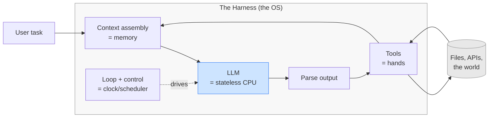

# Day 1 — What Is a Harness?

> **Today's one idea:** An LLM is a stateless CPU; the harness is the operating system that gives it memory, hands, and a clock.
> **Reading time:** ~35 min · **Prereqs:** none
> **Primary source for today:** Andrej Karpathy, *Software Is Changing (Again)*, YC AI Startup School, 2025.

## The hook (2–4 min)

Here is a fact that sounds absurd once you say it plainly: **the model you call "the agent" cannot remember the sentence it just wrote.**

Every time you hit the API, the model starts from nothing. It has no notebook, no clock, no hands, no memory of five seconds ago. You send it a pile of text; it predicts some more text; it forgets everything. That's the whole machine.

So how does Claude Code edit twelve files, run your tests, read the failures, and fix its own bug — across minutes of work — if the thing driving it can't remember its last move?

The answer is that *the model isn't doing that.* Something wrapped around the model is. That wrapper has a name, and learning to build it is this entire course.

## Building the intuition (10–15 min)

Think about a **CPU**. A CPU is astonishingly capable and completely helpless at the same time. It can execute billions of instructions per second — but on its own it has no files, no keyboard, no screen, no memory beyond a few registers, and no idea what to do next. Hand a bare CPU a hard drive and it does nothing, because it has no notion of "read the next instruction, then the one after that."

What makes a CPU *useful* is the **operating system** around it. The OS gives the CPU:

- **Memory** it can read and write (RAM, disk) — because the CPU's own registers are tiny.
- **Hands** — device drivers that let it touch the outside world (disk, network, screen).
- **A clock and a scheduler** — something that decides *when* to run the next instruction and loops until the work is done.
- **Protection** — rules about what it's allowed to touch.

Now swap the nouns. An **LLM is a stateless CPU for text.** It's brilliant at one instruction — "given these tokens, predict the next ones" — and helpless at everything else. It has no memory across calls, can't touch the world, and has no built-in sense of "keep going until the task is done."

The **harness** is the operating system for that CPU. It supplies exactly the four things the OS supplied:

| Operating system gives the CPU… | The harness gives the LLM… | Course day |
|---|---|---|
| RAM and disk (memory it lacks) | Context assembly + external memory | Days 4, 7, 10 |
| Device drivers (hands) | Tools the model can invoke | Days 3, 6 |
| Clock + scheduler (a loop) | The agentic loop | Days 2, 5, 12 |
| Protection rings (what's allowed) | Permissions, retries, guards | Days 12, 14 |



Read that diagram once more with the CPU/OS analogy in mind. The blue box in the middle — the part everyone points to and calls "the AI" — is just the CPU. Everything *around* it, the grey box, is the engineering. **That grey box is your job now.** This is what Karpathy means when he says LLMs are becoming the *runtime* and Software 3.0 is about the systems we build around them: the interesting engineering has moved from the model to the harness.

The single most important consequence: **the model's intelligence is fixed on a given day, but the harness is where you have leverage.** You can't make GPT or Claude smarter this afternoon. You *can* give it better memory, cleaner hands, and a smarter loop this afternoon — and that is usually the difference between a demo and a product.

## The formal picture (10–15 min)

Let's name things precisely.

A **language model** is, for our purposes, a pure function:

```math
\text{model}: \text{tokens}_{\text{in}} \rightarrow \text{tokens}_{\text{out}}
```

Two words in that definition carry all the weight:

- **Pure** — no side effects, no hidden memory. Call it twice with the same input and (temperature aside) you get the same behavior. It cannot remember, cannot act, cannot wait. This is what **stateless** means: output depends only on the current input, never on history the function secretly kept.
- **tokens** — its entire universe is the text you hand it. It has no other senses. (We formalize this tomorrow and Day 4.)

A **harness** is the stateful program wrapped around that pure function. Formally, it's the runtime responsible for:

1. **Context assembly** — building the `tokens_in` for each call (Day 7). The model has no memory, so *the harness is its memory* — it reconstructs everything the model should "know" every single call.
2. **Inference** — actually calling `model`.
3. **Output handling** — parsing `tokens_out` into either a final answer or a request to act (Day 6).
4. **Tool dispatch** — executing requested actions against the world and capturing results (Days 3, 6).
5. **Control flow** — deciding whether to loop again or stop (Days 2, 12).
6. **State management** — persisting anything that must survive across calls (Day 10).

Notice the asymmetry that defines everything downstream: **the model is stateless; the harness is stateful.** All the state — the history, the memory, the progress, the "where are we" — lives in the harness. The model is a fast, forgetful oracle you consult repeatedly. Every hard problem in this course is really a question about how the *harness* manages state on behalf of a thing that has none.

One term to retire today: when a colleague says "the agent decided to retry," gently translate it in your head to "**the harness** looped again after the model emitted a retry action." The agent is not one thing that decides — it's a stateless model plus a stateful harness, and keeping them separate in your mind is the core skill of this course.

## Where it breaks / what it is not (3–5 min)

- **"But models have memory now — long context, 'memory' features!"** Those are still the harness's doing. A long context window is a bigger `tokens_in`, but *something still has to decide what fills it* — and that something is the harness (Days 7, 11). "Memory features" are external stores the harness reads and writes (Day 10). The model function stays pure; the state lives outside it.
- **The harness is not a framework.** LangChain, LangGraph, the Agent SDK — those are *pre-built* harnesses. You can use one, but this course builds the thing underneath so you understand what they do and can debug or replace them. The harness is a concept; frameworks are implementations of it.
- **Stateless is not the same as "dumb" or "small."** A frontier model is enormously capable within a single call. Stateless is a statement about *memory across calls*, not about intelligence within one.
- **The CPU analogy has a seam:** a CPU is deterministic; the model is probabilistic. Hold this thought — it's exactly why the tool boundary (Day 6) and control (Day 12) need more care than an ordinary OS. We'll pay this off.

## Try it yourself (5–10 min)

> Keep a repo for this course. Today's exercise is where it begins.

**1. Retrieval first (do this before anything else).** Close this page. In your own words, write two or three sentences: *What is a harness, and what does it mean that an LLM is "stateless"?* Name the four things a harness supplies (the OS analogy). Only reopen the page after you've written your answer.

<details><summary>Hint</summary>Map it to an OS: memory, hands, a clock/loop, and protection. Stateless = no memory across calls.</details>

<details><summary>Worked answer</summary>A harness is the stateful runtime wrapped around a stateless LLM. The LLM is "stateless" because it's a pure function from input tokens to output tokens — it retains nothing between calls. The harness supplies the four things the model lacks, exactly as an OS supplies them to a CPU: **memory** (context assembly + external stores), **hands** (tools), **a clock/scheduler** (the loop and control flow), and **protection** (permissions/guards). All state lives in the harness; the model is a fast, forgetful oracle it consults repeatedly.</details>

**2. Direct application — prove statelessness with code.** Make two *independent* API calls to any chat model. In the first, say: "My favorite number is 7. Just acknowledge." In the second call — a fresh request, **not** appended to the first — ask: "What's my favorite number?" Observe that it cannot answer. Then make a third call where you manually include the first exchange in the messages you send, and watch it answer correctly. You have just done, by hand, the harness's #1 job: *being the model's memory.*

<details><summary>Hint</summary>The difference between call 2 and call 3 is only what *you* put in the `messages` array. The model changed nothing; the harness (you) did.</details>

<details><summary>Worked solution (Python, Anthropic SDK — any provider works)</summary>

```python
import anthropic
client = anthropic.Anthropic()

def ask(messages):
    r = client.messages.create(
        model="claude-sonnet-5", max_tokens=100, messages=messages)
    return r.content[0].text

# Call 1 — tell it something
ask([{"role": "user", "content": "My favorite number is 7. Just acknowledge."}])

# Call 2 — fresh call, no history. It cannot know.
print(ask([{"role": "user", "content": "What's my favorite number?"}]))
# -> "I don't have that information..."

# Call 3 — the harness (you) supplies the memory by reconstructing history.
print(ask([
    {"role": "user", "content": "My favorite number is 7. Just acknowledge."},
    {"role": "assistant", "content": "Got it — 7."},
    {"role": "user", "content": "What's my favorite number?"},
]))
# -> "Your favorite number is 7."
```

The model is identical in calls 2 and 3. The only thing that changed is the context *you assembled*. That is the entire job you're learning to do well.</details>

**3. Stretch.** A CPU has protection rings so a bad instruction can't wipe the disk. Your harness will let a *probabilistic* model request actions against the real world. Name one danger this creates that an ordinary OS never faces, and one thing your harness will therefore need that an OS scheduler doesn't. (One sentence each. You're extrapolating past today's page — that's the point.)

<details><summary>Worked answer</summary>Danger: the model can *hallucinate* an action — request a tool call that's plausible-looking but wrong or harmful — because its output is probabilistic, not verified. An OS executes exactly the instructions in the binary; a harness executes instructions *invented on the fly by a fallible predictor.* So the harness needs something an OS scheduler doesn't: a **validation/permission layer at the tool boundary** that treats model output as untrusted input (Day 6) and a way to **stop or roll back** a loop gone wrong (Days 12, 14). This is the "seam" flagged above.</details>

> **Transfer — apply it:** Name a system you've built or used where an LLM sits inside a larger program. What plays the role of the harness there — what code assembles the model's input, runs its requested actions, and decides when to stop? Write one sentence: input → what the harness does → output. If nothing comes to mind in 60 seconds, re-read the hook and think about the last agent or chatbot you used.

## Connect it back

Today you inverted the usual picture: the model is the CPU, and the real engineering surface is the OS-like harness around it — memory, hands, a clock, protection. Tomorrow we zoom in on the *clock*: **why one model call is never enough, and where "agentic" behavior actually comes from.** You should now be able to answer a question you couldn't this morning: *if the model can't remember anything, who is doing the remembering?* (Answer: the harness — and you're about to build it.)

## Suggested readings for today

**Required if you have 15 extra minutes:** Andrej Karpathy, *Software Is Changing (Again)* (YC, 2025), first ~20 minutes — the Software 1.0 / 2.0 / 3.0 framing and "LLMs as runtime." [youtube.com/watch?v=LCEmiRjPEtQ](https://www.youtube.com/watch?v=LCEmiRjPEtQ). Watch it as a vivid version of today's inversion.

**If you want the deep version:**
- swyx, "The Rise of the AI Engineer," Latent.Space, 2023 — [link](https://www.latent.space/p/ai-engineer). Why the harness became a job title. Read the "what an AI engineer does" section.
- Packer et al., "MemGPT," 2023, arXiv:2310.08560 — §1 and §3. The harness-as-OS idea taken literally, with tiered memory. We return to this on Day 10; a first skim now makes today concrete.

---

## Navigation

← **Back to course overview:** [README](../README.md)  
→ **Next:** [Day 2 — Why You Need a Loop](day-02-why-you-need-a-loop.md)
