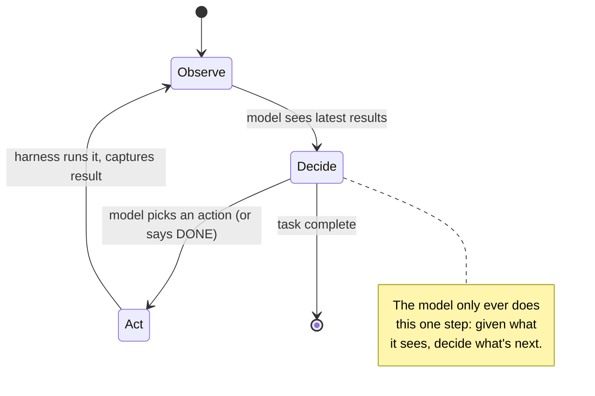

# Day 2 — Why You Need a Loop

> **Today's one idea:** Agent intelligence comes from *iterating* — observe → decide → act → observe — not from one bigger, smarter model call.
> **Reading time:** ~35 min · **Prereqs:** Day 1
> **Primary source for today:** Yao et al., "ReAct: Synergizing Reasoning and Acting in Language Models," ICLR 2023, arXiv:2210.03629.
> **Before you start:** Recall Day 1's load-bearing idea — one sentence, no looking: *In the CPU/OS analogy, what is the LLM, what is the harness, and which of the two holds all the state?*

## The hook (2–4 min)

Ask a model, in a single call: *"What's the total size of all `.log` files in my project?"*

It cannot answer. Not because it's not smart enough — because it has never seen your files. The best it can do is guess or make something up.

Now imagine you let it take **one small step and see the result**: it asks to run `ls`, you show it the file list, and *then* it asks to check sizes, and *then* it adds them up. Suddenly a question that was impossible in one shot becomes trivial. Nothing about the model changed. What changed is that it got to **look, act, and look again.**

That gap — between "answer in one call" and "take steps until done" — is the entire reason agents exist. Today we make it precise.

## Building the intuition (10–15 min)

Consider how *you* fix a bug. You don't read the ticket and immediately type the perfect patch. You:

1. **Observe** — read the error.
2. **Decide** — form a hypothesis: "probably the null check."
3. **Act** — add a print, run it.
4. **Observe** — the print shows something surprising.
5. **Decide** — revise: "oh, it's the *other* branch."
6. …loop until fixed.

Each step is small and often wrong, but the **loop** grinds toward the answer because every action produces new information that sharpens the next decision. Your intelligence isn't in any single step — it's in the *iteration with feedback.*

A single LLM call is step 2 alone: decide, once, blind, with no chance to look or check. Of course it's weak. It's like being forced to write the entire bug fix with your eyes closed before running anything.

The fix is to wrap the model in exactly your debugging loop. This cycle has an old name from military strategy and control theory — **OODA** (Observe, Orient, Decide, Act) — and an even older one: a **thermostat.** A thermostat isn't smart, but it's *effective* because it loops: read temperature → compare to target → act (heat/cool) → read again. Take away the loop and the thermostat is useless; it can't hold a temperature with one measurement.



Here's the reframing that makes it click. Yesterday you learned the model is a stateless oracle. **A loop is how you turn a one-shot oracle into a problem-solver: you consult it many times, and between consultations you feed it the consequences of its last answer.** The oracle never gets smarter — but the *conversation* accumulates evidence, and that's where capability comes from.

This is why "make the model bigger" and "let the model loop" are different axes of capability. A bigger model gives a better *single decision*. A loop gives *many decisions with feedback*. For most real tasks — anything requiring information the model doesn't already have, or verification it can't do in its head — the loop matters more. This is the empirical heart of the **ReAct** paper: interleaving reasoning ("Thought") with acting ("Act") and seeing results ("Observation") beats reasoning alone *or* acting alone, because thought without feedback drifts and action without thought flails.

## The formal picture (10–15 min)

The **agentic loop** is a control structure:

```
state ← initial task
repeat:
    payload   ← assemble_context(state)      # Day 7
    output    ← model(payload)               # the stateless call
    if output is a final answer:
        return output                        # termination (Day 12)
    action    ← parse(output)                # Day 6
    result    ← execute(action)              # Day 3
    state     ← state + action + result      # accumulate evidence (Day 10)
until budget exhausted                       # runaway guard (Day 12)
```

Every line is a future day; today you only need the *shape*. Three formal points:

- **The loop body is one turn** (tomorrow's vocabulary; formally introduced Day 5). Each turn = assemble → infer → act → observe. The agent's whole life is turns stacked end to end.
- **The model chooses the action; the harness performs it.** The model emits *text* that names an action. It never runs anything itself — it's still the pure function from Day 1. The harness reads that text, executes the real action, and appends the real result. This division is absolute and we'll defend it on Day 6.
- **State is the accumulator.** `state ← state + action + result` is where information compounds. This line is why the loop works — and, as you'll learn on Days 7–13, it's also where everything goes wrong, because that accumulating state is exactly the context that overflows and rots. (Flag this. It's the bottleneck of the whole course, and it's born on this innocent-looking line.)

**ReAct** specifically structures each model output as a **Thought** (reasoning in tokens — recall this is Chain-of-Thought, Wei et al. 2022) followed by an **Action**. The Thought is the model reasoning about what it just observed; the Action is what it wants to do next. Then the harness returns an **Observation**. Thought → Action → Observation, repeated. That triple is the pattern you'll implement on Day 5.

Why interleave thought and action rather than plan everything up front? Because the model's plan is made *blind* — before it has seen any results. Interleaving lets each action's real result correct the next thought. Planning-all-at-once is one blind decision; ReAct is many sighted ones.

## Where it breaks / what it is not (3–5 min)

- **A loop is not automatically progress.** Nothing in the structure guarantees the model gets *closer* to done each turn. It can loop forever, repeat the same failed action, or oscillate. Making the loop *terminate correctly* is a real engineering problem — Day 12 exists entirely for this. Today's claim is only that iteration *enables* capability, not that it guarantees it.
- **Not every task needs a loop.** If the task is answerable from the model's own knowledge in one shot ("summarize this paragraph"), a loop just adds cost and latency. Barry Zhang's first principle is "don't use agents for everything." A loop earns its keep only when the task needs *external information or verification* the model can't supply in one call.
- **More turns ≠ better.** Each turn costs tokens, money, latency, and adds a chance to go off the rails. The goal is the *fewest* turns that solve the task, not the most.
- **"Reasoning" in the Thought step is not thinking.** It's the model generating tokens that *look like* reasoning and that empirically improve the next action. Useful, but don't anthropomorphize it into deliberation — it's Chain-of-Thought, a prompting effect, not a mind.

## Try it yourself (5–10 min)

**1. Retrieval first.** Close the page. Write the four-step cycle at the heart of an agentic loop, and one sentence on *where the capability comes from* if the model itself never gets smarter. Reopen only after writing.

<details><summary>Hint</summary>Observe → Decide → Act → Observe. Capability comes from feedback accumulating in state between calls, not from any single call.</details>

<details><summary>Worked answer</summary>The loop is **Observe → Decide → Act → Observe** (the model does the Decide step; the harness does the Act step and captures the next Observe). The model is a stateless one-shot oracle and never improves within a run, so the capability comes from *iteration with feedback*: each action produces new information that is accumulated into state and fed back, sharpening the next decision. Many sighted decisions beat one blind one.</details>

**2. Direct application — feel the difference in code.** Take a task the model can't one-shot (e.g., "how many Python files are in this directory and which is largest?"). First, ask it in a single call — watch it guess or refuse. Then hand-run *one manual loop*: let it ask for a command, you run the command, paste the result back, let it respond. You are being the harness. Notice the task becomes solvable the moment feedback enters.

<details><summary>Hint</summary>You don't need to automate anything yet. Do the loop by hand in the chat: model says "run `ls *.py`", you paste the output, model continues. Being the loop manually is the point.</details>

<details><summary>Worked solution (manual loop transcript)</summary>

```
You (system): You can request ONE shell command per reply, formatted as: RUN: <cmd>.
              I will paste its output. When done, reply DONE: <answer>.
You (user):   How many .py files are here and which is largest?

Model:  Thought: I need the file list with sizes.
        RUN: ls -la *.py
You:    [paste real output: 3 files, sizes 1.2K, 8.4K, 900B]

Model:  Thought: harness.py (8.4K) is largest; there are 3 files.
        DONE: 3 Python files; harness.py is the largest at 8.4K.
```

The model answered correctly on turn 2 — not because it got smarter, but because turn 1's *observation* gave it the facts. That is the loop earning its keep. On Day 5 you'll replace "you paste the output" with `subprocess.run`, and the manual loop becomes an agent.</details>

**3. Stretch.** Your manual loop above worked because *you* decided when it was done (you saw "DONE:"). Now imagine the model never says DONE and keeps asking to run commands. What would you, as the harness, need to add to stop it — and what information would you need to *track across turns* to make that decision? (You're previewing Days 10 and 12.)

<details><summary>Worked answer</summary>You'd need a **termination policy** the harness enforces regardless of the model: at minimum a **max-turns budget** (stop after N iterations), and ideally a **progress check** (are recent turns actually changing state, or repeating?). To decide either, the harness must *track state across turns* — a turn counter, and a record of recent actions/results to detect loops or stagnation. Note that both live in the harness, not the model (Day 1's asymmetry): the stateless model can't count its own turns, so the stateful harness must. This is exactly Day 12's job, and it depends on the state management of Day 10.</details>

> **Transfer — apply it:** Think of a task in your own work you'd hand to an LLM. Is it a one-shot task or a loop task? Write one sentence: what *external information or verification* (if any) the model would need to gather step-by-step — that's the tell for whether it needs a loop. If it needs none, it doesn't need an agent.

## Connect it back

Yesterday: the harness is the OS around a stateless model. Today: the most important thing that OS provides is a **loop** — because iteration with feedback, not model size, is where agent capability comes from ([recall Day 1's clock/scheduler role](day-01-what-is-a-harness.md)). But a loop is inert if the model can only *talk* — it needs to *act* on the world. Tomorrow: **tools** — how the model reaches out and touches something, and why "the model runs a tool" is a lie you must never believe. The question you can now answer: *why does letting a model take steps beat making the model bigger, for most real tasks?*

## Suggested readings for today

**Required if you have 15 extra minutes:** ReAct (arXiv:2210.03629), §1 and §2, plus Figure 1. Figure 1 alone — the side-by-side of "reason-only" vs "act-only" vs "ReAct" failing and succeeding on the same task — is the whole intuition of today in one image.

**If you want the deep version:**
- Wei et al., "Chain-of-Thought Prompting," NeurIPS 2022, arXiv:2201.11903, §3 — *why* the "Thought" step helps at all. ReAct's reasoning step stands on this.
- Dex Horthy, "12-Factor Agents," 2025 — [talk](https://www.youtube.com/watch?v=8kMaTybvDUw), the "own your control flow" factor. A production-grade argument that the loop is *your* code to own, not the framework's. Worth the whole talk once you've done Day 5.

---

## Navigation

← **Previous:** [Day 1 — What Is a Harness?](day-01-what-is-a-harness.md)  
→ **Next:** [Day 3 — Tools: The Model's Hands](day-03-tools-the-models-hands.md)
