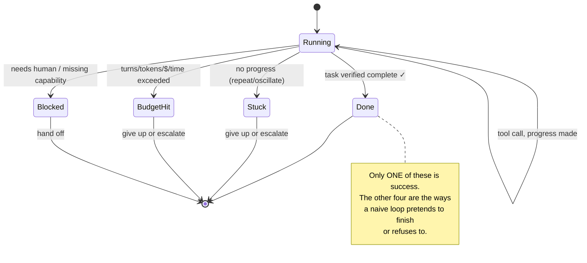

# Day 12 — Loop Control & Stopping

> **Today's one idea:** A loop that can't reliably decide when to stop is not an agent but a hazard; termination is engineered — budgets, stuck-detection, and done-verification — not left to the model's goodwill.
> **Reading time:** ~40 min (code day) · **Prereqs:** Day 5, Day 10
> **Primary source for today:** Anthropic, "Effective Harnesses for Long-Running Agents," 2025.
> **Before you start:** Recall Day 10's load-bearing idea — one sentence, no looking: *What are the two memory tiers, and how does the harness use the external one to cure recency-only amnesia?*

## The hook (2–4 min)

Your Day 5 loop had exactly one stopping rule beyond "model says done": `for turn in range(max_turns)`. It's a seatbelt, and you need it — but lean on it alone and you'll watch your agent do this:

```
turn 14: read_file("test.py")        turn 17: read_file("test.py")
turn 15: run_tests()  -> fail        turn 18: run_tests()  -> fail
turn 16: read_file("test.py")        turn 19: read_file("test.py")   ...
```

It's stuck in a rut, burning ~$0.30 and 20 seconds per turn, and it will keep going until `max_turns` finally guillotines it at turn 50 — having spent $15 to accomplish nothing. Or the opposite failure: it declares "Done! I fixed the test" on turn 6, and the test is still red. It *stopped*, but it lied.

Both are control failures. The loop ran; the *stopping* was wrong. Today you build the three controls that separate a real agent from a while-loop with a foot on the gas: **budgets** (stop before ruin), **stuck-detection** (stop when not progressing), and **done-verification** (stop only when actually finished).

## Building the intuition (10–15 min)

Recall Day 2: an agentic loop *enables* capability but guarantees nothing about progress. The loop is a state machine, and today we make its exits explicit. An agent turn ends in one of five ways:



The naïve loop from Day 5 recognizes only two of these: `Done` (model emits final answer) and `BudgetHit` (max_turns). It's blind to `Stuck` (wastes budget until the guillotine) and it trusts the model's `Done` without checking (accepts lies). Real control means recognizing all five and exiting each appropriately.

Three intuitions carry the day:

1. **Budgets are the non-negotiable floor.** Every unbounded resource an agent can consume — turns, tokens, dollars, wall-clock, tool calls — needs a ceiling the *harness* enforces, because the model cannot count its own consumption (it's stateless — Day 1). A budget doesn't make the agent smart; it makes failure *bounded* instead of catastrophic. This is the one control you must never ship without.

2. **Progress is measurable, and its absence is the real stop signal.** "Stuck" isn't mystical. It looks like: the same action repeated, results that don't change, state that isn't advancing, oscillation between two moves. The harness can *see* this by comparing recent turns — and it should stop or intervene *long before* the budget runs out, because a stuck agent won't un-stick itself by looping more.

3. **"Done" is a claim to verify, not a fact to accept.** The model saying "I fixed it" is a *hypothesis*. Where a cheap, objective check exists — run the test, re-query the state, diff the file — the harness should *verify* before accepting termination. Trust-but-verify becomes just verify for anything that matters. (This is the seed of Day 15: your eval is done-verification generalized.)

The through-line: **control lives in the harness, informed by state.** To detect "stuck," the harness must track recent actions/results across turns (Day 10's state). To enforce budgets, it counts. To verify "done," it runs a check. The model contributes a *proposed* action or a *claimed* completion; the harness decides what actually happens. This is Day 1's asymmetry (stateless model, stateful harness) applied to termination.

## The formal picture (10–15 min)

A controller wraps the loop and evaluates exit conditions every turn:

```python
from dataclasses import dataclass, field
import time

@dataclass
class Budget:
    max_turns: int = 30
    max_tokens: int = 500_000
    max_seconds: float = 300
    max_usd: float = 5.0
    # live counters
    turns: int = 0
    tokens: int = 0
    usd: float = 0.0
    start: float = field(default_factory=time.time)

    def exceeded(self) -> str | None:
        if self.turns >= self.max_turns:            return f"turn budget ({self.max_turns})"
        if self.tokens >= self.max_tokens:          return f"token budget ({self.max_tokens})"
        if self.usd >= self.max_usd:                return f"cost budget (${self.max_usd})"
        if time.time() - self.start >= self.max_seconds: return "time budget"
        return None

def is_stuck(recent_actions: list, window: int = 3) -> bool:
    """No progress if the last `window` actions are identical, or results stopped changing."""
    if len(recent_actions) < window:
        return False
    last = recent_actions[-window:]
    return len({(a["name"], str(a["args"])) for a in last}) == 1   # same action repeated

def verify_done(state, claim: str) -> tuple[bool, str]:
    """Objectively check a completion claim where possible. Returns (accepted, evidence)."""
    if state.get("verifier"):                      # e.g. run the test suite
        ok, output = state["verifier"]()
        return ok, output
    return True, "no verifier available; accepting claim"   # be honest that it's unchecked
```

The controlled loop:

```python
def run_agent(task, tools, budget: Budget, verifier=None):
    state = {"task": task, "tools": tools, "turns": [], "verifier": verifier, ...}
    recent_actions = []
    while True:
        if (why := budget.exceeded()):
            return escalate(state, f"stopped: {why}")           # BudgetHit -> give up / hand off
        if is_stuck(recent_actions):
            return intervene_or_stop(state, "stopped: no progress detected")  # Stuck

        sys, tl, msgs = assemble_context(state, ...)            # Days 7/10/11
        resp = model(sys, tl, msgs)
        budget.turns += 1
        budget.tokens += resp.usage.total_tokens               # count real usage
        budget.usd += cost_of(resp.usage)

        if resp.claims_done:
            ok, evidence = verify_done(state, resp.text)        # Done -> VERIFY first
            if ok:  return success(resp.text, evidence)
            state["turns"].append(observation(f"Verification failed: {evidence}. Keep going."))
            continue                                            # rejected claim -> back to work

        for call in resp.tool_calls:
            recent_actions.append(call)
            obs = dispatch(call.name, call.args)                # Day 6
            state["turns"].append(observation(obs))
```

Formal points:

- **Budgets must count *real* usage, updated every turn.** Count actual tokens/cost from the API response, not estimates. A budget you don't update is decoration. And enforce *multiple* budgets — an agent can blow cost without blowing turns (one expensive tool) or blow time without blowing tokens (a slow tool). The tightest binding constraint should stop you.
- **Stuck-detection is a spectrum; start simple.** The `is_stuck` above catches literal repetition — the most common real case. Richer versions detect: results not changing (same test failure hash), oscillation (A,B,A,B), or *semantic* stagnation (state entropy flat). Add sophistication only when the simple check misses real cases you observe — don't over-engineer detection before you've seen the failures (Day 15 tells you which).
- **Verification is as strong as your verifier.** A coding agent with a test suite has a *strong* objective verifier (green/red). An open-ended research agent may have *none* — then be honest: accept the claim but mark it unverified, and don't pretend certainty you don't have. The presence and quality of a verifier is a design property of the task; where you can manufacture one cheaply (a test, a schema check, a re-query), do.
- **Every non-success exit needs a *policy*, not just a stop.** Stopping is half the decision; what happens next is the other half: **give up** (return failure honestly), **escalate to a human** (Blocked — hand off with context), or **retry with a reset** (Day 14). "Stopped: no progress" that silently returns nothing is nearly as bad as looping forever. Escalation with a clear summary of what was tried is often the right production answer.

## Where it breaks / what it is not (3–5 min)

- **`max_turns` alone is not control.** It bounds *catastrophe*, not *waste*. Without stuck-detection, the agent burns the entire budget on a rut every time it fails. Ship both.
- **Over-eager stuck-detection kills legitimate work.** Some tasks *require* repeating an action (poll until ready, retry a flaky tool). If `is_stuck` is too aggressive it aborts valid patterns. Distinguish "same action, unchanged result, no plan to change" (stuck) from "same action, expecting a change" (waiting). Context matters; tune against real traces.
- **Verification isn't free and isn't always possible.** Running the full test suite every turn is expensive; run it at *claimed completion*, not every turn. And for genuinely open tasks, no objective verifier exists — don't fake one, and don't let the agent grade its own homework without noting the softness.
- **Control is not intelligence.** These mechanisms make the loop *safe and honest*, not *good*. A well-controlled agent that's bad at the task just fails cheaply and truthfully — which is exactly what you want, and what lets you *measure and improve* it (Day 15).

## Try it yourself (5–10 min)

**1. Retrieval first.** Close the page. Name the five ways a turn can end, mark which one is success, and list the three controls that catch the other failure modes. State why all three live in the harness, not the model. Reopen after writing.

<details><summary>Hint</summary>Ends: Done, Stuck, BudgetHit, Blocked, (Running-continue). Success = Done (verified). Controls: budgets, stuck-detection, done-verification. They live in the harness because the model is stateless and can't count its own turns/cost or objectively check its own claim.</details>

<details><summary>Worked answer</summary>A turn ends in one of five states: **Done** (the only success — and only if *verified*), **Stuck** (no progress: repetition/oscillation), **BudgetHit** (turns/tokens/cost/time exceeded), **Blocked** (needs a human or a missing capability), or it keeps **Running**. Three harness controls catch the non-success modes: **budgets** (enforce ceilings on every consumable resource, counting real usage), **stuck-detection** (compare recent actions/results to spot no-progress before the budget runs out), and **done-verification** (objectively check a completion claim — e.g. run the tests — before accepting it). All three live in the harness because the model is stateless (Day 1): it cannot count its own turns/tokens/cost, cannot see across turns to notice it's repeating, and cannot be trusted to objectively grade its own completion claim. Each non-success exit also needs a *policy* — give up, escalate, or retry.</details>

**2. Direct application — give your agent all three controls.** Add a `Budget` (with real token/cost counting), `is_stuck` (literal-repeat detection over a window of 3), and `verify_done` (for a coding task, run the test suite). Then deliberately trigger each: (a) a task it can't solve → watch it stop on *stuck* well before max_turns, (b) a task that claims done falsely → watch verification reject it and continue, (c) confirm cost/turns are counted, not estimated.

<details><summary>Hint</summary>To force "stuck," give it a tool that always returns the same failing result. To force a false "done," use a weak model or a task where success is tempting to over-claim, and make the verifier a real check (`pytest -x` exit code). Log every exit reason.</details>

<details><summary>Worked solution (what to observe)</summary>

```
# (a) unsolvable task:
turn 3: run_tests -> FAIL   turn 4: run_tests -> FAIL   turn 5: run_tests -> FAIL
>> is_stuck: last 3 actions identical -> STOP at turn 5 (not turn 30). Saved ~25 turns of spend.

# (b) false completion:
turn 6: assistant claims "Fixed! test passes."
>> verify_done: pytest exit=1 -> REJECTED. Observation fed back: "Verification failed: 1 test still failing..."
turn 7: agent resumes work with the truth.  # the lie was caught and became fuel

# (c) budget accounting:
each turn: budget.tokens += resp.usage.total_tokens; budget.usd += cost
>> stops at the FIRST ceiling hit — often cost or time, not turns.
```

The two wins: stuck-detection converts a $15 rut into a $1.50 honest failure, and verification converts a confident lie into a corrective observation. Both are pure harness logic — the model never changed. Notice (b) is a preview of Day 15: verification *is* evaluation applied at termination.</details>

**3. Stretch (callback to Day 2 + Day 10).** Your `is_stuck` checks for *identical* repeated actions. Construct a stuck pattern it would **miss**, then describe what state you'd need to track (and from which day's machinery) to catch it. Then argue why you might *not* want to catch every possible stuck pattern. (Extrapolating toward Days 14–15.)

<details><summary>Worked answer</summary>A missed pattern: **oscillation with variation** — the agent edits function A, tests fail, edits function B, tests fail, reverts to A, tests fail… no two *consecutive* actions are identical, so literal-repeat detection sees "progress," but the agent is circling. Or **semantic repetition**: it reads `test.py`, then `./test.py`, then `tests/../test.py` — different args, same effect. To catch these you'd track, across turns, a *normalized* history of (action, result) and detect cycles or unchanged *results* — e.g. hash the test-failure output and notice it hasn't changed in 8 turns despite different edits. That requires the cross-turn state record from **Day 10** (memory of past actions/results), not just the last 3 raw actions. Why *not* catch everything: detection has false positives (aborting legitimate exploration or polling), and each rule adds complexity and its own failure modes. The disciplined path is to **let real runs (Day 15) show you which stuck patterns actually occur and cost you**, then add exactly those detectors — rather than speculatively building a cycle-detection engine that mis-fires on valid work. Control should be as complex as your observed failures demand, no more.</details>

> **Transfer — apply it:** For an agent in your domain, name its single most dangerous *unbounded* resource (dollars? a rate-limited API? database writes?) and the objective *verifier* for its main task (or state honestly that none exists). One sentence each: what ceiling would you set, and what check would gate "done"?

## Connect it back

Days 7–11 mastered *what flows through the loop*; today mastered *how long the loop runs and when it truly stops* — budgets to bound ruin, stuck-detection to stop waste, verification to reject lies, all enforced by the harness because the model can't police itself ([the control the Day 2 loop lacked](day-02-why-you-need-a-loop.md), using [Day 10's state](day-10-memory-and-state.md)). Your agent is now context-smart *and* honestly terminating. Tomorrow is **Drill II**: reps combining assembly, memory, compaction, and control into one coherent turn design — the whole bottleneck, integrated, under pressure. The question you can now answer: *your agent triumphantly reports "task complete" — name two reasons you shouldn't believe it, and what the harness does about each.*

## Suggested readings for today

**Required if you have 15 extra minutes:** Anthropic, "Effective Harnesses for Long-Running Agents," 2025 — [link](https://www.anthropic.com/engineering/effective-harnesses-for-long-running-agents). The production view of keeping a long loop controlled and coherent — budgets, checkpoints, and knowing when to stop.

**If you want the deep version:**
- Anthropic, "Building Effective Agents," 2024 — [link](https://www.anthropic.com/engineering/building-effective-agents), the "when to use agents" and evaluator-optimizer sections; verification as a loop pattern.
- Shinn et al., "Reflexion," arXiv:2303.11366 — the *model-side* complement: reflecting on failure to change strategy, which pairs with harness-side stuck-detection (Day 14 revisits this).

---

## Navigation

← **Previous:** [Day 11 — Compaction & Lost-in-the-Middle](day-11-compaction-lost-in-the-middle.md)  
→ **Next:** [Day 13 — Drill II: The Turn, End-to-End](day-13-drill-the-turn-end-to-end.md)
