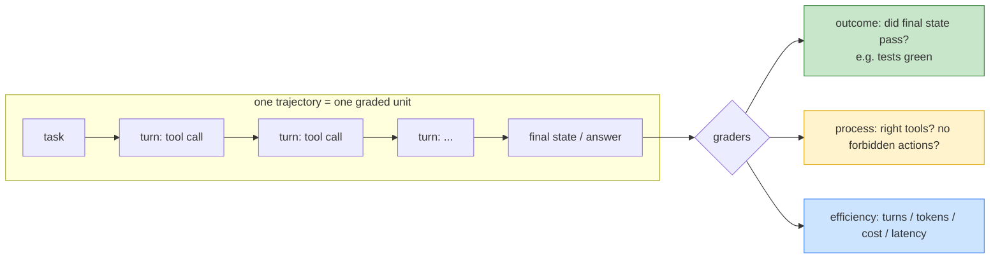

# Day 15 — The Evaluation Harness

> **Today's one idea:** You cannot harden what you cannot measure — so you build a repeatable eval that scores whole *trajectories* against fixed tasks, turning "seems better" into a number you can move.
> **Reading time:** ~40 min (code day) · **Prereqs:** Day 5, Day 12
> **Primary source for today:** Hamel Husain, "Your AI Product Needs Evals," 2024.
> **Before you start:** Recall Day 12's load-bearing idea — one sentence, no looking: *Why is a completion claim a hypothesis to verify rather than a fact to accept, and what does the harness do with a rejected claim?*

## The hook (2–4 min)

You spent Days 7–14 making changes: budgeted context, memory, compaction, stuck-detection, retries. Now answer honestly: **did any of them actually make your agent better?**

You don't know. You *believe* they did — the demo felt smoother. But you changed the compaction threshold last week; did success go up or down? You added memory; does it help on all tasks or hurt on short ones? You have vibes, not numbers. And vibes don't survive a code review, a regression, or a manager asking "is it ready?"

Hamel Husain's observation, from watching many LLM products succeed and fail: the failing ones almost always share one root cause — *no evaluation system.* Not a weak model, not bad prompts. No way to *measure*. Today you build the instrument that makes every prior day's work verifiable and every future change safe. This is the day your agent stops being a demo.

## Building the intuition (10–15 min)

Day 12 gave you *done-verification*: an objective check that one run finished correctly (run the tests, green/red). An **eval** is that idea generalized to a *set* of tasks, run *repeatably*, producing a *score*. Done-verification asks "did this run succeed?"; eval asks "across 50 representative tasks, what fraction succeed, and did my change move that fraction?"

Three properties separate a real eval from "I tried it and it worked":

1. **Fixed task set.** A frozen collection of representative tasks with known-good outcomes. You run *the same tasks* every time, so results are comparable across changes. One clever demo proves nothing; 50 fixed tasks proves something.
2. **Automatic scoring.** A grader that decides pass/fail (or a score) *without you eyeballing it* — because you'll run this hundreds of times and human grading doesn't scale and isn't repeatable.
3. **Trajectory-level, not just final-answer.** An agent doesn't just produce an answer; it produces a *path* — a sequence of tool calls and decisions. You often need to grade the path, not only the destination: did it use the right tool? avoid the forbidden file? finish in a reasonable number of turns? cost under budget?

The critical mental shift is what you're grading. A chatbot eval grades *outputs*. An agent eval grades *trajectories*:



This is exactly how the field's benchmarks work, and studying them tells you how to build yours:

- **SWE-bench** (coding agents): the task is a real GitHub issue; the grader is the repo's *own test suite* — an objective outcome check. The trajectory (which files it read/edited) is the path; the tests are the verdict.
- **τ-bench** (tool-agent-user): the grader compares the *final database state* to a goal state, and introduces **pass^k** — run each task *k* times and measure how often it passes *all k*. Because agents are stochastic (Day 1: temperature), a task that passes once but fails on retry isn't reliably solved. Reliability is a distribution, not a single run.

That last point reframes "does it work?" It's not yes/no; it's "what fraction of tasks, and how *consistently* across repeated attempts?" An agent that solves a task 3/10 times is very different from one that solves it 10/10, even though both "can do it."

## The formal picture (10–15 min)

An eval harness is a loop over tasks that runs your agent and scores each trajectory:

```python
from dataclasses import dataclass

@dataclass
class Task:
    id: str
    prompt: str
    setup: callable          # prepare a fresh sandbox/state (Day 6 workspace)
    grade: callable          # (final_state, trajectory) -> dict of scores
    forbidden: list = None   # actions that auto-fail (e.g. "wrote outside workspace")

def evaluate(agent_fn, tasks: list[Task], k: int = 3) -> dict:
    results = []
    for task in tasks:
        passes = 0
        for run in range(k):                     # repeat for reliability (pass^k, tau-bench)
            state = task.setup()                 # fresh, isolated env each run
            trajectory = agent_fn(task.prompt, state)   # your full harness runs here
            scores = task.grade(state, trajectory)
            # process guards: forbidden actions auto-fail regardless of outcome
            if task.forbidden and any(a in trajectory.actions for a in task.forbidden):
                scores["outcome"] = False
            results.append({"task": task.id, "run": run, **scores})
            passes += bool(scores["outcome"])
        # pass^k: did it pass ALL k runs? (reliability, not just capability)
        record_passk(task.id, passes == k)
    return aggregate(results)                    # success rate, pass^k, avg turns/tokens/cost

def aggregate(results):
    n = len(results)
    return {
        "success_rate": sum(r["outcome"] for r in results) / n,     # capability
        "passk_rate":   passk_fraction(),                           # reliability
        "avg_turns":    mean(r["turns"] for r in results),          # efficiency
        "avg_cost_usd": mean(r["cost"] for r in results),
        "p95_latency":  p95(r["latency"] for r in results),
    }
```

A grader for a coding task (outcome) plus a process check:

```python
def grade_fix_test(final_state, trajectory) -> dict:
    ok, _ = run_pytest(final_state["workspace"])          # outcome: objective (Day 12 verifier)
    return {
        "outcome": ok,
        "turns": trajectory.n_turns,
        "cost": trajectory.cost_usd,
        "latency": trajectory.seconds,
        "read_forbidden": "secrets.yaml" in trajectory.files_read,   # process signal
    }
```

Formal points:

- **The grader is the hard part, not the loop.** Writing `evaluate` is easy. Writing a *grader that's objective and cheap* is the real work. Prefer, in order: **code-based checks** (tests pass, state matches, regex/schema) → **exact/structured comparison** → **LLM-as-judge** only when no objective check exists. LLM-as-judge is a model grading a model: useful for fuzzy quality ("was the summary faithful?"), but it's itself fallible and must be *calibrated* against human labels on a sample. Reach for code graders first; they're deterministic and free to re-run.
- **Start tiny and real, not big and synthetic.** Husain's guidance: begin with ~10–20 tasks drawn from *actual* use (real issues, real user requests), not a giant synthetic suite. A small set of real, correctly-graded tasks beats hundreds of contrived ones. Grow the set by *adding every failure you find in production* as a new eval case — your eval becomes a regression net.
- **Measure the full vector, not just success.** A change that raises success rate but doubles cost or latency may be a bad trade. Track success, pass^k (reliability), turns, tokens, cost, and latency together. This is why Day 16 (cost/observability) comes next: the eval *produces* these numbers; observability *explains* them.
- **Isolation and determinism of the harness matter.** Each run gets a fresh sandbox (`task.setup()`) so runs don't contaminate each other (a Day 6 workspace per run). Fix seeds where you can, but accept the model is stochastic — which is *why* you run `k` times and report a distribution. An eval that's flaky for infrastructure reasons (shared state, network) is worse than none; it teaches false lessons.
- **Eval is done-verification (Day 12) lifted from one run to a population.** The same objective checks you built to verify a single completion become the graders for a whole task set. If you built strong verifiers on Day 12, your eval is half-built; if you couldn't build a verifier for a task, that task is hard to eval — an important signal about the task itself.

## Where it breaks / what it is not (3–5 min)

- **A benchmark number is not your number.** "Model X scores 60% on SWE-bench" tells you little about *your* agent on *your* tasks. Public benchmarks calibrate the field; you still need an eval on *your* distribution. Don't ship on someone else's leaderboard.
- **LLM-as-judge is not ground truth.** It's a convenient grader for fuzzy qualities, but it inherits model biases, can be gamed, and drifts across model versions. Calibrate it against human labels on a sample, and never let a model be the sole judge of a high-stakes outcome. Where a code check exists, it wins.
- **Overfitting to the eval is real.** If you tune relentlessly against 20 fixed tasks, you'll climb *those* 20 and maybe nothing else. Keep a held-out set you *don't* tune against, and refresh tasks from live failures. The eval is a proxy; don't mistake the proxy for the goal.
- **A single run is not a measurement.** Because the agent is stochastic, one green run can be luck. Report pass^k or success over *k* runs. "It worked when I tried it" is the exact anti-pattern this whole day exists to kill.
- **Eval isn't only for shipping — it's for *developing*.** Its highest value is the tight loop: change compaction → run eval → see success go 62%→68% (or 62%→55%, catch the regression). Without it, every change on Days 7–14 was a guess.

## Try it yourself (5–10 min)

**1. Retrieval first.** Close the page. State the three properties that make something an eval (vs. "I tried it"), and explain what "trajectory-level" grading captures that "final-answer" grading misses. Add one sentence on why you run each task *k* times. Reopen after writing.

<details><summary>Hint</summary>Fixed task set + automatic scoring + trajectory-level grading. Trajectory grading captures the *path* (tools used, forbidden actions, efficiency), not just the destination. You run *k* times because the agent is stochastic — reliability (pass^k) differs from capability (passed once).</details>

<details><summary>Worked answer</summary>An eval has three properties: **(1) a fixed task set** — the same representative tasks with known-good outcomes, run every time so results are comparable across changes; **(2) automatic scoring** — a grader that decides pass/fail without human eyeballing, so it scales and is repeatable; **(3) trajectory-level grading** — it scores the whole *path* (which tools were used, whether forbidden actions occurred, turns/tokens/cost/latency), not only the final answer, because an agent's process matters (a right answer reached by reading a forbidden file, or in 40 turns, is not a good outcome). You run each task **k** times because the model is stochastic (Day 1): a task passed once might fail on retry, so *reliability* (pass^k — passing all k) is a different, more honest measure than *capability* (passed at least once).</details>

**2. Direct application — build a mini eval for your own agent.** Create 5 real tasks for your Day 5–14 agent (e.g. small "fix the failing test" repos or file-manipulation tasks), each with `setup` (fresh workspace) and a code-based `grade` (tests pass / file has expected content). Run `evaluate(..., k=3)`. Report success rate, pass^3, and avg turns/cost. Then change *one* thing (e.g. lower the compaction threshold) and re-run. Did the number move?

<details><summary>Hint</summary>Keep graders objective: exit code of `pytest`, or `expected in open(path).read()`. Don't grade by reading output yourself. The magic moment is the A/B: same 5 tasks, one config change, compare the aggregate. That's development-by-measurement.</details>

<details><summary>Worked solution (what the payoff looks like)</summary>

```
# baseline
success_rate=0.73  pass^3=0.40  avg_turns=11.2  avg_cost=$0.42

# after lowering compaction threshold 0.8 -> 0.6 (compact more aggressively)
success_rate=0.67  pass^3=0.27  avg_turns=13.8  avg_cost=$0.51
```

The lesson lands hard: a change you *felt* was an improvement (more aggressive compaction = leaner context) actually *dropped* success and reliability and *raised* cost — probably because over-eager compaction discarded detail the agent needed, causing re-reads (more turns) and failures. You would never have known from a demo; the demo task might be in the 67% that still passes. **This A/B is the entire point** — every Day 7–14 knob is now a measurable trade, not a vibe. Notice pass^3 (0.40→0.27) moved more than success rate: the change hurt *reliability* even more than average capability.</details>

**3. Stretch (callback to Day 12).** Your grader for "fix the test" runs pytest — a strong objective check. Now design an eval task for a *research* agent ("summarize the top 3 risks in this 10-K"), where no pytest exists. What's your grader, what makes it hard, and what's the honest fallback? (Extrapolating LLM-as-judge and its limits.)

<details><summary>Worked answer</summary>No objective verifier exists (there's no "correct" summary the way there's a passing test), so grading options degrade: **(a) Reference-based** — if a human expert wrote a gold list of the 3 risks, grade by overlap/recall against it (semi-objective, but "risk" phrasing varies, so exact match is too strict — you need fuzzy/semantic matching, which is itself fallible). **(b) LLM-as-judge** — a model scores the summary against the source document for faithfulness and coverage ("are these risks actually stated in the 10-K? are they the most material?"). This is the practical fallback, but it's a model grading a model: it inherits biases, can be gamed, and must be **calibrated** — sample some outputs, have a human grade them, and check the judge agrees before trusting it at scale. **(c) Process/constraint checks** you *can* make objective even here: did it cite page numbers? did it hallucinate a risk not in the document (fails a groundedness check)? did it finish under budget? What makes it hard: the outcome is subjective, so you can never get pytest-grade certainty — the honest move is to (1) make as much of the grade objective as possible (grounding, citations, no-hallucination checks — these connect back to Day 12's "where you can manufacture a verifier, do"), (2) use a *calibrated* LLM-judge for the subjective remainder, and (3) *report the softness* rather than pretend to a hard number. Tasks with no verifier are exactly the tasks where you should be most humble about your metrics.</details>

> **Transfer — apply it:** Pick the agent task you most care about in your domain. Write one eval task for it: the input, the *objective* grader (or, if none exists, the calibrated fallback), and one process constraint that auto-fails. One sentence on whether you'd measure it with success-rate or pass^k, and why.

## Connect it back

Days 7–14 were changes you *hoped* helped; today you built the instrument that tells you the truth — a repeatable eval scoring whole trajectories across a fixed task set, reporting capability (success) *and* reliability (pass^k) *and* efficiency, generalizing Day 12's done-verification from one run to a population ([the numbers that turn every prior day's knob into a measured trade](day-12-loop-control-and-stopping.md)). The eval *produces* metrics — turns, tokens, cost, latency — but doesn't yet *explain* them or let you cut them. Tomorrow: **observability & cost** — instrument first, then optimize. The question you can now answer: *you changed your compaction threshold and the agent "feels" better — why is that sentence a red flag, and what replaces it?*

## Suggested readings for today

**Required if you have 15 extra minutes:** Hamel Husain, "Your AI Product Needs Evals," 2024 — [link](https://hamelhusain.substack.com/p/evals). Read the sections on starting small with real cases and building evals from production failures. It's the discipline behind today's harness.

**If you want the deep version:**
- Jimenez et al., "SWE-bench," arXiv:2310.06770, §2–3 — how real-issue tasks are constructed and graded by the repo's own tests; the template for a strong objective eval and the capstone target.
- Yao et al., "τ-bench," arXiv:2406.12045, §3 — the pass^k reliability metric and final-state grading; steal both.
- Chip Huyen, *AI Engineering*, O'Reilly 2025 — the evaluation chapters; the book-length treatment of everything above.

---

## Navigation

← **Previous:** [Day 14 — Failure & Recovery](day-14-failure-and-recovery.md)  
→ **Next:** [Day 16 — Observability & Cost](day-16-observability-and-cost.md)
