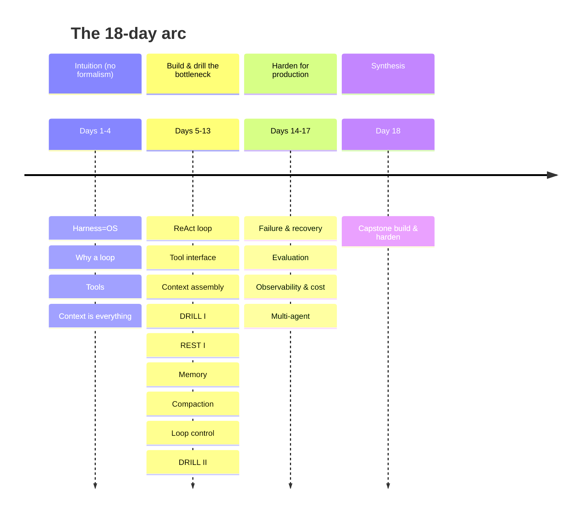

# Learning Path — Harness & Loop Engineering

18 days, one page each. Three arcs plus a capstone. The through-line is a single question: **what flows through the loop each turn?**

## Full path with rationale and callbacks

| Day | Page | Load-Bearing Idea | Why It Comes Now | Prereqs | Callbacks (revisits) |
|---|---|---|---|---|---|
| 1 | [What Is a Harness?](days/day-01-what-is-a-harness.md) | An LLM is a stateless CPU; the harness is the OS that gives it memory, hands, and a clock. | Everything rests on this framing. | — | — |
| 2 | [Why You Need a Loop](days/day-02-why-you-need-a-loop.md) | Agent intelligence comes from *iterating* — observe→decide→act→observe — not one big call. | Motivates the whole course. | 1 | Day 1 |
| 3 | [Tools: The Model's Hands](days/day-03-tools-the-models-hands.md) | A tool is a function the model can *ask* to run; the harness runs it and reports back. | The loop is inert without actions. | 2 | Day 1, 2 |
| 4 | [Context Is Everything It Sees](days/day-04-context-is-everything.md) | The model has no memory; its entire mind each turn is the token payload you assemble. **[bottleneck seed]** | Plant the bottleneck before any code. | 2 | Day 1, 2 |
| 5 | [Your First Agentic Loop](days/day-05-your-first-agentic-loop.md) | A working ReAct agent is ~60 lines: call → parse → run → append → repeat. | Intuition is ready; make it real. | 3, 4 | Day 1, 2, 3 |
| 6 | [The Tool Interface](days/day-06-the-tool-interface.md) | Reliable agents need a hard boundary: schema → dispatch → parse, output treated as untrusted. | The loop's most failure-prone seam. | 5 | Day 3, 5 |
| 7 | [Context Assembly](days/day-07-context-assembly.md) | Each turn you *rebuild* the message list and decide what survives. **[bottleneck]** | Core of the bottleneck; needs the loop first. | 5, 4 | Day 2, 4 |
| 8 | [Drill I — Context Assembly](days/day-08-drill-context-assembly.md) | Reps: prune, order, budget a turn payload under token pressure. | Hit the bottleneck while it's fresh. | 7 | Day 4, 7 |
| 9 | [Rest & Synthesize I](days/day-09-rest-synthesize-i.md) | Consolidate the foundations arc (Days 1–8) from memory. | Lock in before formal state. | 1–8 | Day 1–8 |
| 10 | [Memory & State Across Turns](days/day-10-memory-and-state.md) | Short-term (window) vs long-term (store); the loop is stateless unless you persist. **[bottleneck]** | The other half of "what flows through the loop." | 7 | Day 4, 5, 7 |
| 11 | [Compaction & Lost-in-the-Middle](days/day-11-compaction-lost-in-the-middle.md) | When history won't fit you summarize/truncate/retrieve — and *placement* changes usage. **[bottleneck]** | Direct consequence of Days 7 & 10. | 10 | Day 4, 7, 10 |
| 12 | [Loop Control & Stopping](days/day-12-loop-control-and-stopping.md) | A loop that can't decide it's *done* is a bug; engineer termination, budgets, guards. | Now the loop can run long — control it. | 5, 10 | Day 2, 5, 10 |
| 13 | [Drill II — The Turn, End-to-End](days/day-13-drill-the-turn-end-to-end.md) | Combine assembly + memory + compaction + control into one turn design. **[bottleneck]** | Second bottleneck drill at peak difficulty. | 7,10,11,12 | Day 4, 7, 10, 11, 12 |
| 14 | [Failure & Recovery](days/day-14-failure-and-recovery.md) | Tools and models fail; production loops need retries, timeouts, circuit breakers, idempotency. | The loop works — now make it survive. | 6, 12 | Day 3, 6, 12 |
| 15 | [The Evaluation Harness](days/day-15-the-evaluation-harness.md) | You can't harden what you can't measure; trajectory eval beats vibes. | Gate for all hardening. | 5, 12 | Day 5, 12 |
| 16 | [Observability & Cost](days/day-16-observability-and-cost.md) | Instrument first, then optimize: spans/replay, then token budgets, caching, routing. | You measure (15) before you cut. | 15, 11 | Day 7, 11, 15 |
| 17 | [Multi-Agent Orchestration](days/day-17-multi-agent-orchestration.md) | Split one loop into several with delegated context — and often you shouldn't. | Last architectural lever before capstone. | 10, 12 | Day 1, 2, 10, 12 |
| 18 | [Capstone — Build & Harden](days/day-18-capstone-build-and-harden.md) | Assemble everything into a production harness and defend every choice. | Direct synthesis of all 17 days. | all | Day 1,2,4,7,10,12,14,15 |

## Spacing logic

Every concept is retrieved at least twice after its introduction, spaced roughly +5 and +14 days:

- **Harness-as-OS (Day 1)** → recalled Days 5, 17, 18.
- **The loop (Day 2)** → Days 5, 7, 12, 17, 18.
- **Tools (Day 3)** → Days 5, 6, 14, 18.
- **Context-is-everything (Day 4, the bottleneck)** → Days 7, 8, 11, 13, 18 (heaviest reinforcement, by design).
- **Context assembly (Day 7)** → Days 8, 13, 16, 18.
- **Memory/state (Day 10)** → Days 11, 13, 17, 18.
- **Compaction (Day 11)** → Days 13, 16, 18.
- **Loop control (Day 12)** → Days 13, 14, 17, 18.

Drill days (8, 13) and the rest day (9) exist specifically to reactivate the context/state bottleneck at the moment of near-forgetting.

## What "done" looks like

The capstone (Day 18) is a direct-transfer challenge: a real coding agent on a SWE-bench-lite–style issue (or a τ-bench–style support agent), with a bounded loop, self-managed context, injected-failure recovery, a replayable trace, and a small eval set you authored. You're done when it works *and* you can defend each design choice against the alternatives the course rejected.

---

← **Back to course overview:** [README](README.md) &nbsp;|&nbsp; [Day 1 — What Is a Harness? →](days/day-01-what-is-a-harness.md)
