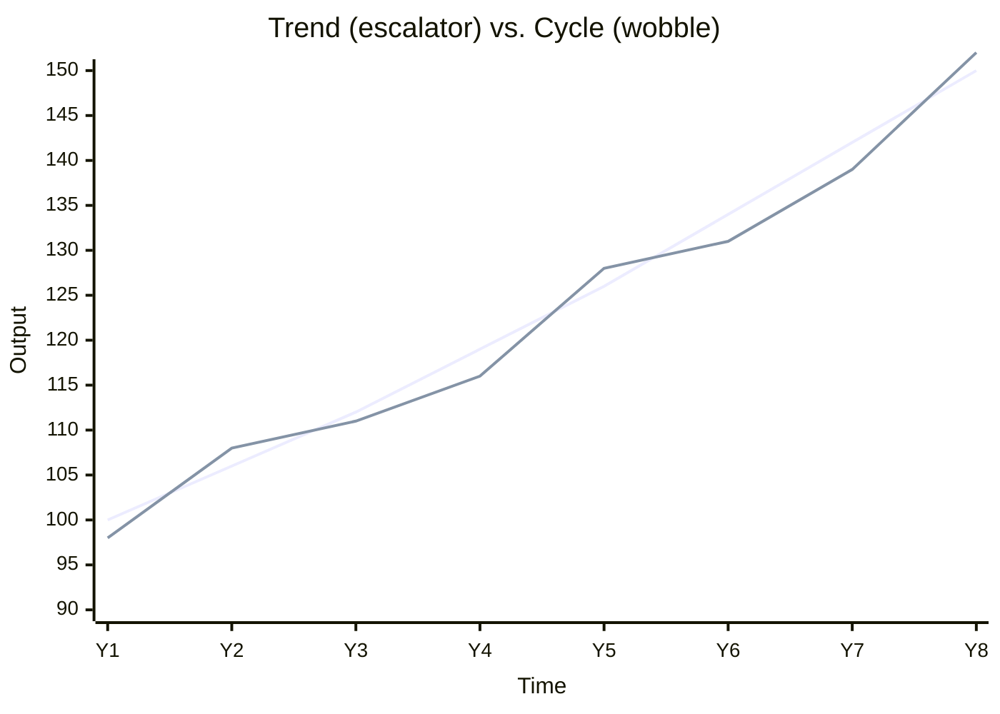

# Day 2 — Trend vs. the Wobble

> **Today's one idea:** An economy does two different things at once — it *grows* over decades (the trend, driven by productivity) and it *wobbles* over quarters (the cycle, driven by swings in spending) — and confusing the two is the most common macro mistake an investor makes.
> **Reading time:** ~35 min · **Prereqs:** [Day 1](day-01-economy-is-transactions.md)
> **Primary source for today:** Vijay Joshi, *India's Long Road* (2017), Introduction.
> **Before you start:** Recall Day 1's load-bearing idea in one sentence, no looking — *why must total spending equal total income in the economy's loop?*

## The hook (2–4 min)

Two headlines, same week:
- "India to be the world's third-largest economy by 2030."
- "India's GDP growth slows to 5.4% in the latest quarter, missing estimates."

Are these contradictory? A newcomer feels a jolt — *is India booming or slowing?* The answer is **both, because they're answering different questions.** The first is about the **trend** (the escalator you're standing on). The second is about the **cycle** (whether you're currently jogging up or down that escalator). Investors who blur these two buy the wrong things at the wrong time.

## Building the intuition (10–15 min)

Picture an escalator, rising slowly and steadily. That's the **trend** — the economy's long-run growth path. It rises because of things that change slowly: more workers, more machines and roads, and — above all — **productivity** (better skills, technology, and organisation, so each hour of work produces more). India's escalator has risen ~6% a year for decades. That's the "third-largest by 2030" story. It barely moves quarter to quarter.

Now imagine you're also *jogging up and down* on that escalator. That's the **cycle** — the short-run wobble around the trend, driven by swings in *spending* (recall Day 1: spending is the loop's fuel). When confidence is high and credit is easy, everyone spends and the loop runs hot — you're jogging up. When confidence cracks, spending pulls back and the loop cools — you're jogging down. That's the "5.4%, missed estimates" story.

The dotted reality weaves above and below the smooth trend. The gap between them has a name we'll formalise later — the **output gap** — and it is what central banks obsess over. When actual runs above trend, the economy overheats and inflation builds; when it runs below, there's slack and unemployment.

Why an investor must keep these separate:
- **Trend answers "how big will the pie be in 10 years?"** — relevant to a long-term equity holder deciding *whether* to own India at all.
- **Cycle answers "is the economy hot or cold *right now*?"** — relevant to *what* to own this year: which sectors, and whether the RBI is about to cut or hike. Markets trade the *cycle* far more than the trend, because the trend is already largely priced in (a preview of tomorrow).

The classic error: seeing a soft quarter (cycle) and concluding India's *growth story* (trend) is broken — or seeing a strong decade (trend) and assuming *this quarter* can't disappoint (cycle). Both cost money.

## The formal picture (10–15 min)

Two distinct concepts, two distinct drivers:

| | **Trend / potential growth** | **Business cycle** |
|---|---|---|
| **Time scale** | Decades | Quarters to a few years |
| **Driven by** | Labour force + capital + **productivity** | Swings in aggregate spending (demand) |
| **India's typical value** | ~6–7% real, slow-moving | Deviations of ±1–2% around trend |
| **What it decides** | Whether to own the country | Which sectors, and RBI's next move |
| **Formal name for the gap** | — | **Output gap** = (actual − potential) / potential |

- **Potential output** is what the economy *can* produce with everything fully employed — the escalator's height. It grows with the **supply side**: workers, capital, productivity.
- **Actual output** is what it *does* produce this quarter — set by the **demand side**: how much everyone actually spends.
- The **business cycle** is the fluctuation of actual around potential. A **recession** is a sustained period of actual falling below potential (in India, defined loosely — we rarely see two negative quarters outside shocks like COVID).

Keep this straight: *supply-side forces move the trend; demand-side forces move the cycle.* When a policymaker wants faster **trend** growth, they build roads and reform labour laws (slow, structural). When they want to fix the **cycle**, they cut rates or raise spending (fast, cyclical). Those are the two levers of [Day 5](day-05-who-steers.md) — and now you know which lever aims at which problem.

## Where it breaks / what it is not (3–5 min)

- **The line between them is blurry in real time.** When growth slows, you don't get a label saying "this is cyclical" or "this is structural." That ambiguity is where the biggest investing debates live (e.g., "is India's slowdown a soft patch or a lower new normal?"). Naming the confusion *is* the skill.
- **A shock can hit both.** COVID slammed the cycle (spending collapsed) *and* dented the trend (lost schooling, shut firms). Real events aren't tidy.
- **Trend is not guaranteed.** "India will keep growing 6%" is a forecast, not a law. Trends bend when productivity or demographics change. Don't treat the escalator as a promise.
- **False friend from equities:** a great company can grow through a downturn; a whole economy mostly cannot outrun its own cycle. Bottom-up intuition doesn't transfer cleanly.

## Try it yourself (5–10 min)

1. **Retrieval first.** Close the page. Write the difference between trend and cycle in two sentences — and name the main driver of each. No looking.

2. **Direct application.** Take the two real headlines from the hook. For an investor, write one sentence on which one should influence your decision to *hold Indian equities for 10 years*, and which should influence *which sectors you tilt toward this year* — and why. (Explain it as if to a colleague who thinks they contradict each other.)

3. **Stretch.** Suppose India reforms its labour laws and power supply, and productivity rises. Which line in the escalator chart moves — the trend, the cycle, or both — and over what time scale would you expect to *see* it in the GDP data? Now the harder half: could this same reform cause a *short-run* dip first? Argue yes or no.

4. **Spaced callback (Day 1).** Using Day 1's loop: when the economy "jogs down" (cycle weakens), *which* side of the identity — spending or income — moves first, and why does the other follow?

Hint

#3: trend = supply side = slow. But building new capacity or reallocating workers can temporarily disrupt output before it lifts it. #4: recall that spending and income are the same rupee — but one party *decides* to change behaviour first.

Worked solution

**#2:** The "third-largest by 2030" headline is a **trend** claim — it bears on whether India's escalator is worth standing on for a decade, i.e., whether to hold Indian equities long-term (yes, if you believe the trend). The "5.4%, missed estimates" headline is a **cycle** claim — it tells you the economy is running cool *right now*, which bears on this year's tilts (defensives over cyclicals, and a higher chance the RBI eases). They don't contradict: you can be bullish the decade and cautious the quarter.

**#3:** Reforms lift **potential output** — the **trend** line — but slowly, over years, as productivity feeds through. In the short run there can be a dip: reallocating workers and capital, or firms adjusting, can disrupt output before the gains arrive (the "J-curve" intuition). So: trend up eventually; possibly cycle down first.

**#4:** **Spending moves first.** A household or firm *decides* to spend less (cut a purchase, delay capex). Because your spending is someone's income (Day 1), the income side follows mechanically once the spending decision is made. Demand leads; income adjusts. That's why the cycle is a demand-side story.

> **Transfer — apply it:** Name one thing you currently watch (a stock, a sector, the index) and say whether your thesis on it is really a *trend* bet or a *cycle* bet. One sentence: input (the data you're watching), what today's idea does (classifies it as trend vs. cycle), output (what that means for your holding period). If you can't tell which it is, that ambiguity is exactly the thing to resolve before you size the position.

## Connect it back

Day 1 gave you the loop; today you learned the loop does two things — rise (trend) and wobble (cycle) — with different drivers and different investment implications. Tomorrow we tackle the question that makes markets *move*: if the trend is already widely known, why do prices lurch on news at all? The answer — markets price the *future*, so only *surprises* matter — is the engine of this whole course.

**The sharp question you can now answer:** Why might a long-term bull on India still sell Indian cyclicals this quarter?

## Suggested readings for today

**Required if you have 15 extra minutes:** Vijay Joshi, *India's Long Road* (2017), **Introduction** — a crisp statement of India's *trend* story and its constraints, which is exactly the escalator, not the wobble.

**If you want the deep version:**
- N. Gregory Mankiw, *Macroeconomics*, 10th ed., **Ch. 1 (intro to growth vs. fluctuations)** — the textbook split between long-run growth and short-run cycles.
- Olivier Blanchard, *Macroeconomics*, 8th ed., **Ch. 1–2 on the short, medium, and long run** — the cleanest formal treatment of the three time horizons.

---

## Navigation

← **Previous:** [Day 1 — The Economy Is Just Transactions](day-01-economy-is-transactions.md)  
→ **Next:** [Day 3 — Markets Price the Future, Not the Present](day-03-markets-price-the-future.md)
