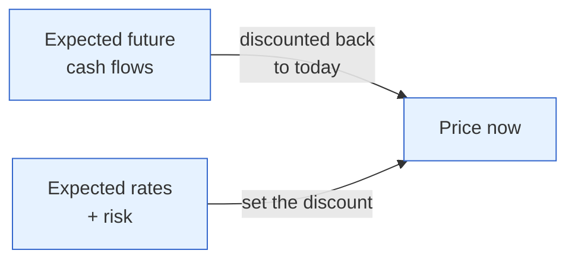

# Day 3 — Markets Price the Future, Not the Present

> **Today's one idea:** A market price already contains everything the crowd *expects*, so prices move not on news itself but on the **surprise** — the gap between what happened and what was expected — and understanding *how* that expectation forms is the key to never being blindsided again.
> **Reading time:** ~40 min · **Prereqs:** [Day 2](day-02-trend-vs-cycle.md)
> **Primary source for today:** Bernanke & Kuttner, "What Explains the Stock Market's Reaction to Federal Reserve Policy?" (*Journal of Finance*, 2005).
> **Before you start:** Recall Day 2 in one sentence, no looking — *what is the difference between the economy's trend and its cycle, and which one do markets trade more?*

## The hook (2–4 min)

The RBI cuts the repo rate by 25 basis points. Textbook logic says lower rates are good for stocks, so the Nifty should jump. Instead it *falls*. A newcomer is baffled and concludes "the market is irrational."

It isn't. Everyone already *knew* a 25 bp cut was coming — economists had forecast it for weeks, and the price had already risen in anticipation. When the cut arrived exactly as expected, there was no new information in the *event*. But the Governor's tone hinted this might be the *last* cut — and *that* was a surprise. The market wasn't reacting to the cut. It was reacting to the part it didn't already know. **This single distinction — event vs. surprise — is why "why markets move on news" confuses almost everyone, and it's the hinge of this entire course.**

## Building the intuition (10–15 min)

Here is the mental shift. A stock or bond price is not a snapshot of today. It is the crowd's best guess about the *future* — future earnings, future rates, future growth — all squeezed into one number *now*. Markets are forward-looking machines.

That has a startling consequence: **anything everyone already expects is already in the price.** If the whole market is sure India will grow 6% next year, then 6% is baked into stock prices today. If growth then comes in at *exactly* 6%, prices don't move — the news confirmed what was priced. Prices only move when reality differs from the consensus. Call that difference the **surprise**:

```math
\text{Price move} \; \propto \; \text{Surprise} \;=\; \text{Actual} - \text{Expected}
```

Read that as: *the price reaction is proportional to how much reality differed from the consensus forecast*, not to the raw number.

Think of a cricket match with heavy betting. The odds already reflect that India is favoured. If India wins as expected, the odds barely move. If a star bowler gets injured mid-match — genuinely new information — the odds lurch. The score moving *as predicted* changes little; the *unpredicted* changes everything. Markets are that betting board, priced continuously.

This immediately explains three things that baffle newcomers:

1. **"Good news, price falls."** A company reports 20% profit growth (good!) but the market expected 25%. The *surprise* is negative. Price falls on good news.
2. **"Priced in."** When traders say a rate hike is "priced in," they mean the expected event will move nothing; only a deviation from it will.
3. **"Buy the rumour, sell the news."** Prices rise on the *anticipation* (expectations building) and then fall when the actual event confirms what was already expected — the surprise is gone.

Where does the "expected" number come from? From the crowd's forecasts — consensus estimates, economist polls, the *whisper* number traders actually trade on. Half of reading markets is knowing **what was expected**, not just what happened. (You'll practise exactly this on [Day 22](../../05-reading-the-real-world/days/day-22-reading-a-data-release.md).) And because those expectations are formed by *humans* — who anchor, extrapolate, and herd — they're often systematically wrong in ways you can anticipate. That behavioural layer is [Day 18](../../04-macro-to-assets/days/day-18-behavioral-engine.md); today just plant the flag: *expectations are a human construct, not a fact.*

## The formal picture (10–15 min)

Two building blocks, both of which return throughout the course.

**1. A price is a discounted expectation of the future.** The value of any asset is the stream of cash it will pay, brought back to today. Even without the formula (that's [Day 17](../../04-macro-to-assets/days/day-17-discount-rate-lens.md)), hold the shape:



Because the price is built from *expectations*, it changes when expectations change — and expectations change when a *surprise* arrives.

**2. Only the unanticipated component of news moves prices.** This is exactly what Bernanke and Kuttner measured for the US Fed. They split each rate decision into an *expected* part and a *surprise* part (using futures prices to back out what markets had anticipated). The finding: equities barely respond to the expected part, but react strongly to the **surprise** — an unexpected 25 bp cut moved the S&P by roughly 1%, working mostly through a change in the **equity risk premium** and expected future dividends, not the rate itself. The event was almost irrelevant; the *surprise* was everything.

The same logic governs every Indian release you'll ever trade: CPI, GDP, the RBI decision, the Budget. Write it as your first rule of market-reading:

> **Reaction ≈ (Actual − Consensus) × (how much the market cares about this variable now).**

That second factor matters: the same inflation surprise moves markets more when inflation is the market's obsession than when everyone's watching growth. Context sets the sensitivity. Keep both terms in view.

## Where it breaks / what it is not (3–5 min)

- **"Priced in" is a claim about consensus, and consensus can be wrong.** If everyone anticipates the same wrong thing, a "no surprise" event can still be followed by a big move later when reality asserts itself. "Priced in" ≠ "correct."
- **Surprises can be about the *future*, not the present.** A central bank can do exactly the expected thing today but signal a surprising *path* ahead (forward guidance). The surprise is in the guidance, not the action — precisely the RBI-cut example from the hook.
- **It is not a claim that markets are always right.** Prices embed the crowd's expectation, which is frequently mistaken (Day 18). "Priced for perfection" often precedes a fall. Forward-looking ≠ correct-looking.
- **Not all surprises are equal.** A surprise in a variable nobody currently cares about moves little. Sensitivity is regime-dependent — a theme we return to on [Day 21](../../04-macro-to-assets/days/day-21-four-regimes.md).

## Try it yourself (5–10 min)

1. **Retrieval first.** Close the page. Write the formula-in-words for what moves a price, and explain in one sentence why a stock can fall on genuinely good earnings. No looking.

2. **Direct application.** India's CPI is released. Consensus was 5.0%. Two scenarios: (a) it prints 5.0%; (b) it prints 5.6%. For an investor holding rate-sensitive stocks (say, a housing-finance company), describe the likely price reaction in each case *and why* — being explicit about the role of expectations. Write it as you'd explain it to a colleague who says "but 5.6% isn't even that high."

3. **Stretch.** A company's results are *exactly* in line with consensus, yet the stock jumps 6% on the day. Give two distinct, plausible reasons this can happen *even though the print held no surprise*. (Hint: what else gets released alongside the numbers? What were people *positioned* for?)

<details>
<summary>Hint</summary>
#2: the market cares about CPI because it drives the RBI (Day 5 preview). A hot print raises expected rates → higher discount rate → rate-sensitive stocks fall. #3: think guidance/outlook (a surprise about the *future*), and think positioning — if everyone feared a *miss* and hedged, an in-line print removes the feared downside.
</details>

<details>
<summary>Worked solution</summary>

**#2:** (a) 5.0% = *no surprise*; the print was already in the price, so little reaction. (b) 5.6% = a *positive inflation surprise* of 0.6%. Even though 5.6% "isn't high" in absolute terms, it's higher than the crowd expected, so the market revises up its expectation of RBI rates. Higher expected rates raise the discount rate applied to a housing-finance company's future earnings (and hint at slower loan demand), so the stock falls. The *level* isn't the point; the *gap from consensus* is.

**#3:** (i) **Guidance surprise:** the results matched, but management raised full-year guidance or said demand is accelerating — a surprise about the *future* even though the past quarter was in line. (ii) **Positioning:** the crowd was braced for a *miss* and had sold or hedged the stock; an in-line print removes the feared bad outcome, and the relief buying (short-covering) lifts the price. In both cases the mover is a surprise — just not in the headline number. This is the first hint of the behavioural/positioning layer of Day 18.
</details>

> **Transfer — apply it:** Pick a stock or index move you saw recently that puzzled you. State it as: input (the news + what was expected), what today's idea does (isolate the surprise), output (why the price moved that way). If the move still looks irrational after isolating the surprise, note it — you'll have the missing piece (positioning/behaviour) by Day 18.

## Connect it back

Day 2 said markets trade the *cycle* more than the trend — today you learned *why*: the trend is largely expected and therefore priced, so it's the cyclical *surprises* that move things. This "surprise, not event" idea is the single most reused concept in the course; it returns on Days 15, 17, 22, and 23, and it's half of every drill. Tomorrow we pick up the second core macro variable — inflation — and build its intuition from scratch before we ever measure it.

**The sharp question you can now answer:** Why can the RBI cut rates and the market fall the same afternoon?

## Suggested readings for today

**Required if you have 15 extra minutes:** Bernanke & Kuttner (2005), **Section I and the conclusion** — skip the econometrics; read their framing of "expected vs. surprise" and the headline result that equities react to the surprise via the risk premium. It's the empirical backbone of today's rule.

**If you want the deep version:**
- Olivier Blanchard, *Macroeconomics*, 8th ed., **Ch. 14 ("Expectations: The Basic Tools")** — how forward-looking expectations enter asset prices.
- Ray Dalio, "How the Economic Machine Works" (video), **the segment on markets and credit** — reinforces that prices are bets on the future.

---

## Navigation

← **Previous:** [Day 2 — Trend vs. the Wobble](day-02-trend-vs-cycle.md)  
→ **Next:** [Day 4 — Inflation Is a Story About Money and Goods](day-04-inflation-money-and-goods.md)
