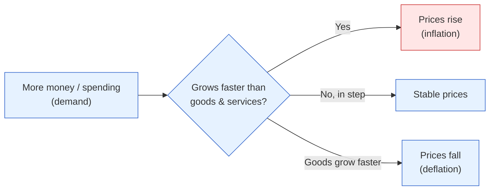

# Day 4 — Inflation Is a Story About Money and Goods

> **Today's one idea:** Inflation is what happens when the amount of *spending* in the economy grows faster than the amount of *stuff* to buy — too much money chasing too few goods — so the rupee steadily buys less.
> **Reading time:** ~35 min · **Prereqs:** [Day 1](day-01-economy-is-transactions.md)
> **Primary source for today:** N. Gregory Mankiw, *Macroeconomics*, 10th ed., inflation chapter.
> **Before you start:** Recall Day 3 in one sentence, no looking — *what actually moves a market price: the news, or the gap between the news and what was expected?*

## The hook (2–4 min)

Your grandmother tells you that in her youth a rupee bought a full meal. Today a rupee barely buys a toffee. The rupee note hasn't changed — same paper, same number. What changed is what it *commands*. That silent erosion, year after year, is inflation. It is not prices "going up" as a moral failing of shopkeepers; it is the *value of money going down*. Same thing, seen from the other side — exactly the two-sided trick you learned on Day 1.

## Building the intuition (10–15 min)

Imagine a small island with 100 coconuts to sell and 100 rupees in circulation. Roughly, a coconut costs ₹1. Now airdrop another 100 rupees onto the island — but there are *still only 100 coconuts*. People have twice the money and want the same coconuts. They bid against each other. Prices rise until ₹200 chases 100 coconuts: about ₹2 per coconut. Nothing *real* changed — same coconuts, same island. Only the price doubled, because money doubled while goods didn't.

That is the whole intuition: **inflation is the mismatch between the growth of spending power and the growth of real output.**



Two flavours of the mismatch, both worth naming because they call for opposite responses:

- **Demand-pull:** too much *spending* (money/credit) relative to output. The coconut airdrop. This is the kind central banks fight by raising rates to cool spending.
- **Cost-push:** the *supply* of goods shrinks or gets costlier — a bad monsoon spikes vegetable prices, or global crude jumps and India (importing ~85% of its oil) pays more for everything that moves. Fewer/costlier goods, same money → prices rise.

For India this distinction is not academic. A huge share of Indian inflation comes from **food and fuel** — supply-side, weather- and oil-driven, and largely outside the RBI's control. That's why India separates "headline" from "core" inflation (Day 9) and why the RBI sometimes *can't* fix an inflation problem with rates alone.

Why an investor cares, in one line each:
- Inflation **erodes the real value of future cash** — a bond paying ₹100 next year is worth less if the rupee buys less then. This is the seed of the discount rate (Day 17).
- Inflation is **the RBI's primary trigger** — it's what makes them hike or cut (Day 13). Since rates drive every asset, inflation is upstream of your whole portfolio.
- Inflation **redistributes**: it quietly taxes savers and lenders and rewards borrowers (who repay in cheaper rupees).

## The formal picture (10–15 min)

**Inflation** is the sustained rise in the *general* price level — not one item, but the broad basket. The **inflation rate** is its percentage change over a year:

```math
\pi_t \;=\; \frac{P_t - P_{t-1}}{P_{t-1}} \times 100
```

where `π` (the Greek letter *pi*, standard notation for inflation) is the inflation rate, and `P` is the price level (the cost of a fixed basket of goods) — this year vs. last year. On Day 9 you'll learn how India actually builds `P` (the CPI basket) and why food's huge weight matters.

The oldest formal story behind the coconut island is the **quantity theory of money**, written as an identity:

```math
M \times V \;=\; P \times Y
```

- **M** = quantity of money in the economy.
- **V** = velocity — how many times each rupee is spent in a year.
- **P** = the price level.
- **Y** = real output (the quantity of goods and services).

Read it plainly: total *spending* (money × how fast it circulates) must equal total *nominal output* (prices × quantity). It's Day 1's identity wearing a hat. The lesson investors take: if **M** grows much faster than **Y** (money outpaces goods), and **V** is roughly stable, then **P** must rise — inflation. It's the coconut airdrop in symbols. (Velocity isn't actually constant, which is why this is a lens, not a law — see below.)

The famous one-liner, from Milton Friedman (whom we meet properly on Day 13): *"Inflation is always and everywhere a monetary phenomenon."* True for sustained, demand-pull inflation. India's food-and-fuel spikes are the "everywhere" that tests the "always" — a tension we hold rather than paper over.

## Where it breaks / what it is not (3–5 min)

- **Velocity isn't constant.** In a panic people hoard money (V falls), so more M doesn't immediately mean more P. This is why central banks can expand money in a crisis without runaway inflation — until confidence and spending return. `MV = PY` is a lens, not a mechanical dial.
- **A one-off price jump is not inflation.** If onion prices triple after a bad harvest but everything else is flat, that's a *relative* price change, not sustained general inflation. Inflation is the *broad, ongoing* rise. (Central banks "look through" one-off supply shocks — Day 9.)
- **Inflation is not the same as the cost of living being high.** A permanently expensive city has high prices, not necessarily high *inflation* (the rate of change). Level vs. change — the same trap as Day 2's trend vs. cycle.
- **Deflation (falling prices) is not the friendly opposite.** It sounds nice but can be dangerous: if people expect prices to fall, they delay spending, the loop slows (Day 1), and the economy can spiral. Central banks fear it.

## Try it yourself (5–10 min)

1. **Retrieval first.** Close the page. Explain inflation using the coconut island, in your own words, without looking — and state the one condition under which more money does *not* cause inflation.

2. **Direct application.** India's crude oil import bill jumps because global oil rises 30%. Walk a colleague through: is this demand-pull or cost-push inflation? Which prices beyond petrol will rise, and why? And why might raising interest rates be a *blunt* tool against this particular kind of inflation?

3. **Stretch.** The government hands ₹1 lakh crore directly to households during a boom when factories are already running flat out. Using `MV = PY`, argue what most likely happens to **P** and why — then contrast with handing out the same money during a deep slump with idle factories. (This is the difference between stimulus that inflates and stimulus that revives — hold it for Day 16.)

4. **Spaced callback (Day 1).** Inflation "erodes the value of money." Restate that using Day 1's insight that spending and income are two sides of one rupee — who *gains* from inflation, the borrower or the lender, and why?

<details>
<summary>Hint</summary>
#2: oil is an input to nearly everything (transport, fertiliser, plastics), so it's a broad *cost-push*; rate hikes fight *demand*, not a supply shock. #3: when Y can't rise (full capacity), extra M must show up in P; when Y has room, extra M can lift Y instead. #4: the borrower repays a fixed rupee amount that's worth less later.
</details>

<details>
<summary>Worked solution</summary>

**#2:** **Cost-push.** Oil is an input to transport, fertiliser, plastics, and power, so its price feeds into almost everything — broad, supply-driven inflation. Rate hikes are blunt here because they work by cooling *demand* (Day 14), but the problem is on the *supply* side; the RBI would have to crush demand hard to offset an oil shock, risking a slowdown. This is why cost-push inflation is the central banker's nightmare.

**#3:** In a boom at full capacity, **Y** can't rise, so extra **M** (with **V** stable) shows up almost entirely in **P** — pure inflation. In a deep slump with idle factories, the extra **M** can raise **Y** (put idle capacity and workers to use) with little effect on **P**. Same policy, opposite result, depending on where you are in the cycle (Day 2). Context decides whether stimulus inflates or revives.

**#4:** The **borrower gains**. A borrower owes a fixed number of rupees; if those rupees buy less when repaid, the *real* burden of the debt shrinks. The lender is repaid in cheaper rupees — a real loss. Inflation silently transfers wealth from lenders/savers to borrowers, which is one reason unexpected inflation is so politically charged.
</details>

> **Transfer — apply it:** Find one place inflation touches your own portfolio or spending. State it as: input (the price/cost that's rising), what today's idea does (is it money-chasing-goods or a supply shock?), output (what that implies for whether it persists and whether the RBI will act). If you can't classify it as demand-pull or cost-push, that's the question to resolve — it changes everything about how the RBI responds.

## Connect it back

You now hold both core macro variables: growth (Days 1–2) and inflation (today). Day 3 taught you markets move on surprises — and inflation surprises are among the most powerful, because they change what the RBI is expected to do. Tomorrow we meet the two players who *respond* to growth and inflation: the RBI and the Government — the two hands on the wheel whose announcements are the "news" markets trade.

**The sharp question you can now answer:** Why can't the RBI simply "fix" an inflation caused by a global oil spike the way it fixes an overheating economy?

## Suggested readings for today

**Required if you have 15 extra minutes:** N. Gregory Mankiw, *Macroeconomics*, 10th ed., **the chapter section on "The Quantity Theory of Money"** — the coconut island, made formal, with the `MV = PY` identity and its assumptions.

**If you want the deep version:**
- Milton Friedman, "The Role of Monetary Policy" (*AER*, 1968), **first few pages** — the origin of "inflation is always and everywhere a monetary phenomenon," in Friedman's own words. (We use it fully on Day 13.)
- Olivier Blanchard, *Macroeconomics*, 8th ed., **the chapter on inflation, activity, and money growth** — a more cycle-aware treatment than the pure quantity theory.

---

## Navigation

← **Previous:** [Day 3 — Markets Price the Future, Not the Present](day-03-markets-price-the-future.md)  
→ **Next:** [Day 5 — Who Steers? The Two Levers](day-05-who-steers.md)
