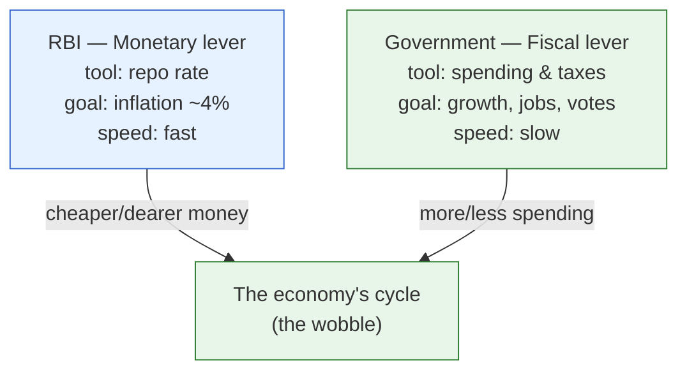

# Day 5 — Who Steers? The Two Levers

> **Today's one idea:** The short-run economy is steered by exactly two hands — the **RBI** pulling the *monetary* lever (interest rates and money) and the **Government** pulling the *fiscal* lever (spending and taxes) — and almost every piece of macro "news" that moves markets is one of these two hands moving, or a hint that it's about to.
> **Reading time:** ~35 min · **Prereqs:** [Day 3](day-03-markets-price-the-future.md), [Day 4](day-04-inflation-money-and-goods.md)
> **Primary source for today:** D. Subbarao, *Who Moved My Interest Rate?* (2016), opening chapters.
> **Before you start:** Recall Day 4 in one sentence, no looking — *what does "too much money chasing too few goods" mean, and what's the difference between demand-pull and cost-push inflation?*

## The hook (2–4 min)

Two dates dominate the Indian market calendar. **The first of February** — the Union Budget, when the Finance Minister in North Block announces how much the government will spend and tax. And **the bi-monthly MPC day** — when the RBI Governor on Mint Road announces what happens to interest rates. On both days, screens light up, the Nifty and the rupee lurch, and TV anchors lose their minds. Why *these* two events above all others? Because these are the two moments the economy's two steering hands actually *move*. Learn to read these two hands and most macro "surprises" (Day 3) stop being surprises.

## Building the intuition (10–15 min)

Recall the escalator-and-wobble from Day 2. The *trend* (escalator) is set by slow structural forces no one controls in the short run. But the *wobble* — the cycle — can be nudged. Two players do the nudging, with two very different tools:

**Hand 1 — The RBI (monetary policy).** The central bank controls the *price and availability of money*. Its main tool is the **repo rate** — the interest rate that ripples out to all other rates (Day 10). Cheaper money → more borrowing and spending → warmer economy. Dearer money → less borrowing → cooler economy. The RBI's job, by law since 2016, is primarily to keep **inflation** near 4% (Day 9, Day 13) while supporting growth. It's fast: the MPC can change rates in an afternoon.

**Hand 2 — The Government (fiscal policy).** The government controls its own *spending and taxes*. Spend more (build roads, pay MGNREGA wages) or tax less → more demand in the loop → warmer economy. Spend less or tax more → cooler. Its main stage is the annual **Budget**, and its key number is the **fiscal deficit** — how much it must borrow (Day 16). It's slower and more political: budgets are annual and hard to reverse.

The crucial investor insight: **these two hands can push together or against each other.** In COVID, both pushed hard for growth at once (rate cuts *and* big spending) — a powerful tailwind for assets. But they can also conflict: if the government spends lavishly (stoking demand and inflation) while the RBI is trying to cool inflation with hikes, the two levers fight, and the bond market (Day 16) gets caught in the middle. Reading *whether the two hands agree* is a genuine edge.

And a distinctly Indian tension you'll return to on Day 25: the RBI is meant to be *independent*, but it's owned by the government and manages the government's borrowing. Governor Subbarao's memoir is largely the story of that push-and-pull — the RBI wanting to fight inflation while North Block wanted lower rates for growth. That friction *is* macro news.

## The formal picture (10–15 min)

| | **Monetary policy** | **Fiscal policy** |
|---|---|---|
| **Who** | The RBI (independent MPC) | The Government (Ministry of Finance) |
| **Tool** | Repo rate, liquidity, money supply | Spending and taxation |
| **Primary goal** | CPI inflation at 4% (±2%), then growth | Growth, employment, redistribution, (politics) |
| **Key event** | Bi-monthly MPC decision | Annual Union Budget (Feb 1) |
| **Key number** | The repo rate | The fiscal deficit (% of GDP) |
| **Speed / reversibility** | Fast, easily reversed | Slow, politically sticky |
| **Main constraint** | Can't fix supply shocks; leaky transmission (Day 14) | Debt sustainability; bond-market limits (Day 16) |

- **Monetary policy** works on the *demand* side by changing the incentive to borrow, spend, and save. It is *countercyclical* by design — lean against the wobble.
- **Fiscal policy** also works on demand, but directly — the government is itself a huge spender in the Day 1 loop. It can target *where* the money goes (a road here, a subsidy there) in a way monetary policy can't.

Two terms to bank:
- **Countercyclical:** acting *against* the cycle — stimulate in a slump, restrain in a boom. Good policy leans against the wind.
- **Procyclical:** acting *with* the cycle — spending big in a boom or cutting in a slump. Usually a mistake (it amplifies the wobble), but politically common.

Everything in Modules 2–3 is really about these two hands: how the RBI decides (Day 13), how its move transmits (Day 14), how the government's borrowing lands in the bond market (Day 16). Today just fix the map: *two hands, two tools, two goals, two speeds.*

## Where it breaks / what it is not (3–5 min)

- **The RBI is not the government — usually.** Its legal independence matters, but the boundary is contested (Subbarao's whole book). In a crisis the lines blur. Don't assume the RBI simply does the government's bidding, but don't assume perfect independence either.
- **These levers move demand, not the trend.** Neither hand can lift India's *potential* growth (Day 2) — that needs structural reform. Confusing "the RBI cut rates" with "India's growth story improved" is the Day 2 error in a new costume.
- **Monetary policy is not all-powerful.** It can't fix a supply shock (Day 4's oil example), and in India it transmits weakly and slowly (Day 14). A rate cut is a nudge, not a switch.
- **There are other actors, but they're second-order for this course.** Global forces (the Fed, oil, capital flows — Day 19) and regulators matter, but for reading day-to-day macro news, the two hands dominate.

## Try it yourself (5–10 min)

1. **Retrieval first.** Close the page. Name the two levers, who controls each, each one's main tool and main goal — from memory. Then state one situation where the two hands would *conflict*.

2. **Direct application.** It's a slowing economy: growth is weak but inflation is *also* high (a bad combination). You're advising on what each hand should do. Write the dilemma for the RBI in two sentences (what does fighting inflation vs. supporting growth pull it to do?), and say why the government's fiscal hand might be the *better* tool here. Explain it to a colleague who says "just cut rates, problem solved."

3. **Stretch.** Suppose the government announces a much larger deficit (big spending) *and* the RBI is worried about inflation. Predict the likely direction of (a) the RBI's next rate move and (b) government bond yields — and explain the tension between the two hands that drives your answer. (You're pre-deriving Days 13 and 16.)

4. **Spaced callback (Day 3).** Budget day and MPC day move markets violently. Using Day 3, explain why the market often *doesn't* move much even on a big rate cut — and what, specifically, it's actually reacting to on those days.

Hint

#2: high inflation says "hike," weak growth says "cut" — the RBI can't do both; a targeted fiscal measure can support growth without adding to broad demand. #3: big deficit → more bond supply and more demand/inflation → RBI leans hawkish → yields up. #4: the decision itself is usually *expected* and priced; the *surprise* is in the tone/guidance/stance.

Worked solution

**#2:** The RBI's dilemma: high inflation argues for *raising* rates to cool demand, but weak growth argues for *cutting* to support activity — one tool, two opposing pulls, so it can't fully satisfy either. This is why "just cut rates" is naive: a cut might revive growth but feed the inflation. The government's fiscal hand can be better because it's *targeted* — e.g., a supply-side measure (cutting fuel taxes, easing a supply bottleneck) can ease inflation *and* support activity without stoking broad demand the way a rate cut does.

**#3:** (a) The RBI leans **hawkish** (higher/held rates): a bigger deficit adds demand and potential inflation, which the RBI must lean against. (b) Government **bond yields rise**: more borrowing means more bond *supply* (pushing prices down, yields up — Day 10), plus higher expected inflation and RBI rates. The tension: the government's growth-seeking hand is pushing the accelerator while the RBI's inflation-fighting hand is on the brake, and the bond market prices the conflict.

**#4:** By Day 3, a widely expected rate decision is already priced, so the *action* moves little. On MPC day the market actually reacts to the **surprise** — the change in the **stance** (accommodative/neutral/withdrawal), the inflation projections, and the Governor's tone about the *future path*. The number is theatre; the guidance is the news. (You'll do this for real on Day 23.)

> **Transfer — apply it:** Think of the last Budget or MPC decision you remember. State it as: input (what the hand actually did), what today's idea does (identify which lever moved and whether it agreed or conflicted with the other hand), output (what that meant for rates, the rupee, or equities). If you can't recall which hand it was, that's the gap — start watching Feb 1 and MPC days deliberately.

## Connect it back

Module 1 is complete. You now have the whole machine as a picture: a spending loop (Day 1) that grows along a trend and wobbles in a cycle (Day 2), watched by markets that trade *surprises* about its future (Day 3), where inflation is money outrunning goods (Day 4), all steered by two hands — the RBI and the Government (today). From tomorrow we stop drawing pictures and start reading the actual numbers India publishes, beginning with the biggest one: GDP, and the three different ways it's counted.

**The sharp question you can now answer:** On MPC day, what is the market *actually* reacting to, if not the rate decision itself?

## Suggested readings for today

**Required if you have 15 extra minutes:** D. Subbarao, *Who Moved My Interest Rate?* (2016), **Ch. 1–2** — a former RBI Governor on the tug-of-war between the two hands. It makes the "conflict between the levers" viscerally real with India-specific stakes.

**If you want the deep version:**
- Ray Dalio, "How the Economic Machine Works" (video), **the segment on the two levers / policymakers** — the same monetary-vs-fiscal split, globally framed.
- N. Gregory Mankiw, *Macroeconomics*, 10th ed., **the chapters introducing monetary and fiscal policy** — the textbook mechanics we'll build out in Module 3.

---

## Navigation

← **Previous:** [Day 4 — Inflation Is a Story About Money and Goods](day-04-inflation-money-and-goods.md)  
→ **Next:** [Day 6 — Three Lenses on One Number](../../02-measuring-the-machine/days/day-06-three-lenses-on-gdp.md)
