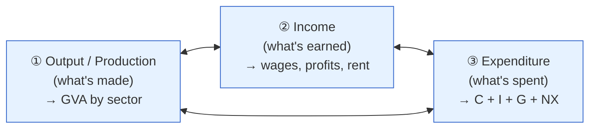

# Day 6 — Three Lenses on One Number

> **Today's one idea:** GDP can be counted three ways — as everything *produced* (output/GVA), everything *earned* (income), or everything *spent* (expenditure) — and because every transaction has two sides, all three must add up to the same number.
> **Reading time:** ~40 min · **Prereqs:** [Day 1](../../01-foundations/days/day-01-economy-is-transactions.md)
> **Primary source for today:** MOSPI GDP methodology; Blanchard, *Macroeconomics*, national-accounts chapter.
> **Before you start:** Recall Day 5 in one sentence, no looking — *what are the two levers that steer the short-run economy, and who controls each?*

## The hook (2–4 min)

When MOSPI (India's statistics ministry) says "GDP grew 7.2% last quarter," where does that number *come from*? Nobody counts every samosa sold. Yet the figure is precise to a decimal, moves markets, and decides the RBI's next move. The trick is that GDP isn't measured once — it's measured *three separate ways* that must agree, like checking a sum by adding the columns and the rows. Understanding those three lenses is what lets you read a GDP print and know *which part* of the economy is really driving it.

## Building the intuition (10–15 min)

Go back to Day 1's tiny island: the farmer buys ₹100 of fish, the fisherman buys ₹100 of grain. Now ask three different questions about that island's economy:

1. **How much did they *produce*?** ₹100 of fish + ₹100 of grain = ₹200 of output.
2. **How much did they *earn*?** The fisherman earned ₹100, the farmer earned ₹100 = ₹200 of income.
3. **How much did they *spend*?** ₹100 on fish + ₹100 on grain = ₹200 of spending.

Same ₹200, three times. Not a coincidence — a *necessity*. Every rupee of output is sold (spending), and the proceeds become someone's income. This is Day 1's identity, now given three named faces:



Each lens tells you something different and useful:
- **The output lens** shows you *which sectors* are producing — agriculture, industry, services. This is what India headlines as **GVA** (Gross Value Added). It answers "who's making the growth?"
- **The income lens** shows *who's getting paid* — labour vs. capital. (Least used in India due to data gaps.)
- **The expenditure lens** shows *who's doing the buying* — households, firms, government, foreigners. This is the `C + I + G + NX` breakdown we dissect tomorrow. It answers "what's driving demand?"

For an investor, lenses ① and ③ are gold: output tells you which *sectors* are hot; expenditure tells you whether the growth is led by consumers, corporate investment, or government — which points to entirely different stocks.

## The formal picture (10–15 min)

**GDP** = the market value of all *final* goods and services produced within a country in a period. Two words earn their keep:
- **Final:** only the finished good counts, not the intermediate inputs (count the bread, not separately the flour that went into it), or you'd double-count. "Value added" at each stage is what sums cleanly — hence *Gross Value Added*.
- **Within a country:** *domestic*. Produced on Indian soil, regardless of who owns the factory.

**India's specific quirk — GVA vs. GDP.** India headlines both, and they differ by taxes:

```math
\text{GDP} \;=\; \text{GVA} \;+\; \text{(Net indirect taxes)} \;=\; \text{GVA} + \text{Taxes on products} - \text{Subsidies}
```

- **GVA** is output valued at the cost of production (what producers actually receive) — the cleanest read of *underlying activity by sector*.
- **GDP** adds the taxes the government slaps on products (GST) and subtracts subsidies — it's GVA at the prices *buyers* pay.
- Why you care: if GDP grows faster than GVA, part of the "growth" is just higher net taxes (or lower subsidies), not more real activity. Analysts often trust **GVA** as the truer pulse. Watch the gap.

**Nominal vs. real — the single most important adjustment.** A number can rise for two reasons: more *stuff*, or higher *prices*. Only more stuff is real growth (recall Day 4).

- **Nominal GDP** = output valued at *current* prices. Includes inflation.
- **Real GDP** = output valued at a *fixed base year's* prices. Strips inflation out. **This is the "GDP grew 7%" number** — always real unless stated otherwise.
- The bridge between them is the **GDP deflator**:

```math
\text{GDP deflator} \;=\; \frac{\text{Nominal GDP}}{\text{Real GDP}} \times 100
```

The deflator is itself an inflation measure — the broadest one, covering *everything* in GDP (unlike CPI's consumer basket — Day 9). If nominal GDP grew 11% and real GDP grew 7%, the deflator (economy-wide inflation) was about 4%.


## Where it breaks / what it is not (3–5 min)

- **The three lenses agree in theory, not exactly in practice.** India measures them separately with imperfect data, so there's a **"discrepancy"** line that plugs the gap. When the discrepancy is large, treat the print with caution — the statisticians are telling you they're unsure.
- **GDP is not welfare.** It counts *activity*, not wellbeing. Rebuilding after a flood adds to GDP; unpaid household work and the vast informal economy are undercounted. Don't read "GDP up" as "everyone better off."
- **The base-year problem.** Real GDP depends on the chosen base year (India: 2011-12). When the base is old, weights get stale and the number drifts from reality; a rebasing can revise history. India's 2015 methodology change (and the "back-series" debate) is exactly this — flagged, not dwelt on.
- **GDP is not GNP.** GDP is production *within India*; GNP adds income Indians earn abroad and subtracts what foreigners earn here. For this course we use GDP.

## Try it yourself (5–10 min)

1. **Retrieval first.** Close the page. Name the three lenses on GDP and, in one sentence, why they must give the same number. Then state the difference between GVA and GDP without looking.

2. **Direct application.** A GDP release shows **nominal GDP +10.5%**, **real GDP +6.5%**. (a) What was economy-wide inflation (the deflator), roughly? (b) A commentator cheers "double-digit growth!" — what's wrong with that, and which number should you quote instead? Explain as you would to that commentator.

3. **Stretch.** In a given quarter, **GDP grows 7.8% but GVA grows only 6.2%.** Give the most likely reason for the 1.6-point gap, and explain why an analyst might trust the GVA figure as the better read of the real economy. What government action could *manufacture* a higher GDP number without more actual production?

4. **Spaced callback (Day 1).** The three lenses are really Day 1's identity in disguise. State the Day 1 identity, and match each of its three terms to one of today's three lenses.

<details>
<summary>Hint</summary>
#2: deflator growth ≈ nominal growth − real growth. #3: GDP = GVA + net indirect taxes; higher GST collections or lower subsidies widen the gap. #4: spending ≡ income ≡ output → expenditure ≡ income ≡ output/production.
</details>

<details>
<summary>Worked solution</summary>

**#2:** (a) Deflator (broad inflation) ≈ 10.5% − 6.5% = **~4%**. (b) "Double-digit growth" is *nominal* — it includes ~4% inflation, which isn't real growth in output. The honest figure is **real GDP, +6.5%**. Quoting nominal growth as if it were real is a classic way to flatter the numbers.

**#3:** GDP = GVA + net indirect taxes. A 1.6-point gap means **net indirect taxes rose** — either higher GST collections or *lower subsidies* (both raise GDP relative to GVA) — without any extra underlying production. An analyst trusts **GVA** because it measures activity at producers' cost, uncontaminated by the tax/subsidy wedge. A government could lift *GDP* by cutting subsidies or if GST buoyancy is strong, even as real sectoral activity (GVA) is softer — so always check whether GDP strength is "real" (GVA) or "tax-driven."

**#4:** Day 1: **Total Spending ≡ Total Income ≡ Total Output.** Match: Spending = the **expenditure** lens (C+I+G+NX); Income = the **income** lens (wages, profits); Output = the **production/GVA** lens. Today's three lenses are literally the three terms of Day 1's identity, each turned into a measurement method.
</details>

> **Transfer — apply it:** Next time a GDP print lands, decide *before* reading commentary: is the strength coming from the output side (which sectors?) or the expenditure side (which buyers?), and is it real or nominal? State it as input (the release) → today's idea (which lens explains the move) → output (which sectors/stocks that points to). This is the habit tomorrow's page turns into a repeatable read.

## Connect it back

Day 1's abstract loop is now a measured number with three faces. But "GDP grew 6.5%" is still just a headline — the *real* information is in the breakdown. Tomorrow we pick up the expenditure lens (`C + I + G + NX`) and learn to read the *composition* of demand: whether growth is led by the consumer, corporate capex, the government, or trade — because each points to a different set of Nifty sectors.

**The sharp question you can now answer:** If GDP is up 8% but GVA is up only 6%, what is the other 2% — and should it make you more or less excited?

## Suggested readings for today

**Required if you have 15 extra minutes:** MOSPI, "Press Note on Quarterly GDP Estimates" (any recent quarter, on mospi.gov.in) — **read the summary tables**, and find the GVA-by-sector table and the nominal/real split. Seeing the actual Indian release makes today concrete.

**If you want the deep version:**
- Olivier Blanchard, *Macroeconomics*, 8th ed., **Ch. 2 ("A Tour of the Book" / national accounts)** — the three approaches, formalised.
- N. Gregory Mankiw, *Macroeconomics*, 10th ed., **Ch. 2**, the GDP-deflator and nominal-vs-real sections.

---

## Navigation

← **Previous:** [Day 5 — Who Steers? The Two Levers](../../01-foundations/days/day-05-who-steers.md)  
→ **Next:** [Day 7 — Dissecting Demand: C, I, G, NX](day-07-dissecting-demand.md)
