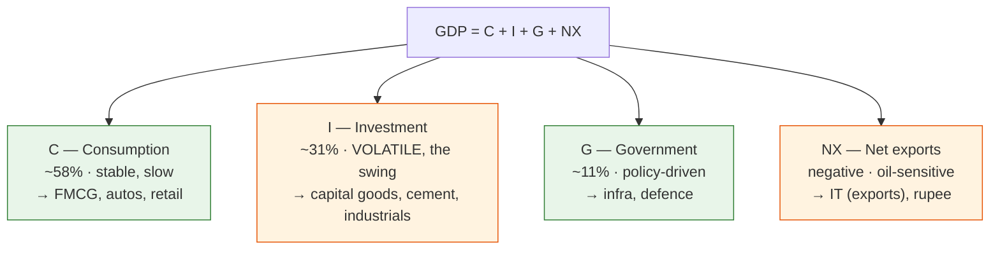
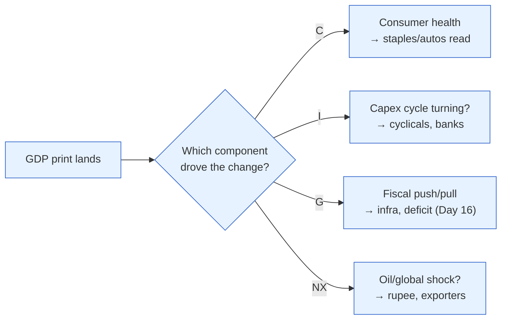

# Day 7 — Dissecting Demand: C, I, G, NX

> **Today's one idea:** The *composition* of spending — how much comes from consumers (C), businesses investing (I), the government (G), and net trade (NX) — tells you where the economy is in its cycle and which sectors are driving it, far more than the headline GDP number does.
> **Reading time:** ~40 min · **Prereqs:** [Day 2](../../01-foundations/days/day-02-trend-vs-cycle.md), [Day 6](day-06-three-lenses-on-gdp.md)
> **Primary source for today:** Government of India, *Economic Survey* (expenditure-side GDP section).
> **Before you start:** Recall Day 6 in one sentence, no looking — *what are the three lenses on GDP, and what does the expenditure lens break GDP into?*

## The hook (2–4 min)

Two economies both grow 7%. In the first, the growth is all consumers buying phones and scooters. In the second, it's all companies building new factories. Same headline — completely different investment implications. In the first, you'd want FMCG, autos, retail. In the second, you'd want capital goods, cement, industrials. The headline "7%" hides the one thing an investor actually needs: **who is doing the spending.** Today you learn to crack the number open.

## Building the intuition (10–15 min)

The expenditure lens (Day 6) says every rupee of output is bought by one of exactly four buyers. That's the famous identity:

```math
\text{GDP} \;=\; C \;+\; I \;+\; G \;+\; NX
```

- **C — Private consumption.** Households buying goods and services: groceries, rent, phones, haircuts. In India, ~**57–60% of GDP** — the biggest and most stable slice. This is the base of the economy.
- **I — Investment (Gross Fixed Capital Formation + inventories).** Businesses building capacity: factories, machines, buildings, plus households buying new homes. ~**30–33% of India's GDP**. *This is the volatile part* — the swing factor that decides booms and busts.
- **G — Government consumption.** The government's own spending on goods and services and salaries (*not* transfers like subsidies, which just move money around). ~**10–11%**.
- **NX — Net exports (Exports − Imports).** What foreigners buy from India minus what India buys abroad. For India this is usually **negative** (we import more than we export, especially oil) — a structural trade deficit that ties directly to the rupee (Day 19).

Here's the key investor insight: **the four components have wildly different personalities.**



- **Consumption is the ballast** — it rarely crashes (people always eat and commute), so it doesn't *cause* cycles, but a wobble in it (e.g., rural distress hitting two-wheeler sales) is an early warning.
- **Investment is the engine of the cycle.** When firms are confident, they build (I surges); when they're scared, they freeze capex (I collapses). Because it's the most volatile component, **most of the business cycle (Day 2) is really a story about I.** When you hear "the capex cycle is turning," that's I — and it's the single most important thing for cyclical equities.
- **Government spending is the deliberate lever** (Day 5's fiscal hand) — it can lean against a weak C or I.
- **Net exports** connect the domestic economy to the world and the rupee.

So when a GDP print lands, the professional move is to ignore the headline for a second and ask: *which component moved?* Weak GDP driven by falling **I** (frozen capex) is a very different, more worrying signal than weak GDP driven by a one-off dip in **G** or a surge in imports.

## The formal picture (10–15 min)

The identity `GDP = C + I + G + NX` is, again, true by definition (Day 1) — it just sorts total spending by *who spent it*. A few formal points that matter for reading real Indian data:

**Approximate India composition (orders of magnitude, not exact):**

| Component | Share of GDP | Cyclical personality | Maps to |
|---|---|---|---|
| C (Private consumption) | ~58% | Stable, defensive | FMCG, autos, retail, staples |
| I (Investment / GFCF) | ~31% | **Highly volatile** | Capital goods, cement, infra, banks (credit) |
| G (Government) | ~11% | Policy-driven | Infra, defence, PSUs |
| NX (Net exports) | negative (~ −2 to −4%) | Oil- and global-driven | IT/pharma (exporters); importers hurt |

**Two traps in the definitions:**
1. **"Investment" (I) means *physical* capital, not financial.** Buying shares is *not* I in GDP — that's just swapping ownership of existing assets. I is *new* factories, machines, houses — real productive capacity. This trips up every finance person at first.
2. **G excludes transfers.** Subsidies, pensions, and MGNREGA cash are *transfers* — they show up when the recipient *spends* them (as C), not as G. G is only the government's *direct* purchases and salaries.

**Why NX is negative for India and why it matters:** India imports huge quantities of crude oil, gold, and electronics. When oil rises, imports rise, NX falls, and — since it's a *subtraction* — it drags GDP *and* weakens the rupee (more dollars demanded to pay for imports; Day 19). A single global variable (oil) thus hits growth, the trade balance, inflation (Day 4), and the currency at once. Watch it.

The investor's dissection routine, to internalise:



## Where it breaks / what it is not (3–5 min)

- **Shares shift slowly; *contributions to growth* shift fast.** C is 58% of the *level*, but in a given quarter a swing in the much smaller I can contribute *most of the change*. Always distinguish "share of GDP" from "contribution to this quarter's growth." Commentators conflate them constantly.
- **Inventories hide inside I and are noisy.** A GDP beat driven by firms *building unsold inventory* is weak growth in disguise (it means goods aren't selling). Strip inventories to see final demand.
- **The informal economy muddies C.** Much Indian consumption is informal and estimated, so C is measured with lag and revision. Treat single prints with humility (Day 8 exists partly because of this).
- **NX being negative is not "bad."** A growing economy that imports capital goods to build capacity runs a deficit *because* it's investing — deficit quality matters more than its sign (Day 19).

## Try it yourself (5–10 min)

1. **Retrieval first.** Close the page. Write the `GDP = C + I + G + NX` identity, and next to each letter write its rough share of Indian GDP and whether it's stable or volatile. No looking.

2. **Direct application.** A GDP release: headline growth *slowed* from 7.5% to 6.0%. The breakdown shows C steady, G steady, but **Gross Fixed Capital Formation (I) fell sharply** and imports rose. Write the two-sentence read you'd give a colleague: what's the real story, why is it more concerning than the headline suggests, and which sectors would you be cautious on?

3. **Stretch.** The government boosts capital spending (G, and infra I) hard in an election year while private I is weak. GDP holds up at 7%. Give two reasons an investor should be *cautious* about treating this 7% as healthy, sustainable growth. (Think about what happens after the election, and about the deficit — Day 16.)

4. **Spaced callback (Day 2).** You learned the business cycle is mostly a demand-side wobble. Which of the four components is the main *engine* of that wobble, and why does its personality make it so?

<details>
<summary>Hint</summary>
#2: falling I = frozen capex = firms not confident about the future; that's a leading signal, and rising imports drag NX and the rupee. #3: government-led growth needs financing (deficit) and can reverse post-election; it may crowd out or mask weak private demand. #4: the most volatile component drives the swings.
</details>

<details>
<summary>Worked solution</summary>

**#2:** The headline slowdown is really a **capex story**: falling GFCF means businesses are freezing investment — a sign they're not confident about future demand, which is a *leading* indicator of further weakness (unlike a dip in stable C). Rising imports dragging NX adds a rupee/oil worry. It's more concerning than "6% is still fine" suggests, because the *composition* is deteriorating at the volatile, forward-looking margin. Be cautious on **cyclicals and capital-goods names** (and watch banks, since capex needs credit).

**#3:** (i) **Sustainability:** government-led capex is fiscal and often front-loaded before elections; it can drop sharply afterward, so the 7% may not persist. (ii) **Financing and quality:** it's funded by a wider deficit (Day 16), which the bond market must absorb (higher yields), and it may be *masking* weak private demand (soft C and I) rather than reflecting broad-based health. Government spending can hold up the number while the private engine sputters.

**#4:** **Investment (I).** It's the most volatile component because it's driven by *confidence about the future* — firms build capacity when optimistic and freeze when scared, and those swings are large and self-reinforcing. Since the cycle is a demand-side wobble (Day 2) and I is the demand component that swings most, the cycle is largely an investment story.
</details>

> **Transfer — apply it:** Take a sector you follow and identify which GDP component it rides on — is your thesis really a bet on C (the consumer), I (the capex cycle), G (government spending), or NX (exports/the rupee)? State it as input (the sector) → today's idea (which component drives its demand) → output (which GDP data point is your real leading indicator). Now you know exactly which line of the next GDP release to read first.

## Connect it back

Yesterday GDP was one number with three faces; today it's a demand story with four named drivers, each pointing at different stocks. But GDP comes out only quarterly, with long lags and heavy revisions — an investor can't wait three months to know if the economy is turning. So tomorrow: the *high-frequency pulse* — the monthly and weekly indicators (IIP, PMI, GST, credit, auto sales) that India watches *between* GDP prints, precisely because it has no monthly jobs report.

**The sharp question you can now answer:** Two economies both grow 7% — why might you buy cement and capital goods in one and FMCG in the other?

## Suggested readings for today

**Required if you have 15 extra minutes:** Government of India, *Economic Survey*, **the chapter/section on the expenditure side of GDP** (look for the "Aggregate Demand" or GFCF discussion). It shows the real Indian C/I/G/NX split and the current debate over which is driving growth.

**If you want the deep version:**
- N. Gregory Mankiw, *Macroeconomics*, 10th ed., **the "Components of Expenditure" section** — the identity and the meaning of each term, with the investment-isn't-financial warning.
- Vijay Joshi, *India's Long Road* (2017), **the chapters on investment and savings** — why India's investment rate is the crux of its growth story.

---

## Navigation

← **Previous:** [Day 6 — Three Lenses on One Number](day-06-three-lenses-on-gdp.md)  
→ **Next:** [Day 8 — The Growth Pulse: What India Watches](day-08-the-growth-pulse.md)
