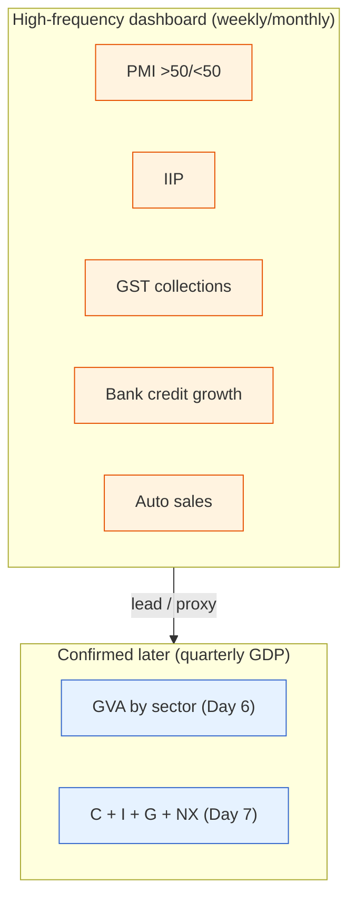

# Day 8 — The Growth Pulse: What India Watches

> **Today's one idea:** Because India has no reliable monthly jobs report and GDP arrives only quarterly with long lags, the market reads the economy's real-time health through a dashboard of *high-frequency proxies* — IIP, PMI, GST collections, bank credit, auto sales, and more.
> **Reading time:** ~35 min · **Prereqs:** [Day 2](../../01-foundations/days/day-02-trend-vs-cycle.md), [Day 6](day-06-three-lenses-on-gdp.md)
> **Primary source for today:** RBI *Bulletin* (monthly "State of the Economy" article).
> **Before you start:** Recall Day 7 in one sentence, no looking — *what are the four components of GDP by expenditure, and which one is the volatile engine of the cycle?*

## The hook (2–4 min)

In the US, the first Friday of every month stops trading floors worldwide: the *non-farm payrolls* report, a clean monthly count of jobs added. India has nothing like it. Most Indians work informally, off any register, so there's no timely national jobs number that moves markets. And GDP? It comes quarterly, roughly two months *after* the quarter ends — ancient history for a market that trades the future (Day 3). So how does anyone know, *this week*, whether India's economy is speeding up or slowing down? They read a dashboard of faster, messier signals. Learning that dashboard is today's job.

## Building the intuition (10–15 min)

Think of GDP as an annual full-body health check — thorough but infrequent. Between check-ups, a doctor takes your pulse, temperature, and blood pressure — quick, imperfect, but *frequent* readings that hint at trouble early. India's macro-watchers do the same, tracking a set of **high-frequency indicators** that each proxy for a piece of the GDP they can't yet see.

The core dashboard, grouped by what they proxy:

| Indicator | Frequency | Proxies for | Read it as |
|---|---|---|---|
| **IIP** (Index of Industrial Production) | Monthly | Industry (part of GVA) | Factory/mining/power output momentum |
| **PMI** (Manufacturing & Services) | Monthly | Business activity | >50 = expanding, <50 = contracting |
| **GST collections** | Monthly | Consumption + formal activity | Broad transaction volume in the economy |
| **Bank credit growth** | Fortnightly | Investment (I) + consumption | Appetite to borrow and spend (Day 14) |
| **Auto sales** | Monthly | Consumer + rural demand | Two-wheelers = rural/mass; cars = urban |
| **Electricity demand, e-way bills, rail freight** | Weekly/monthly | Real activity | Hard-to-fake physical throughput |
| **PLFS / CMIE** | Quarterly / monthly | Labour market | Jobs — the closest India gets to payrolls |

Two of these deserve a special note because markets react to them:

- **PMI** is a *diffusion index* built from a survey asking managers "is activity up, down, or flat vs. last month?" The 50 line is the magic threshold: above 50, more firms are expanding than contracting. It's fast (released first business day), forward-looking (managers know their order books), and globally comparable. A drop from 56 to 51 is a slowdown signal even though it's "still above 50."
- **GST collections** are a distinctly Indian gem — a near-real-time read on the *volume of transactions* across the formal economy. Rising GST = the Day 1 loop spinning faster.

The professional habit: **no single indicator is trusted alone.** Each is noisy (a festival shifts auto sales; a monsoon distorts IIP). You read the *cluster* — when IIP, PMI, GST, and credit all soften together, the economy is genuinely cooling, and you can position *before* the quarterly GDP confirms it. This is the entire point: high-frequency data buys you *time* over people who wait for GDP.

## The formal picture (10–15 min)

The dashboard maps onto the concepts you already own:

Three properties define a useful high-frequency indicator, and every trade-off among them matters:

1. **Timeliness** — how fast is it out? PMI (day 1) beats IIP (6-week lag) beats GDP (2-month lag).
2. **Signal-to-noise** — how much is it distorted by one-offs (festivals, weather, base effects)? Physical measures (electricity, freight) are hard to fake; surveys can be moody.
3. **Coverage** — how much of the economy does it see? GST and credit are broad; auto sales are narrow but a sharp read on discretionary demand.

**"Base effect" — a trap you must know.** Year-on-year growth compares this month to the *same month last year*. If last year's month was unusually weak (say, a COVID lockdown), this year looks spectacular — not because things are booming but because the *base* was low. Always ask "what was the base?" before believing a big YoY number. (This bites hardest on IIP and GST.)

**The labour gap, honestly.** India's official jobs data — the **PLFS** (Periodic Labour Force Survey) — is improving but lags and is quarterly/annual; private **CMIE** unemployment data is timelier but debated. The upshot: unlike the US, India's market rarely trades a "jobs number." Labour-market health is inferred *indirectly* from the activity dashboard and from rural proxies (two-wheeler and tractor sales, MGNREGA demand). This is a real structural difference in how Indian macro is read — not a gap to gloss over.

## Where it breaks / what it is not (3–5 min)

- **High-frequency ≠ high-reliability.** These indicators are *revised* and *noisy*. A single month's IIP swing is often reversed. Trust the trend across three months and the *cluster*, not one print.
- **Surveys measure sentiment, not rupees.** PMI asks "better or worse," not "how much." A PMI of 55 doesn't quantify growth; it says *more firms are improving*. Don't over-read the precise level.
- **Base effects can flip the story.** A "24% IIP surge" against a locked-down base year is not a boom. Level vs. change vs. *base* — the Day 2/Day 4 "level vs. change" trap, with a third twist.
- **Formalisation distorts trends.** As India's informal economy formalises (GST, digital payments), some "growth" in GST/formal data is activity *shifting into the measured economy*, not new activity. Genuine, but not the same as real expansion.

## Try it yourself (5–10 min)

1. **Retrieval first.** Close the page. List at least five of India's high-frequency indicators and, for each, one line on what it proxies. Then explain why India relies on these more than the US does.

2. **Direct application.** This month: Manufacturing PMI slips from 57 to 52, GST collections are flat YoY, bank credit growth is decelerating, and two-wheeler sales are down. GDP won't be out for six weeks. Write the read you'd give a colleague *today*: what's happening to the economy, how confident are you, and what one sector-level tilt does it suggest?

3. **Stretch.** IIP prints +18% YoY and headlines scream "industrial boom," but PMI is only 51 and electricity demand is flat. Reconcile these. Which indicator do you trust, and what single question about the IIP number would resolve the contradiction?

4. **Spaced callback (Day 6).** Yesterday you learned GVA is split into agriculture, industry, and services. Which high-frequency indicator is the best monthly proxy for the *industry* portion of GVA, and why is there no equally good monthly proxy for *services* or *agriculture*?

Hint

#2: a broad-based softening across the cluster = genuine cooling; lean defensive. #3: +18% against a low base is not a boom; ask "what was the base month?" #4: IIP is industrial output; services are harder to measure monthly and agriculture is seasonal/annual.

Worked solution

**#2:** Four indicators softening *together* — PMI down (though still >50), GST flat, credit decelerating, two-wheelers (rural/mass demand) down — is a **broad-based slowdown**, and the cluster agreement makes it fairly reliable (not one noisy print). Rural weakness (two-wheelers) is notable. The read: the economy is cooling ahead of the GDP confirmation; **lean defensive** — favour staples/consumption-stable names over cyclicals and rate-sensitive capex plays, and note a softening economy raises the odds the RBI eases (Day 13).

**#3:** A +18% IIP against a **low base** (e.g., last year's month was disrupted) is a *statistical* jump, not a real boom — which is why PMI (51, barely expanding) and flat electricity demand disagree. Trust the *cluster*: PMI + electricity say activity is roughly flat. The resolving question: **"What was the IIP level in the base month?"** If it was depressed, the 18% is a base effect and the "boom" is an illusion.

**#4:** **IIP** is the best monthly proxy for the *industry* GVA (it literally measures industrial output). Services are harder — there's no single monthly output index for haircuts, IT, and finance combined (Services PMI helps but is a survey), so services GVA is estimated from scattered proxies. Agriculture is *seasonal and annual* (tied to sowing/harvest and the monsoon), so a monthly number is meaningless. This is why the monthly dashboard is industry-heavy while services/agri lean on quarterly GDP.

> **Transfer — apply it:** Pick the one high-frequency indicator most relevant to a stock or sector you hold, and start tracking it monthly. State it as input (the indicator) → today's idea (it leads the quarterly data your stock reports) → output (an early read on that company's demand). If you don't know which indicator maps to your holding, that's tomorrow's homework — it's the difference between reacting to results and anticipating them.

## Connect it back

You can now read the economy's growth pulse in real time, not just its quarterly report card. But growth is only half of what the RBI watches — the other half is inflation, and India measures *that* in its own peculiar way. Tomorrow: CPI vs. WPI, why food and fuel dominate India's inflation basket, and why "core" inflation can tell a completely different story from the headline — the number that legally decides the RBI's next move.

**The sharp question you can now answer:** Why can an Indian investor know the economy is slowing weeks before the GDP data admits it?

## Suggested readings for today

**Required if you have 15 extra minutes:** RBI *Bulletin*, the monthly **"State of the Economy"** article (rbi.org.in) — read how the RBI itself reads the high-frequency dashboard. It's the single best model of the professional habit.

**If you want the deep version:**
- MOSPI, the monthly **IIP press release** — see the base year, sectoral weights, and the "use-based" classification (capital goods vs. consumer goods — a direct link to Day 7's C vs. I).
- S&P Global / HSBC **India PMI** methodology note — how a diffusion index is built and why 50 is the line.

---

## Navigation

← **Previous:** [Day 7 — Dissecting Demand: C, I, G, NX](day-07-dissecting-demand.md)  
→ **Next:** [Day 9 — Inflation: CPI vs. WPI & the 4% Target](day-09-inflation-cpi-wpi.md)
