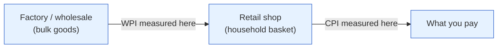

# Day 9 — Inflation: CPI vs. WPI & the 4% Target

> **Today's one idea:** India targets **CPI** inflation — a household shopping basket dominated by food and fuel — at 4% (±2%), which means the RBI's most important trigger is a number that's often driven by monsoons and oil, not by the economy overheating.
> **Reading time:** ~40 min · **Prereqs:** [Day 4](../../01-foundations/days/day-04-inflation-money-and-goods.md)
> **Primary source for today:** RBI, "Report of the Expert Committee to Revise and Strengthen the Monetary Policy Framework" (Urjit Patel Committee, 2014).
> **Before you start:** Recall Day 4 in one sentence, no looking — *what is inflation, and what's the difference between demand-pull and cost-push?*

## The hook (2–4 min)

In 2010–2013, Indian newspapers ran two different inflation numbers that told opposite stories. One (WPI) suggested inflation was cooling; the other (CPI) showed households being hammered by double-digit price rises, driven by onions, dal, and vegetables. Which one was "real"? And which should the RBI act on? The answer to that question — settled by the Urjit Patel Committee in 2014 — reshaped how Indian monetary policy works to this day. Get the two measures straight and you'll understand *why* the RBI reacts the way it does to an inflation print.

## Building the intuition (10–15 min)

Recall Day 4: inflation is the sustained rise in the *general* price level. But "general" hides a choice — *whose* prices, measured *where* in the chain? India has two main answers:

- **CPI (Consumer Price Index)** — prices at the **shop counter**, in the basket a *typical household* actually buys: food, housing, fuel, clothing, transport, education. This is what *you* experience as inflation.
- **WPI (Wholesale Price Index)** — prices at the **factory/wholesale gate**, for goods traded in bulk between businesses, *before* they reach you. No services, heavy on manufactured goods and commodities.

They can diverge sharply because they measure different things at different points:



**The single most important fact about India's CPI: food and fuel dominate it.** Food & beverages alone are roughly **~46%** of the CPI basket (versus ~14% in the US). Add fuel and you have a majority of the index swinging on monsoons, harvests, and global crude. This has enormous consequences:

- India's *headline* CPI is **volatile and supply-driven** — a bad monsoon spikes vegetable prices and the whole index jumps, even if the economy is weak. That's **cost-push** inflation (Day 4), largely outside the RBI's control.
- To see the *demand-driven* inflation that monetary policy *can* address, you strip out food and fuel to get **core inflation** — the stickier, underlying trend. Core is what tells the RBI whether inflation is broadening into the economy or just a food spike that will pass.

So the professional reads *two* numbers on CPI day: the **headline** (what households feel, what's politically explosive) and the **core** (what the RBI ultimately steers by). When headline is high but core is low, the RBI can "look through" a food spike and hold rates. When *core* is rising, inflation is entrenching and the RBI must act. That gap is the whole game on inflation day.

## The formal picture (10–15 min)

**The index.** CPI tracks the cost of a *fixed basket* over time. Each item has a **weight** = its share of typical spending. The index is the weighted average of price changes:

```math
\pi_{\text{CPI}} \;=\; \sum_i w_i \cdot \pi_i
```

where `w_i` is item *i*'s weight in the basket and `π_i` is its price change. Because `w_food ≈ 0.46` in India, a big `π_food` swamps everything — the arithmetic *forces* Indian headline CPI to dance to food's tune.

**Headline vs. core:**
- **Headline CPI** = the full basket.
- **Core CPI** = headline *minus food and fuel* — the stubborn, demand-sensitive part.

**The policy framework (the Urjit Patel Committee's legacy).** In 2016 India formally adopted **flexible inflation targeting**: the RBI is legally mandated to keep **CPI headline** inflation at **4%, within a band of 2–6%**. Two things to notice:
1. They chose **CPI, not WPI** — because CPI is what households live, and price *expectations* form around what people actually pay (a link to Day 4 and Day 13).
2. The target is **headline**, not core — so the RBI *cannot* fully ignore food and fuel, even though it can't control them. This tension is central to every Indian rate decision (and to Day 13).

| | **CPI** | **WPI** |
|---|---|---|
| Measured at | Retail (shop) | Wholesale/factory gate |
| Includes services? | Yes (housing, education, transport) | No |
| Food weight | ~46% (very high) | Lower |
| Who feels it | Households | Businesses (input costs) |
| RBI's policy target? | **Yes (4% ±2%)** | No |
| Best used for | The RBI's trigger; cost of living | Input-cost pressure, corporate margins |

**Why WPI still matters to an investor even though it's not targeted:** WPI is a read on **producers' input costs**, so it leads *corporate margins*. Rising WPI with flat CPI means companies are absorbing higher input costs they can't yet pass on — a squeeze on profits. Falling WPI can mean margin relief. So: CPI for the RBI's move; WPI for the margin story. (The US analogue for CPI is the **PCE** index, the Fed's preferred gauge — noted here only so Day 23's Fed overlay makes sense.)

## Where it breaks / what it is not (3–5 min)

- **Headline is noisy; don't trade every spike.** A monsoon-driven vegetable spike often *reverses* within months. The RBI (and you) should watch whether it's feeding into *core* and into *expectations* before treating it as real inflation.
- **CPI ≠ your personal inflation.** The basket is a national average. If you spend heavily on school fees or healthcare (rising fast) and little on cereals, your lived inflation differs from the print. The index is representative, not personal.
- **"Core" isn't sacred either.** In India, food price spikes can *leak* into core over time (via wages and transport), so a persistent food shock eventually contaminates the "underlying" number. Core is cleaner, not clean.
- **The target is a band, not a point.** 4% is the centre, but anywhere in 2–6% is "in tolerance." The RBI only formally "fails" if it's outside 2–6% for three straight quarters. Don't read every deviation from 4% as a policy trigger.

## Try it yourself (5–10 min)

1. **Retrieval first.** Close the page. Explain the difference between CPI and WPI, state which one the RBI targets and at what number, and explain why India's headline CPI is so volatile. No looking.

2. **Direct application.** CPI print: **headline 5.9%** (up from 5.1%), but **core 4.2%** (flat), and the jump is entirely in vegetables after a poor monsoon. You hold rate-sensitive stocks. Write the two-sentence read: is the RBI likely to hike on this, and why — and what's the risk to your "they'll look through it" view?

3. **Stretch.** WPI has turned *negative* (deflation at the wholesale level) while CPI is still running at 5.5%. (a) How can wholesale prices fall while retail prices rise? (b) What does negative WPI imply for corporate *margins*, and which is the better environment for equity profits — rising or falling WPI, holding CPI constant?

4. **Spaced callback (Day 4).** You classified inflation as demand-pull or cost-push. India's food-driven CPI spikes are usually which type — and why does that make them so awkward for a central bank whose only tool is interest rates?

<details>
<summary>Hint</summary>
#2: high headline but flat core = supply-driven; the RBI may look through it *unless* it threatens to unanchor expectations or leak into core. #3: WPI is goods/commodities, CPI includes sticky services and retail margins; falling input costs help margins. #4: cost-push — and rate hikes fight demand, not monsoons.
</details>

<details>
<summary>Worked solution</summary>

**#2:** With **core flat at 4.2%** and the headline jump entirely in monsoon-hit vegetables, this is a **supply-side, likely transient** spike — the RBI will probably *look through* it and hold, since hiking rates does nothing for vegetable supply. **The risk to that view:** if the food spike *persists* and starts lifting inflation *expectations* (people and firms begin assuming high inflation and demand higher wages/prices), it can leak into core — at which point the RBI must act, and your rate-sensitive stocks would suffer. So watch core and expectations, not the headline.

**#3:** (a) WPI is dominated by **manufactured goods and commodities** (globally-priced, currently falling), while CPI includes **sticky services** (rents, education, transport) and retail margins that keep rising — so the two can move in opposite directions. (b) Negative WPI means **falling input costs**, which is *good for corporate margins* (costs down, selling prices sticky). So **falling WPI with steady CPI is the better environment for equity profits** — the classic margin-expansion setup analysts love.

**#4:** They're usually **cost-push** (supply-driven — monsoons, oil). That's awkward because the RBI's only real tool, interest rates, works by cooling *demand* (Day 14). Rates can't grow more onions or lower global crude. To offset a big food/fuel shock the RBI would have to crush demand hard — hurting growth — to bring *headline* back to target. That's the core dilemma of targeting headline CPI in a food-heavy economy.
</details>

> **Transfer — apply it:** On the next CPI release, read core *before* headline and note the gap. State it as input (headline vs. core) → today's idea (is the inflation demand-driven and sticky, or a supply spike that passes?) → output (whether the RBI is likely to act, and thus what it means for your rate-sensitive holdings). If a commentator quotes only headline, you now know the more important number they skipped.

## Connect it back

You now have both of the RBI's inputs measured the Indian way: the growth pulse (Day 8) and inflation (today). Everything so far has been about *reading the economy*. Tomorrow we cross the bridge from macro to your portfolio: the single most important price in all of finance — the RBI's **repo rate** — and the government bonds (G-secs) it anchors. This is where macro finally touches your equity returns.

**The sharp question you can now answer:** Why might the RBI hold rates steady even as headline inflation jumps to 6%?

## Suggested readings for today

**Required if you have 15 extra minutes:** RBI, Urjit Patel Committee Report (2014), **the executive summary and the section recommending CPI as the nominal anchor** — the actual reasoning for why India targets CPI headline at 4%. It's the constitution of modern Indian monetary policy.

**If you want the deep version:**
- MOSPI, the monthly **CPI press release** — find the item-weight table (see food's ~46%) and the core computation.
- Eugene Fama, "Stock Returns, Real Activity, Inflation, and Money" (*AER*, 1981) — the uncomfortable evidence that inflation and stock returns often move *inversely*, which we use on Day 21.

---

## Navigation

← **Previous:** [Day 8 — The Growth Pulse: What India Watches](day-08-the-growth-pulse.md)  
→ **Next:** [Day 10 — The Price of Money: Repo & G-secs](day-10-repo-and-gsecs.md)
