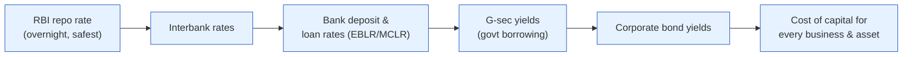

# Day 10 — The Price of Money: Repo & G-secs

> **Today's one idea:** The RBI's **repo rate** is the anchor price of money in India — it sets the cost of the safest, shortest loan, and every other interest rate, bond yield, and asset valuation is built on top of it — and bond prices move *inversely* to their yields.
> **Reading time:** ~40 min · **Prereqs:** [Day 3](../../01-foundations/days/day-03-markets-price-the-future.md), [Day 5](../../01-foundations/days/day-05-who-steers.md)
> **Primary source for today:** RBI *Monetary Policy Report* (biannual).
> **Before you start:** Recall Day 5 in one sentence, no looking — *what are the two levers, and what is the RBI's main tool and legal goal?*

## The hook (2–4 min)

Ask an equity investor "what's the most important number in the market?" and you'll hear Nifty levels, or a favourite stock's P/E. The real answer is a number most equity people barely track: the **repo rate**. It's the gravitational constant of finance. When it moves, the value of *every* asset — your stocks, your bonds, your house, the rupee — shifts, because it changes the one thing all of them are measured against: the price of money and time. Today you learn what it is, and the one bond-market fact that trips up every equities person: **why bond prices fall when yields rise.**

## Building the intuition (10–15 min)

Money has a price, and that price is the **interest rate** — what you pay to use someone's money for a while, or get paid to lend yours. But there isn't one interest rate; there's a whole ladder of them, from the safe overnight rate up to a risky 10-year corporate loan. The RBI sets the *bottom rung*, and the market builds the rest of the ladder on top.

**The repo rate** is that bottom rung: the rate at which the RBI lends *overnight* to commercial banks against government-bond collateral (a "repurchase agreement" — the bank sells the RBI a bond and buys it back the next day, the difference being the interest). It's the cheapest, safest, shortest loan in the system. When the RBI changes it, it changes banks' cost of funds, and they pass it (imperfectly — Day 14) up the whole ladder:



Now meet the other half: the **G-sec** (Government Security) — a loan *you* (or a bank, or a fund) make to the Government of India. You pay ₹100 today; the government pays you a fixed coupon each year and returns your ₹100 at maturity. Because the government can always print rupees to repay, a rupee G-sec is treated as the **risk-free** asset — the benchmark everything else is priced against. The **10-year G-sec yield** is India's single most-watched interest rate after the repo.

**The one fact equities people must burn in — price and yield move in opposite directions.** Here's why, with the smallest example. You buy a bond for ₹100 that pays ₹5 a year forever. Your yield = 5/100 = 5%. Now suppose new bonds start offering ₹7 a year (because rates rose). Nobody wants your ₹5 bond at ₹100 anymore — they'd buy the ₹7 one. So your bond's *price* must fall until its ₹5 payment represents a competitive yield: at a price of ₹71, the ₹5 is a 7% yield. **Rates up → existing bond prices down. Rates down → bond prices up.** The coupon is fixed; only the price can adjust.

```
Yield UP   →  existing bond PRICE DOWN
Yield DOWN →  existing bond PRICE UP
(the fixed coupon can't change, so the price must)
```

This inverse relationship is *the* foundational bond fact. It's why "the RBI hiked, bonds fell" makes sense, and it's the mechanism behind the yield curve (tomorrow) and the discount-rate lens (Day 17).

## The formal picture (10–15 min)

**The policy rate corridor.** The repo rate doesn't act alone — the RBI runs a *corridor*:
- **Repo rate** — the RBI *lends* to banks at this (the policy rate; the one that's "the" rate).
- **SDF / reverse repo** — the RBI *pays* banks to park spare cash at a slightly lower rate (the floor).
- **MSF** — an emergency higher rate banks pay to borrow more (the ceiling).

The overnight market rate stays inside this corridor; by moving it, the RBI moves the entire rate ladder. Alongside the rate, the RBI manages **liquidity** — how much cash is sloshing in the banking system (via operations like OMO, CRR) — which affects how *tightly* the market rate hugs the repo. Rate = the *price* of money; liquidity = the *quantity*. Both are levers.

**Yield, price, and duration (just enough).** A bond's **yield to maturity** is the single discount rate that makes its future coupons and principal worth today's price. The formal inverse relationship:

```math
\text{Price} \;=\; \sum_{t=1}^{N} \frac{\text{Coupon}}{(1+y)^t} \;+\; \frac{\text{Face value}}{(1+y)^N}
```

As yield `y` rises, every term shrinks, so **price falls** — the math behind the ₹100→₹71 example. One more term to bank: **duration** — how *sensitive* a bond's price is to yield changes. Longer-maturity bonds have higher duration, so a 1% yield move swings a 10-year bond's price far more than a 1-year bond's. (This is why the *long* end of the curve is where the action is — tomorrow.)

**Basis points.** Rate moves are quoted in **basis points (bp)**: 1 bp = 0.01%. A "25 bp hike" = 0.25%. Central banks move in 25 bp steps usually; "50 bp" is aggressive.

**Why the repo is the anchor for equities too.** Your stocks are claims on *future* cash flows. To value future rupees today, you discount them by a rate that starts from the risk-free G-sec yield (which starts from the repo). Raise the repo → raise the risk-free rate → raise the discount rate → *lower* the present value of every stock, especially long-duration growth stocks whose earnings are far in the future. This is the through-line to Day 17. **The repo rate is upstream of your equity portfolio whether you track it or not.**

## Where it breaks / what it is not (3–5 min)

- **The repo sets the *short* end; the market sets the *long* end.** The RBI directly controls the overnight rate, but the 10-year G-sec yield is set by the *market's* expectations of future rates, growth, and inflation (Day 11). The RBI influences it but doesn't dictate it.
- **"Rates up = stocks down" is a tendency, not a law.** If rates rise because *growth* is surging, strong earnings can outweigh the higher discount rate. *Why* rates moved matters as much as the move (a theme for Day 24). Don't apply the rule mechanically.
- **Transmission is leaky and slow in India** (Day 14). A repo cut doesn't instantly lower your home-loan rate; banks pass it through partially and with lag. The anchor tugs the ladder; it doesn't yank it.
- **G-secs are "risk-free" only of *default*, not of *price*.** You can lose money on a G-sec if yields rise and you sell before maturity (price fell). Risk-free ≠ loss-free.

## Try it yourself (5–10 min)

1. **Retrieval first.** Close the page. Define the repo rate in one sentence, and state — with the *reason* — what happens to an existing bond's price when yields rise. No looking.

2. **Direct application.** The RBI hikes the repo rate by 50 bp, more than expected. Walk a colleague through the chain: what happens to (a) a 10-year G-sec you already own, (b) bank loan rates, and (c) a high-growth, richly-valued stock — and *why* each one, referencing the discount-rate logic. Be explicit about the role of the *surprise* (Day 3).

3. **Stretch.** Two G-secs both yield 7%: one matures in 2 years, one in 10 years. The RBI unexpectedly signals a long hiking cycle and yields jump to 8%. Which bond's price falls *more*, and why? What does this tell you about where in the curve a cautious bond investor hides when they fear rate hikes?

4. **Spaced callback (Day 3).** The repo decision is usually widely expected. Using Day 3, explain why bond and equity markets can be *unmoved* by a repo hike but lurch on the RBI's *guidance* — and connect this to which part of the rate "chain" the surprise actually hits.

<details>
<summary>Hint</summary>
#2: surprise hike → higher risk-free rate → higher discount rate everywhere; long-duration growth stocks hurt most. #3: longer duration = bigger price move for the same yield change. #4: the expected part is priced; the surprise is in the *expected path of future rates*, which moves the long end.
</details>

<details>
<summary>Worked solution</summary>

**#2:** (a) Your **10-year G-sec falls in price** — yields rose, and price moves inversely (and being long-duration, it falls hard). (b) **Bank loan rates rise** (with lag) as banks' cost of funds climbs — the repo tugs the ladder up. (c) The **high-growth stock falls**, likely more than the market: its value is mostly *distant* future earnings, and a higher discount rate shrinks the present value of distant cash flows most (it's "long duration" in equity terms). The *surprise* (50 bp vs. less expected) is what drives the reaction — an expected hike would already be priced (Day 3).

**#3:** The **10-year bond falls more** — higher **duration** means greater price sensitivity to the same 1% yield rise. A 2-year bond barely moves; a 10-year can drop several percent. Lesson: when you fear rate hikes, **hide at the short end** of the curve (low duration) — you take less price damage. This is a real, usable positioning rule.

**#4:** A repo hike that everyone expected is already in prices (Day 3), so the *action* moves little. The **surprise** lives in the RBI's *guidance about the future path* of rates — and expectations of future short rates are exactly what set the *long end* of the curve (the 10-year yield). So hawkish guidance can send long yields (and rate-sensitive stocks) sharply even when the rate itself did the expected thing. The surprise hits the *expectations* embedded in the ladder, not the bottom rung.
</details>

> **Transfer — apply it:** Find the current 10-year G-sec yield and the current repo rate (both on rbi.org.in or any financial site). State it as input (the two rates) → today's idea (the repo anchors the ladder; the 10-year embeds rate expectations) → output (a higher risk-free rate means a higher bar for every stock you own). If the gap between them is unusually wide or narrow, hold that observation — it's the yield curve, and it's tomorrow's entire topic.

## Connect it back

You've crossed the bridge: macro (Days 1–9) now connects to your portfolio through the repo rate and the risk-free G-sec yield. But a single yield is just one point. Tomorrow we plot the *whole ladder* — yields from overnight to 30 years — into the **yield curve**, and read its shape as the bond market's forecast of growth and inflation. It's the closest thing markets have to a crystal ball, and equity investors ignore it at their peril.

**The sharp question you can now answer:** Why does an unexpected repo hike hurt a high-growth stock more than a value stock?

## Suggested readings for today

**Required if you have 15 extra minutes:** RBI *Monetary Policy Report*, **the section explaining the policy corridor and liquidity framework** (rbi.org.in) — the repo, SDF, MSF, and how the RBI steers the overnight rate. Seeing the actual corridor makes the "anchor" concrete.

**If you want the deep version:**
- Antti Ilmanen, *Expected Returns* (2011), **the chapter on bond risk premia** — how yields decompose into expected rates plus a premium (sets up Days 11 and 17).
- Perry Mehrling, "Economics of Money and Banking" (Coursera), **the early lectures on the money market** — the plumbing of repo and the rate corridor.

---

## Navigation

← **Previous:** [Day 9 — Inflation: CPI vs. WPI & the 4% Target](day-09-inflation-cpi-wpi.md)  
→ **Next:** [Day 11 — The G-sec Yield Curve as a Forecast](day-11-gsec-yield-curve.md)
