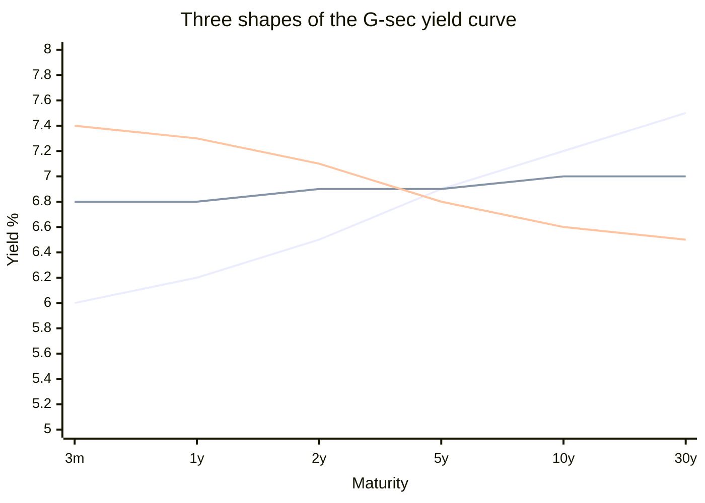

# Day 11 — The G-sec Yield Curve as a Forecast

> **Today's one idea:** The yield curve — G-sec yields plotted from short to long maturities — is the bond market's collective forecast of future growth and inflation, and its *shape* (especially when it inverts) is one of the most reliable recession signals in finance.
> **Reading time:** ~40 min · **Prereqs:** [Day 3](../../01-foundations/days/day-03-markets-price-the-future.md), [Day 10](day-10-repo-and-gsecs.md)
> **Primary source for today:** Estrella & Mishkin, "The Yield Curve as a Predictor of U.S. Recessions" (FRB New York, 1996).
> **Before you start:** Recall Day 10 in one sentence, no looking — *what is the repo rate, and why do bond prices fall when yields rise?*

## The hook (2–4 min)

Normally, if you lend the government money for 10 years you demand a *higher* rate than for 1 year — longer means more risk, so more reward. That's common sense. But every so often the curve *flips*: the 10-year yield drops *below* the 2-year. Lenders accept *less* to lock money up longer. That sounds insane — until you realise what it means: the market expects rates to be *much lower* in the future, which is to say it expects the economy to weaken enough that the RBI will have to cut. An inverted curve is the bond market quietly forecasting a downturn. In the US it has preceded almost every recession. Learning to read the curve gives an equity investor a warning system.

## Building the intuition (10–15 min)

Yesterday you learned there's a whole ladder of rates. Plot that ladder — yield on the y-axis, maturity on the x-axis — and you get the **yield curve**:



The shape is not random — it encodes the market's expectations, because of one key idea: **a long-term rate is roughly the average of expected future short-term rates** (plus a small premium for tying up money longer). If the market expects the RBI to *raise* short rates over the next decade, long yields sit *above* today's short rate → upward curve. If it expects the RBI to *cut* (because it sees weakness ahead), long yields sit *below* short rates → inverted curve.

So each shape tells a story:

| Shape | What it says | Typical context |
|---|---|---|
| **Normal (upward)** | Market expects steady growth; rates to rise or hold | Healthy expansion |
| **Steep** | Market expects strong growth / rising inflation ahead | Early recovery, reflation |
| **Flat** | Uncertainty; growth expectations fading | Late cycle, transition |
| **Inverted** | Market expects rate *cuts* → weakness/recession ahead | Pre-recession warning |

The magic is that this is a *forecast you can read for free*. The bond market is enormous, liquid, and populated by people betting real money on the future path of the economy. Their aggregate view is baked into the curve's shape (this is Day 3 — prices embed expectations — applied to bonds). When the curve inverts, thousands of bond investors are collectively saying "we think the economy is heading down." An equity investor who ignores that is ignoring the market's single best macro forecast.

**The most-watched summary: the "spread"** — usually the 10-year yield minus a short yield (e.g., 10y − 2y, or 10y − 3-month). Positive = normal; negative = inverted. When this spread goes negative, alarm bells ring.

## The formal picture (10–15 min)

**The expectations hypothesis** (the core theory): a long-term yield equals the average of the short-term rates the market expects over that horizon, plus a **term premium** (extra yield for bearing the risk of tying money up long):

```math
y_{\text{long}} \;\approx\; \underbrace{\text{avg}(\,\text{expected future short rates}\,)}_{\text{the forecast part}} \;+\; \underbrace{\text{term premium}}_{\text{risk compensation}}
```

This is why the curve is a forecast: the "expected future short rates" term *is* the market's prediction of RBI policy, which tracks its prediction of growth and inflation. Rearranged: **the slope of the curve reveals where the market thinks short rates — and thus the economy — are going.**

**Why inversion predicts recessions (the causal story):**
1. When the economy overheats, the RBI hikes *short* rates hard to cool it → the short end rises.
2. Simultaneously, bond investors, foreseeing that tight policy will slow the economy, expect *future* rate cuts → they buy long bonds, pushing *long* yields down.
3. Short up + long down = **inversion**. The curve inverts precisely when policy is tight *and* the market expects that tightness to force a downturn.
4. A downturn often follows — hence the predictive power.

Estrella and Mishkin's classic finding (for the US): the slope of the yield curve, especially the 10y−3m spread, is among the best single predictors of recessions 12–18 months out — better than most economists' forecasts. The signal *leads* by a year or more, which is what makes it useful rather than merely descriptive.

**The India caveat — read it, don't skip it.** The yield curve is a *weaker* recession signal in India than in the US, for concrete reasons:
- The RBI **actively manages** the curve (via OMOs, and it's the government's debt manager), so the shape is partly *policy*, not pure market expectation.
- India's bond market is **less liquid** and dominated by banks (who must hold G-secs by regulation — SLR), distorting demand at various maturities.
- India rarely has clean "recessions" (Day 2); growth *slows* more than it *contracts*.

So in India, use the curve's *shape and changes* as a **read on rate expectations and growth sentiment**, not as a mechanical recession alarm. A flattening Indian curve still tells you the market expects the RBI's hiking to slow the economy — valuable — even if outright inversion is rarer and murkier. Read directionally.

## Where it breaks / what it is not (3–5 min)

- **The term premium moves too.** The curve isn't *pure* expectation — the term premium (risk compensation) shifts with things like bond supply (a big government borrowing programme, Day 16, lifts long yields for non-forecast reasons). A steepening can mean "more growth expected" *or* "more bond supply coming." Don't read every move as a forecast.
- **Inversion is a lead, not a timer.** Even in the US, inversion can precede a recession by 6–24 months, and the equity market often *rises* after inversion before it falls. It's a warning, not a sell signal.
- **India ≠ US.** As above — RBI management and illiquidity mute the signal. Import the *logic*, not the US track record.
- **Curves can un-invert before the downturn.** The curve often steepens again *just before* the recession hits (as the RBI starts cutting). So "the curve un-inverted, all clear" can be exactly the wrong conclusion.

## Try it yourself (5–10 min)

1. **Retrieval first.** Close the page. Draw (or describe) the three curve shapes and, for each, state what the bond market is forecasting. Then explain in one sentence *why* an inverted curve signals expected weakness. No looking.

2. **Direct application.** India's 10-year G-sec yield is 7.0% and the 1-year is 6.9% — the curve has flattened sharply from a steep shape six months ago. Write the read you'd give a colleague: what has the bond market's view of the economy changed *to*, what does it imply about where the RBI is in its cycle, and how might you tilt an equity portfolio?

3. **Stretch.** The Indian curve *steepens* dramatically: long yields jump while short yields are steady. Give *two* competing explanations — one bullish (growth story) and one bearish-for-bonds (supply/fiscal story) — and name the one piece of information you'd need to tell them apart. (This is the term-premium problem in action; it links to Day 16.)

4. **Spaced callback (Day 3).** The yield curve is "a forecast you read for free." Explain how that is just Day 3's principle — that prices embed expectations — applied to the bond market. What is the "surprise" that would move the *shape* of the curve?

<details>
<summary>Hint</summary>
#2: flattening = market no longer expects rate hikes / sees slowing growth = late cycle; lean defensive. #3: growth-driven steepening (good) vs. fiscal-supply-driven steepening (bond-bearish); check whether the Budget/borrowing just expanded. #4: the curve is the average of *expected* future short rates; a surprise about the RBI's future path re-shapes it.
</details>

<details>
<summary>Worked solution</summary>

**#2:** A curve flattening from steep to nearly flat means the bond market has **stopped expecting rate hikes and growth acceleration** — it now sees the economy slowing and the RBI's tightening cycle near its end (**late cycle**). Implication: the next RBI move is more likely a pause or eventual cut, and growth momentum is fading. Tilt: **lean defensive** — reduce cyclicals, favour quality/consumption-stable names; long-duration bonds may start to look attractive if cuts are coming.

**#3:** (i) **Bullish:** the market expects stronger future growth and higher inflation, so it demands higher long yields — a "reflation" steepening (good for cyclicals). (ii) **Bearish-for-bonds:** the government just announced a **larger deficit/borrowing programme** (Day 16), flooding the market with long-bond *supply* and raising the term premium — long yields rise for fiscal, not growth, reasons. The distinguishing info: **did the fiscal/borrowing outlook just change?** If yes, it's supply; if the growth data is accelerating with no fiscal news, it's reflation.

**#4:** Day 3 says a market price already contains the crowd's expectations. The yield curve is just the *bond* market's price, so its shape *is* the crowd's expectation of future short rates — hence future growth and inflation. It's "free" because you don't have to forecast; you read the market's forecast off the curve. The **surprise** that re-shapes it is any news that changes the expected *path* of the RBI — a hot CPI print, a hawkish MPC, a fiscal blowout — exactly the events Days 22–23 teach you to read.
</details>

> **Transfer — apply it:** Look up India's current 10y−1y (or 10y−2y) G-sec spread and note whether it's steep, flat, or inverted. State it as input (the spread) → today's idea (what future path of rates/growth the market is pricing) → output (where you'd guess we are in the cycle, and how that colours your equity stance). Check it monthly — a *change* in the shape is often an earlier signal than any single data release.

## Connect it back

That closes the measurement arc. You can now read India's growth pulse, its inflation, the repo anchor, and the bond market's own forecast in the curve. You've earned a checkpoint. Tomorrow is **Rest & Synthesize I** — no new material. You'll reconstruct the whole machine (Days 1–11) from memory, find the cracks, and patch only those. Do it honestly; Module 3 (how policy *moves markets*) is built directly on these foundations, and any weak spot here will show up there.

**The sharp question you can now answer:** If the 10-year G-sec yield falls below the 1-year, what is the bond market trying to tell you — and why should an equity investor listen?

## Suggested readings for today

**Required if you have 15 extra minutes:** Estrella & Mishkin (1996), "The Yield Curve as a Predictor of U.S. Recessions" — **read the intro and the charts**, skip the probit models. The visual of the spread going negative before each recession is the whole idea.

**If you want the deep version:**
- Olivier Blanchard, *Macroeconomics*, 8th ed., **the chapter on the yield curve / term structure and expectations** — the expectations hypothesis, formalised.
- RBI *Monetary Policy Report*, **any recent edition's discussion of the G-sec market and yields** — how the RBI itself thinks about (and manages) the Indian curve.

---

## Navigation

← **Previous:** [Day 10 — The Price of Money: Repo & G-secs](day-10-repo-and-gsecs.md)  
→ **Next:** [Day 12 — Rest & Synthesize I](day-12-rest-and-synthesize-1.md)
