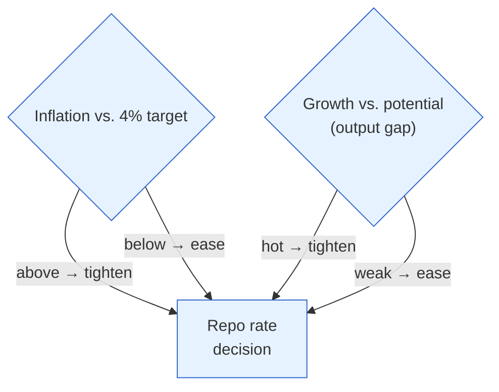
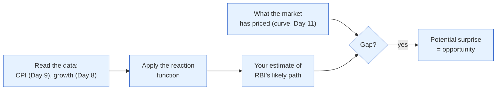

# Day 13 — The RBI's Reaction Function

> **Today's one idea:** The RBI doesn't set rates arbitrarily — it follows a rough *reaction function*, raising rates when inflation is above target or growth is hot, and cutting when inflation is low or growth is weak — so if you know the data, you can largely predict the RBI.
> **Reading time:** ~40 min · **Prereqs:** [Day 9](../../02-measuring-the-machine/days/day-09-inflation-cpi-wpi.md), [Day 10](../../02-measuring-the-machine/days/day-10-repo-and-gsecs.md), [Day 8](../../02-measuring-the-machine/days/day-08-the-growth-pulse.md)
> **Primary source for today:** John B. Taylor, "Discretion versus Policy Rules in Practice" (1993).
> **Before you start:** Recall Day 10 in one sentence, no looking — *what is the repo rate, and why is it the anchor for every other asset price?*

## The hook (2–4 min)

Before every MPC meeting, TV panels argue as if the decision were a coin toss. It usually isn't. Most of the time, the RBI's move is *predictable* — because the RBI is, deliberately, somewhat mechanical. It has a legal target (CPI at 4%) and a mandate to support growth, and it moves rates in a fairly consistent way in response to those two variables. Once you internalise its **reaction function**, you stop asking "what will the RBI do?" and start asking the more useful question: "what does the *market* expect the RBI to do, and where might reality surprise it?" That second question is where money is made (Day 3).

## Building the intuition (10–15 min)

Imagine you're the RBI Governor. You have one main dial (the repo rate) and two things to worry about:
- **Inflation** relative to your 4% target. Too high → you need to cool demand → *raise* rates. Too low → *cut*.
- **Growth** relative to the economy's potential (the "output gap," Day 2). Running hot/above potential → raise. Weak/below potential → cut.

So your decision is roughly: *"How far is inflation from target, and how far is growth from potential?"* Add those two pressures and you get the direction and size of your move. That's a **reaction function** — a rule mapping the state of the economy to the policy rate.



The two pressures can agree (both say hike: high inflation *and* hot growth → aggressive tightening) or conflict (high inflation *but* weak growth — the stagflation dilemma from Day 5 — where the RBI must weigh which matters more). India's framework says inflation gets primary weight (it's the legal target), but the RBI explicitly retains flexibility for growth — hence *flexible* inflation targeting.

Why this is powerful for an investor: it turns the RBI from a black box into a **forecastable function of data you can already read** (Days 8–9). See inflation climbing toward 6% and growth strong? The reaction function says "hikes coming." The *market* sees the same thing and prices it — so the RBI's expected path is already in bond yields and stock prices. Your edge isn't predicting the RBI; it's spotting when the data will push the RBI *away* from what the market expects. The reaction function is the tool that lets you compute "what's priced."

## The formal picture (10–15 min)

John Taylor formalised this in 1993 for the US Fed. The **Taylor rule** says the policy rate should be:

```math
i \;=\; r^* \;+\; \pi \;+\; 0.5(\pi - \pi^*) \;+\; 0.5(y - y^*)
```

Naming every symbol:
- `i` = the policy (repo) rate the rule recommends.
- `r*` = the "neutral" real rate — the real rate that neither stimulates nor restrains (more below).
- `π` = current inflation; `π*` = the target (4% in India).
- `(π − π*)` = the **inflation gap** — how far inflation is above/below target.
- `(y − y*)` = the **output gap** — how far output is above/below potential (Day 2).
- The `0.5` weights = how aggressively the central bank responds to each gap.

Read it plainly: **start from neutral, then add extra tightening for every point inflation is above target and every point growth is above potential.** If inflation is *at* target and output is *at* potential, both gaps are zero and the rule says "sit at neutral." The gaps are the whole story.

**The neutral rate `r*` — a concept you'll reuse.** This is the "resting" real interest rate. Above it, policy is *restrictive* (braking the economy); below it, *accommodative* (stimulating). When the RBI says policy is "accommodative" or it's in "withdrawal of accommodation," it's describing where the repo sits relative to neutral. India's neutral real rate is debated (perhaps ~1–2%), but the *concept* — is policy pressing the accelerator or the brake? — is what matters.

**India's version isn't the literal Taylor formula.** The MPC — a six-member committee (three RBI, three external, the Governor holding a casting vote) — doesn't plug numbers into Taylor. But it behaves *like* a reaction function: primary weight on bringing CPI to 4%, secondary weight on growth, adjusted for the neutral-rate judgment and for how *persistent* an inflation shock looks (recall the "look through food spikes" logic, Day 9). Milton Friedman's 1968 warning underlies the whole framework: a central bank can't permanently buy growth with higher inflation — try, and you just get inflation *and* unanchored expectations. So the reaction function is disciplined by the target.

**The investor's use — computing the "expected" for Day 3:**



## Where it breaks / what it is not (3–5 min)

- **It's a tendency, not a formula the RBI obeys.** The MPC exercises judgment, splits votes, and can surprise. Use the reaction function to form a *base case*, not a guarantee.
- **The gaps are unobservable in real time.** "Potential output" and the "neutral rate" aren't measured; they're *estimated*, and estimates get revised. Much of the genuine disagreement about RBI policy is really disagreement about `y*` and `r*`.
- **Supply shocks scramble it.** A food/oil spike (Day 9) pushes inflation up without hot demand — the reaction function's inflation term says "hike," but hiking won't fix supply, so the RBI may look through it. Judgment overrides the rule.
- **Global constraints intrude.** If the US Fed is hiking hard and the rupee is under pressure (Day 19), the RBI may hike partly to defend the currency, not because domestic data demands it. The reaction function is domestic; reality is global.

## Try it yourself (5–10 min)

1. **Retrieval first.** Close the page. Write the RBI's reaction function in words — the two variables it responds to and the direction for each — and explain why knowing it doesn't automatically make you money (hint: Day 3). No looking.

2. **Direct application.** The data: CPI at 6.2% (above the 4% target, and above the 6% upper band), growth strong and above trend. The market has priced *one* 25 bp hike. Using the reaction function, state what the RBI is likely to do, whether the market's pricing looks too dovish or too hawkish, and what that implies for bonds and rate-sensitive equities.

3. **Stretch.** CPI is at 5.8% but *entirely* due to a vegetable/oil supply spike, while growth is *weak* and core inflation is at 4%. The mechanical reaction function says "tighten" (inflation is high). Argue what the RBI should actually do and why — and what single thing you'd watch to know if you're right. (This is judgment overriding the rule.)

4. **Spaced callback (Day 5).** On Day 5 you learned the two levers can conflict. Describe a situation where the RBI's reaction function says "hike" but the *government's* fiscal stance is pushing the other way — and who the bond market sides with.

<details>
<summary>Hint</summary>
#2: inflation above the *band* + hot growth = reaction function says more than one hike; market pricing one hike looks too dovish → risk of hawkish surprise. #3: supply-driven, weak growth, contained core → look through it; watch core and expectations. #4: loose fiscal (big deficit) + tight RBI = levers fighting; bonds price the net.
</details>

<details>
<summary>Worked solution</summary>

**#2:** Inflation at 6.2% is above target *and* above the 6% tolerance band, and growth is hot — both terms of the reaction function scream **tighten**, likely more than one hike or a larger move. The market pricing just one 25 bp hike looks **too dovish**, so the risk is a **hawkish surprise** (Day 3): the RBI hikes more/signals more than priced. That would push **bond yields up (prices down)** and **hurt rate-sensitive and high-growth equities**. Positioning: don't be caught long duration or expensive growth into that meeting.

**#3:** The RBI should probably **look through it and hold** (or ease bias): the inflation is supply-driven (cost-push, Day 9), core is at target, and growth is weak — hiking would crush already-soft demand without fixing vegetable/oil supply. The mechanical rule misleads because it can't tell demand inflation from supply inflation. **What to watch:** *core* inflation and *inflation expectations* — if they start rising, the food spike is leaking into the underlying economy and the RBI must then act.

**#4:** If the government runs a big pre-election deficit (loose fiscal, stoking demand and inflation) while the RBI's reaction function says "hike" to contain that inflation, the two levers **fight** (Day 5). The bond market prices the *net*: more government borrowing (supply) *plus* a hawkish RBI both push **yields up**. Bonds effectively side with neither — they sell off on both the extra supply and the tighter policy, which is why loose-fiscal/tight-money combinations are hard on bondholders.
</details>

> **Transfer — apply it:** Before the next MPC meeting, form your *own* call using the reaction function: where's CPI vs. 4%, where's growth vs. trend, what does that imply? Then check what the market has priced (via news or the curve). State it as input (the data) → today's idea (reaction function → your RBI call) → output (does it match what's priced, or is there a gap?). The gap is your thesis. Track how it plays out — this is the exact skill Day 23 formalises.

## Connect it back

Day 12 asked "what will the RBI do next?" — today gives you the tool to answer it: the reaction function turns readable data into a policy forecast, and comparing it to what's priced reveals opportunity. But a rate decision is useless to markets if it doesn't *reach* the economy. Tomorrow — the heart of the whole course — how a repo change actually transmits to your loans, the rupee, and asset prices, and the very Indian problem of *why that transmission is slow and leaky.*

**The sharp question you can now answer:** If you can roughly predict the RBI from the data, where does an investor's edge actually come from?

## Suggested readings for today

**Required if you have 15 extra minutes:** John B. Taylor, "Discretion versus Policy Rules in Practice" (1993), **the section introducing the rule and Figure 1** — see how closely a simple rule tracked actual Fed policy. The fit is the revelation.

**If you want the deep version:**
- Milton Friedman, "The Role of Monetary Policy" (*AER*, 1968) — why you *can't* permanently trade more inflation for more growth; the discipline behind the target.
- RBI *Monetary Policy Report*, **the MPC's projections section** — read how the committee frames its own inflation/growth trade-off in its own words.

---

## Navigation

← **Previous:** [Day 12 — Rest & Synthesize I](../../02-measuring-the-machine/days/day-12-rest-and-synthesize-1.md)  
→ **Next:** [Day 14 — How a Repo Change Reaches You](day-14-monetary-transmission.md)
