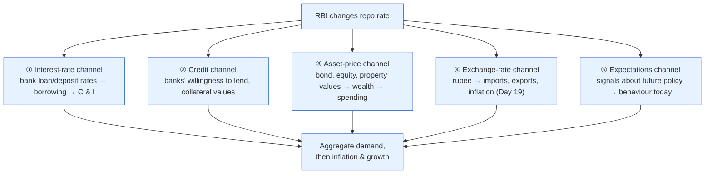

# Day 14 — How a Repo Change Reaches You

> **Today's one idea:** A repo-rate change doesn't act directly on the economy — it *transmits* through several channels (bank lending, asset prices, the rupee, expectations) with long and variable lags, and in India that transmission is notably slow and leaky, which changes how you should trade RBI moves.
> **Reading time:** ~40 min · **Prereqs:** [Day 10](../../02-measuring-the-machine/days/day-10-repo-and-gsecs.md), [Day 13](day-13-rbi-reaction-function.md)
> **Primary source for today:** Bernanke & Gertler, "Inside the Black Box: The Credit Channel of Monetary Policy Transmission" (1995).
> **Before you start:** Recall Day 13 in one sentence, no looking — *what two variables drive the RBI's reaction function, and in which direction?*

## The hook (2–4 min)

The RBI cuts the repo rate by 25 bp on a Friday. Does your home-loan EMI drop on Monday? No. It might fall a little, months later, if your bank feels like passing it on. Meanwhile a US Fed cut can move global markets within *seconds*. Same tool, wildly different speed and force. Why? Because a policy rate is not a switch wired to the economy — it's the top of a long, lossy chain of transmission, and India's chain is especially long and lossy. Understanding *where* and *how fast* a rate change actually bites is what separates "the RBI cut, so buy everything" from a real thesis.

## Building the intuition (10–15 min)

When the RBI changes the repo rate, it directly changes only *one* thing: the overnight cost of funds for banks. Everything else — your loan rate, company borrowing costs, the rupee, stock prices — moves only *because* that initial change propagates through the economy along several distinct **channels**. Think of it like turning a tap at the top of a hill: the water reaches different fields through different ditches, at different speeds, with some soaking away en route.

The main channels:



1. **Interest-rate channel** (the textbook one): lower repo → lower loan rates → cheaper to borrow → households and firms borrow and spend more (C and I rise, Day 7). The direct route.
2. **Credit channel** (Bernanke & Gertler's contribution): it's not just the *price* of credit but its *availability*. Lower rates lift collateral values and bank health, so banks *lend more freely*; in a downturn, even cheap money doesn't help if scared banks won't lend. Availability can matter more than price.
3. **Asset-price channel**: lower rates lift bond, equity, and property prices (Day 10, Day 17); richer households feel wealthier and spend more (the "wealth effect").
4. **Exchange-rate channel**: lower rates make rupee assets less attractive to foreigners → rupee weakens → exports cheaper, imports dearer (feeding inflation). This is the global link (Day 19).
5. **Expectations channel**: often the fastest and most powerful. If the RBI *signals* a long easing cycle, firms and markets act *today* on the expected future path — which is why *guidance* moves markets more than the rate itself (Day 3, Day 23).

The crucial insight: these channels have **different speeds**. The expectations and asset-price channels move in *minutes* (markets reprice instantly). The interest-rate and credit channels take *months to quarters* (loan books reprice slowly, spending decisions lag). So a rate cut hits your *portfolio* almost immediately but the *real economy* only much later — famously described as acting "with long and variable lags."

## The formal picture (10–15 min)

**Why India's transmission is slow and leaky — the concrete reasons (this is the India-specific payload):**

| Friction | What it does | Effect on transmission |
|---|---|---|
| **Bank-dominated system** | Most credit flows through banks, not markets | Repricing depends on banks' choices, not market speed |
| **Fixed-rate & MCLR legacy loans** | Old loans repriced slowly on internal benchmarks | Cuts take quarters to reach borrowers |
| **Small-savings rates** | Government-set rates (PPF, etc.) compete with deposits | Banks can't cut deposit rates freely → can't cut loan rates |
| **Weak bank balance sheets (NPAs)** | Stressed banks hoard capital | Credit channel clogs — cuts don't spur lending |
| **Large informal sector** | Many borrowers outside formal banking | Policy simply never reaches them |

To force faster pass-through, the RBI in 2019 mandated **EBLR** (External Benchmark Lending Rate) — linking many retail loans *directly* to the repo rate, so they reprice automatically. This has improved transmission for new retail loans, but corporate and legacy loans still lag. So India's transmission is *improving but still partial* — a repo cut might pass through 50–70%, not 100%, and over quarters, not days.

**The lag structure — why timing confounds everyone:**

```
Repo change today
   │  minutes ──► markets/expectations (bonds, equities, INR reprice)
   │  weeks ────► new loan rates (EBLR loans)
   │  1–2 quarters ► spending decisions (C, I) shift
   │  3–4 quarters ► inflation & growth actually respond
```

This is why the RBI must be **forward-looking** (Day 13): it sets rates today for an economy 3–4 quarters out, because that's when the effect lands. And it's why "the RBI cut but the economy didn't improve *this quarter*" is not a failure — the effect hasn't arrived yet. Bernanke and Gertler's paper matters here because it explains why transmission can *break down* precisely when you need it: in a credit crunch, the credit channel jams (banks won't lend regardless of the rate), so cuts push on a string. India saw exactly this after the **IL&FS/NBFC crisis of 2018** (Day 20, Day 25), when RBI cuts struggled to revive credit.

**What this means for trading RBI moves:**
- **Fast channels (your first read):** on the decision, bonds, equities, and the rupee reprice on the *surprise* vs. expectations (Day 3) — this is what you trade on the day.
- **Slow channels (your macro thesis):** the *real-economy* effect on growth and inflation shows up quarters later — this is what you position for over months. Don't confuse the two.

## Where it breaks / what it is not (3–5 min)

- **Transmission is not instant or complete — ever, but especially in India.** Assuming "repo cut 25 bp → my borrowing cost falls 25 bp next month" is wrong. Expect partial, lagged pass-through.
- **You can't push on a string.** In a slump with scared banks and unwilling borrowers (blocked credit channel), rate cuts do little — the classic limit of monetary policy, and the reason fiscal policy (Day 16) takes over in deep crises.
- **The channels can conflict.** A cut stimulates via the interest-rate channel but *weakens the rupee* via the exchange-rate channel, which *raises* imported inflation — partly offsetting the intent. Net effect isn't always obvious.
- **"Long and variable" means variable.** The lag isn't a fixed number; it shifts with bank health, confidence, and the global backdrop. Anyone who tells you "cuts take exactly X months to work" is overclaiming.

## Try it yourself (5–10 min)

1. **Retrieval first.** Close the page. List at least four transmission channels and rank them fastest-to-slowest. Then give two reasons India's transmission is leaky. No looking.

2. **Direct application.** The RBI cuts 25 bp, roughly as expected. A colleague says "great, cut = cheaper loans = buy rate-sensitive stocks and expect GDP to jump next quarter." Correct them precisely: what will actually happen on the day (and why), and what won't happen next quarter (and why). Reference specific channels and lags.

3. **Stretch.** It's a credit crunch: banks are stressed with bad loans and fearful. The RBI cuts aggressively, but lending barely rises and growth stays weak. (a) Which channel is broken, and why does the rate cut fail? (b) What kind of policy (which lever, Day 5) is better suited to this situation, and why?

4. **Spaced callback (Day 10).** On Day 10 you learned the repo anchors the whole rate ladder. Reconcile that with today's "leaky transmission." If the repo *is* the anchor, why doesn't a repo cut immediately lower your home-loan rate by the same amount?

<details>
<summary>Hint</summary>
#2: on the day, fast channels (markets reprice on the surprise); next quarter, slow channels haven't landed (real economy responds in 3–4 quarters). #3: the credit channel is jammed; fiscal policy works when monetary can't. #4: the anchor tugs the ladder, but frictions (MCLR legacy, small savings, bank health) slow and shrink the pass-through.
</details>

<details>
<summary>Worked solution</summary>

**#2:** **On the day:** markets (bonds, equities, rupee) reprice via the fast *expectations* and *asset-price* channels — but only on the *surprise* versus what was expected (Day 3). Since the cut was expected, the day's move may be small unless guidance surprised. **Next quarter:** GDP will *not* jump — the interest-rate and credit channels take 3–4 quarters to reach spending and growth (long, variable lags), and India's pass-through is partial anyway. Your colleague conflates the instant market reaction with the delayed real-economy effect.

**#3:** (a) The **credit channel** is broken: stressed, fearful banks won't lend regardless of how cheap money is, and weak borrowers can't post collateral — so the cut "pushes on a string" (Bernanke–Gertler). (b) **Fiscal policy** (Day 5) is better: the government can spend *directly* into the economy (bypassing reluctant banks) or recapitalise banks to unclog credit. When the monetary channel jams, the fiscal hand must do the work — the core lesson of deep crises (Day 25).

**#4:** The repo anchors the ladder in the sense that it sets the *floor* and the *direction*, but the ladder is connected by *frictions*: legacy MCLR loans reprice on slow internal benchmarks, banks can't cut deposit rates below government-set small-savings rates, and stressed banks pocket the cut to rebuild margins rather than pass it on. So the anchor *tugs* the ladder over quarters and only partially — the connection is elastic, not rigid. EBLR loans are the exception, repricing quickly with the repo.
</details>

> **Transfer — apply it:** Find out what your own loan (or a company you follow) is benchmarked to — EBLR (repo-linked, fast) or MCLR/fixed (slow). State it as input (the benchmark) → today's idea (how quickly a repo change transmits to it) → output (how soon an RBI move actually changes that borrower's cost). This is the difference between a borrower who benefits from a cut in weeks and one who waits a year.

## Connect it back

You now hold the mechanism at the centre of the whole course: how a repo change fans out through channels, at different speeds, incompletely — the engine behind "why markets move on RBI news." You've read the theory for thirteen days. Tomorrow you *do* it: **Drill I** — no narrative, just seven progressively harder reps chaining a single macro shock to bonds, equities, the rupee, and credit. This is the gym for the one skill this course exists to build.

**The sharp question you can now answer:** Why can a rate cut move the Nifty in seconds but take a year to show up in GDP?

## Suggested readings for today

**Required if you have 15 extra minutes:** Bernanke & Gertler, "Inside the Black Box" (1995), **the intro and the section on the credit channel** — skip the models; grasp why *availability* of credit, not just its price, is how policy transmits (and jams).

**If you want the deep version:**
- Urjit Patel, *Overdraft* (2020) — the Indian banking/NBFC fragility that clogs the credit channel; makes the "leaky transmission" viscerally real.
- RBI *Monetary Policy Report*, **the box/section on monetary transmission and EBLR** — the RBI's own data on how much of a repo change reaches lending rates.

---

## Navigation

← **Previous:** [Day 13 — The RBI's Reaction Function](day-13-rbi-reaction-function.md)  
→ **Next:** [Day 15 — Drill I: Shock → Asset Move](day-15-drill-shock-to-asset.md)
