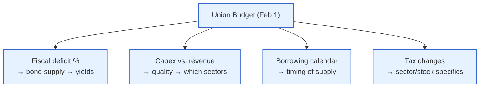

# Day 16 — Fiscal Policy & the Debt

> **Today's one idea:** When the government spends more than it earns, it must *borrow* the difference by selling G-secs — so the fiscal deficit lands directly in the bond market, and the size of the government's borrowing is a primary driver of yields, the rupee, and the RBI's job.
> **Reading time:** ~40 min · **Prereqs:** [Day 5](../../01-foundations/days/day-05-who-steers.md), [Day 11](../../02-measuring-the-machine/days/day-11-gsec-yield-curve.md)
> **Primary source for today:** Government of India, *Economic Survey* (fiscal chapter) & Union Budget documents.
> **Before you start:** Recall Day 15's drill — for a *larger-than-expected fiscal deficit*, which way did the G-sec price move, and why (name both forces)?

## The hook (2–4 min)

Every February 1st, the Finance Minister opens a briefcase (now a *bahi-khata*) and the market holds its breath for one number above all: the **fiscal deficit as a percentage of GDP**. Not the flashy scheme announcements — that number. Because it answers the question the bond market actually cares about: *how many rupees of new government debt will I have to absorb this year?* The government's spending is the second lever (Day 5), but unlike the RBI's rate, the fiscal lever pays for itself with borrowed money — and that borrowing is where fiscal policy collides with your portfolio.

## Building the intuition (10–15 min)

The government, like a household, has income (taxes) and expenses (spending). When it spends more than it collects, the gap is the **fiscal deficit**, and it has to be *financed* — the government can't just conjure rupees (that's the RBI's domain, and monetising deficits causes inflation). So it does what you'd do: it borrows. It borrows by issuing **G-secs** (Day 10) — IOUs sold to banks, insurers, funds, and foreigners.

Here's the chain that makes fiscal policy a market event:


Think of the bond market as having limited appetite. If the government dumps a huge quantity of new bonds on it, buyers demand a *lower price* (higher yield) to absorb them all — simple supply and demand. Since the G-sec yield is the risk-free base for *every* asset (Day 10), a bigger deficit raises the cost of capital across the economy. This is why the deficit number moves markets more than the individual schemes.

Two more consequences the pros watch:
- **Crowding out:** when the government borrows heavily, it competes with private companies for the same pool of savings, pushing up rates and potentially "crowding out" private investment (the volatile I from Day 7). More G-secs can mean dearer money for corporate India.
- **The RBI's headache:** a big deficit pumps demand into the economy (stimulative) and can stoke inflation — which pushes the RBI's reaction function toward tighter rates (Day 13). This is the two-levers conflict (Day 5) made concrete: fiscal loosening can *force* monetary tightening.

But — crucial nuance — **not all deficits are equal.** A deficit spent on a new highway or port (capital expenditure) builds productive capacity and can *raise future growth* (the trend, Day 2), potentially paying for itself. A deficit spent on subsidies and salaries (revenue expenditure) just adds demand today with no lasting asset. So the bond market reads not just the *size* of the deficit but its *quality* — the capex-vs-revenue split. A rising deficit that's funding capex is treated very differently from one funding giveaways.

## The formal picture (10–15 min)

**The key numbers (know these by name):**

| Term | What it is | Why it matters |
|---|---|---|
| **Fiscal deficit** | Total spending − total revenue (excl. borrowing), % of GDP | The headline; the amount to be borrowed |
| **Revenue deficit** | The part of the deficit funding *day-to-day* (non-asset) spending | High = borrowing to eat, not build — low quality |
| **Primary deficit** | Fiscal deficit − interest payments | Strips out old-debt servicing; shows the *new* imbalance |
| **Capex / revenue split** | Share of spending that builds assets vs. consumption | The *quality* of the deficit |
| **Debt-to-GDP** | Total accumulated government debt ÷ GDP | Long-run sustainability |
| **FRBM Act** | Law targeting fiscal discipline (a ~4.5% deficit path) | The rule the government is (loosely) held to |

**Debt sustainability — the one equation that matters.** A government's debt-to-GDP ratio is stable if the economy grows at least as fast as the interest it pays on its debt. The intuition (the "**r vs. g**" condition):

```math
\text{Debt/GDP stable if } \; g \; \ge \; r
```

where `g` = the economy's nominal growth rate and `r` = the average interest rate on government debt. If growth (`g`) outpaces the interest cost (`r`), the economy "grows out of" its debt — the denominator rises faster than the debt compounds. India's saving grace is high nominal growth: strong `g` lets India run deficits that would alarm a slow-growth country, because it's growing the GDP denominator fast. But if growth stalls while borrowing costs stay high, debt dynamics turn dangerous — the mechanism behind many emerging-market crises (Day 25).

**Who finances India's deficit — and the hidden constraint.** Indian banks are *required* to hold a chunk of their assets in G-secs (the **SLR** — Statutory Liquidity Ratio). This creates captive demand that helps the government borrow cheaply — but it also means bank balance sheets are stuffed with government debt, linking the government's health to the banking system's. Foreign holding of Indian G-secs is small but rising (via index inclusion), which will make yields *more* sensitive to global flows over time (Day 19).

**The Budget as a market event:**



On Budget day, the market reacts to the deficit number *versus expectations* (Day 3): a *smaller* deficit than feared → bond rally (yields down); a *larger* one → bonds sell off. And it reads the capex line to decide which sectors win (infra, capital goods if capex is up).

## Where it breaks / what it is not (3–5 min)

- **A deficit is not automatically "bad."** In a slump (weak private C and I), government borrowing to spend can be exactly right — it fills the demand hole when monetary policy is pushing on a string (Day 14). Austerity in a slump can deepen it (the Day 1 paradox-of-thrift, at government scale). Context decides.
- **The household analogy misleads (again).** A government isn't a household: it can roll debt over indefinitely, prints its own currency (for rupee debt, default is a *choice*, not a necessity), and its spending is others' income (Day 1). "The government must balance its budget like a family" is the Day 1 false-friend in a suit.
- **The deficit *level* vs. its *quality*.** Two 6% deficits — one funding highways, one funding subsidies — have opposite long-run consequences. Judging on size alone is naive.
- **Off-budget borrowing hides the true picture.** Governments sometimes push borrowing to state-owned entities to flatter the headline deficit. The "real" fiscal impulse can exceed the printed number — a reason to read the *Economic Survey*'s analysis, not just the Budget headline.

## Try it yourself (5–10 min)

1. **Retrieval first.** Close the page. Explain in your own words how a fiscal deficit ends up raising G-sec yields, and state the one condition under which rising government debt is *sustainable*. No looking.

2. **Direct application.** The Budget sets the fiscal deficit at 5.9% of GDP — *lower* than the market feared (it expected 6.3%) — and shifts spending sharply toward capex. Write the read: how do (a) G-sec yields, (b) infrastructure/capital-goods stocks, and (c) the rupee likely react, and why? Explain the deficit reaction in terms of *expectations* (Day 3).

3. **Stretch.** India runs a 6% fiscal deficit and nominal GDP grows 11%, while the average interest on its debt is 7%. (a) Is the debt-to-GDP ratio likely rising or falling, and why? (b) Now growth collapses to 4% (interest still 7%). What happens to debt dynamics, and why does this make the deficit suddenly dangerous? (Use the r-vs-g idea.)

4. **Spaced callback (Day 5).** On Day 5 the two levers could conflict. Give the precise mechanism by which a *loose fiscal* stance forces the RBI toward a *tighter monetary* stance — naming what the bond market does in between.

<details>
<summary>Hint</summary>
#2: smaller-than-feared deficit = positive surprise for bonds → yields down; capex shift → infra stocks up. #3: compare g (nominal growth) to r (interest cost); g > r = growing out of debt; g < r = debt spirals. #4: fiscal stimulus → more demand + more bond supply → inflation + higher yields → RBI leans hawkish.
</details>

<details>
<summary>Worked solution</summary>

**#2:** (a) **G-sec yields fall (prices rise):** the deficit came in *below* expectations (Day 3), so less bond supply than feared → a relief rally in bonds. (b) **Infra/capital-goods stocks rise:** the shift toward capex directly boosts their order books, and it signals higher-quality, growth-oriented spending. (c) **The rupee firms modestly:** fiscal discipline (a smaller deficit) supports credibility and lowers inflation/CAD worries. A "good Budget" for markets = smaller deficit + more capex, which is exactly this.

**#3:** (a) **Falling/stable:** nominal growth (11%) exceeds the interest cost (7%), so India is "growing out of" its debt — the GDP denominator rises faster than debt compounds (g > r). A 6% deficit is manageable in that regime. (b) **Debt dynamics deteriorate sharply:** with growth at 4% and interest at 7% (r > g), debt now compounds *faster* than GDP grows. The ratio rises, interest payments eat more of the budget, and it can spiral — the same 6% deficit that was fine is now dangerous. *Growth is what makes Indian deficits sustainable; lose the growth and the debt math turns hostile.*

**#4:** A loose fiscal stance means the government spends and borrows heavily. This (i) pumps **demand** into the economy, raising inflation pressure, and (ii) floods the bond market with **supply**, pushing **yields up** (the bond market's move in between). Both feed the RBI's reaction function (Day 13): higher inflation → the RBI leans **hawkish** to contain it. So fiscal loosening → higher yields + higher inflation → tighter money. The two hands end up fighting, and bondholders lose from both the supply and the tightening.
</details>

> **Transfer — apply it:** Look up India's current fiscal deficit target (% of GDP) and the capex share in the latest Budget. State it as input (the deficit + capex split) → today's idea (bond supply and quality of spending) → output (what it implies for yields and which sectors). Then note the current 10-year yield — you're now reading the fiscal and monetary levers *together*, which is exactly what a macro thesis requires.

## Connect it back

Module 3 is complete: you can predict the RBI (Day 13), trace how its move transmits (Day 14), chain a shock to assets (Day 15), and now read the government's borrowing as a bond-market force (today). You've assembled the whole *policy* machine. Module 4 turns it outward to *assets*: tomorrow, the master equation that prices everything — the **discount-rate lens** — which unifies the surprise (Day 3) and the repo (Day 10) into a single tool you'll use for the rest of your investing life.

**The sharp question you can now answer:** Why does the bond market care more about the deficit number than about which schemes the Budget funds?

## Suggested readings for today

**Required if you have 15 extra minutes:** Government of India, *Economic Survey*, **the fiscal chapter** — read the deficit path, the capex-vs-revenue discussion, and the debt-sustainability (r vs. g) analysis in India's own framing.

**If you want the deep version:**
- Vijay Joshi, *India's Long Road* (2017), **the chapters on fiscal policy and public finances** — why India's fiscal position is both a constraint and, given high growth, more manageable than it looks.
- N. Gregory Mankiw, *Macroeconomics*, 10th ed., **the government-debt chapter** — crowding out, Ricardian equivalence, and debt sustainability, formalised.

---

## Navigation

← **Previous:** [Day 15 — Drill I: Shock → Asset Move](day-15-drill-shock-to-asset.md)  
→ **Next:** [Day 17 — The Discount-Rate Lens](../../04-macro-to-assets/days/day-17-discount-rate-lens.md)
