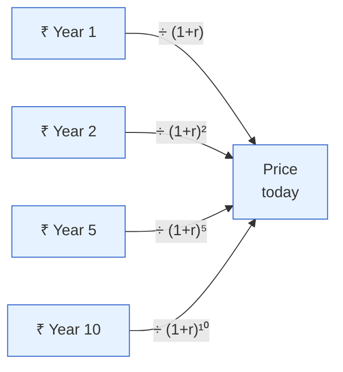
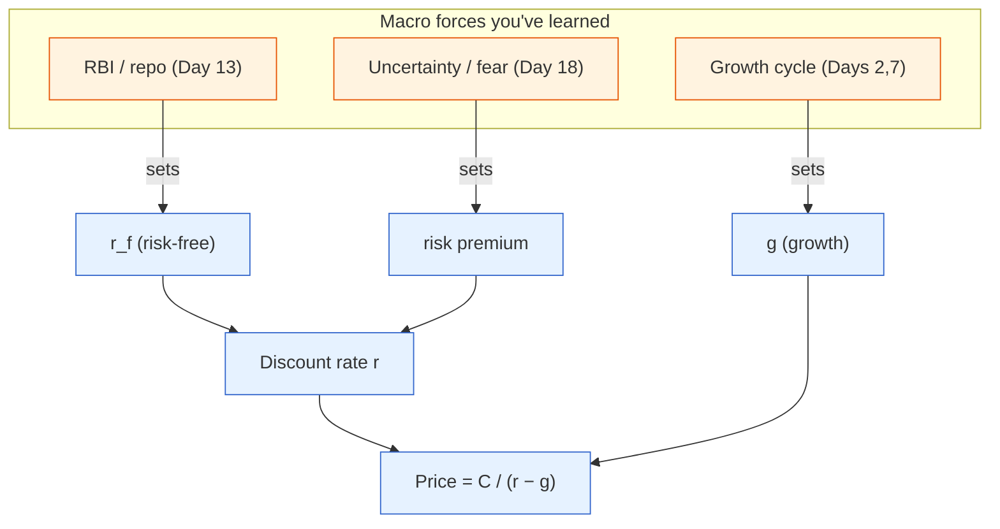

# Day 17 — The Discount-Rate Lens

> **Today's one idea:** Every asset — a stock, a bond, a building — is worth the future cash it will pay, discounted back to today, and that discount rate is built from three macro pieces: the risk-free rate, expected growth, and a risk premium. Master this one equation and you can price *anything*.
> **Reading time:** ~40 min · **Prereqs:** [Day 3](../../01-foundations/days/day-03-markets-price-the-future.md), [Day 10](../../02-measuring-the-machine/days/day-10-repo-and-gsecs.md)
> **Primary source for today:** Antti Ilmanen, *Expected Returns* (2011).
> **Before you start:** Recall Day 16 in one sentence, no looking — *how does a larger fiscal deficit raise G-sec yields, and by what two forces?*

## The hook (2–4 min)

Why did high-growth tech stocks *soar* when rates were near zero in 2020–21, then *crash* in 2022 when rates rose — even though their businesses barely changed? The companies were the same. What changed was the **discount rate** — the invisible lever that converts "future rupees" into "today's price." When money is cheap, distant future profits are worth a lot today; when money is dear, those same profits are worth far less. Almost every big market move you've ever seen is, underneath, a change in the discount rate. Today you learn to see it — the single most powerful lens in this course.

## Building the intuition (10–15 min)

Start with a question: would you rather have ₹100 today or ₹100 in five years? Today, obviously — you could invest it, and inflation will erode the future ₹100. So future money is worth *less* than present money. **Discounting** is just putting a number on "how much less."

The discount rate is your required return — the rate at which you're willing to trade future rupees for present ones. To value any asset, you take all its future cash flows and shrink each one by the discount rate, more so the further out it is:



Notice the *later* cash flows get divided by a bigger number (the exponent grows), so they shrink most. This is the key to everything: **when the discount rate `r` rises, distant cash flows lose the most value.** A stock whose profits are mostly far in the future (a "growth" stock) is *long duration* — brutally sensitive to `r`. A stock paying big dividends now (a "value" stock) is *short duration* — less sensitive. Same insight as the bond duration idea from Day 10, now applied to equities. That's why rising rates hammer growth stocks: it's not their business, it's the arithmetic of discounting.

Now — where does the discount rate *come from*? This is where all your macro knowledge pours in. The discount rate has three building blocks:

```math
r \;=\; \underbrace{r_f}_{\text{risk-free rate}} \;+\; \underbrace{\text{risk premium}}_{\text{compensation for uncertainty}}
```

and the value also depends on **expected growth** of the cash flows. So three macro forces set every price:

1. **The risk-free rate (`r_f`)** — the G-sec yield (Day 10), anchored by the repo rate (Day 13). *Higher rates → higher discount rate → lower prices.* This is the macro channel you've spent two weeks learning.
2. **Expected growth** — how fast the cash flows will grow (tied to the economic cycle, Days 2, 7). *Higher expected growth → higher future cash flows → higher prices.*
3. **The risk premium** — extra return demanded for bearing uncertainty. *Higher fear/uncertainty → higher premium → higher discount rate → lower prices.* (This is the piece behaviour will hijack — Day 18.)

Every macro event you've studied moves one of these three. The RBI hikes → `r_f` up. Growth data disappoints → expected growth down. A crisis erupts → risk premium up. **The discount-rate lens is the master switchboard through which all macro reaches all assets.**

## The formal picture (10–15 min)

**The valuation identity (Gordon growth form, the simplest version):** for an asset paying a cash flow `C` next year, growing at rate `g`, discounted at `r`:

```math
\text{Price} \;=\; \frac{C}{r - g}
```

Every symbol: `C` = next year's cash flow (dividend/earnings); `g` = the growth rate of that cash flow; `r` = the discount rate (required return). Stare at this — it contains the whole course:
- `r` rises (RBI hikes, Day 13) → denominator bigger → **price falls**.
- `g` rises (growth accelerates, Day 7) → denominator smaller → **price rises**.
- The *gap* `(r − g)` is everything. When `r` and `g` are close, the price is enormous and hyper-sensitive — which is why growth stocks are so volatile.

**Decomposing `r` — the equity version:**

```math
r \;=\; r_f \;+\; \text{ERP}
```

- `r_f` = risk-free rate (the G-sec yield).
- **ERP** = the **equity risk premium** — the extra annual return investors demand for holding stocks over risk-free bonds. Historically a few percent; it *rises* in fear (prices fall) and *falls* in complacency (prices rise).

Ilmanen's central idea in *Expected Returns*: asset returns are **compensation for bearing macro risks**. You earn the ERP because stocks crash in bad times (recessions, when you can least afford it); you earn the bond term premium for taking duration risk; you earn credit spreads for default risk (Day 20). Each premium is a *price of a macro risk*. So "why does this asset return what it does?" always resolves to "what macro risk is it compensating you for?" — the lens that organises the entire assets arc (Days 18–21).

**Recall Day 3 — this is the same idea, now mechanised.** On Day 3 you learned prices are discounted expectations of the future. Today you have the actual discounting machine: `Price = C/(r−g)`, with `r` and `g` set by macro, and prices moving on *surprises* to any of the three inputs. Day 3 was the intuition; this is the engine.



## Where it breaks / what it is not (3–5 min)

- **`r` and `g` are not independent.** Often rates rise *because* growth is strong (Day 15, Rep 6) — so `r` up and `g` up can partly cancel. Naively moving only `r` while holding `g` fixed gives wrong answers. Always ask *why* `r` moved.
- **The model is a lens, not a calculator.** `Price = C/(r−g)` requires `r > g` and constant growth — false for real firms. Use it to reason about *direction and sensitivity*, not to compute a precise fair value.
- **The risk premium is the wild card.** `r_f` is observable (the G-sec yield); the risk premium is not — it's set by *sentiment* and swings hugely (Day 18). Most of the biggest price moves are risk-premium moves, not rate or growth moves. Bernanke–Kuttner (Day 3) found exactly this: Fed surprises hit equities mainly through the risk premium.
- **Duration cuts both ways.** Long-duration growth stocks are punished by rising `r` but *rewarded* most by falling `r`. The lens explains the upside too, not just the crashes.

## Try it yourself (5–10 min)

1. **Retrieval first.** Close the page. Write `Price = C/(r−g)`, name each symbol, and state what happens to the price when (a) the RBI hikes and (b) growth accelerates. Then name the three macro building blocks of the discount rate. No looking.

2. **Direct application.** Two Indian stocks: a mature FMCG company (steady dividends now) and a young, profitless SaaS company (all its value is projected profits 7–10 years out). The 10-year G-sec yield rises 100 bp on a hawkish RBI surprise. Explain, using the lens, which stock falls more and *why* — as you'd explain it to a colleague who says "but rates barely affect a good business."

3. **Stretch.** The RBI *cuts* rates 50 bp, which should lower `r` and lift prices — yet the market *falls*. Using the three building blocks of the discount rate, give a coherent explanation for how a rate cut can *raise* the discount rate on net. (Hint: what if the cut signals panic?)

4. **Spaced callback (Day 3, +14).** On Day 3 you learned markets move on the *surprise*. Reframe that using today's equation: a "positive surprise" is really a surprise to *which* of the three inputs (`r_f`, `g`, risk premium)? Give an example of a surprise to each.

<details>
<summary>Hint</summary>
#2: the SaaS firm is long-duration — its distant cash flows get divided by (1+r) to high powers, so a higher r crushes it. #3: a panicky emergency cut can *raise the risk premium* (fear) by more than it lowers r_f. #4: earnings beat → g surprise; hawkish CPI → r_f surprise; crisis → risk-premium surprise.
</details>

<details>
<summary>Worked solution</summary>

**#2:** The **SaaS company falls far more.** Its value is almost entirely *distant* future cash flows (years 7–10), which get divided by `(1+r)` raised to high powers — so a higher `r` shrinks them dramatically (long duration). The FMCG firm's value is mostly *near-term* dividends, divided by low powers, so a higher `r` barely dents them (short duration). To the skeptical colleague: "rates barely affect a good business's *operations*, true — but they massively affect what the market will *pay today* for profits that are a decade away. It's the discounting arithmetic, not the business quality."

**#3:** The discount rate is `r_f + risk premium`. A 50 bp cut lowers `r_f` — but if the market reads the cut as a *panic move* signalling the RBI sees serious trouble, the **risk premium can jump** (fear rises, `g` expectations fall). If the risk-premium spike (and lower growth expectations) outweighs the lower `r_f`, the *net* discount rate rises and/or expected `g` collapses — and prices fall. "Emergency cut → market falls" is a real, recurring pattern (it happened globally in early 2020): the cut screamed danger louder than it eased conditions.

**#4:** A "surprise" is a surprise to one (or more) of the three inputs: **`g` surprise** — a company beats earnings or GDP comes in hot (cash-flow growth revised up → price up); **`r_f` surprise** — a hot CPI print raises expected RBI rates (risk-free up → price down, Day 15 Rep 1); **risk-premium surprise** — a geopolitical shock or crisis spikes fear (premium up → price down). Day 3's abstract "surprise" is always, concretely, a surprise to `r_f`, `g`, or the risk premium. That's the whole macro-to-price map in one sentence.
</details>

> **Transfer — apply it:** Take a stock you own and classify it as long- or short-duration (is its value mostly near-term cash or distant growth?). State it as input (the stock's cash-flow profile) → today's idea (its duration = its sensitivity to `r`) → output (how much a 100 bp move in the G-sec yield should move it). You now know, *before* rates move, which of your holdings are secretly bond-like bets on the discount rate.

## Connect it back

This is the unifier: Day 3's "prices are discounted expectations" and Day 10's "the repo is the anchor" are now one equation, `Price = C/(r−g)`, through which every macro force reaches every asset. But notice the loose piece — the *risk premium*, set not by data but by human emotion. Tomorrow we open that box: the **behavioural engine**, where anchoring and herding make real prices over- and undershoot what the lens says they *should* be. That gap is where surprises are born.

**The sharp question you can now answer:** Why did unchanged tech companies lose half their value in 2022 when interest rates rose?

## Suggested readings for today

**Required if you have 15 extra minutes:** Antti Ilmanen, *Expected Returns* (2011), **Ch. 1–2 (the framework: returns as compensation for risk)** — the idea that every risk premium is the price of a macro risk. Dense but foundational for the rest of Module 4.

**If you want the deep version:**
- Bernanke & Kuttner (2005) — revisit their finding that Fed surprises hit equities mainly through the *risk premium*, not the risk-free rate. It's the empirical proof of today's decomposition.
- Olivier Blanchard, *Macroeconomics*, 8th ed., **the asset-pricing / present-value chapter** — the discounting machinery, formalised.

---

## Navigation

← **Previous:** [Day 16 — Fiscal Policy & the Debt](../../03-policy-moves-markets/days/day-16-fiscal-policy-and-debt.md)  
→ **Next:** [Day 18 — The Behavioral Engine](day-18-behavioral-engine.md)
