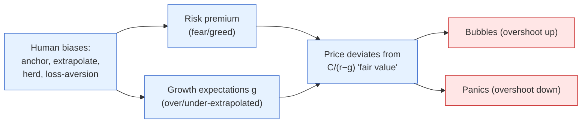
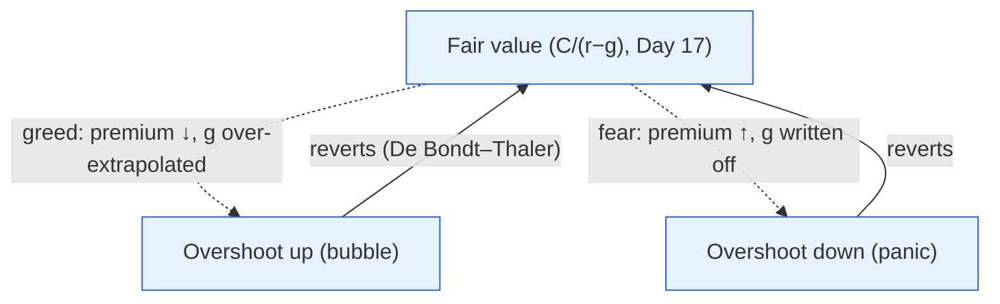

# Day 18 — The Behavioral Engine

> **Today's one idea:** Real prices are set by humans who anchor, extrapolate, and herd — so markets systematically *over- and undershoot* the fair value the discount-rate lens predicts, and that gap between mechanism and mood is where the biggest surprises (and opportunities) come from.
> **Reading time:** ~40 min · **Prereqs:** [Day 3](../../01-foundations/days/day-03-markets-price-the-future.md), [Day 17](day-17-discount-rate-lens.md)
> **Primary source for today:** Daniel Kahneman, *Thinking, Fast and Slow* (2011).
> **Before you start:** Recall Day 17 in one sentence, no looking — *what are the three macro building blocks that set an asset's discount rate, and which one is set by emotion?*

## The hook (2–4 min)

Day 17 gave you a clean machine: `Price = C/(r−g)`. If markets obeyed it, prices would move smoothly as `r` and `g` updated. But look at any real chart — Indian small-caps in 2017, crypto, the 2021 IPO frenzy, or any crash. Prices don't glide; they *lurch*, overshoot euphorically, then overshoot fearfully the other way. The machine is right about the *destination* but wrong about the *path*, because the machine is operated by humans. The risk premium — that one emotional input — is where psychology hijacks the mechanism. Today you learn the predictable ways it does, so the crowd's mistakes stop surprising you and start informing you.

## Building the intuition (10–15 min)

Kahneman's core finding: humans run on two systems. **System 1** is fast, automatic, emotional, intuitive. **System 2** is slow, effortful, logical. Investing *should* be System 2 (weigh the cash flows, discount them) — but under uncertainty and time pressure, System 1 takes over, and it has predictable biases. A handful matter enormously for markets:

- **Anchoring.** We fixate on a reference number. "The stock was ₹500 last month, so ₹400 is cheap" — even if ₹400 is still overvalued on the cash flows. The anchor (₹500) has nothing to do with `C/(r−g)`, yet it drives behaviour.
- **Extrapolation (recency bias).** We assume the recent trend continues. Three good years → "this always goes up" → people pay any price. This makes `g` expectations *overshoot* in booms and *undershoot* in busts.
- **Herding.** We copy the crowd — partly for safety ("if everyone's buying, they must know something"), partly career risk ("no one got fired for buying what everyone bought"). Herding turns individual biases into *correlated* market-wide moves.
- **Loss aversion.** Losses hurt about twice as much as equal gains please (Kahneman & Tversky's prospect theory). We panic-sell at bottoms and freeze, which makes the risk premium spike exactly when prices are lowest.
- **Availability.** Vivid recent events feel more probable. After a crash, everyone overestimates crash risk (premium too high); after a long calm, everyone underestimates it (premium too low).

Now connect to the lens. These biases don't move the *cash flows* (`C`) or the *risk-free rate* (`r_f`, set by the RBI). They move the **risk premium** and the **`g` expectations** — the two subjective inputs:



The result: prices oscillate *around* fair value, overshooting in both directions. In greed, the risk premium collapses and `g` is over-extrapolated → prices soar above fair value (a bubble). In fear, the risk premium explodes and `g` is written off → prices crater below fair value (a panic). **The mechanism sets the centre of gravity; behaviour sets the swing.**

The Indian angle makes this concrete and current: the post-2020 boom in **retail participation** — tens of millions of new demat accounts, record **SIP** inflows, the 2021 IPO and small-cap frenzy — created a huge pool of System-1-driven, momentum-following, often first-cycle investors. Combined with **FII herding** (foreign flows that surge in and rush out together, Day 19), Indian markets can detach from fair value faster and further than the textbook allows. Recognising *when the crowd is anchored and herding* is a genuine edge in India specifically.

## The formal picture (10–15 min)

**Prospect theory (the one formal model to know).** Kahneman & Tversky showed people don't evaluate outcomes in absolute wealth but as *gains and losses relative to a reference point*, with a value function that is:
- **Reference-dependent:** you feel the *change* from your anchor, not your total wealth.
- **Loss-averse:** the pain of a loss is ~2× the pleasure of an equal gain (the curve is steeper below zero).
- **Diminishing sensitivity:** ₹1,000 → ₹2,000 feels bigger than ₹101,000 → ₹102,000.

```
        value
          │        ......  (gains: concave, gentle)
          │   ....
──────────┼───────────────  reference point
      ..  │
   ..     │   (losses: steep — hurts ~2×)
 .        │
```

This asymmetry explains market pathologies: investors hold losers too long (to avoid *realising* a loss), sell winners too early (to *lock in* a gain), and dump everything in panics (loss aversion overwhelming reason). It's why the risk premium spikes in crashes — collective loss aversion demanding huge compensation to hold risk.

**The evidence that markets over/undershoot.** De Bondt & Thaler (1985) showed *overreaction*: stocks that did extremely badly over 3–5 years subsequently *outperformed*, and prior winners *underperformed* — prices had overshot in both directions and then reverted. This is the empirical backbone of "mean reversion" and of value investing: buy what the crowd has over-punished, sell what it has over-loved. The crowd's overshoot is a *tradable* pattern.

**Efficient markets vs. behavioural — the honest synthesis.** The efficient-markets view (Day 3's "prices embed all information") and the behavioural view aren't fully opposed. The reconciliation this course uses:
- Markets are *hard to beat* (prices embed most information most of the time) — so don't assume you're smarter than the crowd casually.
- *But* they periodically detach at extremes, when biases become correlated and self-reinforcing (herding + extrapolation). The opportunities are at the *extremes*, not in the day-to-day.



The practical stance: **use the discount-rate lens to estimate the centre of gravity, and use behavioural awareness to judge whether the crowd has pushed price far above or below it — and, critically, whether *you* are being swept along.** The hardest bias to spot is your own.

## Where it breaks / what it is not (3–5 min)

- **"The market is irrational" is not a strategy.** Prices can stay detached from fair value far longer than you can stay solvent betting against them (Keynes's warning). Identifying an overshoot doesn't tell you *when* it corrects. Behavioural edge is about *odds over time*, not timing.
- **Don't over-diagnose bubbles.** Every rising price is not a bubble; sometimes `g` really did improve. The lens (Day 17) is your discipline — call "overshoot" only when price has clearly detached from *any* reasonable `C/(r−g)`, not just because it went up.
- **You are not immune.** Knowing the biases doesn't switch them off — System 1 runs automatically. The value is in building *rules* (checklists, pre-commitments) that protect you from your own System 1, not in believing you've transcended it.
- **Behaviour moves the swing, not the anchor.** Over long horizons, fair value (cash flows and rates) dominates; behaviour dominates the *short-to-medium* term. Don't use "sentiment" to justify ignoring a genuinely broken business.

## Try it yourself (5–10 min)

1. **Retrieval first.** Close the page. Name four behavioural biases and, for each, state whether it pushes price *above* or *below* fair value and *which* input of the discount-rate lens it distorts. No looking.

2. **Direct application.** A hot Indian small-cap has risen 300% in a year; retail investors are pouring in via SIPs and social media, saying "it always goes up, get in before it's too late." Using the lens (Day 17) *and* today's biases, write the two-part assessment you'd give a colleague: (a) what fair-value question to ask, and (b) which specific biases are inflating the price — and why that makes it fragile.

3. **Stretch.** After a market crash, a fundamentally sound Indian company trades at half its pre-crash price though its business is barely affected. Using prospect theory and the discount-rate lens, explain *why* it overshot to the downside, and construct the contrarian case — including the honest caveat about *timing*.

4. **Spaced callback (Day 3, +15).** On Day 3 you learned prices move on the *surprise*. Now add today's layer: explain how *positioning* (everyone herded to one side) can make an *in-line* print produce a big price move — connecting herding to the "surprise" framework.

<details>
<summary>Hint</summary>
#2: ask what cash flows justify the price (lens); extrapolation + herding + availability are inflating it. #3: loss aversion + availability spike the risk premium, crushing price below fair value; contrarian buys the overshoot but can't time the bottom. #4: if everyone's positioned one way, an in-line print triggers unwinding of the crowded trade.
</details>

<details>
<summary>Worked solution</summary>

**#2:** (a) **The fair-value question:** what future cash flows (`C`, `g`) would justify this price at a reasonable discount rate (`r`)? If no plausible earnings path supports a 300% move, price has detached from the lens. (b) **The biases:** *extrapolation* ("it always goes up" — over-extrapolating recent `g`), *herding* (retail piling in because others are), and *availability* (vivid recent gains making further gains feel certain), all *collapsing the risk premium*. This makes it **fragile** because the price rests on sentiment, not cash flows — when the momentum breaks, the same biases reverse violently (herding out, loss aversion), and there's no fair-value floor nearby to catch it.

**#3:** In the crash, collective **loss aversion** (losses hurt 2×) and **availability** (the crash is vivid, so more crashes feel imminent) spike the **risk premium** — investors demand huge compensation to hold *any* risk, so they dump even sound companies indiscriminately. With `C` and `g` barely changed but `r` (via the premium) massively elevated, `C/(r−g)` collapses — the stock overshoots *below* fair value. **Contrarian case:** the business is intact, so as fear normalises and the premium falls, price should revert up (De Bondt–Thaler). **The caveat:** you *cannot time the bottom* — it can fall further and stay cheap for months; size the position to survive being early.

**#4:** If the crowd has *herded* to one side — say, everyone is long and bullish going into a CPI print — then even an *in-line* print (no surprise to the data) can trigger a big move, because there's no one left to buy and the crowded trade *unwinds* on the slightest disappointment (or profit-taking). The "surprise" isn't in the data; it's the surprise of *realising the trade is over-crowded*. Positioning turns a non-event into a mover — which is why pros track *what's priced and who's positioned*, not just the number (Day 22).
</details>

> **Transfer — apply it:** Identify one position you hold (or avoided) where your *own* System 1 was driving — an anchor to your buy price, a fear of missing out, a reluctance to realise a loss. State it as input (the emotion) → today's idea (which bias, distorting which lens input) → output (how it may have skewed your decision vs. the cash flows). The bias you can name in *yourself* is the one you can build a rule against.

## Connect it back

The picture is now complete in principle: the discount-rate lens (Day 17) sets fair value; behaviour (today) sets the swing around it. Together they explain *why markets move on macro news* — the surprise hits the mechanism, and the crowd's biases amplify or dampen the move. Tomorrow we apply this combined lens to the asset that most concentrates both mechanism and mood for India: **the rupee**, where domestic rates, oil, the Fed, and herding FII flows all collide.

**The sharp question you can now answer:** If the discount-rate lens is "right," why do prices still crash 50% below and soar 200% above what it says?

## Suggested readings for today

**Required if you have 15 extra minutes:** Daniel Kahneman, *Thinking, Fast and Slow* (2011), **the chapters on anchoring and on prospect theory / loss aversion** — the source machinery for today, in Kahneman's own examples.

**If you want the deep version:**
- Werner De Bondt & Richard Thaler, "Does the Stock Market Overreact?" (*Journal of Finance*, 1985) — the evidence that prices over- and undershoot, then revert.
- Santosh Nair, *Bulls, Bears and Other Beasts* (2018) — herding and mania made concrete through Indian market history (Harshad Mehta to the present).
- Richard Thaler, *Misbehaving* (2015) — the most readable overview of the whole field.

---

## Navigation

← **Previous:** [Day 17 — The Discount-Rate Lens](day-17-discount-rate-lens.md)  
→ **Next:** [Day 19 — The Rupee Ties It Together](day-19-the-rupee.md)
