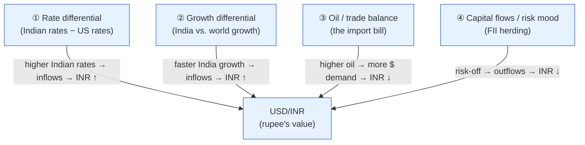
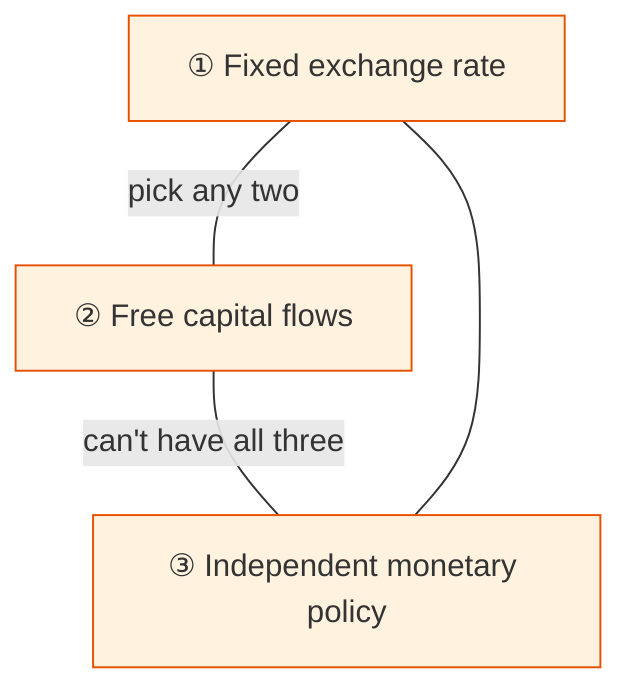

# Day 19 — The Rupee Ties It Together

> **Today's one idea:** The USD/INR exchange rate is where domestic and global forces collide — it moves on the *difference* between Indian and US interest rates and growth, on the oil import bill, and on herding foreign capital flows — making the rupee the single variable that connects your Indian portfolio to the whole world.
> **Reading time:** ~40 min · **Prereqs:** [Day 10](../../02-measuring-the-machine/days/day-10-repo-and-gsecs.md), [Day 13](../../03-policy-moves-markets/days/day-13-rbi-reaction-function.md)
> **Primary source for today:** Raghuram Rajan, *I Do What I Do* (2017).
> **Before you start:** Recall Day 18 in one sentence, no looking — *how do anchoring and herding make prices deviate from the discount-rate lens's fair value?*

## The hook (2–4 min)

In 2013, a single sentence from the US Federal Reserve — a hint that it might slow its bond-buying — sent the rupee crashing from ~55 to ~68 per dollar in months. India's economy hadn't changed overnight. What changed was that global money, which had flooded into India chasing yield, suddenly rushed for the exit. The rupee is the valve through which the whole world's mood enters India. An equity investor who watches only the Nifty and ignores the rupee is watching one gauge on a two-gauge dashboard — and the rupee is the one that warns you when the *global* tide is turning against you.

## Building the intuition (10–15 min)

An exchange rate is just a price — the price of one currency in another. USD/INR = 83 means one dollar costs 83 rupees. Like any price, it's set by supply and demand: demand for rupees (foreigners buying Indian goods and assets) versus demand for dollars (Indians buying imports and foreign assets). The rupee *strengthens* when dollars flow *in*, *weakens* when they flow *out*.

What drives those flows? Four forces, and you already understand three of them:

1. **Rate differential.** If Indian bonds yield 7% and US bonds yield 4%, global investors can earn the 3% gap by holding rupee assets (the "carry"). Higher Indian rates *relative to the US* attract dollars → rupee strengthens. **The key word is *relative*** — this is the Day 15 Rep-5 trap: what matters isn't India's rate alone but India's rate *minus* the US rate. When the Fed hikes, the gap *narrows* even if the RBI does nothing, and money flows *out* of India.
2. **Growth differential.** Faster Indian growth (vs. the world) attracts equity investment → inflows → stronger rupee. Weakening relative growth → outflows.
3. **Oil and the trade balance.** India imports ~85% of its crude. When oil rises, India must buy more dollars to pay for it → dollar demand up → rupee down. Oil is the single biggest swing factor in India's import bill and thus its current-account deficit (**CAD**, Day 7's negative NX). A rising CAD structurally pressures the rupee.
4. **Capital flows and risk mood (the behavioural piece).** **FII/FPI flows** — foreign money in Indian stocks and bonds — are large, fast, and *herd* (Day 18). In "risk-on" global moods, money floods emerging markets like India (rupee up); in "risk-off" (a crisis, a Fed scare), it stampedes back to the safe-haven dollar (rupee down), regardless of India's fundamentals. This is why the rupee can fall *even when India is doing fine* — the 2013 taper tantrum exactly.

The synthesis: the rupee is a **relative** and **global** variable. The Nifty can be understood largely from domestic forces; the rupee *cannot* — it's always India vs. the US, India vs. oil, India vs. the global risk mood. That's what makes it the connective tissue.

## The formal picture (10–15 min)

**The RBI's role — a managed float.** India doesn't let the rupee float freely, nor does it fix it. It runs a **managed float**: the market sets the rate, but the RBI intervenes to smooth volatility, selling dollars from its **forex reserves** (~$600+ billion) to support the rupee when it falls too fast, or buying dollars to stop it rising too fast. So the rupee reflects market forces *filtered through* RBI intervention. When you see the rupee oddly stable during turmoil, the RBI is likely spending reserves to hold it — and reserves are finite, so watch them.

**The impossible trinity (a concept that explains RBI's constraints).** A country cannot simultaneously have all three of:

India chooses **independent monetary policy** (the RBI sets rates for domestic goals, Day 13) and *partially* open capital flows — so it must accept a *floating* (managed) rupee. This is *why* the rupee moves: India won't sacrifice its domestic rate policy to peg the currency, so the currency absorbs the adjustment. Rajan's *I Do What I Do* is partly the story of defending the rupee in 2013 while preserving this policy independence.

**Why the rupee matters to an equity investor — three channels:**
1. **Imported inflation.** A weaker rupee makes all imports (oil, electronics, gold) costlier in rupees → pushes up CPI (Day 9) → pressures the RBI toward hikes (Day 13) → higher discount rate → lower stock prices. The rupee is upstream of inflation and rates.
2. **Sector winners and losers.** A weaker rupee *helps* exporters (IT, pharma — they earn dollars, spend rupees) and *hurts* importers (oil marketers, companies with dollar debt). "Rupee down" is not uniformly bad for equities — it's a *rotation* signal.
3. **The FII feedback loop.** A falling rupee can *trigger* FII outflows (foreigners lose in dollar terms even if the stock is flat), which sells stocks *and* sells rupees — a self-reinforcing spiral (a reflexive loop, Day 25). Currency weakness and equity weakness can feed each other.

**The forward-looking version (uncovered interest parity, as a lens not a law):** in theory, a currency with higher interest rates should be *expected* to depreciate by roughly the rate gap — otherwise there'd be free money. In practice this holds poorly (the "carry trade" earns returns precisely because it doesn't), but the intuition is useful: a high rate differential attracts flows *now* but plants the seed of future depreciation. Don't treat carry as free.

## Where it breaks / what it is not (3–5 min)

- **"Higher rates → stronger currency" needs the word *relative*.** (Day 15 Rep 5.) India hiking strengthens the rupee only if the US *isn't* hiking more. Always compare to the US/global rate path, not India's rate in isolation.
- **A weak rupee is not simply "bad."** It helps exporters and can improve competitiveness. Panic about "rupee at record low" often ignores that gradual depreciation is normal for a higher-inflation economy (its prices rise faster, so its currency must drift down over time — purchasing-power parity).
- **RBI intervention has limits.** Reserves are large but finite; the RBI can slow a rupee fall, not reverse a genuine outflow. Betting "the RBI will hold the line" against fundamentals is dangerous.
- **The rupee is not a pure fundamentals story.** In risk-off episodes, herding flows (Day 18) dominate fundamentals for months. India can have great data and a falling rupee simultaneously if the global mood is "sell EM."

## Try it yourself (5–10 min)

1. **Retrieval first.** Close the page. List the four forces that move USD/INR and, for each, state the direction it pushes the rupee. Then explain why "India raised rates, so the rupee will strengthen" can be wrong. No looking.

2. **Direct application.** The US Fed signals faster hikes; US 10-year yields jump. The RBI holds. Oil is steady. Walk a colleague through what happens to (a) the rupee, (b) FII flows, (c) the Nifty, and (d) what the RBI might be *forced* to do — and why, referencing the rate *differential* explicitly.

3. **Stretch.** The rupee is falling fast. The RBI faces a choice: hike rates to defend it, or let it slide. Lay out the *trade-off* — what does defending the rupee cost the domestic economy, and when is letting it slide the wiser choice? Connect your answer to the impossible trinity and to the RBI's reaction function (Day 13).

4. **Spaced callback (Day 3, +16).** The rupee is a price, so (Day 3) it embeds expectations and moves on surprises. What is the "surprise" that would cause a sharp rupee move on a day when the RBI does *exactly* what everyone expected?

Hint

#2: narrower India–US rate gap → outflows → rupee down → FII sell equities → Nifty down → RBI may hike to defend the currency. #3: hiking to defend the rupee slows the domestic economy — a real cost; sometimes letting it slide (helping exporters, preserving growth) is better. #4: a surprise to the *expected path* — e.g., a shift in Fed expectations or an oil shock — not the RBI's action.

Worked solution

**#2:** (a) **Rupee weakens:** the India–US rate *differential narrows* (US rates up, India flat), so the carry appeal of rupee assets shrinks → dollars flow out. (b) **FII outflows:** global money rotates toward the now-higher-yielding, safer dollar (risk-off), selling Indian bonds and equities. (c) **Nifty falls:** FII equity selling + a weaker rupee raising imported inflation and the discount rate. (d) **The RBI may be *forced* to hike** — not because domestic data demands it, but to defend the rupee and stem outflows (protecting the rate differential), even though its reaction function (Day 13) alone wouldn't call for it. This is global forces overriding domestic policy.

**#3:** **The trade-off:** hiking rates to defend the rupee raises borrowing costs across the whole domestic economy (Day 14) — slowing growth, hurting investment — to protect the currency. That's a real cost paid by every domestic borrower for a currency problem. **When to let it slide:** if the fall is orderly and driven by a global mood (not a domestic crisis), letting the rupee depreciate *helps exporters*, improves competitiveness, and preserves domestic growth — often the wiser choice. The impossible trinity frames it: India won't peg the rupee, so it lets the currency absorb the shock rather than sacrificing domestic monetary independence. Rajan's 2013 playbook mixed modest rate defence with other measures rather than crushing the economy to hold a number.

**#4:** The rupee moves on surprises to the *expected path* of its drivers — most often a **shift in Fed expectations** (a hawkish US surprise narrows the expected rate gap) or an **oil shock** (a jump in the expected import bill), or a sudden **risk-off** event triggering herding outflows. So even if the RBI does exactly what's expected, the rupee can lurch because the *global* inputs surprised. The rupee's biggest surprises are usually *imported*, which is the whole point of today: it's the global valve.

> **Transfer — apply it:** Check the current USD/INR, the India–US 10-year yield gap, and the oil price. State it as input (these three) → today's idea (rate differential + oil + flows) → output (which way the rupee is likely biased, and whether that favours exporters or importers in your portfolio). If you hold IT or pharma (exporters) vs. oil-sensitive names, you now know the rupee is a live variable in your P&L.

## Connect it back

The rupee showed you that no Indian asset is an island — the global risk mood, the Fed, and oil all enter through the currency, amplified by the herding you learned yesterday. We've now covered equities (the discount-rate lens), the crowd (behaviour), and the currency. Tomorrow we add the market's *fear gauge* — **credit spreads** — which price default risk, tend to *lead* equities into trouble, and turn the abstract "risk premium" of Day 17 into a number you can watch.

**The sharp question you can now answer:** Why did the rupee crash in 2013 even though India's economy hadn't materially changed?

## Suggested readings for today

**Required if you have 15 extra minutes:** Raghuram Rajan, *I Do What I Do* (2017), **the sections on the 2013 taper tantrum and defending the rupee** — a central banker's real-time account of managing the exact forces in this page.

**If you want the deep version:**
- Government of India, *Economic Survey*, **the external-sector chapter** — India's current-account deficit, oil dependence, and capital flows, with current data.
- Olivier Blanchard, *Macroeconomics*, 8th ed., **the open-economy chapters (exchange rates, interest parity, the trilemma)** — the formal treatment of everything above.

---

## Navigation

← **Previous:** [Day 18 — The Behavioral Engine](day-18-behavioral-engine.md)  
→ **Next:** [Day 20 — Credit Spreads and the Cycle](day-20-credit-spreads.md)
