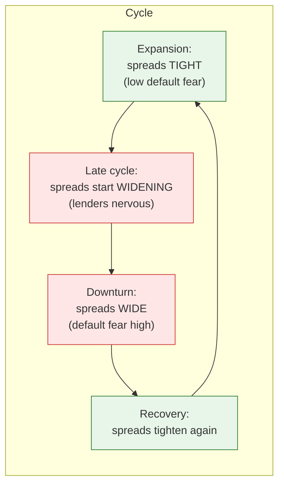
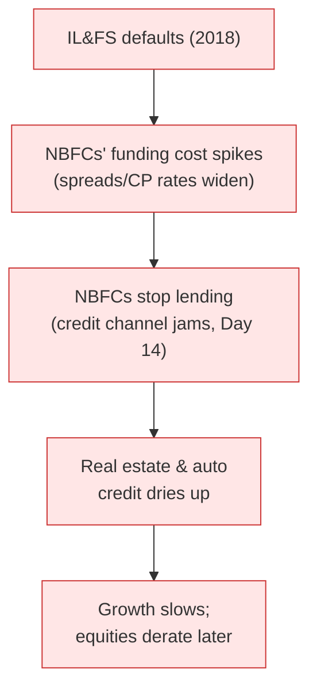

# Day 20 — Credit Spreads and the Cycle

> **Today's one idea:** A credit spread — the extra yield a risky borrower pays over the government — is the market's price of default risk, and because lenders sense trouble before equity investors do, widening spreads often *lead* the stock market into a downturn.
> **Reading time:** ~40 min · **Prereqs:** [Day 2](../../01-foundations/days/day-02-trend-vs-cycle.md), [Day 11](../../02-measuring-the-machine/days/day-11-gsec-yield-curve.md), [Day 18](day-18-behavioral-engine.md)
> **Primary source for today:** Antti Ilmanen, *Expected Returns* (2011), credit chapter.
> **Before you start:** Recall Day 19 in one sentence, no looking — *what are the four forces that move USD/INR, and why is "relative" the key word for the rate differential?*

## The hook (2–4 min)

In 2018, a single company — IL&FS, an infrastructure financier few retail investors had heard of — defaulted on its debt. Within weeks, the cost of borrowing for *every* Indian NBFC (non-bank lender) spiked, lending froze, and the shock rippled into stocks, real estate, and growth. The equity market took months to fully register what the *credit* market priced almost immediately: risk had gone up. Bond and credit investors, whose entire job is worrying about *getting paid back*, are the market's early-warning system. Today you learn to read their signal — the credit spread — because it often speaks before the Nifty does.

## Building the intuition (10–15 min)

When you lend money, you face one basic risk: *not getting paid back*. Lend to the Government of India (a G-sec, Day 10) and that risk is treated as ~zero — the government can always print rupees. Lend to a company, and there's real default risk. So you demand a *higher* yield from the company to compensate. That extra yield — the difference between the corporate bond's yield and the same-maturity G-sec's yield — is the **credit spread**:

```math
\text{Credit spread} \;=\; \text{Corporate bond yield} \;-\; \text{G-sec yield (same maturity)}
```

The spread *is* the market's price of that borrower's default risk. A rock-solid AAA company pays a thin spread (maybe 0.5–1%); a shaky one pays a fat spread (3%+); a distressed one pays a huge spread as lenders demand heavy compensation or refuse to lend at all.

Now the cyclical magic. Spreads *move with the economic cycle* (Day 2), and they move *early*:



Why do spreads *lead*? Because credit investors are structurally pessimistic — their upside is capped (they just get their money back plus interest) but their downside is total (default wipes them out). This asymmetry (a cousin of loss aversion, Day 18) makes them hyper-alert to deterioration. Equity investors, by contrast, dream of upside and often stay optimistic longer. So when the economy starts weakening, *lenders* pull back and spreads widen *before* the stock market rolls over. A sharp, broad widening of credit spreads is one of the most reliable "risk-is-rising" signals an equity investor can watch — a free warning from a more paranoid market.

Spreads also connect straight back to Day 17: the credit spread *is* a risk premium — the compensation for bearing default risk. When fear rises (Day 18), the spread (premium) widens, which *raises the discount rate* for risky borrowers, which lowers their asset values. Spread-widening and equity-falling are two faces of the same rising-risk-premium coin.

## The formal picture (10–15 min)

**What sits inside a spread.** A credit spread compensates for three things:
1. **Expected default loss** — probability of default × loss if it happens. The "fair" core.
2. **A risk premium** — extra compensation because defaults *cluster in bad times* (exactly when you can least afford losses). This is the Ilmanen idea: you're paid for taking a risk that's correlated with recessions.
3. **A liquidity premium** — extra yield because corporate bonds are harder to sell than G-secs, especially in a panic.

In a crisis, all three balloon at once — default fear, risk aversion, *and* illiquidity — which is why spreads can gap violently wider (and bond prices crater) far beyond the change in actual default odds. That overshoot (Day 18) is where distressed-debt investors hunt.

**The India-specific texture (read this, it's where the signal actually lives):**
- India's corporate bond market is **smaller and less liquid** than the US's, and dominated by high-grade (AAA/AA) issuance. So the cleanest Indian spread signal is often the **AAA corporate − G-sec spread**, and — crucially — the **NBFC/HFC spreads**, because non-bank lenders fund India's shadow-credit system and are the fault line that cracked in 2018.
- Much Indian credit risk shows up not in traded bond spreads but in **bank lending** (Day 14's credit channel) and in **commercial paper** rates for NBFCs. When NBFCs' short-term funding costs spike, that *is* India's credit-spread signal, even if the bond market looks calm.
- **Bank NPAs** (non-performing assets) are the slow-motion version: rising bad loans = the banking system's own credit stress, which chokes the credit channel and the cycle.

**The IL&FS case as the archetype (why it's the Indian teaching example):**



One default → a system-wide repricing of NBFC risk → a credit freeze → slower growth → *then* the equity market fully registered it. The credit market led; equities followed. That sequence is the whole lesson.

**How to use it as an equity investor:**
- **Watch the direction and speed of spreads, not the level.** A *sharp widening* is the warning; a stable level (however wide or tight) is just the current risk price.
- **Broad vs. idiosyncratic.** One company's spread blowing out is a company story. *Many* spreads widening together is a *macro* story — the cycle turning. Distinguish the two.
- **Tight spreads = complacency risk.** When spreads are historically *tight*, the market is pricing little default risk — good for now, but it means little cushion and lots of room to widen if the cycle turns. Very tight spreads are a late-cycle caution (Day 21).

## Where it breaks / what it is not (3–5 min)

- **India's illiquid bond market mutes the signal.** Unlike the deep US high-yield market, India's thin corporate-bond trading means spreads can be stale or driven by one-off issuance. Cross-check with NBFC funding costs and bank stress, not just quoted bond spreads.
- **Spreads can widen for non-cyclical reasons.** A single large default (IL&FS), a regulatory change, or a liquidity squeeze can widen spreads without a broad economic downturn. Ask "is this idiosyncratic or systemic?"
- **Leading ≠ always right.** Spreads sometimes widen and *no* recession follows (a false alarm), just as the yield curve sometimes over-warns (Day 11). It's a probabilistic early-warning, not a certainty.
- **Tight spreads are not safety.** Complacently tight spreads *precede* trouble more often than they signal all-clear. Don't read calm as robustness.

## Try it yourself (5–10 min)

1. **Retrieval first.** Close the page. Define a credit spread, state what it prices, and explain *why* it tends to widen *before* the equity market falls. No looking.

2. **Direct application.** You notice AAA corporate spreads and NBFC funding costs widening sharply over a few weeks, while the Nifty is still near highs. Write the read you'd give a colleague who's bullish: what is the credit market telling you, why might you trust it over the buoyant equity market, and what *one* portfolio action would you consider?

3. **Stretch.** Credit spreads are at *historic lows* (very tight) and the economy is booming; a colleague says "spreads are tiny, credit risk is clearly low, load up on riskier bonds and cyclicals." Using Day 18 and today, construct the counter-argument — why tight spreads might be a *warning*, not an all-clear — and name what you'd watch for the turn.

4. **Spaced callback (Day 2, +18).** On Day 2 you separated trend from cycle. Explain how credit spreads are a *cycle* indicator (not a trend one), and what a widening spread tells you about where in the business cycle the economy likely is.

<details>
<summary>Hint</summary>
#2: broad spread-widening = lenders (the early-warning system) sensing deterioration before equities; consider trimming risk/cyclicals. #3: tight spreads = complacency + little cushion (Day 18); watch for the first sharp widening. #4: spreads tighten in expansion, widen late-cycle/downturn — a coincident-to-leading cycle gauge.
</details>

<details>
<summary>Worked solution</summary>

**#2:** The credit market is flashing **rising risk**: lenders — the market's paranoid early-warning system — are demanding more compensation, which means they sense deteriorating ability to repay *before* equity investors have priced it. You'd trust it because credit investors' asymmetric payoff (capped upside, total downside) makes them react to trouble first, and *broad* widening (not one name) signals a *macro* turn, not a company story. **Action:** trim cyclical/high-beta equity exposure and raise quality/defensives (Day 21), and be wary of leveraged, credit-dependent sectors (NBFCs, real estate). The credit market is giving you a lead the equity market hasn't acted on yet.

**#3:** Historically tight spreads mean the market is pricing *almost no* default risk — which reflects **complacency** (Day 18: low risk premium, extrapolated calm) and leaves **no cushion**: there's lots of room to widen and little to tighten. Tight spreads also encourage reckless lending and leverage, *building* the fragility that later cracks. So "spreads are tiny" is often a *late-cycle* warning, not proof of safety. **What to watch:** the *first sharp widening* off the lows — the moment complacency breaks — plus rising leverage and any single default that could trigger a broad repricing (an IL&FS-type spark). Don't load up into complacency; that's when risk is highest and worst-compensated.

**#4:** Credit spreads are a **cycle** indicator: they *tighten* during expansions (default fear low, lenders confident) and *widen* in the late cycle and downturn (default fear rising). They say nothing about India's long-run *trend* growth (Day 2) — a country can have a great trend and still see spreads blow out in a cyclical downturn. So a sharp, broad *widening* tells you the economy is likely **late-cycle or turning down** — a demand-side cyclical signal, and often an *early* one relative to equities.
</details>

> **Transfer — apply it:** Find one credit-risk gauge you can track for India — the AAA−G-sec spread, NBFC/HFC commercial-paper rates, or the trend in bank gross NPAs. State it as input (the gauge) → today's idea (it prices default risk and leads the cycle) → output (what its recent *direction* says about rising or falling risk). If it's widening while equities are calm, you've just found the kind of divergence that pays to respect.

## Connect it back

You now have the full asset set — equities (the discount-rate lens), the crowd (behaviour), the currency (the rupee), and credit (the fear gauge) — and you've seen that they're all really pricing the same two things: expected cash flows and a risk premium that swings with the cycle and the mood. Tomorrow assembles it all into the payoff you were promised on Day 1: **the four regimes** — a map from the macro weather (growth × inflation) to what each asset class does, and what to own.

**The sharp question you can now answer:** Why did India's credit market "know" about the 2018 slowdown before the stock market did?

## Suggested readings for today

**Required if you have 15 extra minutes:** Antti Ilmanen, *Expected Returns* (2011), **the credit chapter** — the decomposition of spreads into expected loss, risk premium, and liquidity premium, and why credit is a cyclical, recession-correlated risk.

**If you want the deep version:**
- Urjit Patel, *Overdraft* (2020) — the NBFC/banking fragility and the IL&FS episode from a policymaker's seat.
- RBI *Financial Stability Report* (biannual, rbi.org.in) — the RBI's own tracking of bank NPAs, NBFC health, and system-wide credit stress; India's real credit-risk dashboard.

---

## Navigation

← **Previous:** [Day 19 — The Rupee Ties It Together](day-19-the-rupee.md)  
→ **Next:** [Day 21 — The Four Regimes](day-21-four-regimes.md)
