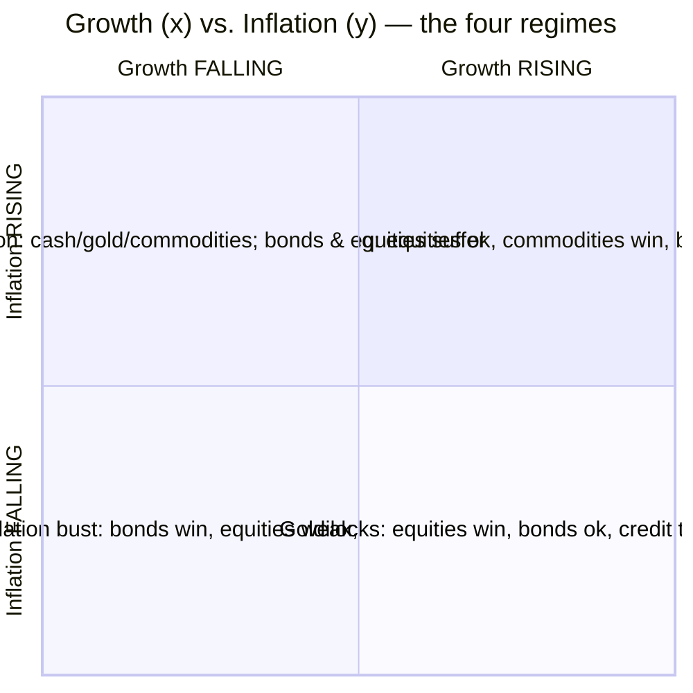
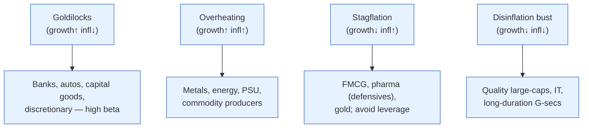

# Day 21 — The Four Regimes

> **Today's one idea:** Combine the two master variables — growth (rising/falling) and inflation (rising/falling) — into a 2×2 grid, and you get four macro "regimes," each of which reliably favours a different set of asset classes; knowing which regime you're in is the bridge from macro understanding to portfolio decisions.
> **Reading time:** ~40 min · **Prereqs:** [Day 2](../../01-foundations/days/day-02-trend-vs-cycle.md), [Day 9](../../02-measuring-the-machine/days/day-09-inflation-cpi-wpi.md), [Day 17](day-17-discount-rate-lens.md)
> **Primary source for today:** Ray Dalio, *Principles for Navigating Big Debt Crises* (2018) & the "All Weather" framework.
> **Before you start:** Recall Day 20 in one sentence, no looking — *what is a credit spread, and why does it tend to widen before the equity market falls?*

## The hook (2–4 min)

For twenty days you've built understanding. Today it pays out. Here's the promise from Day 1, delivered: a single map that takes everything you've learned about growth and inflation and tells you, at a glance, what tends to work and what tends to break. It won't tell you *exactly* what to buy — nothing can — but it will stop you from making the classic error of owning the wrong asset for the weather you're in, like wearing a raincoat in a heatwave. The whole course has been assembling the two dials on this map. Now you read it.

## Building the intuition (10–15 min)

Every asset cares about two things above all: is the economy **growing or slowing**, and is inflation **rising or falling**? These are your two dials (Days 2 and 9). Cross them and you get four boxes — four **regimes**:

Walk the four boxes, using the discount-rate lens (Day 17: `Price = C/(r−g)`, `r = r_f + premium`) to reason about *why* each asset behaves as it does:

- **Goldilocks — growth rising, inflation falling/low** (bottom-right). The dream. Strong `g` (earnings grow) *and* low inflation keeps `r_f` low (the RBI is relaxed). Both inputs push equity prices up. **Equities win** (especially cyclicals and growth), credit spreads tighten (Day 20), bonds are fine. This is the "risk-on" regime.
- **Overheating — growth rising, inflation rising** (top-right). Good growth, but inflation forces the RBI to hike → `r_f` rises. Earnings are strong but the discount rate climbs. **Commodities and real assets win** (they benefit from inflation), equities are mixed (earnings vs. higher rates), **bonds suffer** (yields rise, Day 10). Late-cycle.
- **Stagflation — growth falling, inflation rising** (top-left). The nightmare (Day 5's dilemma). Weak `g` *and* high inflation keeping `r_f` up — both inputs hurt equities and bonds. **Cash, gold, and some commodities are the refuge**; **equities and bonds both suffer**. The hardest regime, and the one that breaks the naive "bonds hedge stocks" assumption.
- **Disinflationary slowdown / bust — growth falling, inflation falling** (bottom-left). Recession-like. Weak `g` hurts earnings, but *falling* inflation lets the RBI cut → `r_f` drops sharply. **Government bonds win** (yields fall, prices rise — the classic flight to safety), **equities are weak** (poor earnings), **cash is safe**, credit spreads *widen* (Day 20). "Risk-off."

The single most useful insight here: **bonds and equities don't always move together or opposite — it depends on the regime.** In a disinflationary bust, bonds *rise* while equities fall (bonds hedge — the "normal" negative correlation). But in stagflation or an inflation scare, bonds and equities fall *together* (bonds don't hedge — as in 2022 globally). Whether your bonds protect your stocks depends entirely on *which dial is moving*. That's why the regime, not just "stocks vs. bonds," is what matters.

## The formal picture (10–15 min)

**The regime → asset map (your reference table):**

| Regime | Growth | Inflation | Winners | Losers | India flavour |
|---|---|---|---|---|---|
| **Goldilocks** | ↑ | ↓/low | Equities (cyclicals, growth), credit | Cash | Broad Nifty rally; banks, autos, capex |
| **Overheating** | ↑ | ↑ | Commodities, real assets, value | Long bonds | Metals, energy, PSU; IT if rupee weak |
| **Stagflation** | ↓ | ↑ | Cash, gold, commodities | Equities *and* bonds | Defensives (FMCG, pharma), gold |
| **Disinflation bust** | ↓ | ↓ | Govt bonds, cash, quality | Cyclicals, credit | Duration (long G-secs), quality large-caps |

**Mapping to Nifty sectors (the India-specific payoff):**

**Why this works — it's the discount-rate lens applied four ways.** Each regime is just a different combination of what's happening to `g` (growth) and `r_f` (via inflation → RBI):
- Growth ↑ helps `C` and `g` (good for equities).
- Inflation ↑ forces `r_f` up (bad for bonds and long-duration equities; good for real assets/commodities that *are* the inflation).
- The four regimes are the four sign-combinations of these two effects. **You already derived this on Day 17** — today just labels the four corners.

**How to locate the current regime (the practical skill):** use your Module 2 gauges. Growth direction: the growth pulse (Day 8: PMI, IIP, credit trend) and GDP momentum. Inflation direction: CPI trend and core (Day 9). Cross-check with the yield curve (Day 11: steepening = reflation/overheating; inverting = expected bust) and credit spreads (Day 20: widening = late-cycle/bust). The regime isn't a label you're told — you *diagnose* it from the data you now know how to read.

**The crucial caveat — the market prices the *expected* regime.** By Day 3, asset prices already reflect the regime the market *expects*. So the money isn't in knowing "we're in Goldilocks" (everyone knows) — it's in anticipating the *transition* to the next regime before the crowd, or spotting when the market has mis-identified the regime. Regimes are most profitable at their *turning points*.

## Where it breaks / what it is not (3–5 min)

- **Regimes are fuzzy and transitions are messy.** The economy doesn't announce "now entering stagflation." You're often *between* regimes, or the two dials disagree (growth ambiguous). The grid is a compass, not GPS.
- **The map is probabilistic, not mechanical.** "Bonds win in a disinflationary bust" is a strong tendency, not a guarantee for every episode — valuations, starting points, and global factors (Day 19) modify it. Don't bet the farm on the box alone.
- **It's already partly priced (Day 3).** Knowing the current regime is table stakes; the edge is in transitions and mis-pricings. Using the grid to buy what's *already* worked in the current regime often means buying the top.
- **India isn't a closed system.** A global regime (e.g., a US recession) can drag India via the rupee and flows (Day 19) even if India's *domestic* dials say otherwise. Read the Indian regime *and* the global one.

## Try it yourself (5–10 min)

1. **Retrieval first.** Close the page. Draw the 2×2 grid (growth × inflation), label all four regimes, and name the winning asset class in each. Then state the one insight about when bonds *do* and *don't* hedge equities. No looking.

2. **Direct application.** The data: PMI and credit growth are rolling over (growth slowing), and CPI is falling back toward 4% (inflation easing). Diagnose the regime, name what the discount-rate lens says happens to `g` and `r_f`, and write the tilt you'd give a colleague across equities, bonds, and sectors — with the reasoning.

3. **Stretch.** You diagnose "Goldilocks" and everyone agrees — equities are euphoric. Using Day 3 and Day 18, explain why *this* is exactly when you should be most alert, and describe the *transition* you'd watch for and how you'd position *ahead* of the crowd. (The edge is in the turn, not the label.)

4. **Spaced callback (Day 17).** Show that the four regimes are just the discount-rate lens applied four times: for each regime, state what happens to `g` and to `r_f`, and how that combination determines whether equities and bonds rise or fall.

Hint

#2: growth↓ + inflation↓ = disinflationary slowdown → bonds win, equities weak, favour quality/duration. #3: a fully-priced Goldilocks has no cushion; watch for the first sign of rising inflation (→ overheating) or slowing growth (→ bust). #4: g up/down drives C; inflation up/down drives r_f; the four sign-pairs are the four boxes.

Worked solution

**#2:** Growth slowing + inflation falling = **disinflationary slowdown/bust** (bottom-left). The lens: `g` is falling (bad for equity earnings) but falling inflation lets the RBI cut, so `r_f` drops (good for bonds and, eventually, for the *valuation* of quality equities). **Tilt:** favour **government bonds / duration** (yields set to fall → prices rise, Day 10–11), raise **cash and quality large-caps**, reduce **cyclicals and leveraged/credit-sensitive names** (spreads likely widening, Day 20). Within equities, defensives and quality over high-beta. The regime says "risk-off, own duration and quality."

**#3:** A fully-priced Goldilocks (Day 3) means all the good news is *already in prices* and the risk premium is *low* (complacency, Day 18) — so there's little upside cushion and lots of downside room if the regime turns. You're most alert *here* precisely because everyone is relaxed. **The transitions to watch:** (i) inflation starting to rise → shift toward **Overheating** (trim long bonds, add commodities/real assets); (ii) growth starting to roll over (PMI, credit, spreads widening) → shift toward **Disinflation bust** (add duration and quality, cut cyclicals). Positioning *ahead*: begin rotating *before* the data confirms the turn, because by the time the regime label is obvious, the assets have already repriced. The edge is anticipating the box you're moving *to*.

**#4:** For each regime, `g` and `r_f`: **Goldilocks** — `g`↑ (equities up via higher C), `r_f` low/steady (no drag) → equities up, bonds fine. **Overheating** — `g`↑ (earnings up) but `r_f`↑ (inflation → RBI hikes) → equities mixed, bonds down. **Stagflation** — `g`↓ (earnings down) and `r_f`↑ (inflation → high rates) → equities *and* bonds both down. **Disinflation bust** — `g`↓ (earnings down) but `r_f`↓ (RBI cuts) → equities weak, bonds *up* (falling yields). So the four boxes are exactly the four (`g`, `r_f`) sign-combinations feeding `Price = C/(r−g)` — the whole regime map falls out of Day 17.

> **Transfer — apply it:** Diagnose *today's* regime for India using your gauges — is growth rising or falling (PMI/credit trend), is inflation rising or falling (CPI/core trend)? State it as input (the two dials) → today's idea (which of the four boxes) → output (what that says your portfolio should tilt toward, and what to avoid). Then ask the harder question: which regime are we *transitioning toward*? That's your real thesis.

## Connect it back

Module 4 is complete — the payoff delivered. You can now take the macro machine and read it as a portfolio map: diagnose the regime from the data, and know what the weather favours. But a map is only as good as your ability to read the *live* signals that reveal the current regime and its turns. Module 5 makes it real: tomorrow, how to read an actual data release the way the market does — reacting to the gap between the print and consensus — starting the final arc from theory to live practice.

**The sharp question you can now answer:** Why do your government bonds protect your stock portfolio in some downturns but crash *alongside* it in others?

## Suggested readings for today

**Required if you have 15 extra minutes:** Ray Dalio, *Principles for Navigating Big Debt Crises* (2018), **the sections on how different assets behave across the debt/economic cycle** — the intuition behind the "All Weather" / four-quadrant thinking.

**If you want the deep version:**
- Antti Ilmanen, *Expected Returns* (2011), **the chapters on how asset returns depend on growth and inflation environments** — the rigorous version of the regime map.
- Eugene Fama, "Stock Returns, Real Activity, Inflation, and Money" (*AER*, 1981) — the evidence for why inflation and equities interact the way the "overheating" and "stagflation" boxes describe.

---

## Navigation

← **Previous:** [Day 20 — Credit Spreads and the Cycle](day-20-credit-spreads.md)  
→ **Next:** [Day 22 — Reading a Data Release](../../05-reading-the-real-world/days/day-22-reading-a-data-release.md)
