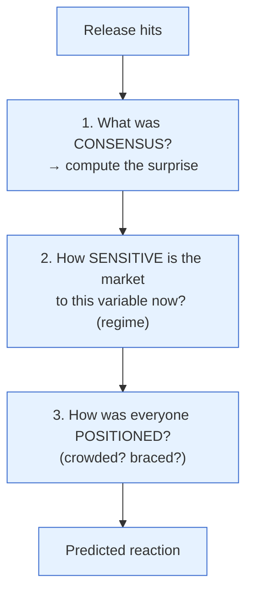

# Day 22 — Reading a Data Release

> **Today's one idea:** To read a data release like the market, you don't ask "is this number good or bad?" — you ask "how does it compare to what was expected, and how were people positioned?" — because price moves on the surprise and the unwind, not the level.
> **Reading time:** ~40 min · **Prereqs:** [Day 3](../../01-foundations/days/day-03-markets-price-the-future.md), [Day 8](../../02-measuring-the-machine/days/day-08-the-growth-pulse.md), [Day 9](../../02-measuring-the-machine/days/day-09-inflation-cpi-wpi.md)
> **Primary source for today:** Bernanke & Kuttner (2005); live MOSPI/RBI release calendars.
> **Before you start:** Recall Day 21 in one sentence, no looking — *name the four macro regimes and the winning asset class in each.*

## The hook (2–4 min)

CPI comes in at 5.2%. Is that good or bad for stocks? You genuinely cannot answer — and neither can any professional — without one more piece of information: *what was expected?* If the consensus was 5.6%, then 5.2% is a *dovish surprise* (inflation lower than feared) and stocks rally. If the consensus was 4.8%, the same 5.2% is a *hawkish surprise* and stocks fall. The identical number produces opposite reactions. This is Day 3 made operational. Today you build the actual checklist a market professional runs the moment a number hits the wire.

## Building the intuition (10–15 min)

Amateurs read the *level*; professionals read the *gap*. When a release hits, the market instantly compares it to the **consensus** (the average of analysts' forecasts) and trades the difference:

```math
\text{Market reaction} \;\approx\; \underbrace{(\text{Actual} - \text{Consensus})}_{\text{the surprise}} \;\times\; \underbrace{\text{sensitivity}}_{\text{how much this variable matters now}}
```

Two factors, both essential (this is Day 3's rule, refined):
1. **The surprise** — actual minus consensus. Direction *and* size.
2. **The sensitivity** — how much the market cares about *this* variable *right now*. In an inflation-obsessed regime (Day 21), a CPI surprise moves everything; when the market is fixated on growth, the same CPI surprise barely registers. Context sets the multiplier.

But there's a third layer that separates good readers from great ones: **positioning**. Prices are moved by people *trading*, and if everyone has already crowded onto one side of a bet (Day 18's herding), the reaction can be counterintuitive:
- **"Good news, sell-off":** if everyone was positioned for a great number and it merely meets expectations, there's no one left to buy — the crowded longs take profits and price *falls* on a "good" print.
- **"Bad news, rally":** if everyone feared a disaster and hedged, a merely-bad number removes the feared tail, and relief buying (short-covering) *lifts* price.
- **"Buy the rumour, sell the fact":** price runs up in anticipation, then falls when the expected good news actually arrives (the surprise is gone).

So the professional's mental model has three questions, in order:



And there's a fourth, subtler read: the **internals**. A headline can match consensus while the *composition* tells a different story — Indian CPI headline in-line but *core* (Day 9) rising; GDP in-line but driven by weak-quality inventory or government spending (Day 7); jobs data in-line but participation collapsing. Pros read past the headline into the components, because that's where the *next* surprise is forming.

## The formal picture (10–15 min)

**The Indian release calendar — what to watch and its typical sensitivity:**

| Release | Source | Frequency | Watches | Typical market sensitivity |
|---|---|---|---|---|
| **CPI inflation** | MOSPI | Monthly | Headline vs. consensus; **core** trend | High (drives RBI, Day 13) |
| **GDP/GVA** | MOSPI/NSO | Quarterly | Headline + C/I/G/NX mix (Day 7) | High but lagged |
| **IIP** | MOSPI | Monthly | Momentum, base effects (Day 8) | Medium |
| **PMI** | S&P Global | Monthly | 50 line, direction | Medium (timely) |
| **GST collections** | GoI | Monthly | YoY trend | Medium |
| **Trade deficit** | Commerce Min. | Monthly | Oil, gold; rupee read (Day 19) | Medium (rupee-focused) |
| **RBI MPC** | RBI | Bi-monthly | Rate + **stance** + guidance | Very high (Day 23) |

**The surprise, made concrete (a worked template):**

```
CPI release
  Consensus: 5.6%   Actual: 5.2%   → surprise = −0.4% (inflation LOWER than expected)
  Regime sensitivity: HIGH (inflation-focused market)
  Positioning: market braced for a hot print, defensively positioned
  → Reaction: dovish surprise → expected RBI rates fall → bonds rally (yields down),
    rate-sensitive equities rally, rupee softens slightly.
  Internals check: was the drop in FOOD (transient, look-through) or CORE (durable)?
    If core fell → stronger, more durable dovish signal.
```

**Where to find "consensus" for India.** Unlike the US (with deep forecast surveys), Indian consensus comes from: economist polls (Reuters/Bloomberg run pre-release surveys), brokerage estimates, and — as a fast proxy — what the *market has already moved* in the days before (Day 3: price embeds expectations). If bonds rallied into a CPI print, the market is *positioned* for a soft number; a soft print then does less than you'd think (priced in), and a hot one hurts more (Day 18's positioning).

**Bernanke & Kuttner's lesson, reapplied.** Their study (Day 3) isolated the *surprise* component of Fed decisions and found *that* is what equities react to — via the risk premium. The same discipline applies to every Indian release: decompose actual into *expected* (already priced) + *surprise* (the mover), and remember the reaction runs mostly through the discount rate (Day 17) and, in crowded markets, through positioning unwinds.

**Good news is bad news — the regime-dependent inversion.** Sometimes strong growth data *hurts* stocks — when the market fears it will force the RBI to hike (an overheating/inflation-focused regime, Day 21). The same strong data *helps* stocks in a growth-starved, disinflationary regime. Whether "good news" is good depends on *which dial the market is watching*. Always ask: is the market currently more afraid of weak growth or of high inflation? That tells you the sign.

## Where it breaks / what it is not (3–5 min)

- **Consensus itself can be wrong or thin.** Indian forecast surveys are shallower than the US's, so "consensus" is noisier — the market's *pre-positioning* is often a better read of expectations than a published poll.
- **First prints get revised.** Indian data (GDP, IIP) is heavily revised. A huge reaction to a first estimate can reverse when revisions land. Weight the surprise by the data's reliability (Day 8).
- **Sensitivity shifts.** The same variable matters enormously in one regime and barely in another. Don't assume last quarter's market obsession is this quarter's. Re-read the regime (Day 21) before predicting the reaction.
- **Positioning is hard to observe.** You rarely *know* how crowded a trade is; you infer it from pre-release price moves, FII flow data, and sentiment. Treat positioning as a hypothesis, not a certainty.

## Try it yourself (5–10 min)

1. **Retrieval first.** Close the page. Write the three questions (in order) a professional asks when a release hits, and explain why the *level* of a number can't predict the market reaction on its own. No looking.

2. **Direct application.** India's GDP prints at 6.8%, exactly matching consensus — yet the Nifty *falls* 1.5% on the day. Give two distinct, coherent explanations (using positioning and internals), and say what *one* thing you'd check in the release to distinguish between them. Write it as advice to a confused colleague.

3. **Stretch.** You're about to trade a CPI release. In the three days *before* it, Indian bonds have rallied hard (yields fell) and rate-sensitive stocks have run up. The print comes in *slightly below* consensus (mildly dovish). Predict the market reaction — and explain why it might be *muted or even negative* despite being "good" news. (This is positioning + Day 3.)

4. **Spaced callback (Day 3, +19).** Restate today's whole framework as a direct application of Day 3's principle. What has today *added* to the bare "price moves on the surprise" idea?

<details>
<summary>Hint</summary>
#2: in-line headline but a crowded long unwinding, or weak internals (bad C/I mix). #3: the good news was already priced in (bonds/stocks ran up = positioned for it), so "sell the fact." #4: Day 3 = surprise; today adds sensitivity (regime) and positioning (the crowd).
</details>

<details>
<summary>Worked solution</summary>

**#2:** (i) **Positioning:** the market was crowded long into a good number; an in-line print gave the longs no *new* reason to buy, so they took profits ("good news, sell-off" — the surprise was zero, and crowded longs unwound). (ii) **Internals:** the 6.8% headline may hide *weak composition* — e.g., driven by government spending (G) or inventories while private investment (I) fell (Day 7), which is a lower-quality, more worrying growth mix than the headline suggests. **What to check:** the **C/I/G/NX breakdown** — if private I is falling under an in-line headline, that's the bearish internal explanation; if the mix is healthy, positioning is the likelier culprit.

**#3:** The reaction is likely **muted or even negative** despite the mildly-good print. In the three days before, bonds and rate-sensitives *rallied* — meaning the market had *already positioned* for a soft CPI (Day 3: the expectation was already in prices, and the pre-move confirms it). A print merely *slightly* below consensus delivers little *fresh* surprise, so there's limited new buying — and crowded longs may "sell the fact" and take profits, pushing price *down* even on good news. To actually rally further, the print would need to be *much* softer than the already-dovish positioning implied. Lesson: a good number into a market already positioned for it is often a sell.

**#4:** Day 3 said: price moves on the *surprise* (actual − expected), not the event. Today adds two refinements: (1) **sensitivity/regime** — the surprise is *multiplied* by how much the market currently cares about that variable (an inflation surprise moves more in an inflation-focused regime), and (2) **positioning** — because prices are moved by people *trading*, a crowded market can react counterintuitively (good news → sell-off; feared-but-mild bad news → relief rally). So the full rule is: reaction ≈ surprise × sensitivity, *modulated by* how the crowd was positioned — with a check on the *internals* for where the next surprise is brewing.
</details>

> **Transfer — apply it:** Pick the next scheduled Indian release (CPI, GDP, or the MPC — check the MOSPI/RBI calendar). *Before* it, write down the consensus, the current regime sensitivity, and your guess at positioning (did the market pre-move?). After the release, compare your predicted reaction to what happened. State it as input (the surprise) → today's idea (× sensitivity, modulated by positioning) → output (the move). Doing this even three times will rewire how you watch data days.

## Connect it back

You can now read any scheduled data release the way the market does — surprise, sensitivity, positioning, internals. But the single most important "release" in macro isn't a data print — it's the central bank *talking*. Tomorrow: reading the RBI's statement, stance, and minutes (with the Fed as overlay), where the "number" is often unchanged and the entire market moves on *words* — the purest test of everything you've learned.

**The sharp question you can now answer:** Why can the same CPI number of 5.2% send stocks up one month and down the next?

## Suggested readings for today

**Required if you have 15 extra minutes:** Bernanke & Kuttner (2005), **the sections on decomposing the surprise** — the rigorous version of "trade the gap, not the level," and the finding that the reaction runs through the risk premium.

**If you want the deep version:**
- MOSPI and RBI **release calendars** (mospi.gov.in, rbi.org.in) — bookmark them; knowing *when* data lands is half of reading it.
- Trading Economics — India (tradingeconomics.com/india) — a quick source for actual-vs-consensus on Indian releases, so you can practise computing surprises live.

---

## Navigation

← **Previous:** [Day 21 — The Four Regimes](../../04-macro-to-assets/days/day-21-four-regimes.md)  
→ **Next:** [Day 23 — Reading the RBI (and the Fed)](day-23-reading-the-rbi.md)
