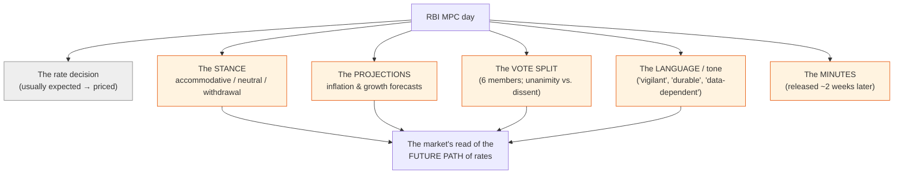
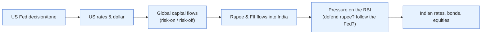

# Day 23 — Reading the RBI (and the Fed)

> **Today's one idea:** On a policy day the rate decision is usually the *least* important thing — what moves markets is the change in the RBI's **stance, projections, and language**, because those reveal the future *path* of policy, and the market trades the path, not the point.
> **Reading time:** ~40 min · **Prereqs:** [Day 13](../../03-policy-moves-markets/days/day-13-rbi-reaction-function.md), [Day 22](day-22-reading-a-data-release.md)
> **Primary source for today:** RBI MPC Resolutions, Minutes & Governor's Statements (rbi.org.in).
> **Before you start:** Recall Day 22 in one sentence, no looking — *what three questions does a professional ask the instant a data release hits the wire?*

## The hook (2–4 min)

The RBI keeps the repo rate unchanged — exactly as all 40 economists predicted. "No news," you'd think. Yet the moment the Governor finishes speaking, the 10-year yield jumps 12 basis points, bank stocks tumble, and the rupee wobbles. What happened? The *rate* didn't change, but the *stance* shifted from "accommodative" to "neutral," the inflation projection was revised up, and the Governor dropped a phrase about "remaining vigilant." The market didn't trade the decision — it traded the *change in the expected path*. Learning to read a central bank's *words* is the highest-leverage skill in macro, because central banks are the biggest single mover of the discount rate (Day 17).

## Building the intuition (10–15 min)

By now you know the decision itself is usually *expected* and therefore *priced* (Day 3, Day 22). So where's the surprise on policy day? In everything *around* the number — the parts that tell you where policy is *heading*:



The four things that actually move markets:

1. **The stance.** India's MPC signals direction with a formal stance: **"accommodative"** (bias to cut / support growth), **"neutral"** (could go either way), or **"withdrawal of accommodation"** (bias to tighten). A *change* in stance is often the biggest signal of the day — it re-anchors the market's whole expected path. Watch for the stance shifting even when the rate holds.
2. **The projections.** The MPC publishes its own CPI-inflation and growth forecasts. If it *revises inflation up*, it's signalling a more hawkish future — even without moving today. The market re-prices the reaction function (Day 13) around the new forecast.
3. **The vote split.** Six members vote. A unanimous hold is different from a 4–2 hold with two members wanting a hike — the split reveals how close the *next* move is. Dissents are leading indicators of turns.
4. **The language.** Central banks choose words with surgical care. "Data-dependent," "durable disinflation," "remain vigilant," "withdrawal of accommodation" — each is a coded signal about the path. Markets parse tone shifts obsessively; a single changed adjective can move yields. And the **Minutes** (released ~two weeks later) give the detailed reasoning of each member — a second, slower market-moving event.

The core skill: **compare this meeting to the last one and isolate what *changed*.** Did the stance shift? Did projections move? Did the tone harden or soften? Did the vote split widen? The *delta* is the news (Day 22's "surprise," applied to words). A meeting that changes nothing — same rate, same stance, same forecasts, same tone — is a genuine non-event, however dramatic the build-up.

## The formal picture (10–15 min)

**Forward guidance — why words are a policy tool.** Because the *expected path* of rates sets long yields (Day 11) and the discount rate (Day 17), a central bank can move financial conditions *without moving the rate at all*, simply by changing what the market expects. This is **forward guidance**, and it's often more powerful than the rate itself. When the RBI says "we expect to hold for an extended period," it's flattening the expected path — easing conditions today via the expectations channel (Day 14). Words *are* policy.

**The professional's policy-day checklist:**

```
1. Rate decision vs. consensus?           → usually priced; note any surprise
2. STANCE — changed from last time?       → biggest directional signal
3. PROJECTIONS — inflation/growth revised? → re-prices the reaction function (Day 13)
4. VOTE — unanimous or dissents?          → how close is the next move
5. LANGUAGE — tone harder/softer? new phrases/dropped phrases?
6. Governor's presser — Q&A tone, hedges
7. Two weeks later: MINUTES — member reasoning (second event)
→ Net read: did the expected PATH shift up (hawkish) or down (dovish)?
```

Then translate the path shift to assets exactly as in the Day 15 drill:
- **Hawkish surprise** (path shifts up): bonds down (yields up), rate-sensitive/growth equities down, rupee up (modestly, higher carry).
- **Dovish surprise** (path shifts down): bonds up, equities up, rupee softer.

**The Fed overlay — why an Indian investor watches Washington.** The US Federal Reserve is, in effect, the world's central bank, and it reaches India through the rupee and flows (Day 19):



A hawkish Fed can *force* the RBI's hand (Day 19: defend the rupee, protect the rate differential) even when Indian data alone wouldn't warrant it. So you read *two* central banks: the RBI for domestic policy, and the Fed for the global tide that constrains the RBI. The Fed's equivalents to watch: the FOMC statement, the **"dot plot"** (members' rate projections), Chair's press conference, and the minutes. The *grammar* is the same — decision usually priced, the *path* is the news.

**Reading the presser and Q&A.** The Governor's press conference (and the Fed Chair's) is where unscripted signals leak — how a question about growth is hedged, whether inflation confidence is firm or tentative. Markets often move *more* on the presser than the written statement, because that's where the tone is unguarded. Watch what they *decline* to rule out.

## Where it breaks / what it is not (3–5 min)

- **Central banks are deliberately ambiguous.** "Data-dependent" is partly a way to *avoid* committing. Don't over-read every word; distinguish genuine signal (a stance change, a projection revision) from boilerplate hedging.
- **Guidance can be wrong — and reversed.** A central bank's projected path is a forecast, not a promise; it changes when data changes. Don't treat a dot plot or stance as a guarantee. (Central banks have whipsawed markets by reversing guidance.)
- **The market can misread it, then re-read it.** The initial knee-jerk on the statement often reverses during the presser or after the minutes, as the market digests nuance. The first five-minute move is not always the right one.
- **Global can override domestic.** A perfectly dovish RBI can be swamped by a hawkish Fed hitting the rupee. Reading the RBI in isolation, ignoring the Fed overlay, will get you blindsided (Day 19).

## Try it yourself (5–10 min)

1. **Retrieval first.** Close the page. List the things *other than the rate* that move markets on RBI day, and explain why the rate itself is usually a non-event. Then explain what "forward guidance" is and why words can move markets without any rate change. No looking.

2. **Direct application.** The RBI holds the repo rate (as expected) but changes its stance from "withdrawal of accommodation" to "neutral" and revises its inflation forecast *down*. Two members who previously voted to hike now vote to hold. Write the read: is this hawkish or dovish, what happens to bonds/rate-sensitive equities/the rupee, and why — walking a colleague through the *path* logic.

3. **Stretch.** The RBI is dovish (cutting, soft tone), but the same week the US Fed turns aggressively hawkish and US yields spike. The rupee starts falling. Predict the tension the RBI now faces and what it may be *forced* to do despite its dovish domestic stance — and what an Indian equity investor should watch. (Combine Day 19 + today.)

4. **Spaced callback (Day 13, +10).** On Day 13 you learned the RBI's reaction function. Explain how reading the *projections* on policy day lets you *update* your estimate of the reaction function in real time — and why a revised inflation forecast is more informative than the rate decision itself.

<details>
<summary>Hint</summary>
#2: dovish — stance softened, inflation forecast cut, hawks capitulated → path shifts down → bonds up, equities up, rupee softer. #3: dovish RBI + hawkish Fed = rupee pressure; RBI may have to pause/defend despite wanting to cut. #4: the projections reveal the RBI's own view of the inflation/growth gaps that drive its rule.
</details>

<details>
<summary>Worked solution</summary>

**#2:** This is **clearly dovish**, despite no rate change. Three signals all shifted the expected path *down*: the stance softened (withdrawal → neutral = tightening bias removed), the inflation forecast was cut (less pressure to hike, Day 13), and two former hawks capitulated to hold (the next move is now less likely to be a hike). **Reaction:** bonds **rally** (yields fall as the expected path drops), rate-sensitive and growth **equities rise** (lower expected discount rate, Day 17), the **rupee softens** modestly (lower expected carry). The *rate* did nothing; the *path* moved down, and the market trades the path.

**#3:** The RBI faces the Day 19 tension: it *wants* to cut (dovish domestic view), but a hawkish Fed is widening the US–India rate gap and driving the rupee down via outflows. If it cuts anyway, it risks accelerating the rupee's fall (and imported inflation). So the RBI may be **forced to pause or even signal caution** — subordinating its domestic dovishness to currency defence and the rate differential. **What to watch:** the rupee level and RBI forex-reserve usage (is it intervening?), FII flow data, and whether the RBI's *language* starts acknowledging "global spillovers" — the tell that the Fed is overriding its domestic stance. An equity investor should expect the dovish domestic story to be *capped* by the global tide.

**#4:** The RBI's reaction function (Day 13) maps inflation and growth gaps to the rate. On policy day, the **projections** *are* the RBI telling you its own current estimate of those gaps — so a revised inflation forecast directly updates the inputs to its rule, letting you recompute where rates are headed. That's more informative than the rate decision (which is usually already priced) because it reveals the RBI's *forward* view: an upward inflation revision means the reaction function now points to higher future rates, regardless of today's hold. You're updating the function's inputs live.
</details>

> **Transfer — apply it:** Pull up the two most recent RBI MPC resolutions side by side (rbi.org.in) and find the three deltas: did the *stance* change, did the *projections* move, did the *vote* shift? State it as input (the two statements) → today's idea (isolate what changed = the signal) → output (did the expected path move up or down, and what that means for bonds/equities/rupee). Then do the same for the two latest FOMC statements. This side-by-side habit is exactly the capstone's core task.

## Connect it back

You can now read the highest-leverage macro event there is — a central bank talking — by isolating the change in the path, not the point, and by watching the Fed overlay that constrains the RBI. You've now assembled every skill the course promised. Tomorrow is the second and final drill — **Drill II** — where mechanism meets narrative in eight adversarial scenarios designed to make the lazy story cost you money. It's the hardest test of everything, right before you consolidate and build your own thesis.

**The sharp question you can now answer:** How can the RBI move the entire bond market on a day it doesn't change the rate at all?

## Suggested readings for today

**Required if you have 15 extra minutes:** RBI, the latest **MPC Resolution and the Governor's Statement** (rbi.org.in) — read one in full, then skim the *previous* one and list what changed. The delta-reading is the whole skill.

**If you want the deep version:**
- RBI **MPC Minutes** (released ~2 weeks after each meeting) — read one member's remarks to see how individual reasoning maps to the vote and the reaction function.
- A recent **FOMC statement + dot plot** (federalreserve.gov) — compare the Fed's guidance apparatus to the RBI's; the grammar is the same, which is the point of the overlay.
- Ben Bernanke, "The Federal Reserve and the Financial Crisis" (2012 lectures) — how a central banker thinks about communication as a policy tool.

---

## Navigation

← **Previous:** [Day 22 — Reading a Data Release](day-22-reading-a-data-release.md)  
→ **Next:** [Day 24 — Drill II: Mechanism vs. Narrative](day-24-drill-mechanism-vs-narrative.md)
