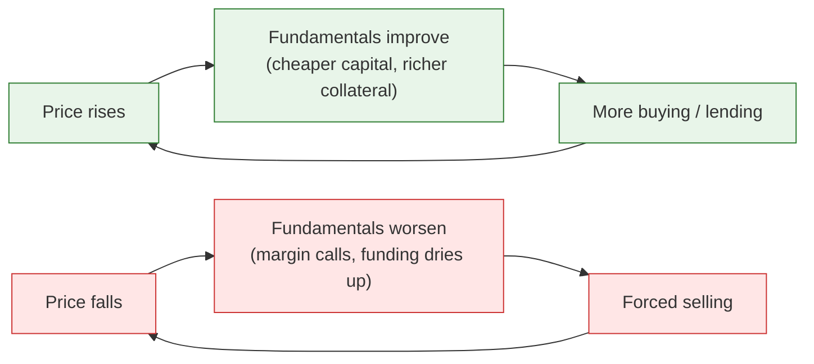
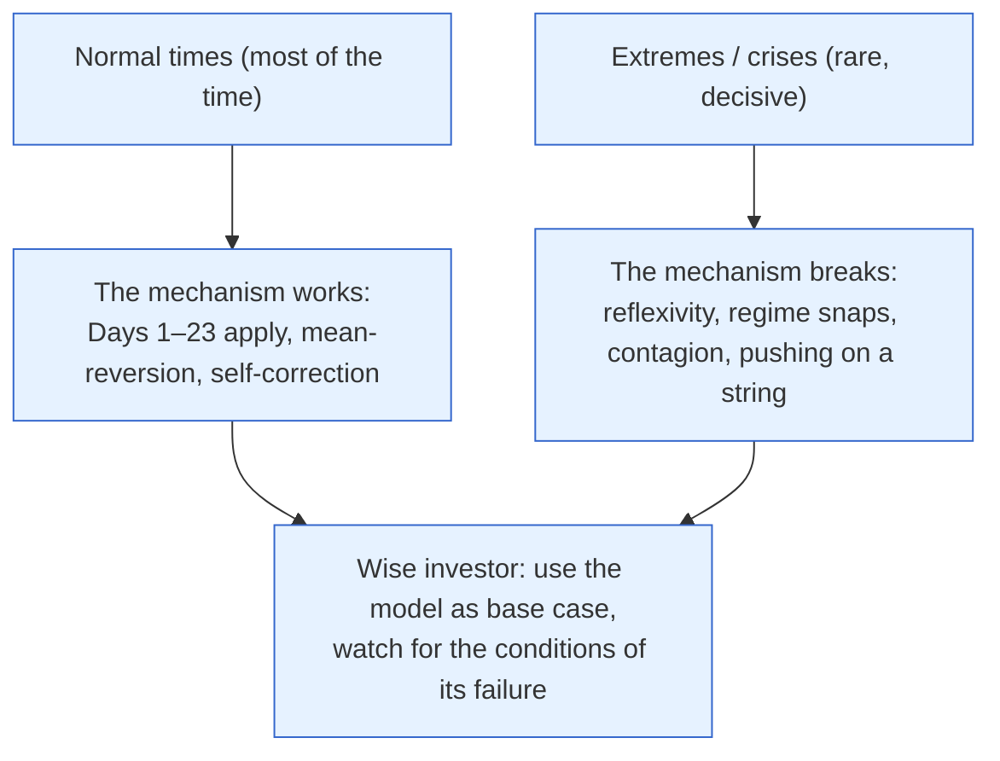

# Day 25 — When the Model Breaks

> **Today's one idea:** The tidy mechanism you've learned assumes a stable, self-correcting economy — but sometimes markets become *reflexive* (prices change the fundamentals that drive prices), regimes shift abruptly, and narratives take on a life of their own, so the wise investor holds the model *and* its limits at once.
> **Reading time:** ~40 min · **Prereqs:** [Day 14](../../03-policy-moves-markets/days/day-14-monetary-transmission.md), [Day 18](../../04-macro-to-assets/days/day-18-behavioral-engine.md), [Day 21](../../04-macro-to-assets/days/day-21-four-regimes.md)
> **Primary source for today:** George Cooper, *The Origin of Financial Crises* (2008).
> **Before you start:** Recall Day 24 — *what is the single unifying flaw in every lazy market narrative?*

## The hook (2–4 min)

Everything you've learned assumes the economy behaves like a thermostat: push it too hot, forces (and the RBI) push back and it self-corrects. Most of the time, that's right. But every so often the thermostat breaks and the economy behaves like a *microphone next to its own speaker* — a screech that feeds on itself. Rising prices attract buyers whose buying raises prices further; falling prices force selling that pushes prices lower still. In these moments — 2008, 2013's taper tantrum, 2018's IL&FS, 2020's COVID crash — the clean mechanism doesn't just mislead, it inverts. Today isn't about abandoning the model. It's about knowing the conditions under which it breaks, so you're humble exactly when overconfidence is most expensive.

## Building the intuition (10–15 min)

The standard model (Days 1–23) has a hidden assumption: **equilibrium**. Push the system and it returns toward balance — supply meets demand, arbitrage corrects mispricings, the RBI leans against the cycle. This is usually true. But it fails in three specific ways an investor must recognise:

**1. Reflexivity (the feedback loop).** George Soros's and George Cooper's core idea: in financial markets, prices don't just *reflect* fundamentals — they *change* them. Examples:
- A rising stock price lets a company raise cheap capital, which improves its actual business, which justifies a higher price — a virtuous loop *upward* (until it isn't).
- A falling currency triggers FII outflows (Day 19), which weaken the currency further, which triggers more outflows — a vicious loop *downward*.
- Rising collateral values let banks lend more, which pushes asset prices up, which raises collateral values (Day 14's credit channel in reverse gear during busts).

In a reflexive loop, the "fundamentals" your discount-rate lens (Day 17) treats as *inputs* are themselves being moved by *price* — so the model's arrows point both ways, and the system can run far from equilibrium in either direction. This is the mechanism behind bubbles and crashes, not the calm mean-reversion of Day 18.

**2. Regime shifts and non-linearity.** The economy can sit stable for years, then *snap* to a new state — the four regimes (Day 21) don't glide, they can jump. A slow build-up of leverage (Minsky's "stability breeds instability": calm makes everyone borrow more, which makes the system fragile) ends in a sudden crack. The relationships you calibrated in the calm regime (correlations, sensitivities) *break* in the new one — famously, "all correlations go to 1 in a crisis" (everything falls together, so diversification fails exactly when you need it, Day 21's stagflation/panic boxes).

**3. Narrative and contagion.** Robert Shiller's *Narrative Economics*: stories go viral and *become* economic forces. "Housing never falls," "this time is different," "India is the next China" — a narrative can drive spending, lending, and prices independent of fundamentals, until it flips. Fear and greed (Day 18) scale from individuals to a self-fulfilling collective mood. Panics spread by contagion — one default (IL&FS) makes everyone doubt *every* similar borrower, freezing the whole sector regardless of individual health.

## The formal picture (10–15 min)

**Where monetary policy breaks — "pushing on a string" (Day 14 revisited).** In a deep balance-sheet recession (Richard Koo's term), households and firms are so indebted they want to *pay down debt*, not borrow, no matter how low rates go. The interest-rate and credit channels jam; rate cuts do nothing. The model's central lever stops working — which is why fiscal policy (Day 16) must take over in these episodes, and why "the RBI cut, so buy" (Day 24, Rep 1) is dangerous in a crisis.

**The Indian breakage case-studies (your reference set):**

| Episode | What broke the model | The reflexive/regime element |
|---|---|---|
| **Taper Tantrum 2013** | Fed hint → sudden EM outflows | Rupee fall → FII exit → bigger rupee fall (Day 19 loop); India in the "Fragile Five" |
| **Demonetization 2016** | Overnight policy shock removed 86% of cash | A *discrete* shock no smooth model predicted; informal-economy cash loop (Day 1) seized |
| **IL&FS / NBFC 2018** | One default → sector-wide credit freeze | Contagion: doubt about one lender froze *all* NBFC funding (Day 20); credit channel jammed |
| **COVID 2020** | Simultaneous supply + demand + confidence collapse | All correlations → 1; emergency cuts *coincided* with crashes (Day 24, Rep 1) |

Each shows the same lesson: at the extremes, the *linear* mechanism (shock → proportional, self-correcting response) gives way to *non-linear*, self-reinforcing dynamics. The transmission you learned still operates — but amplified, jammed, or reversed by feedback.

**The honest synthesis — hold both (this is the whole point of the day):**

**The warning signs the model is about to break** (your checklist for humility):
- **Leverage building** in the calm — debt rising faster than income (Minsky). The IL&FS setup.
- **Spreads historically tight / volatility historically low** — complacency pricing no risk (Day 20). The calm before.
- **A dominant, unquestioned narrative** ("X can only go up"). Day 18's extrapolation gone collective.
- **Reflexive linkages** — where a price move would *force* more of the same (currency + outflows, leverage + collateral). Map these *before* the stress.
- **Correlations rising** — diversifying assets starting to move together (the regime is shifting under you).

The practical stance isn't "the model is useless." It's: **use the mechanism as your base case, size your positions so a regime break doesn't ruin you, and raise your alertness precisely when everyone is calmest.** Overconfidence in the model is itself one of the conditions that builds the fragility.

## Where it breaks / what it is not (3–5 min)

- **This is not a licence to cry "crisis" constantly.** Reflexive breaks are *rare*; most of the time the mechanism works and permabears lose money waiting for the apocalypse (Day 18: markets can stay rational longer than you can stay solvent betting on chaos). Respect the model as the base case.
- **"It's different this time" is usually wrong — but not always.** The phrase is a classic bubble marker, yet regimes *do* genuinely shift. The skill is distinguishing a real structural change from a narrative-driven mania — hard, and where humility matters most.
- **You can't predict the timing of a break.** You can identify *fragility* (leverage, complacency, reflexive links) but not *when* it snaps. Position for resilience, not prediction.
- **Not every crisis invalidates the model — most confirm it later.** After the break, the mechanism reasserts (the RBI cuts, fiscal responds, spreads normalise, mean-reversion resumes). The break is a *phase*, not a permanent new physics.

## Try it yourself (5–10 min)

1. **Retrieval first.** Close the page. Define reflexivity and give one example of an upward and one of a downward reflexive loop. Then list three warning signs that the standard model is becoming fragile. No looking.

2. **Direct application.** The rupee starts falling sharply during a global risk-off event. Explain the *reflexive loop* that could turn an orderly decline into a spiral, identify where the RBI can intervene to break it (Day 19), and say why the normal "higher rates → stronger currency" logic (Day 24, Rep 3) might not save it. Write it as a briefing to a colleague.

3. **Stretch.** Indian markets are calm: volatility is at multi-year lows, credit spreads are historically tight, SIP inflows are record-high, and the dominant narrative is "India is a structural multi-decade buy." A colleague says "everything's great, maximise risk." Using today's warning signs, construct the *contrarian caution* — what specifically worries you, why *calm itself* is a risk factor (Minsky), and how you'd position *without* becoming a permabear.

4. **Spaced callback (Day 14).** On Day 14 you learned monetary transmission has channels. Explain how, in a balance-sheet recession, those channels *break* — and why this means "the RBI will cut and fix it" can fail, requiring the *other* lever (Day 16).

Hint

#2: rupee down → FII losses in USD → more selling → rupee down further; RBI sells reserves / hikes to break the loop; relative rates may not help in a global stampede. #3: calm breeds leverage and complacency (Minsky); tight spreads = no cushion; position for resilience (size, quality) not prediction. #4: over-indebted borrowers won't borrow at any rate → interest/credit channels jam → fiscal must act.

Worked solution

**#2:** **The reflexive loop:** the rupee falls → foreign investors' Indian holdings lose value *in dollar terms* → they sell Indian assets to cut losses → that selling requires converting rupees to dollars → *more* rupee weakness → more FII losses → more selling. An orderly decline becomes a self-feeding spiral (Day 19). **Where the RBI breaks it:** sell dollars from forex reserves to meet the demand and steady the rate, and/or tighten liquidity/hike to defend the differential and stem outflows — buying time for the panic to pass. **Why "higher rates → stronger rupee" may not save it:** in a *global* risk-off stampede, capital flees *all* EMs for the safe-haven dollar regardless of India's rates (the sign-flip, Day 24 Rep 3); a rate hike may be swamped by the flight, and can even hurt by signalling stress. The RBI relies more on reserves and calming the *loop* than on the textbook rate lever.

**#3:** **The contrarian caution:** every warning sign is flashing. **Low volatility + tight spreads** = the market is pricing almost no risk, so there's no cushion and lots of room to widen (Day 20). **Record leverage/inflows + an unquestioned narrative** ("structural multi-decade buy") is Day 18 extrapolation gone collective — and Minsky's point is that *this very calm breeds the leverage that creates fragility*: stability makes everyone comfortable borrowing and taking risk, which builds the instability. So "calm" is not safety; it's often the *setup*. **How to position without being a permabear:** don't sell everything or predict a crash (you can't time it) — instead, *reduce* leverage, tilt toward *quality and resilience*, keep some dry powder/cash, and size positions so a regime break can't ruin you. Stay invested (the base case is the model working) but *survivable* (in case it breaks). Resilience, not prediction.

**#4:** In a balance-sheet recession, households and firms are so over-indebted that their priority is *paying down debt*, not borrowing — so even as the RBI cuts rates to zero, no one wants new loans and banks won't lend to the stressed (Day 14's interest-rate and credit channels both jam — "pushing on a string"). The central lever stops transmitting. Because monetary policy can't force people to borrow, the *fiscal* lever (Day 16) must step in — the government spends *directly* into the economy, bypassing the broken credit channel, to fill the demand hole. This is why "the RBI will cut and fix it" fails in a deep crisis, and why the two levers exist (Day 5).

> **Transfer — apply it:** Look at the current Indian market: check volatility (India VIX), credit spreads, and the dominant narrative you're hearing. State it as input (these fragility gauges) → today's idea (are the conditions for a model-break building?) → output (should you be dialling risk up or building resilience?). You don't need to predict a crash — just to know whether you're in the calm that breeds fragility, and size accordingly.

## Connect it back

You now hold the model *and* its limits — the mark of a mature macro investor, not a mechanical one. This is the humility that separates "rate cuts are bullish" from a real thesis. Tomorrow is your final consolidation — **Rest & Synthesize II** — where you'll reconstruct the *entire* course from memory before the capstone puts it all to work on live data.

**The sharp question you can now answer:** Why does diversification tend to fail in exactly the crises when you most need it?

## Suggested readings for today

**Required if you have 15 extra minutes:** George Cooper, *The Origin of Financial Crises* (2008), **the chapters on instability and the credit cycle** — a short, sharp case that markets are inherently unstable, against the equilibrium default.

**If you want the deep version:**
- Robert Shiller, *Narrative Economics* (2019) — how viral stories become economic forces.
- George Soros, *The Alchemy of Finance* (1987) — reflexivity from the trader who built a career on it.
- Richard Koo, *The Escape from Balance Sheet Recession and the QE Trap* (2014) — why monetary policy fails after a credit bust.
- D. Subbarao, *Who Moved My Interest Rate?* (2016) — the 2008 crisis and 2013 taper tantrum from inside the RBI.

---

## Navigation

← **Previous:** [Day 24 — Drill II: Mechanism vs. Narrative](day-24-drill-mechanism-vs-narrative.md)  
→ **Next:** [Day 26 — Rest & Synthesize II](day-26-rest-and-synthesize-2.md)
