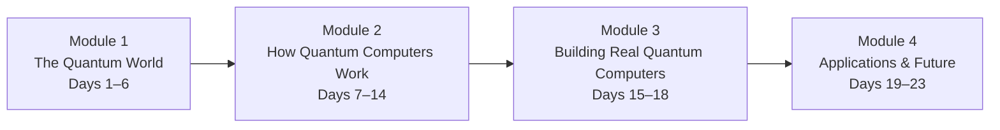

# Learning Path

A complete day-by-day map of the course with the rationale behind each sequencing decision.

---

## The Four Modules

---

## Full Day-by-Day Table

| Day | Title | Load-Bearing Idea | Why It Comes Now | Prereqs |
|-----|-------|-------------------|-----------------|---------|
| 1 | [Why Quantum at All?](modules/01-quantum-world/days/day-01-why-quantum.md) | Classical computers have a fundamental ceiling that physics itself imposes | Sets the *problem* before we meet the solution; motivation without which the weirdness of Days 2–5 feels pointless | — |
| 2 | [The Strangeness of the Quantum World](modules/01-quantum-world/days/day-02-quantum-strangeness.md) | At tiny scales, nature violates everyday intuition — and this is not a measurement artifact, it's fundamental | Earns the right to say "quantum is weird" by showing *why* with the double-slit experiment; establishes the mindset needed for Days 3–5 | Day 1 |
| 3 | [Superposition — Both and Neither](modules/01-quantum-world/days/day-03-superposition.md) | A qubit isn't a fuzzy bit; it's a physical system in a genuine blend of states with amplitudes that can interfere | First of the three core primitives; everything else builds on this | Day 2 |
| 4 | [Entanglement — Correlated by Nature](modules/01-quantum-world/days/day-04-entanglement.md) | Two entangled qubits share a fate that can't be explained by any pre-agreed local information | Second core primitive; its strangeness only makes sense after superposition (Day 3) | Day 3 |
| 5 | [Interference — How Quantum Computers "Aim"](modules/01-quantum-world/days/day-05-interference.md) | Quantum algorithms work by amplifying right answers and cancelling wrong ones via wave mechanics | Third and final core primitive; completes the triad that powers all quantum algorithms | Days 3, 4 |
| 6 | [Rest & Synthesize I](modules/01-quantum-world/days/day-06-rest-synthesize-1.md) | Consolidate the three pillars: can you explain each without notes? | First checkpoint before any formalism is introduced; tests whether the intuition is actually solid | Days 1–5 |
| 7 | [Qubits in the Real World](modules/02-quantum-computers/days/day-07-qubits-real-world.md) | A qubit is a physical object — a photon, electron spin, or superconducting loop — with specific hardware tradeoffs | Grounds the abstract qubit in physical reality before we use it in circuits | Day 3 |
| 8 | [Quantum Gates — Operations on Qubits](modules/02-quantum-computers/days/day-08-quantum-gates.md) | Quantum gates are reversible transformations that rotate a qubit's state on the Bloch sphere | The building block of all quantum circuits; must come before circuits (Day 9) | Days 5, 7 |
| 9 | [Quantum Circuits — Wiring Gates Together](modules/02-quantum-computers/days/day-09-quantum-circuits.md) | A quantum circuit is a recipe: a sequence of gates applied to qubits before measurement | The grammar of quantum algorithms; prepares for the specific algorithms in Days 11–13 | Day 8 |
| 10 | [Measurement — The Act of Looking](modules/02-quantum-computers/days/day-10-measurement.md) | Measurement collapses superposition into a definite outcome, probabilistically, destroying the superposition | Completes the circuit model; explains why quantum information is precious and non-clonable | Days 3, 9 |
| 11 | [Deutsch's Problem — The First Quantum Speedup](modules/02-quantum-computers/days/day-11-deutsch-problem.md) | One quantum query can answer a question that takes two classical queries — the simplest real quantum speedup | First concrete algorithm; uses all of Days 8–10; demonstrates interference doing real computational work | Days 9, 10 |
| 12 | [Grover's Algorithm — Quantum Search](modules/02-quantum-computers/days/day-12-grovers-algorithm.md) | Searching an unsorted list of N items takes √N quantum steps vs. N classical steps | Generalizes Day 11's insight to a practically meaningful problem; introduces quadratic speedup | Day 11 |
| 13 | [Shor's Algorithm — Why Cryptographers Worry](modules/02-quantum-computers/days/day-13-shors-algorithm.md) | Quantum computers can factor large numbers exponentially faster than any known classical method | The most consequential quantum algorithm; also introduces the concept of exponential vs. quadratic speedup | Day 12 |
| 14 | [Rest & Synthesize II](modules/02-quantum-computers/days/day-14-rest-synthesize-2.md) | Consolidate: what kinds of problems get quantum speedups, and why can't quantum computers speed up everything? | Mid-course checkpoint before shifting from software to hardware; tests whether the algorithm arc is integrated | Days 7–13 |
| 15 | [Decoherence — The Enemy of Quantum](modules/03-building-quantum/days/day-15-decoherence.md) | Interaction with the environment destroys superposition; this is the central engineering challenge | Transitions from "what quantum computers can do" to "why they're so hard to build" | Days 3, 7 |
| 16 | [Quantum Error Correction — Fighting Back](modules/03-building-quantum/days/day-16-error-correction.md) | Quantum errors can be detected and corrected without collapsing the state — but at enormous qubit overhead | Proposed solution to decoherence; explains why current hardware is far from fault-tolerant | Day 15 |
| 17 | [The Hardware Landscape](modules/03-building-quantum/days/day-17-hardware-landscape.md) | Each quantum hardware platform (superconducting, trapped ion, photonic) makes different tradeoffs | Grounds the engineering choices in concrete technologies; necessary context for evaluating company claims | Days 7, 15 |
| 18 | [Quantum Advantage vs. Quantum Supremacy](modules/03-building-quantum/days/day-18-advantage-vs-supremacy.md) | "Supremacy" is a narrow milestone; practical advantage on useful problems is a separate and harder goal | Gives precise vocabulary for evaluating news claims; separates hype from legitimate progress | Days 12–13, 17 |
| 19 | [Quantum Cryptography — Unhackable by Physics](modules/04-applications-future/days/day-19-quantum-cryptography.md) | QKD uses quantum mechanics to detect eavesdropping — its security is a law of physics, not a computational assumption | First application; contrasts quantum cryptography (near-term, real) with Shor's threat (long-term, real) | Days 4, 10 |
| 20 | [Quantum Simulation — The Original Killer App](modules/04-applications-future/days/day-20-quantum-simulation.md) | Quantum computers can simulate molecules and materials that classical computers fundamentally cannot | Feynman's original motivation; explains why pharma, materials, and chemistry are the leading application domains | Days 5, 9 |
| 21 | [Quantum Machine Learning — Hype vs. Reality](modules/04-applications-future/days/day-21-quantum-ml.md) | QML claims require scrutiny: quantum speedups for ML are narrower and more conditional than headlines suggest | Teaches calibrated skepticism; a good test of whether the reader can apply Days 12–13's speedup intuition | Days 12, 13, 18 |
| 22 | [The Road Ahead — Timelines, NISQ, Fault Tolerance](modules/04-applications-future/days/day-22-road-ahead.md) | We are in the NISQ era: noisy, intermediate-scale quantum devices that are real but not yet transformative | Synthesizes everything into a coherent present-day picture and a map of milestones to watch | Days 15–21 |
| 23 | [Capstone — Explain, Evaluate, Anticipate](modules/04-applications-future/days/day-23-capstone.md) | Three writing challenges that force integration of every concept in the course | Forces active retrieval rather than passive recognition; the only honest test of L1 competence | All |

---

## The Learning Arc Narrative

On Day 1, the reader confronts a genuine puzzle: why can't we just build a faster classical computer? The answer — that some problems are exponentially hard by physics, not by engineering shortfalls — sets up the entire course. Days 2–5 introduce the three strange phenomena that make quantum computing possible: superposition (a system can be in multiple states at once), entanglement (two systems can share a correlated state no classical model can explain), and interference (the ability to engineer probabilities so that right answers are amplified and wrong answers are cancelled). Day 6 is a checkpoint — the reader who can explain all three in plain language to an imaginary friend is ready to proceed.

The middle arc (Days 7–14) shows how these phenomena are *used*. Quantum gates and circuits give the mechanics; Deutsch's algorithm, Grover's search, and Shor's factoring give three landmark examples of what those mechanics can achieve. The hardware arc (Days 15–18) then asks the hard question: if quantum computers are so powerful, why don't we have them yet? Decoherence, error correction, and the NISQ reality answer that question with precision. The final arc (Days 19–23) is about the world: which applications are real now, which are plausible soon, and which are oversold — and how to tell the difference. The capstone is not a test of memorization; it is a test of whether the reader can *think* with the concepts they've built.
