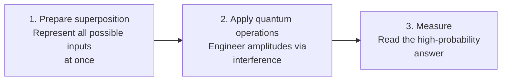

# Day 5 — Interference — How Quantum Computers "Aim"

> **Today's one idea:** Quantum algorithms work by engineering interference — amplifying the probability of correct answers and cancelling the probability of wrong ones — and this is where the actual computational intelligence happens.
> **Reading time:** ~40 min · **Prereqs:** Days 3, 4
> **Primary source for today:** Rieffel & Polak, *Quantum Computing: A Gentle Introduction*, Chapter 1, Sections 1.3–1.5 (MIT Press, 2011)

---

## The hook

You're wearing noise-canceling headphones on a flight. The engine produces a steady roar at, say, 250 Hz. The headphone's microphone picks up that sound wave, and the speaker generates an *exact copy — but upside down*: same frequency, same amplitude, opposite phase.

The two waves — engine noise and generated anti-noise — meet in your ear canal. Because one is the mirror image of the other, their amplitudes cancel out. The result: silence.

This is destructive interference. Waves can cancel each other. They can also reinforce each other (constructive interference) — add two identical waves in phase and you get a wave twice as tall.

Now here's the quantum computing punch line: **this is exactly how quantum algorithms work**, but with probability amplitudes instead of sound waves.

A quantum algorithm engineers the amplitudes of all possible answers so that wrong answers cancel each other out (destructive interference) and the right answer reinforces (constructive interference). When you measure at the end, the right answer has overwhelming probability — not because you "tried everything," but because you deliberately orchestrated the wave math.

Superposition lets you represent all possible answers at once. Entanglement links qubits. But *interference* is how you aim.

---

## Building the intuition

### Superposition alone doesn't compute

On Day 3, you learned that a qubit can be in superposition — representing both 0 and 1 simultaneously. With 10 qubits in superposition, you're representing 2^10 = 1024 states at once.

A naive hope: put all possible inputs into superposition, run the computation, and read off the answer.

The problem: measurement collapses the superposition to *one random answer*. If the superposition is uniform (equal amplitudes), measuring it gives a random output — no better than guessing. You've learned nothing.

Superposition is necessary but not sufficient. You need to manipulate the amplitudes *before measuring* so that the right answer has high amplitude and wrong answers have low amplitude. That manipulation is interference.

### The wave picture

Remember from Day 2: quantum states are described by wave functions. Amplitudes behave like waves — they have magnitude *and* sign (or more generally, a phase).

Two amplitudes can:
- **Add up** (constructive interference): both positive → larger amplitude → higher probability
- **Cancel out** (destructive interference): one positive, one negative → smaller amplitude → lower probability

```
Constructive interference:
     + 0.5    +    + 0.5    =    + 1.0
     ↑                           ↑
  amplitude A     amplitude B   combined (probability = 1.0² = 100%)

Destructive interference:
     + 0.5    +    - 0.5    =    0.0
     ↑                           ↑
  amplitude A     amplitude B   combined (probability = 0² = 0%)
```

A quantum algorithm is designed so that the computational paths leading to *wrong* answers destructively interfere, and the paths leading to the *right* answer constructively interfere.

### A toy example: two-path interference

Imagine a quantum computer with one qubit in superposition (|+⟩ = (1/√2)|0⟩ + (1/√2)|1⟩).

We apply an operation. Without interference, both amplitudes remain equal — measurement is still 50/50.

But suppose the operation makes the amplitude for |1⟩ negative:

(1/√2)|0⟩ + (1/√2)|1⟩  →  (1/√2)|0⟩ − (1/√2)|1⟩

The probabilities are still 50/50. But now apply the same starting operation again:

```
Apply Hadamard to (1/√2)|0⟩ − (1/√2)|1⟩:

  The |0⟩ component contributes: + (1/2)|0⟩ + (1/2)|1⟩
  The |1⟩ component contributes: − (1/2)|0⟩ + (1/2)|1⟩  (note the minus sign flips)

  Add them:
    |0⟩ terms: +1/2 − 1/2 = 0   → 0% probability of measuring 0
    |1⟩ terms: +1/2 + 1/2 = 1   → 100% probability of measuring 1
```

The |0⟩ amplitudes cancelled (destructive interference). The |1⟩ amplitudes reinforced (constructive interference). Measurement now gives |1⟩ with certainty — not randomly, but because the interference was engineered.

This two-step is the Hadamard gate applied twice — and it's the heart of the Deutsch algorithm (Day 11). The math generalizes to any number of qubits.

### The three-step structure of every quantum algorithm

Every quantum algorithm follows this skeleton:



Step 2 is where all the cleverness lives. The operations must be carefully chosen so that wrong answers cancel and right answers amplify. This requires *knowing something about the structure of the problem* — which is why quantum speedups are problem-specific, not universal.

---

## The formal picture

In quantum computing, an algorithm is a sequence of *unitary operations* (quantum gates) applied to a starting state. Unitarity is the mathematical requirement that the total probability always sums to 1 — gates redistribute amplitude, but never create or destroy it.

**Amplitude amplification** is the general technique: given a quantum algorithm that marks correct answers, you can repeat a sequence of operations that systematically boosts the amplitude of correct answers at the expense of incorrect ones. Grover's algorithm (Day 12) is the cleanest example — each iteration roughly doubles the amplitude of the marked answer while leaving everything else nearly unchanged.

**Phase kickback** is the most common interference mechanism in quantum algorithms. When a quantum gate acts on a "target" qubit based on the state of a "control" qubit, it can imprint a phase (a sign change) on the control qubit's amplitude. This phase propagates through the system and creates the interference pattern that makes the algorithm work.

You don't need to follow the linear algebra to use this course. The key intuition is: **quantum algorithms are precision instruments that orchestrate wave cancellation to spotlight the answer.**

---

## Where it breaks / what it is not

**"Quantum computers try all answers simultaneously."**
This is the most common description and the most misleading. Yes, superposition lets you represent all inputs at once. But a quantum computer that just did that and then measured would give a random answer — useless. The interference step is what makes computation possible. "Trying all answers" without interference gives you nothing.

**"Interference only works for problems with one right answer."**
Not quite. Grover's algorithm works even when you don't know which answer is right — it just needs a way to *check* whether an answer is correct (an "oracle"). The oracle's role is to flip the phase of the right answer, and then interference does the amplification. The problem must have some checkable structure.

**"We can use interference to make any problem fast."**
No. Interference only helps when the computational paths have structure that allows wrong answers to cancel. For a genuinely random problem (where every answer is equally valid and uncorrelated), there's no interference pattern to exploit. This is why quantum computers don't speed up *all* problems.

---

## Try it yourself

**1. Check understanding.**
After step 1 of the three-step structure (prepare superposition), all possible answers have equal amplitude. After step 3 (measure), you get one answer. What must step 2 (interference) achieve for the algorithm to be useful?

<details>
<summary>Answer</summary>
Step 2 must redistribute amplitude so that the correct answer has much higher amplitude (and therefore probability) than incorrect answers. Specifically, it must create destructive interference for wrong answers (reducing their amplitudes toward zero) and constructive interference for the right answer (increasing its amplitude toward 1). Without this, measurement gives a random result.
</details>

**2. Apply.**
In the toy example above, we applied the Hadamard gate twice to get from an equal superposition to a definite answer. What would happen if we applied the Hadamard gate only once (starting from the equal superposition |+⟩)?

<details>
<summary>Answer</summary>
Applying Hadamard to |+⟩ = (1/√2)|0⟩ + (1/√2)|1⟩ gives |0⟩ with certainty. (The two amplitudes for |1⟩ cancel, and the two for |0⟩ add.) So one Hadamard on |+⟩ also produces a definite answer — but it's |0⟩ instead of |1⟩. Both outcomes are deterministic because the interference was complete.
</details>

**3. Stretch.**
Why do quantum speedups require the problem to have "structure"? What kind of structure does Grover's search exploit?

<details>
<summary>Answer</summary>
Interference can only amplify the correct answer if there's a way to distinguish correct paths from incorrect ones — i.e., to flip the phase of the correct answer's amplitude. This requires a checkable criterion: given a candidate answer, you must be able to verify whether it's correct. Without this, all amplitudes are identical and interference has nothing to work with. Grover's search exploits the structure that one (or a few) items in the database are "marked" — there exists a check function that returns 1 for the right answer and 0 for all others. This is enough structure for interference to amplify the right answer.
</details>

---

## Connect it back

You now have all three pillars:

| Pillar | What it does | Introduced |
|--------|-------------|------------|
| Superposition | Represents all possible inputs simultaneously | Day 3 |
| Entanglement | Links qubits into correlated joint states | Day 4 |
| Interference | Amplifies right answers, cancels wrong ones | Today |

Tomorrow is a rest day — no new material. Your job is to consolidate these three ideas until you can explain them, without notes, to an imaginary curious friend. If you can do that, you are ready for Module 2.

**The question you should now be able to answer:** Why isn't it enough for a quantum computer to just "try all answers at once" using superposition?

---

## Suggested readings for today

**Required if you have 15 extra minutes:**
Rieffel & Polak, *Quantum Computing: A Gentle Introduction*, Chapter 1, Sections 1.3–1.5 (MIT Press, 2011). These pages introduce interference in the context of quantum computation specifically, not just physics. Pages 12–24.

**If you want the deep version:**
- Aaronson, *Quantum Computing Since Democritus*, Lecture 9, pages 8–14. Aaronson's description of why superposition alone doesn't give a speedup — and why interference is the actual mechanism — is the most lucid philosophical treatment available.
- Gribbin, *Computing with Quantum Cats*, Chapter 5 (Bantam Press, 2013). Gribbin's narrative account of how Feynman's and Deutsch's early insights led to the understanding of quantum interference as a computational resource.

---

## Navigation

← **Previous:** [Day 4 — Entanglement — Correlated by Nature](./day-04-entanglement.md)
→ **Next:** [Day 6 — Rest & Synthesize I — The Three Pillars](./day-06-rest-synthesize-1.md)
