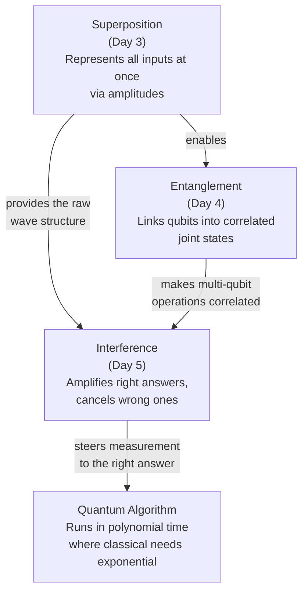

# Day 6 — Rest & Synthesize I — The Three Pillars

> **Today's one idea:** No new ideas today — your job is to consolidate superposition, entanglement, and interference until you can explain each one clearly, connect them to each other, and see why all three are needed.
> **Reading time:** ~35 min (review + exercises only) · **Prereqs:** Days 1–5
> **Primary source for today:** Your own notes from Days 1–5.
> **Before you start:** Recall Day 5's load-bearing idea — one sentence, no looking. Why is superposition alone insufficient for a quantum algorithm — what must interference accomplish before you can take a useful measurement?

---

## How to use this day

Rest and synthesize days have no new material. They are the most important days in the course.

Here is why: reading a concept and understanding a concept are not the same thing. The gap between them only becomes visible when you try to reproduce the idea without the text in front of you. Most people discover on day 6 that two or three of the five preceding days feel shakier than they thought.

Today's structure:

1. **The Feynman test** — explain all three pillars aloud (or in writing), from scratch, without notes.
2. **The connection map** — trace how the three pillars relate to each other.
3. **The misconception checklist** — run through the most common wrong intuitions and make sure none of them are secretly yours.
4. **Five consolidation questions** — answer without looking at previous pages.
5. **Identify your weakest link** — decide which day to re-read if one concept is still shaky.

---

## Part 1 — The Feynman Test

Close all previous pages. Then explain each of the following to an imaginary curious friend who knows nothing about physics — in your own words, using one analogy and one concrete example per concept.

**Explain superposition:**
> What is a qubit, and how is it different from a classical bit? What is an amplitude, and how is it different from a probability? Why does superposition alone not make a quantum computer powerful?

**Explain entanglement:**
> What does it mean for two qubits to be entangled? Why is the "magic gloves" analogy incomplete? Why does entanglement not allow faster-than-light communication?

**Explain interference:**
> What is the three-step structure of a quantum algorithm? What does constructive interference do to an answer's probability? What does destructive interference do? Why do quantum speedups require the problem to have structure?

If you can answer all three without hesitation, proceed to Part 2.

If any explanation falters, re-read the relevant day before continuing. A shaky foundation here will make Days 7–23 harder than they need to be.

---

## Part 2 — The Connection Map

The three pillars are not independent. They work together in a specific order:

Trace each arrow and make sure you can explain it in one sentence. Example: "Superposition enables entanglement because entanglement is a joint superposition of multi-qubit states — you need superposition to exist before you can have a superposition that can't be factored."

---

## Part 3 — The Misconception Checklist

These are the most common wrong intuitions at this stage. Check each one honestly.

| Misconception | Why it's wrong | My confidence I've cleared this |
|--------------|---------------|--------------------------------|
| "A qubit is just a probability over 0 and 1" | Amplitudes are not probabilities — they can be negative and interfere | ☐ |
| "Quantum computers try all answers simultaneously" | Yes via superposition, but without interference measurement gives a random answer | ☐ |
| "Entanglement allows faster-than-light communication" | Measurement outcomes are random; correlation only visible via classical comparison | ☐ |
| "The observer must be conscious to collapse a wave function" | Any physical interaction that creates a record destroys the superposition | ☐ |
| "A qubit stores infinite information because α can be any value" | Only one bit of information is extractable per measurement | ☐ |
| "Quantum speedup applies to all hard problems" | Only problems with structure that allows interference; most everyday problems have no quantum speedup | ☐ |

---

## Part 4 — Five Consolidation Questions

> **Why these questions are scrambled:** Retrieval is harder when you can't predict the topic from position. The five questions below jump across Days 1–5 in non-sequential order — resist the urge to scan back before writing each answer.

**Q1.** Alice and Bob each hold one qubit of the Bell state |Φ+⟩ = (1/√2)(|00⟩ + |11⟩). Alice measures her qubit and gets 1. What is Bob's qubit's state now? Does this mean Alice "sent" information to Bob?

Answer

Bob's qubit is now in state |1⟩. But Alice cannot use this to send information: she had no control over whether her measurement gave 0 or 1 — the outcome was random. Bob, looking at his qubit in isolation, sees a random outcome (50/50) regardless of when Alice measures. The correlation only becomes apparent when Alice and Bob compare results over a classical channel. No information traveled between them.

**Q2.** Why can quantum computers simulate molecules efficiently when classical computers cannot?

Answer

A molecule's quantum state involves a superposition of exponentially many electron configurations. To simulate this classically, you must track all 2^N configurations explicitly — exponential memory and time. A quantum computer is *itself* a quantum system: you can encode the molecule's state directly in the qubits and let the quantum hardware evolve it. The exponential state space is handled "for free" by the physics, not by explicitly storing every configuration.

**Q3.** A quantum algorithm starts with all qubits in equal superposition. Without any interference step, what happens when you measure?

Answer

You get a uniformly random answer — each possible computational outcome has equal probability. This is no better than guessing. The interference step is what makes the algorithm useful: it must redistribute amplitude before measurement so that the correct answer has high probability.

**Q4.** What is the difference between the states |+⟩ = (1/√2)|0⟩ + (1/√2)|1⟩ and |−⟩ = (1/√2)|0⟩ − (1/√2)|1⟩ from a measurement standpoint? From a computational standpoint?

Answer

From a measurement standpoint (measuring in the standard basis), they are identical: both give 50% probability of 0 and 50% probability of 1. From a computational standpoint, they are physically different — they interfere differently with subsequent quantum gates. The negative amplitude in |−⟩ means that operations which produce constructive interference for |+⟩ will produce destructive interference for |−⟩, and vice versa. This sign difference is exactly what quantum algorithms exploit.

**Q5.** *(Cross-concept bridge — spans Days 3, 5, and beyond)* If a quantum computer gives a random result when you just "measure a superposition," why isn't Grover's algorithm just as useless?

Answer

Grover's algorithm doesn't just measure a superposition. It applies a sequence of carefully designed operations that, through interference, systematically boost the amplitude of the correct answer and reduce the amplitude of all wrong answers before measuring. After ~√N applications of this boost, the correct answer has probability close to 1. The measurement is no longer random; it's guided.

---

## Part 5 — Your Weakest Link

After completing Parts 1–4, identify which day felt shakiest:

| If this felt uncertain... | Re-read this |
|--------------------------|-------------|
| Why quantum computers are needed at all | [Day 1](./day-01-why-quantum.md) |
| Why quantum mechanics is genuinely strange | [Day 2](./day-02-quantum-strangeness.md) |
| Amplitudes, Bloch sphere, no-cloning | [Day 3](./day-03-superposition.md) |
| Entanglement, Bell states, non-classical correlations | [Day 4](./day-04-entanglement.md) |
| Interference, the three-step structure, why structure is needed | [Day 5](./day-05-interference.md) |

Re-read that page. Then return here and re-answer the consolidation question that covers it.

---

## What comes next

Module 2 begins tomorrow. It takes the three pillars and shows how to build with them: physical qubit implementations (Day 7), quantum gates (Day 8), circuits (Day 9), measurement mechanics (Day 10), and the first real algorithms (Days 11–13).

Everything in Module 2 will reference today's pillars. When Day 8 talks about gates as "rotations on the Bloch sphere," that's Day 3. When Day 11 uses interference to solve a two-query problem in one, that's Day 5. When Day 12 exploits a structured search space, that's Days 3 and 5 together.

You are ready. Move forward.

---

## Navigation

← **Previous:** [Day 5 — Interference — How Quantum Computers "Aim"](./day-05-interference.md)
→ **Next:** [Day 7 — Qubits in the Real World](../../02-quantum-computers/days/day-07-qubits-real-world.md)
