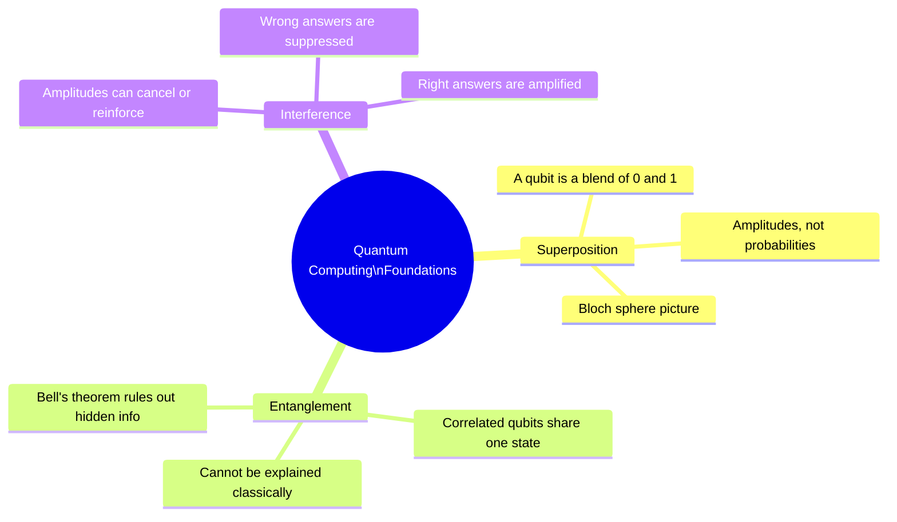

# Module 1 — The Quantum World (Days 1–6)

## What this module earns you

By the end of Day 6, you will be able to explain — in plain language, to someone with no physics background — why quantum computing is fundamentally different from classical computing, and what three physical phenomena make it possible.

You won't yet know how to build a quantum algorithm or evaluate hardware claims. But you'll have the mental models that every subsequent page in this course builds on. Skip or rush this module, and Days 7–23 will feel like memorization. Do it well, and everything that follows will click into place.

## The three ideas this module delivers

## Why the order matters

Day 1 establishes *why* we care — without the motivation (classical computers can't simulate chemistry), Days 2–5 feel like physics trivia. Day 2 opens the door to quantum weirdness gently, using the famous double-slit experiment that even physicists find astonishing. Days 3, 4, and 5 then build the three core primitives in the order of their dependency: you need superposition to understand entanglement, and you need both to understand interference.

Day 6 is a rest day — no new material. Use it to consolidate. A concept that you can reproduce from memory is ready to be built upon. A concept that requires re-reading is not.

## Days in this module

| Day | Title | Link |
|-----|-------|------|
| 1 | Why Quantum at All? | [→](days/day-01-why-quantum.md) |
| 2 | The Strangeness of the Quantum World | [→](days/day-02-quantum-strangeness.md) |
| 3 | Superposition — Both and Neither | [→](days/day-03-superposition.md) |
| 4 | Entanglement — Correlated by Nature | [→](days/day-04-entanglement.md) |
| 5 | Interference — How Quantum Computers "Aim" | [→](days/day-05-interference.md) |
| 6 | Rest & Synthesize I — The Three Pillars | [→](days/day-06-rest-synthesize-1.md) |

← [Back to course overview](../../README.md)
