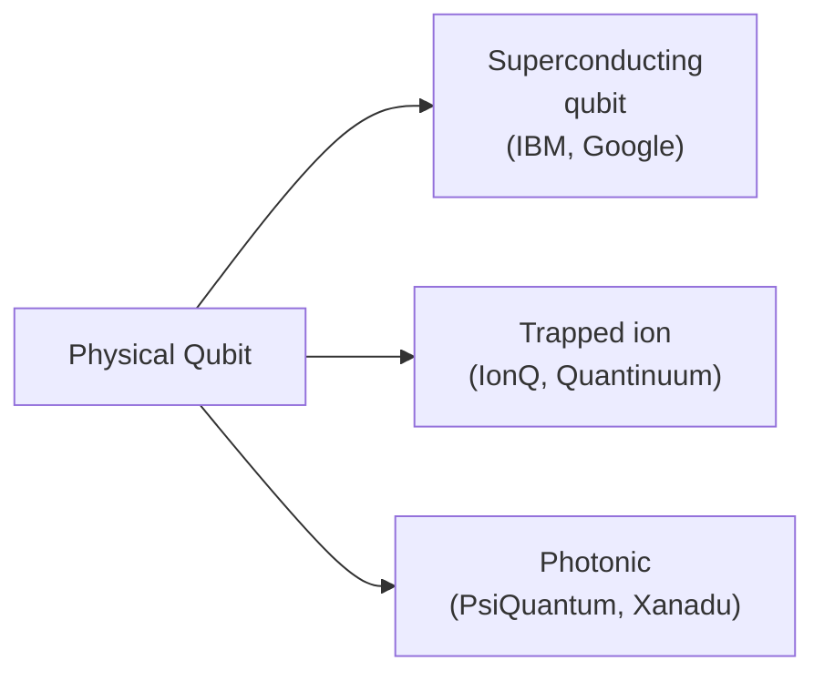

# Day 7 — Qubits in the Real World

> **Today's one idea:** A qubit isn't an abstraction — it's a specific physical object, and the choice of which physical system to use as a qubit determines every practical tradeoff in quantum hardware.
> **Reading time:** ~35 min · **Prereqs:** Day 3 (superposition), Day 6 (synthesis checkpoint)
> **Primary source for today:** Jack Hidary, *Quantum Computing: An Applied Approach*, 2nd ed., Chapter 2 (Springer, 2021)
> **Before you start:** Recall the three pillars from Day 6's synthesis — one sentence each, no looking: what is superposition, what is entanglement, and what is interference?

---

## The hook

So far, a qubit has been a mathematical object: α|0⟩ + β|1⟩. You've learned what it represents, what superposition means, how amplitudes differ from probabilities. All of that was real and important.

But a qubit is also a *thing* — a physical system that must exist somewhere in the world, be manipulated by machines, and survive long enough to participate in a computation. The gap between the mathematical ideal and the physical reality is enormous — and it's the central challenge of quantum engineering.

So what can actually *be* a qubit?

The answer: any quantum system with exactly two distinct, accessible states. Nature provides many options. Each carries different tradeoffs. And choosing wrong — or building the wrong kind of computer — is a multi-billion-dollar mistake.

---

## Building the intuition

### The one requirement: two quantum states

A qubit needs exactly two states that you can:
- **Prepare:** reliably start in a known state (usually |0⟩)
- **Manipulate:** apply gates to create superpositions and entanglement
- **Measure:** read out the result as a classical 0 or 1

Any quantum two-level system can satisfy these requirements in principle. The practical question is how *well* and for how *long*.

### Three leading physical implementations

**1. Superconducting qubits**

Cool a small loop of superconducting metal (niobium or aluminum) to near absolute zero — about 15 millikelvin, colder than deep space. At that temperature, electrons flow without resistance and the loop behaves as a quantum system. The two qubit states are different energy levels of the microwave current flowing in the loop.

- **Gates:** Microwave pulses (nanoseconds long) — extremely fast.
- **Coherence time:** ~100 microseconds (millionths of a second). Time available before the qubit loses its quantum state.
- **Scaling:** Manufactured using chip-fabrication techniques similar to classical processors — potentially scalable.
- **Used by:** IBM, Google, Rigetti.

**2. Trapped ions**

Trap individual atoms (typically ytterbium or barium) using electric fields in a vacuum chamber. The two qubit states are two different energy levels of the ion's electrons. Laser pulses manipulate and entangle them.

- **Gates:** Laser pulses (microseconds long) — slower than superconducting.
- **Coherence time:** Seconds to minutes — orders of magnitude longer than superconducting qubits.
- **Scaling:** Each qubit must be individually trapped and addressed — physical scaling is harder.
- **Used by:** IonQ, Quantinuum (formerly Honeywell).

**3. Photonic qubits**

Use individual photons (particles of light) as qubits. The two states are typically two polarization directions or two paths through a beam splitter.

- **Gates:** Optical elements (beam splitters, phase shifters).
- **Coherence time:** Very long — photons barely interact with the environment — but measurement is lossy.
- **Scaling:** Can operate at room temperature; compatible with fiber optic infrastructure.
- **Used by:** PsiQuantum (targeting silicon photonic chips), Xanadu.

### The key tradeoffs

| | Superconducting | Trapped Ion | Photonic |
|---|---|---|---|
| Gate speed | ~10 ns (very fast) | ~10 µs (100× slower) | ~1 ns (fast) |
| Coherence time | ~100 µs | Seconds to minutes | Long (but lossy) |
| Connectivity | Local (near neighbors) | All-to-all | Flexible |
| Operating temp | 15 mK (extreme cooling) | Room temperature in vacuum | Room temperature |
| Maturity | Most mature | Very mature | Less mature |
| Scaling challenge | Crosstalk, fabrication | Physical ion spacing | Photon loss |

No platform dominates. The race is wide open.

### What "coherence time" means practically

Coherence time is how long a qubit maintains its quantum state before decoherence (Day 15) destroys it. During that window, you must complete all your gate operations.

- A superconducting gate takes ~10 nanoseconds. Coherence time is ~100 microseconds. So you can fit roughly 10,000 gates before the qubit decoheres.
- A trapped-ion gate takes ~10 microseconds. Coherence time is ~1 second. So you can fit roughly 100,000 gates.

The trapped-ion qubit is slower *per gate* but better *per computation*, because it stays coherent longer. Which is better depends on the algorithm.

---

## The formal picture

**Physical qubit types by implementation:**

| Implementation | Two-level system | Manipulation |
|---|---|---|
| Superconducting | Josephson junction energy levels | Microwave pulses |
| Trapped ion | Electron energy levels | Laser pulses |
| Photonic | Photon polarization or path | Optical elements |
| Spin qubits (silicon) | Electron spin ↑ or ↓ | Magnetic pulses |
| Neutral atoms | Hyperfine atomic energy levels | Laser pulses |
| Topological (Microsoft) | Non-Abelian anyons | Braiding operations |

**Logical vs. physical qubits:** The qubits described above are *physical* qubits — the actual hardware objects. A *logical* qubit (Day 16) is an error-protected qubit encoded across many physical qubits. Today's devices operate entirely with physical qubits; fault-tolerant computers will use logical qubits. The ratio is expected to be ~1,000–10,000 physical qubits per logical qubit.

---

## Where it breaks / what it is not

**"Superconducting is winning because IBM and Google are using it."**
Not settled. Different algorithms favor different hardware. Trapped ions have better coherence times and native all-to-all connectivity. The field may end up with different hardware for different use cases — just as classical computing uses CPUs, GPUs, and TPUs for different workloads.

**"More qubits = better quantum computer."**
Emphatically no. A quantum computer with 1,000 noisy, low-coherence qubits may be less useful than one with 50 high-quality, high-coherence qubits. Qubit *quality* (gate fidelity, coherence time, connectivity) matters far more than raw count at this stage.

**"Topological qubits are theoretical — Microsoft hasn't built anything."**
Microsoft announced experimental evidence for topological qubits (Majorana fermions) in early 2023, though the approach remains less mature than superconducting or trapped-ion platforms. It's a real but high-risk bet.

---

## Try it yourself

**1. Retrieval — close the page.** Write down in one sentence: what is coherence time, and why does it matter more than raw qubit count when evaluating real quantum hardware? Open only after writing your answer.

Answer

Coherence time is how long a qubit maintains its quantum state before noise destroys the superposition. It matters more than qubit count because the figure that determines computational power is gates per coherence time — how many operations you can complete before the state decoheres. A system with 100 long-lived qubits can run deeper, more powerful circuits than one with 1,000 short-lived qubits.

**2. Check understanding.**
A superconducting qubit has a coherence time of 100 microseconds and a gate time of 10 nanoseconds. A trapped-ion qubit has a coherence time of 1 second and a gate time of 10 microseconds. How many gates can each execute before decoherence?

Answer

Superconducting: 100 µs / 10 ns = 100,000 / 10 = 10,000 gates.
Trapped ion: 1,000,000 µs / 10 µs = 100,000 gates.
Despite being 1,000× slower per gate, the trapped-ion system supports 10× more gates per computation.

**3. Apply.**
An algorithm requires all-to-all connectivity — any qubit must be able to interact directly with any other qubit. Which hardware type handles this more naturally: superconducting or trapped ion? Why?

Answer

Trapped ion. In a trapped-ion system, all ions in the trap can interact with each other (via shared vibrational modes), giving natural all-to-all connectivity. Superconducting qubits are chips where qubits interact only with their physical neighbors — achieving long-range coupling requires SWAP operations (additional gates), which adds noise and time.

**4. Stretch.**
Why must superconducting quantum computers operate at 15 millikelvin — colder than deep space — while trapped-ion computers can operate at room temperature (in a vacuum)?

Answer

Superconducting qubits are macroscopic objects (small metal loops) that would normally behave classically. Only at extremely low temperatures do thermal fluctuations become small enough that the loop can enter a quantum superposition. A single photon of room-temperature thermal energy would contain far more energy than the gap between the qubit's two levels, instantly collapsing the superposition. Trapped ions, by contrast, are individual atoms in a vacuum. Their quantum energy levels are determined by atomic physics (not macroscopic engineering), and the laser pulses that manipulate them are tuned precisely to those levels — room-temperature thermal noise doesn't couple strongly to the relevant transitions.

---

**Transfer — apply it (all levels):** Think of a technology stack you work with that has an equivalent of "coherence time" — a window within which an operation must complete before context is lost (a session timeout, a lock hold, a transaction window). Write one sentence connecting that constraint to coherence time, and one sentence on the key difference.

---

## Connect it back

Until today, qubits were abstract. Now they're physical — and fragile. A superconducting qubit must be kept colder than the coldest place in the known universe. A trapped ion must be suspended in a near-perfect vacuum by electric fields. These aren't engineering quirks; they're the price of maintaining quantum coherence.

Tomorrow, Day 8 shows how we manipulate these physical qubits using quantum gates. Day 15 will explain what happens when we fail to isolate them from the environment: decoherence, the central engineering enemy.

**The question you should now be able to answer:** Why does "more qubits" not automatically mean "better quantum computer"?

---

## Suggested readings for today

**Required if you have 15 extra minutes:**
Hidary, *Quantum Computing: An Applied Approach*, 2nd ed., Chapter 2, Sections 2.1–2.3 (Springer, 2021). Hidary covers superconducting and trapped-ion qubits with clear diagrams and no heavy physics. Pages 20–45.

**If you want the deep version:**
- Rieffel & Polak, *Quantum Computing: A Gentle Introduction*, Chapter 7 ("Physical Realizations"), pages 155–180 (MIT Press, 2011). A more formal but accessible survey of qubit implementations.
- IBM Quantum Learning (quantum.ibm.com/learning): the "Introduction to Quantum Hardware" module gives interactive diagrams of superconducting qubit architecture that make the physical structure visceral.

---

## Navigation

← **Previous:** [Day 6 — Rest & Synthesize I](../../01-quantum-world/days/day-06-rest-synthesize-1.md)
→ **Next:** [Day 8 — Quantum Gates — Operations on Qubits](./day-08-quantum-gates.md)
