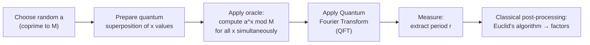

# Day 13 — Shor's Algorithm — Why Cryptographers Worry

> **Today's one idea:** Shor's algorithm can factor large numbers exponentially faster than any known classical method — which matters enormously because the security of most internet encryption depends on factoring being hard.
> **Reading time:** ~40 min · **Prereqs:** Day 12
> **Primary source for today:** Rieffel & Polak, *Quantum Computing: A Gentle Introduction*, Chapter 7 (MIT Press, 2011)
> **Before you start:** Recall Day 12's load-bearing idea — one sentence, no looking. What does Grover's algorithm achieve, and why is the speedup quadratic rather than exponential?

---

## The hook

Right now, every time you buy something online, your credit card number is encrypted using a scheme called RSA. RSA's security rests on a single mathematical bet: that multiplying two large prime numbers is easy, but *reversing* that multiplication — finding which two primes were multiplied together — is computationally infeasible.

Multiplying: 17,159 × 10,007 = 171,760,913. Takes a millisecond.

Factoring: given 171,760,913, find its prime factors. For small numbers, trial division works. For 2048-bit numbers (the standard for RSA), trial division would take longer than the age of the universe on any classical computer.

In 1994, Peter Shor proved that a quantum computer could factor such numbers in polynomial time — exponentially faster than any known classical algorithm.

No quantum computer has yet factored numbers large enough to break RSA encryption (the record as of 2024 is ~2,048-bit RSA factoring remaining far out of reach for current hardware). But the algorithm is mathematically certain. When large-scale, fault-tolerant quantum computers exist, RSA is broken. Governments, banks, and militaries are treating this as a serious threat — and the race to "post-quantum cryptography" is already underway.

---

## Building the intuition

### Why factoring is hard classically

For an N-digit number, the best classical factoring algorithm (the general number field sieve) runs in roughly:

```math
\exp\!\left(c \cdot N^{1/3} (\log N)^{2/3}\right)
```

This is "sub-exponential" — better than purely exponential, but far worse than polynomial. For a 2048-bit number, it's estimated to require ~10^34 operations on a classical computer.

Shor's algorithm runs in O(N³) steps — polynomial. The difference is exponential.

### The key insight: factoring reduces to period-finding

Shor's algorithm doesn't attack factoring directly. It uses a beautiful mathematical trick: factoring a number M is *equivalent* to finding the period of a certain function.

The function is: f(x) = a^x mod M, where a is any number you choose that shares no common factor with M.

This function is periodic — it repeats. For example, with M = 15 and a = 7:

| x | 7^x mod 15 |
|---|-----------|
| 0 | 1 |
| 1 | 7 |
| 2 | 4 |
| 3 | 13 |
| 4 | 1 ← repeats |
| 5 | 7 |
| 6 | 4 |
| 7 | 13 |

The period is r = 4 (the sequence repeats every 4 steps).

Once you have the period r, a classical calculation using Euclid's algorithm gives you the prime factors of M with high probability. (The math involves gcd(a^(r/2) ± 1, M) — you don't need to follow this; the point is that period → factors is easy once you have r.)

**The classical bottleneck:** Finding the period of f(x) = a^x mod M classically requires evaluating the function for many values of x — potentially exponentially many for large M.

**Shor's quantum speedup:** The quantum part of Shor's algorithm finds the period using a quantum Fourier transform, which extracts the period from a superposition in polynomial time.

### The quantum Fourier transform — extracting hidden periodicity

You've learned about the classical Fourier transform in everyday contexts: it decomposes a sound wave into its constituent frequencies. A waveform that repeats with period r has a strong frequency component at 1/r.

The **quantum Fourier transform (QFT)** does the same thing on quantum amplitudes. Prepare a superposition of all values of f(x), apply the QFT, and measure — the result encodes the period r.

Classically, the fast Fourier transform takes O(N log N) operations. The QFT takes O(N²) quantum gates (and N here is the number of *bits*, not the number to be factored). For a 2048-bit number, this is wildly more efficient than any classical period-finding approach.

### The full Shor algorithm — overview



The quantum speedup lives entirely in steps B–E. Step F is classical and fast.

### Why this matters for cryptography

RSA encryption is based on the hardness of factoring the product of two large primes. Break factoring → break RSA.

Most internet traffic today uses RSA or Diffie-Hellman key exchange (which has a similar structure — it relies on the hardness of discrete logarithm, also solved by Shor's algorithm). If a large quantum computer were built today, it could:

- Read any previously recorded encrypted internet traffic
- Impersonate any RSA-signed certificate
- Break the encryption protecting banking, government, and military communications

This is why:
- NIST standardized post-quantum cryptographic algorithms in 2024 (CRYSTALS-Kyber, CRYSTALS-Dilithium, SPHINCS+)
- Major governments have classified timelines for "harvest now, decrypt later" — recording encrypted traffic today to decrypt it once quantum computers arrive
- Migration to post-quantum cryptography is actively underway

---

## The formal picture

**Shor's algorithm complexity:**
- Classical best known (GNFS): sub-exponential, ~exp(c · N^(1/3) log(N)^(2/3))
- Shor's algorithm: polynomial, O(N³) quantum gates (with N = number of bits)

For a 2048-bit RSA key:
- Classical GNFS: ~10^34 operations (infeasible)
- Shor's quantum algorithm: ~10^10 quantum operations (feasible with fault-tolerant quantum computer)

**Resource requirements for breaking RSA-2048 with Shor's algorithm** (estimates as of 2023):
- Physical qubits needed: ~4,000–20,000,000 (depending on error rate assumptions)
- Current best quantum computers: ~1,000–5,000 physical qubits, too noisy, no error correction
- Time to run: hours to days on a fault-tolerant machine

Realistic timeline for a quantum computer capable of breaking RSA-2048: most expert estimates put this at 10–20+ years.

**What Shor cannot do:**
- Break symmetric encryption (AES) — Grover's gives only quadratic speedup there
- Break post-quantum cryptographic standards (NIST 2024) — these are designed to resist quantum attacks

---

## Where it breaks / what it is not

**"Shor's algorithm will break all encryption."**
No. It breaks RSA and related public-key systems. Symmetric encryption (AES with 256-bit keys) is not broken — Grover halves the effective key length, which is mitigated by using longer keys. Post-quantum cryptographic standards already exist and are being deployed.

**"Someone will use Shor's algorithm to break RSA soon."**
Not with current hardware. Today's quantum computers (NISQ era, Day 18) are far too noisy and small. Breaking RSA-2048 would require millions of *high-quality* physical qubits with quantum error correction — technology that doesn't yet exist.

**"Shor's algorithm is an exponential speedup over classical."**
Technically: Shor is polynomial where the best known classical algorithm is sub-exponential. Whether this counts as "exponential" speedup depends on the baseline. It is certainly a dramatic speedup — practical vs. impractical for large numbers.

**"Post-quantum cryptography uses quantum computers."**
Confusingly named, but no. "Post-quantum" cryptography is classical cryptography designed to resist *quantum* attacks. It runs on ordinary computers and is based on mathematical problems believed hard even for quantum computers (lattice problems, hash functions, code-based problems).

---

## Try it yourself

**1. Retrieval — close the page.** Write down in one sentence: what is Shor's algorithm, what mathematical trick does it use, and why does it threaten RSA but not AES? Open only after writing your answer.

<details>
<summary>Answer</summary>
Shor's algorithm factors large integers in polynomial time by reducing factoring to period-finding: the function f(x) = a^x mod M is periodic, and the Quantum Fourier Transform extracts its period in polynomial steps. RSA's security rests on factoring being hard — Shor's breaks that. AES (symmetric) depends only on key-search hardness, which Grover addresses with a quadratic speedup, mitigated by using 256-bit keys.
</details>

**2. Check understanding.**
What is the "period-finding" trick in Shor's algorithm, and why does finding the period of f(x) = a^x mod M help you factor M?

<details>
<summary>Answer</summary>
The function f(x) = a^x mod M is periodic — it repeats with some period r. The mathematical relationship gcd(a^(r/2) ± 1, M) gives the prime factors of M with high probability (a classical result from number theory). So: if you can find r, you can factor M with a classical computation. The quantum speedup is entirely in finding r efficiently — the QFT extracts the period from a superposition in polynomial time, while classical period-finding would require exponentially many evaluations.
</details>

**3. Apply.**
NIST's post-quantum cryptography standard (2024) includes CRYSTALS-Kyber for key encapsulation and CRYSTALS-Dilithium for digital signatures. These are based on the "learning with errors" (LWE) problem over lattices. Why would migrating to these standards protect against Shor's algorithm?

<details>
<summary>Answer</summary>
Shor's algorithm works by reducing factoring to period-finding, then using the QFT to find periods efficiently. The LWE problem has a completely different mathematical structure — it's about finding a secret vector in a noisy system of equations. No quantum algorithm is known to solve LWE faster than classical algorithms (the best known algorithms are still exponential). The assumption is that the LWE problem's structure doesn't admit a QFT-based attack. This is why LWE-based cryptography is considered "post-quantum secure."
</details>

**4. Stretch.**
"Harvest now, decrypt later" is a strategy where adversaries record encrypted traffic today, intending to decrypt it once a quantum computer exists. What kinds of information would be most valuable to harvest, and why?

<details>
<summary>Answer</summary>
The most valuable targets are data with long secrecy requirements: (1) Government and military secrets — classified information that remains sensitive for decades. (2) Long-term business secrets — trade secrets, IP, strategic plans that remain valuable for 10+ years. (3) Personal records — medical, legal, financial data that doesn't expire. (4) Cryptographic keys — if you can break the key exchange, you can decrypt all communications that used that key. The attack is only worth doing if the information will still be valuable by the time the quantum computer exists (estimated 10–20 years). This is why migration to post-quantum cryptography is urgent for governments and long-lived secrets, even though practical attacks are not yet possible.
</details>

---

**Transfer — apply it (all levels):** What encryption standard does your organization (or a system you work on) use for sensitive data at rest or in transit? Write one sentence: is it RSA-based (broken by Shor's), symmetric (only quadratically threatened by Grover's, mitigated by 256-bit keys), or already post-quantum? What would the migration cost look like?

---

## Connect it back

You've now seen the three landmark quantum algorithms: Deutsch (constant-vs-balanced, two-query problem), Grover (quadratic speedup on search), and Shor (exponential speedup on factoring). Tomorrow is the second rest day — consolidating these into a coherent understanding of when and why quantum speedups happen, and when they don't.

**The question you should now be able to answer:** Why does Shor's algorithm threaten RSA but not AES?

---

## Suggested readings for today

**Required if you have 15 extra minutes:**
Rieffel & Polak, *Quantum Computing: A Gentle Introduction*, Chapter 7, Sections 7.1–7.3 (MIT Press, 2011). Pages 153–180. The period-finding reduction and QFT are explained with more care than anywhere else at this level. Focus on Sections 7.1 (the structure of the algorithm) and 7.2 (why period-finding works).

**If you want the deep version:**
- Peter W. Shor, "Algorithms for Quantum Computation: Discrete Logarithms and Factoring," *FOCS 1994*, pp. 124–134. The original paper. Sections 1 and 5 (the main algorithm) are readable with today's background.
- Gribbin, *Computing with Quantum Cats*, Chapter 7 ("Breaking Codes"), Bantam Press, 2013. Gribbin's narrative account of RSA, its vulnerabilities, and Shor's discovery is the most accessible historical treatment available.

---

## Navigation

← **Previous:** [Day 12 — Grover's Algorithm — Quantum Search](./day-12-grovers-algorithm.md)
→ **Next:** [Day 14 — Rest & Synthesize II — Algorithms & Speedups](./day-14-rest-synthesize-2.md)
