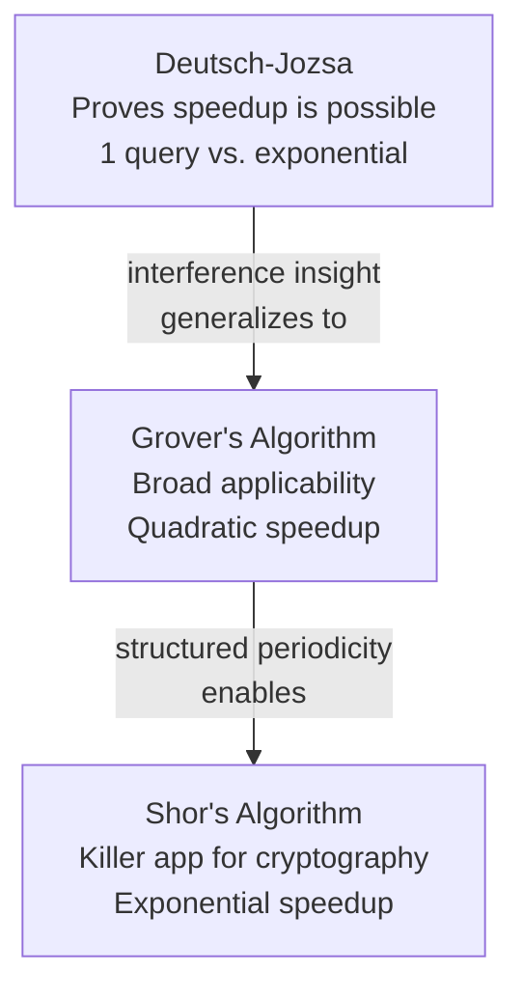

# Day 14 — Rest & Synthesize II — Algorithms & Speedups

> **Today's one idea:** No new material — consolidate what quantum speedups actually are, what determines their size, and why quantum computers cannot speed up everything.
> **Reading time:** ~35 min (review + exercises only) · **Prereqs:** Days 7–13
> **Primary source for today:** Your notes from Days 7–13.

---

## How to use this day

You've now seen the complete machinery of quantum computing — physical qubits, gates, circuits, measurement — and three landmark algorithms. Today is the checkpoint before the course shifts from "what quantum computers can do" to "why they're so hard to build."

Use this day to:
1. Build the algorithm comparison map.
2. Answer the central question: **what kinds of problems get quantum speedups?**
3. Run the misconception checklist for Module 2.
4. Answer five consolidation questions without looking at previous pages.
5. Identify what to re-read.

---

## Part 1 — The Algorithm Map

| Algorithm | Classical cost | Quantum cost | Speedup type | Real-world impact |
|-----------|---------------|-------------|-------------|------------------|
| Deutsch-Jozsa (Day 11) | 2^(n-1)+1 queries | 1 query | Exponential over deterministic | Proof of concept only |
| Grover (Day 12) | O(N) | O(√N) | Quadratic | Modest — doubles required key size |
| Shor (Day 13) | Sub-exponential | Polynomial | Effectively exponential | Catastrophic — breaks RSA |

---

## Part 2 — The Central Question: What Gets a Quantum Speedup?

**Quantum speedups exist when a problem has structure that allows:**

1. **Interference to amplify the right answer** — the answer must be checkable (Grover) or reducible to a periodic structure (Shor).
2. **Superposition to explore a space too large for classical exhaustive search.**
3. **Amplitude to concentrate before measuring** — otherwise you just get random noise.

**Quantum speedups do NOT exist (or are not known) for:**

| Problem | Quantum speedup? | Why |
|---|---|---|
| Factoring large integers | Yes — exponential | Hidden period structure + QFT |
| Unstructured database search | Yes — quadratic | Amplitude amplification |
| Simulating quantum chemistry | Yes — exponential | Nature is quantum; hardware matches |
| Sorting a list | No known speedup | Classical merge sort already optimal |
| General NP-complete problems | No known exponential speedup | No interference structure known |
| Training neural networks | No known significant speedup | Matrix ops don't expose period structure |
| Email, video, web browsing | None | Classical computing already optimal |

**The honest summary:** Quantum speedups are real but narrow. They exist for specific mathematical structures — primarily periodicity, search, and simulation. Most everyday computing problems lack this structure.

---

## Part 3 — Misconception Checklist

| Misconception | Correct view |
|---|---|
| "Quantum computers speed up everything" | Only specific problem structures; most everyday computing has no speedup |
| "Grover breaks all encryption" | Quadratic only — AES-256 remains safe with longer keys |
| "Shor breaks all encryption" | Breaks RSA/ECDH (public-key); AES (symmetric) is safe |
| "More qubits = more powerful" | Gate fidelity and coherence time matter as much as qubit count |
| "Quantum computers give exact answers" | Probabilistic — you run many shots and take the most frequent result |
| "Quantum supremacy = useful quantum computer" | Supremacy is demonstrating any quantum task classical can't; useful advantage requires practical problems |

---

## Part 4 — Consolidation Questions

**Q1.** Explain the difference between a quadratic speedup (Grover) and an exponential speedup (Shor) using concrete numbers.

Answer

Quadratic (Grover): Searching 1 million items takes ~1,000 quantum oracle calls vs. ~500,000 classical — about 500× faster. If the database doubles to 2 million, classical doubles; quantum grows by √2 ≈ 1.4×. The advantage is real but bounded.

Exponential (Shor): Factoring a 2,048-bit number takes ~10^10 quantum operations vs. ~10^34 classical operations — a factor of 10^24 difference. Double the bit length to 4,096, and classical grows by exp(2^(1/3)) while quantum grows polynomially. The gap grows without bound as numbers get larger.

**Q2.** What is gate fidelity, and why does 99.5% two-qubit gate fidelity become catastrophic after 1,000 gates?

Answer

Gate fidelity is the probability that a gate performs its intended operation correctly. At 99.5%, each two-qubit gate has a 0.5% error rate. After 1,000 gates: 0.995^1000 ≈ 0.007. Less than 1% chance that all gates succeeded. For a 1,000-gate circuit, you'd expect at least one error in nearly every run — the algorithm fails far more than it succeeds. This is why quantum error correction (Day 16) is not optional for deep circuits.

**Q3.** A company claims their "quantum algorithm speeds up AI training by 1,000×." What three questions would you ask to evaluate this claim?

Answer

(1) What specific mathematical operation is accelerated, and does it correspond to a known quantum speedup (e.g., sampling, linear algebra over specific structures)? Most AI training bottlenecks (stochastic gradient descent, backpropagation) don't have known quantum speedups.
(2) Is the comparison against the best known classical algorithm, or a naive baseline? A 1,000× speedup over an unoptimized classical routine is not impressive.
(3) Does this run on current noisy hardware, or does it assume fault-tolerant qubits that don't yet exist? Most claimed speedups require logical qubits requiring millions of physical qubits — hardware that's decades away.

**Q4.** Why does Grover's algorithm fail to break AES-256, even though it breaks AES-128's security in practice?

Answer

Grover gives a quadratic speedup: searching the AES-128 keyspace (2^128 keys) takes ~2^64 quantum oracle calls instead of ~2^127 classical. 2^64 ≈ 18 quintillion oracle calls — still computationally infeasible at any foreseeable gate speed. AES-128's effective security drops from 128 bits to 64 bits, which is marginal but not immediately broken.

AES-256 uses a 2^256 keyspace. With Grover, it requires ~2^128 oracle calls — the same difficulty as breaking AES-128 classically. 2^128 is still computationally infeasible. So AES-256 is secure against Grover — you just need to use the longer key.

**Q5.** What is the "harvest now, decrypt later" threat, and why does it make post-quantum migration urgent even though fault-tolerant quantum computers don't yet exist?

Answer

Adversaries record encrypted traffic today, storing it at scale, with the intention of decrypting it once a quantum computer capable of running Shor's algorithm exists. If RSA-encrypted government secrets or medical records captured in 2025 are decrypted in 2040, the data is still sensitive — it doesn't expire. The threat is: if your data has a 15-year secrecy requirement, and large-scale quantum computers arrive in 15 years, adversaries can already compromise it now. This is why governments and financial institutions are migrating to post-quantum cryptographic standards (NIST 2024) urgently — not because the attack is possible today, but because the window to protect long-lived data is closing.

---

## Part 5 — Your Weakest Link in Module 2

| If this felt uncertain... | Re-read this |
|---|---|
| Physical qubit types and tradeoffs | [Day 7](./day-07-qubits-real-world.md) |
| Gates as rotations, Hadamard, CNOT | [Day 8](./day-08-quantum-gates.md) |
| Circuit notation, depth, width | [Day 9](./day-09-quantum-circuits.md) |
| Born rule, collapse, why you run many shots | [Day 10](./day-10-measurement.md) |
| Deutsch's algorithm, phase kickback | [Day 11](./day-11-deutsch-problem.md) |
| Grover, amplitude amplification | [Day 12](./day-12-grovers-algorithm.md) |
| Shor, period-finding, cryptographic impact | [Day 13](./day-13-shors-algorithm.md) |

---

## What comes next

Module 3 answers the question this entire module has been quietly deferring: if quantum computers can do all of this — why don't we have them?

Day 15 introduces decoherence: the physical process that destroys quantum states when they interact with the environment. Day 16 shows the proposed solution: quantum error correction. Days 17 and 18 survey the current hardware landscape and put an honest label on where we actually stand.

The pivot from "what's possible" to "what's hard" begins tomorrow.

---

## Navigation

← **Previous:** [Day 13 — Shor's Algorithm — Why Cryptographers Worry](./day-13-shors-algorithm.md)
→ **Next:** [Day 15 — Decoherence — The Enemy of Quantum](../../03-building-quantum/days/day-15-decoherence.md)
