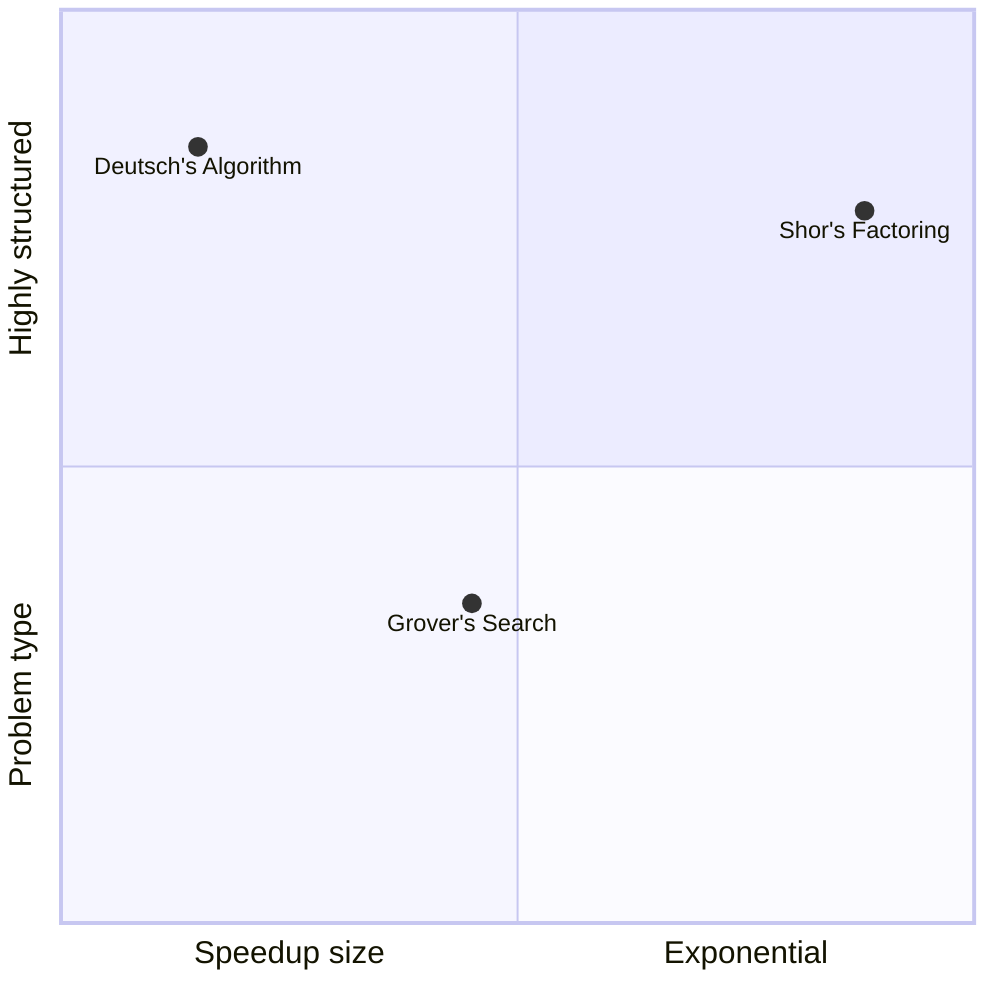

# Module 2 — How Quantum Computers Work (Days 7–14)

## What this module earns you

By the end of Day 14, you will understand how quantum algorithms are actually structured — gates, circuits, measurement — and why three landmark algorithms (Deutsch, Grover, Shor) represent genuinely different kinds of quantum speedup. You'll be able to explain what quantum speedup means, what kinds of problems benefit from it, and why most problems do not.

## The arc of this module

The module has three layers:

1. **The hardware layer (Day 7):** What physical objects are qubits?
2. **The circuit layer (Days 8–10):** How are gates combined into circuits, and what does measurement do?
3. **The algorithm layer (Days 11–13):** What can these circuits actually *compute*, and how much faster?

Day 14 is a synthesis checkpoint. By then, the reader should be able to answer: "What kinds of problems get quantum speedups, and why can't quantum computers just speed up everything?"

## The three algorithm "shapes"

- **Deutsch (Day 11):** The simplest case — proves speedup is possible at all.
- **Grover (Day 12):** Quadratic speedup on unstructured search — broadly applicable but limited.
- **Shor (Day 13):** Exponential speedup on a structured number theory problem — the most consequential.

## Days in this module

| Day | Title | Link |
|-----|-------|------|
| 7 | Qubits in the Real World | [→](days/day-07-qubits-real-world.md) |
| 8 | Quantum Gates — Operations on Qubits | [→](days/day-08-quantum-gates.md) |
| 9 | Quantum Circuits — Wiring Gates Together | [→](days/day-09-quantum-circuits.md) |
| 10 | Measurement — The Act of Looking | [→](days/day-10-measurement.md) |
| 11 | Deutsch's Problem — The First Quantum Speedup | [→](days/day-11-deutsch-problem.md) |
| 12 | Grover's Algorithm — Quantum Search | [→](days/day-12-grovers-algorithm.md) |
| 13 | Shor's Algorithm — Why Cryptographers Worry | [→](days/day-13-shors-algorithm.md) |
| 14 | Rest & Synthesize II — Algorithms & Speedups | [→](days/day-14-rest-synthesize-2.md) |

← [Back to course overview](../../README.md)
