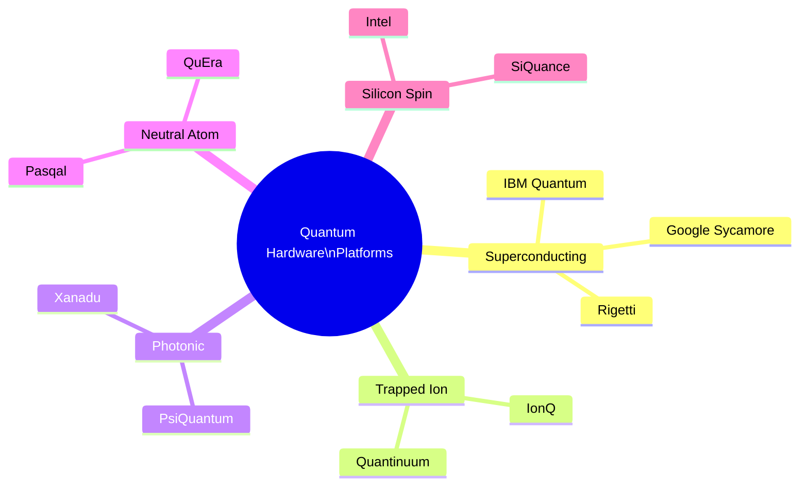

# Day 17 — The Hardware Landscape

> **Today's one idea:** Every quantum hardware platform makes different tradeoffs between qubit quality, gate speed, connectivity, and scalability — and the race is genuinely open, with no platform yet proven to be the path to fault-tolerant quantum computers.
> **Reading time:** ~35 min · **Prereqs:** Days 7, 15
> **Primary source for today:** Jack Hidary, *Quantum Computing: An Applied Approach*, 2nd ed., Chapter 5 (Springer, 2021)

---

## The hook

In the 1970s and 80s, the battle to build personal computers was fought on many fronts simultaneously: Intel vs. Motorola processors, Apple vs. IBM architectures, CP/M vs. DOS operating systems. Nobody knew which approach would win. Most bets turned out to be wrong. The winners were decided by a combination of technical merit, manufacturing economics, and timing.

The quantum computing hardware race looks remarkably similar today. Five distinct physical platforms are being developed by dozens of companies and research groups. Each has genuine strengths. Each has genuine weaknesses. No one platform has yet demonstrated the combination of qubit quality, connectivity, and scalability needed for fault-tolerant quantum computing.

Understanding the landscape — even at a high level — is essential for evaluating the claims you'll read in the news, the roadmaps companies publish, and the announcements that make headlines.

---

## Building the intuition

### The five main platforms

### Platform deep-dives

**1. Superconducting qubits** — the current frontrunner by qubit count

Tiny loops of superconducting metal cooled to 15 millikelvin. Energy levels in the Josephson junction serve as the |0⟩ and |1⟩ states. Gates applied via microwave pulses.

*Strengths:* Fast gates (~10–50 ns), manufacturable using adapted semiconductor fab techniques, large qubit count (IBM's Condor chip: 1,121 qubits in 2023).
*Weaknesses:* Short coherence times (~100–500 µs), fixed connectivity (qubits interact only with neighbors on the chip), extreme cooling requirements.
*Path to fault tolerance:* Scale up chip size + improve error rates. IBM's roadmap targets 100,000+ qubits by 2033.

**2. Trapped ions** — the current leader in qubit quality

Individual atoms (ytterbium, barium, or calcium) trapped in a vacuum by electric fields. Two hyperfine energy levels serve as qubit states. Laser pulses entangle ions via shared vibrational modes.

*Strengths:* Very high gate fidelity (~99.9% two-qubit), long coherence (seconds to minutes), all-to-all connectivity within a trap.
*Weaknesses:* Slow gates (~10–1,000 µs), physically scaling to thousands of qubits requires novel architectures (ion shuttling, modular traps).
*Path to fault tolerance:* Modular trapped-ion systems connected by photonic links. Quantinuum's H2 processor (56 qubits, 2023) has the highest fidelity of any current device.

**3. Photonic qubits** — the room-temperature bet

Individual photons encoded in polarization, path, or timing modes. Linear optical elements (beam splitters, phase shifters) manipulate them.

*Strengths:* Operates at room temperature, naturally compatible with fiber optic networks, photons don't decohere easily.
*Weaknesses:* Photon loss is the dominant error (photons get absorbed or scattered), two-photon interactions are inherently probabilistic without nonlinear media.
*Path to fault tolerance:* PsiQuantum is building silicon photonic chips at GlobalFoundries, targeting fusion-based quantum computation.

**4. Neutral atoms** — the dark horse with recent breakthroughs

Neutral atoms (rubidium, cesium) held in arrays of laser tweezers. Qubit states are two hyperfine ground states. Entanglement created via Rydberg interactions (exciting atoms to high-energy states where they interact strongly).

*Strengths:* Highly reconfigurable geometry (rearrange atoms during computation), all-to-all connectivity within range, large qubit counts (QuEra's Aquila: 256 qubits, 2023), long coherence.
*Weaknesses:* Rydberg gate speed (~1 µs) and fidelity (~99.5%) still below trapped ions; atom loss during computation is challenging.
*Path to fault tolerance:* Rapid improvement in 2023–2024 demonstrated error-corrected logical qubits. Harvard/MIT/QuEra collaboration achieved 48 logical qubits in 2023 — a significant milestone.

**5. Silicon spin qubits** — the semiconductor industry's bet

Electron spins in silicon quantum dots. The spin-up and spin-down states of a single electron serve as |0⟩ and |1⟩. Compatible with existing CMOS semiconductor fabrication.

*Strengths:* Potentially manufacturable at scale using existing semiconductor fabs (billions of qubits per chip is theoretically imaginable), long coherence in isotopically purified silicon.
*Weaknesses:* Two-qubit gates are still being improved; operating at dilution refrigerator temperatures; qubit uniformity at scale is unproven.
*Path to fault tolerance:* Longest-term bet — Intel and SiQuance leading. Not yet demonstrated useful quantum computation.

### The key comparison

| | Superconducting | Trapped Ion | Neutral Atom | Photonic | Silicon Spin |
|---|---|---|---|---|---|
| Best single-qubit fidelity | ~99.9% | ~99.99% | ~99.9% | ~99.5% | ~99.9% |
| Best two-qubit fidelity | ~99.5% | ~99.9% | ~99.5% | ~99% | ~99% |
| Coherence time | ~100 µs | Seconds | Seconds | Long (lossy) | Seconds |
| Gate speed | Fast (ns) | Slow (µs) | Medium (µs) | Fast (ns) | Fast (ns) |
| Connectivity | Local | All-to-all | Reconfigurable | Flexible | Local |
| Scalability | High (fab) | Medium | Medium | High (fab) | High (fab) |
| Operating temp | 15 mK | Room temp (vacuum) | Room temp | Room temp | 1 mK |
| Maturity | Most mature | Very mature | Rapidly improving | Early | Early |

---

## The formal picture

**The DiVincenzo criteria** (1996) — the checklist every quantum hardware platform must satisfy:

1. A scalable physical system with well-characterized qubits.
2. The ability to initialize qubits to a simple state (e.g., |0⟩).
3. Long coherence times, much longer than gate operation time.
4. A universal set of quantum gates.
5. The ability to measure specific qubits reliably.

Every current platform satisfies all five in principle. The challenge is satisfying them simultaneously at *scale* (thousands to millions of qubits) with *sufficient fidelity* (below the fault-tolerance threshold).

**Quantum volume** (IBM's metric) — a single number summarizing a quantum computer's quality: the largest square random circuit (equal width and depth) that the device can run with >2/3 probability of success. IBM's best systems have achieved quantum volume 2^17 = 131,072 (2023). Higher is better. This metric penalizes both noise and low qubit count.

---

## Where it breaks / what it is not

**"IBM/Google is winning because they have the most qubits."**
Qubit count is a marketing-friendly metric that doesn't capture qubit quality. A 1,000-qubit processor with 99.9% two-qubit fidelity is far more powerful than a 1,000-qubit processor with 99.0% fidelity for any algorithm of practical depth.

**"We'll know the winning platform in 5 years."**
Unlikely. The history of computing suggests that hardware transitions take decades. It's plausible that multiple platforms survive — serving different use cases (trapped ions for high-quality scientific computation; superconducting for cloud access; photonic for networking).

**"Quantum annealing (D-Wave) is a competitor to these platforms."**
D-Wave's quantum annealers are real quantum devices — but they implement a specific optimization algorithm (quantum annealing) rather than the universal gate model. They cannot run Grover's or Shor's algorithms. Their advantage over classical for practical optimization problems has not been convincingly demonstrated. They occupy a separate niche.

---

## Try it yourself

**1. Check understanding.**
A company reports that their quantum processor has 1,000 qubits and 99.5% two-qubit gate fidelity. Another company has 100 qubits and 99.9% two-qubit gate fidelity. Which is more useful for running a 500-gate, 50-qubit algorithm, and why?

Answer

The 100-qubit, 99.9% fidelity system. For a 500-gate circuit: 
- System A (99.5%): probability all gates succeed ≈ 0.995^500 ≈ 0.082 (8% success rate).
- System B (99.9%): probability all gates succeed ≈ 0.999^500 ≈ 0.606 (61% success rate).
System B is ~7× more likely to give the correct answer per shot. The extra 900 qubits on system A are irrelevant for a 50-qubit algorithm, while the lower fidelity makes the result unreliable.

**2. Apply.**
A startup claims their neutral atom quantum computer can "reconfigure qubit connectivity on the fly." Why is this a significant advantage over superconducting qubits for certain algorithms?

Answer

Superconducting qubits are fixed on a chip — each qubit can only directly interact with its neighbors. Running an algorithm that requires two non-adjacent qubits to interact requires a chain of SWAP gates to move quantum information across the chip, adding depth and noise. Neutral atom systems can physically rearrange atoms (using laser tweezers) so that any two atoms can interact directly. This reduces the circuit depth needed for algorithms with complex connectivity patterns, enabling deeper circuits with less noise on a given hardware configuration.

**3. Stretch.**
Microsoft's topological qubit approach (based on Majorana fermions) proposes qubits that are intrinsically protected from local errors — without external error correction codes. If successful, how would this change the resource estimates for fault-tolerant quantum computing?

Answer

Current estimates for fault-tolerant quantum computers assume ~1,000–10,000 physical qubits per logical qubit (error correction overhead). Topological qubits, if they achieve hardware-level protection, would need far fewer physical-to-logical qubit ratios — potentially close to 1:1. This would collapse the qubit requirements by orders of magnitude: breaking RSA-2048 might require thousands rather than millions of physical qubits. The timeline to fault-tolerant quantum computing would compress dramatically. However, Microsoft has not yet demonstrated that topological qubits achieve the coherence and gate fidelity needed for computation — as of 2024, experimental demonstrations are still in early stages.

---

## Connect it back

You now have a realistic picture of the hardware race: each platform has genuine strengths, genuine weaknesses, and a plausible path to scale — but none has yet achieved the combination needed for fault-tolerant quantum computing. Tomorrow (Day 18) takes this picture and gives you the vocabulary to evaluate what you read in the news: the distinction between "quantum supremacy" (what was achieved) and "quantum advantage" (what's still needed).

**The question you should now be able to answer:** Why does higher qubit count not automatically mean a better quantum computer?

---

## Suggested readings for today

**Required if you have 15 extra minutes:**
Hidary, *Quantum Computing: An Applied Approach*, 2nd ed., Chapter 5 (Springer, 2021). Pages 120–155. Hidary surveys each hardware platform with engineering specificity — the clearest single treatment of the full landscape.

**If you want the deep version:**
- Preskill, "Quantum Computing in the NISQ Era and Beyond," Section 4 ("NISQ technology and its applications"), arXiv:1801.00862. Preskill's assessment of which near-term hardware is most promising and why — still relevant in 2026.
- IBM Quantum roadmap: search "IBM Quantum development roadmap" for their published multi-year plan with qubit counts, fidelity targets, and milestone dates. A good exercise in reading a company's technical claims critically.

---

## Navigation

← **Previous:** [Day 16 — Quantum Error Correction — Fighting Back](./day-16-error-correction.md)
→ **Next:** [Day 18 — Quantum Advantage vs. Quantum Supremacy](./day-18-advantage-vs-supremacy.md)
