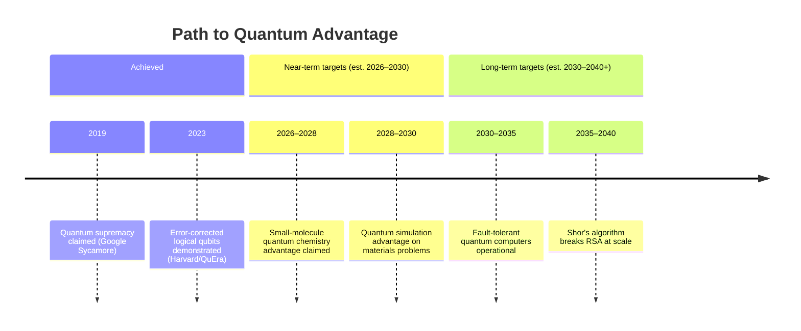
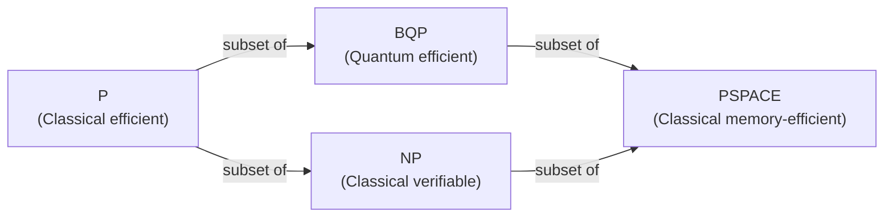

# Day 18 — Quantum Advantage vs. Quantum Supremacy

> **Today's one idea:** "Quantum supremacy" means a quantum computer did *something* faster than any classical computer — even a useless something. "Quantum advantage" means a quantum computer solved a *useful* problem faster than the best classical approach. They are very different milestones, and only the first has been claimed.
> **Reading time:** ~35 min · **Prereqs:** Days 12, 13, 17
> **Primary source for today:** John Preskill, "Quantum Computing in the NISQ Era and Beyond," *Quantum* 2:79, 2018. arXiv:1801.00862
> **Before you start:** Recall Day 17's load-bearing idea — one sentence, no looking. Name two quantum hardware platforms and the single most important tradeoff that distinguishes them.

---

## The hook

In October 2019, Google published a paper in *Nature* with a striking claim: their 53-qubit Sycamore processor had performed a computation in 200 seconds that would take the world's best supercomputer 10,000 years.

The headlines were instant: "Google Achieves Quantum Supremacy." Within days, IBM pushed back: their supercomputer could actually do the same task in 2.5 days with cleverer classical algorithms — not 10,000 years.

The debate raged. Who was right? And what did it actually mean?

The answer requires understanding the precise definition of what was claimed — and recognizing how far it is from what anyone actually needs quantum computers to do.

---

## Building the intuition

### Quantum supremacy — the technical definition

**Quantum supremacy** (a term coined by John Preskill in 2012): a demonstration that a quantum device can perform *some* computational task faster than any classical computer could — even if that task has no practical value.

Google's demonstration: the Sycamore processor sampled from a probability distribution produced by a random quantum circuit. The distribution is hard to classically simulate (classical simulation requires tracking ~2^53 ≈ 10^16 amplitudes). Google claimed: we sampled from this distribution in 200 seconds; classically, it would take 10,000 years.

**What was proven:**
- A quantum device can execute a specific circuit faster than classical simulation of that circuit.
- The quantum device is operating as a quantum system (not just a classical noisy device).

**What was NOT proven:**
- The task has any useful application.
- The quantum device is faster than classical on any problem anyone actually cares about.
- The classical estimate of 10,000 years was correct (IBM's 2.5-day counter-claim had merit).

### Quantum advantage — the goal

**Quantum advantage** (or practical quantum advantage): a quantum computer performs a *useful, practically relevant* task better than the best available classical algorithm.

"Better" can mean faster, cheaper, or more energy-efficient. "Useful" means the problem has real-world value (drug discovery, cryptanalysis, optimization, machine learning).

No quantum advantage has been demonstrated as of 2026. The roadmap looks like this:

### The NISQ era — where we actually are

Preskill coined a second term in the same 2018 paper: **NISQ** — Noisy Intermediate-Scale Quantum.

NISQ devices are:
- **Noisy:** Error rates too high for most quantum algorithms to run reliably without error correction.
- **Intermediate-Scale:** 50–1,000+ qubits — large enough to be interesting, too small and too noisy for fault-tolerant computation.

What can NISQ devices do today?
- Demonstrate quantum supremacy on toy tasks ✓
- Run small quantum chemistry simulations (potential near-term advantage) — uncertain
- Run variational quantum algorithms (VQAs) for optimization — modest and contested
- **Run Grover's or Shor's algorithm at useful scale:** No. Far from it.

### A vocabulary for evaluating headlines

| Term | Precise meaning | What it doesn't mean |
|---|---|---|
| Quantum supremacy | Beat classical on *any* task, even a useless one | Useful quantum computing |
| Quantum advantage | Beat classical on a *useful* task | Definitely achieved |
| NISQ | Current era: real but noisy devices | Fault-tolerant quantum computers |
| Fault tolerant | Error-corrected, runs arbitrary long algorithms | Exists today |
| Logical qubit | Error-protected qubit from many physical qubits | Same as physical qubit |
| Quantum volume | IBM's quality metric (higher = better) | Not universal across platforms |

### How to read a quantum computing news story

When a headline says "quantum computer achieves breakthrough," ask:

1. **What task was performed?** Is it useful or a demonstration problem?
2. **What was the classical comparison?** What algorithm and hardware? Was it the best classical approach?
3. **What qubit count and error rate?** NISQ devices can't run useful algorithms at depth.
4. **What does this imply about the timeline to useful quantum computing?** Nothing, usually — breakthroughs in demonstrations don't linearly translate to useful machines.

---

## The formal picture

**Quantum computational complexity:** The formal framework for analyzing when quantum computers outperform classical ones.

- **BQP (Bounded-Error Quantum Polynomial time):** Problems a quantum computer can solve in polynomial time with ≥2/3 probability. This is the "quantum P."
- **P ⊆ BQP:** Everything classical computers do efficiently, quantum can too.
- **Factoring ∈ BQP** (Shor): Factoring is in the quantum efficient class.
- **It is believed (not proven): P ≠ BQP** — quantum computers are strictly more powerful than classical for some problems.
- **NP ⊆ BQP? Unknown.** Quantum computers are not known to solve NP-complete problems efficiently. This is a major open question.

The key open question: where exactly does BQP sit relative to NP? Quantum computers can solve some problems outside P (like factoring), but there's no proof they solve all NP problems.

---

## Where it breaks / what it is not

**"Google's 2019 result means quantum computers are now useful."**
No. The demonstration problem (random circuit sampling) has no practical value. It was specifically designed to be hard for classical computers to simulate — not to solve any real-world problem. Supremacy is a proof-of-principle, not a product.

**"IBM's counter-claim invalidated Google's result."**
Partially. IBM showed the classical estimate was too pessimistic — better classical algorithms could simulate the task faster than Google claimed. But a more refined version of the same experiment by Google's group in 2023 addressed some objections. The conclusion that the quantum device is operating quantumly is broadly accepted; the exact classical comparison remains debated.

**"We're 5 years away from quantum advantage."**
This has been said every 5 years since the 1990s. Preskill's 2018 paper is careful to avoid specific timelines. The most honest assessment: useful quantum advantage could come in the 2030s for specific chemistry or materials problems — but is far from certain.

**"Quantum computers will replace classical computers."**
No. Quantum computers will be coprocessors — accelerators for specific problems, just as GPUs accelerate specific ML workloads. Classical computing is not threatened for the vast majority of tasks.

---

## Try it yourself

**1. Retrieval — close the page.** Write down in one sentence: what is the difference between quantum supremacy and quantum advantage — and which one has been demonstrated as of 2026? Open only after writing your answer.

Answer

Quantum supremacy means a quantum device outperformed classical on some task, even a useless one; quantum advantage means outperforming classical on a practically useful task. Google claimed supremacy in 2019 (random circuit sampling) — but this task has no practical value and the classical comparison was contested. As of 2026, quantum advantage for any commercially relevant problem has not been demonstrated.

**2. Check understanding.**
A news headline reads: "Quantum computer solves problem in 3 minutes that would take classical computers 10,000 years." What three questions would you ask before accepting this claim?

Answer

(1) What problem was solved, and is it practically useful or a synthetic demonstration? (2) What classical algorithm was used for comparison — was it the best known, or a naive baseline? (3) Has the result been independently verified, and have classical researchers confirmed they can't do better? (Many quantum supremacy claims have been partially walked back as classical algorithms improved.)

**3. Apply.**
A company announces "quantum advantage for drug discovery." They report their quantum computer found the ground state energy of a small molecule (10 atoms) faster than a classical simulation. Evaluate this claim.

Answer

Promising but needs scrutiny:
(1) 10 atoms is a very small molecule — classical quantum chemistry methods (density functional theory, coupled cluster) are highly effective at this scale. "Quantum advantage" at 10 atoms is surprising and should be examined carefully.
(2) What classical comparison? DFT on a laptop would likely solve a 10-atom ground state energy in seconds to minutes. The relevant comparison is to the best classical methods, not a naive baseline.
(3) Is this result a gateway to useful molecules (100+ atoms where classical methods struggle)? A 10-atom demonstration doesn't demonstrate advantage for practically useful drug-candidate molecules.
Verdict: Extraordinary claim requiring extraordinary evidence. Likely premature to call it "advantage."

**4. Stretch.**
Preskill speculated in 2018 that NISQ devices might show "quantum advantage" for specific near-term applications using variational quantum algorithms (VQAs). Why has this hope proven more difficult to realize than expected?

Answer

VQAs (like QAOA and VQE) use classical optimization to tune quantum circuit parameters, hoping to use noisy quantum hardware to find approximate solutions to optimization or chemistry problems. Three problems emerged:
(1) Barren plateaus: VQA optimization landscapes flatten exponentially as problem size grows, making classical parameter tuning fail. Random initialization gives gradients near zero — the algorithm can't train.
(2) Classical simulation: Many VQA instances that would run on NISQ hardware can be efficiently simulated classically (using tensor networks or other methods), undermining the proposed advantage.
(3) Noise sensitivity: NISQ errors corrupt the quantum computation enough that the result is dominated by noise rather than the actual quantum optimization. Classical algorithms tend to outperform noisy quantum VQAs on the same problems.
This doesn't mean VQAs are worthless — but they haven't delivered the practical advantage that optimists hoped for.

---

**Transfer — apply it (all levels):** Find or invent a quantum computing headline (real or plausible). Apply today's three questions: (1) What task was performed — useful or synthetic? (2) What was the classical comparison, and was it the best known? (3) What does this imply about the timeline to useful quantum advantage? Write one sentence per question.

---

## Connect it back

Module 3 is complete. You now understand not just what quantum computers can *theoretically* do — but why building them is extraordinarily difficult, what the current hardware looks like, and how to read the news without being deceived by imprecise language.

Module 4 turns to applications: what is real, what is coming, and what is hype. Starting tomorrow with quantum cryptography — the one application where quantum mechanics is being commercially deployed *right now*.

**The question you should now be able to answer:** What is the difference between quantum supremacy and quantum advantage, and why does the distinction matter?

---

## Suggested readings for today

**Required if you have 15 extra minutes:**
Preskill, "Quantum Computing in the NISQ Era and Beyond," Sections 1 and 2, arXiv:1801.00862. The first six pages are the clearest honest assessment of where quantum computing stands and what NISQ-era devices can and cannot do. Essential reading for the vocabulary of this field.

**If you want the deep version:**
- Frank Arute et al. (Google AI), "Quantum Supremacy Using a Programmable Superconducting Processor," *Nature* 574:505–510, 2019. DOI: 10.1038/s41586-019-1666-5. The original supremacy paper. The introduction (1 page) and conclusion (1 page) are readable; the technical sections require quantum information background.
- Scott Aaronson's blog: scottaaronson.blog. Aaronson's live commentary on the Google supremacy result and the IBM counter-claim in October 2019 is the best real-time analysis of a major quantum computing claim by a deeply informed skeptic. Search "Quantum Supremacy: The Gloves Are Off."

---

## Navigation

← **Previous:** [Day 17 — The Hardware Landscape](./day-17-hardware-landscape.md)
→ **Next:** [Day 19 — Quantum Cryptography — Unhackable by Physics](../../04-applications-future/days/day-19-quantum-cryptography.md)
