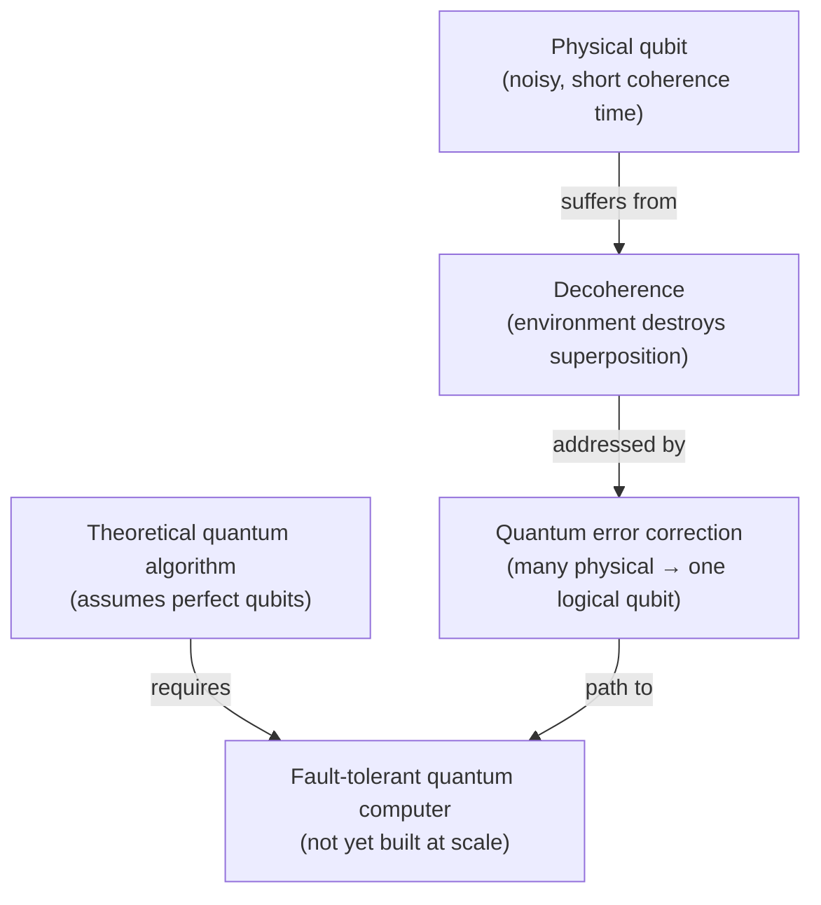

# Module 3 — Building Real Quantum Computers (Days 15–18)

## What this module earns you

By the end of Day 18, you will understand *why* we don't yet have the quantum computers that Modules 1 and 2 described — and you'll have precise vocabulary for evaluating hardware claims, news stories, and company announcements. You'll know the difference between "quantum supremacy" and "quantum advantage," and why that distinction matters enormously.

## The central tension of this module

Everything in Module 2 assumed a perfect quantum computer: gates that work exactly, qubits that hold their state indefinitely, measurements that are reliable. None of that is true in practice.

The real challenge is a phenomenon called **decoherence** — quantum states are extraordinarily fragile, and any interaction with the environment destroys them. This module traces the engineering response: error correction (which works in principle but requires a staggering amount of overhead), hardware design (which involves fundamental physical tradeoffs), and the honest accounting of where we actually are in 2026.

## The hardware vs. theory gap

## Days in this module

| Day | Title | Link |
|-----|-------|------|
| 15 | Decoherence — The Enemy of Quantum | [→](days/day-15-decoherence.md) |
| 16 | Quantum Error Correction — Fighting Back | [→](days/day-16-error-correction.md) |
| 17 | The Hardware Landscape | [→](days/day-17-hardware-landscape.md) |
| 18 | Quantum Advantage vs. Quantum Supremacy | [→](days/day-18-advantage-vs-supremacy.md) |

← [Back to course overview](../../README.md)
