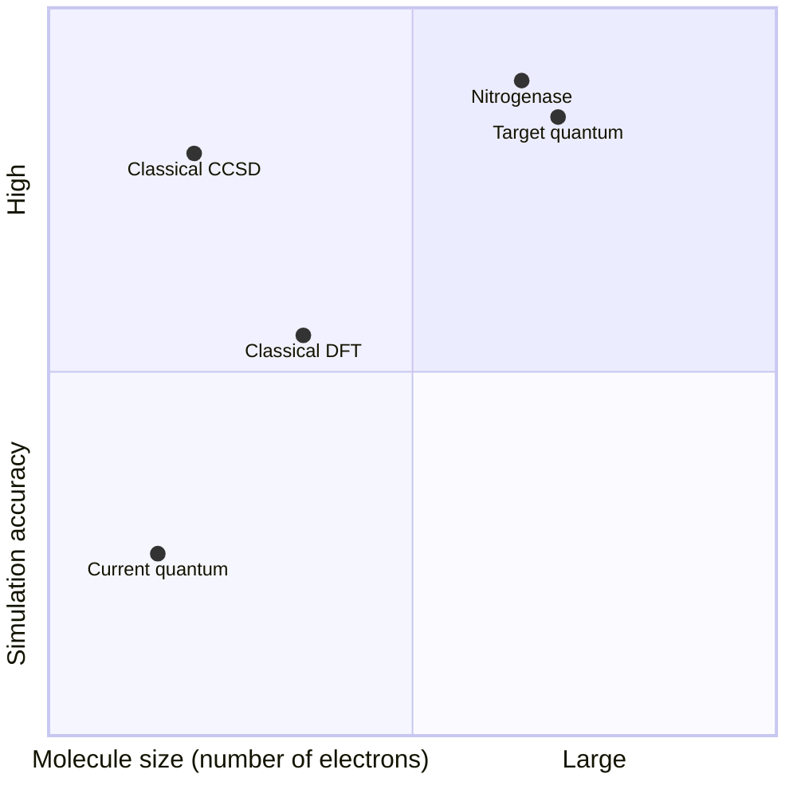

# Day 20 — Quantum Simulation — The Original Killer App

> **Today's one idea:** Quantum computers can simulate quantum systems — molecules, materials, chemical reactions — that are fundamentally impossible to simulate classically at scale, and this is the application most likely to deliver the first genuine quantum advantage.
> **Reading time:** ~35 min · **Prereqs:** Days 5, 9
> **Primary source for today:** Richard Feynman, "Simulating Physics with Computers," *International Journal of Theoretical Physics* 21(6/7):467–488, 1982.

---

## The hook

In 1918, a German chemist named Fritz Haber won the Nobel Prize for a process that would transform human civilization: synthesizing ammonia from nitrogen and hydrogen. The Haber-Bosch process now produces fertilizer that feeds roughly half the global population.

But here's an extraordinary fact: certain soil bacteria have been doing the same chemistry for billions of years, at room temperature, without high pressure, and with far less energy — using a single enzyme called nitrogenase. If we understood exactly *how* nitrogenase works at the quantum level, we could potentially design an industrial process that mirrors it — slashing the energy cost of fertilizer production and feeding billions more people more sustainably.

The problem: nitrogenase involves about 160 atoms with complex quantum interactions. Classical computers cannot simulate it accurately. The quantum state space is simply too large — 2^160 configurations to track simultaneously, far beyond any conceivable classical hardware.

A quantum computer with a few hundred reliable logical qubits could simulate nitrogenase directly. This single application would justify the entire field.

---

## Building the intuition

### Why classical simulation fails — the exponential wall again

Return to Day 1's insight: classical computers hit an exponential wall when simulating quantum systems. To simulate N electrons in a molecule:
- The state space has 2^N basis configurations.
- Storing the full state requires 2^N complex numbers.
- Evolving the state requires 2^N × 2^N matrix operations.

For small molecules (water: 10 electrons, caffeine: 58 electrons), approximate classical methods work well. But:
- For molecules with 50+ electrons, the state space (2^50 ≈ 10^15) exceeds petabytes of RAM.
- For 100+ electrons, simulation is physically impossible classically.
- Exact treatment of electron-electron interactions at scale remains beyond any classical hardware.

### What quantum simulation actually means

A quantum simulator doesn't "run" chemistry software. Instead, it *encodes the quantum state of the molecule directly in the qubits and lets the quantum hardware evolve it* according to the quantum mechanical equations that govern the molecule.

Think of it as: build a quantum analog model. The qubits represent electrons. The gates represent the forces between them. Run the simulation, measure the energy — and you have the molecule's ground state energy to high precision.

Feynman's 1982 insight: "If you want to make a simulation of nature, you'd better make it quantum mechanical." A quantum computer *is* a quantum mechanical system — it can simulate other quantum mechanical systems without exponential overhead.

### The applications

**Drug discovery:** Understanding how a drug molecule binds to a protein requires knowing the molecule's precise quantum mechanical properties — energy landscape, electron distribution, reaction pathways. Quantum simulation could enable *in silico* drug design with accuracy beyond any current classical method.

**Materials science:** Designing superconductors that work at room temperature, better batteries, more efficient solar cells — all require understanding quantum behavior of electrons in materials. Classical simulation of correlated electron systems (Hubbard model, etc.) is notoriously hard; quantum simulation could unlock it.

**Catalysis:** The nitrogenase example above. Many industrial chemical reactions use expensive catalysts (platinum, palladium). Quantum simulation could help design cheaper alternatives by understanding catalytic mechanisms at the quantum level.

**Nuclear physics:** Simulating atomic nuclei, understanding matter in neutron stars — domains where classical simulation breaks down at relatively small system sizes.

### Where we are today — the NISQ simulation gap

Current quantum computers can simulate small molecules (H₂, LiH, BeH₂) using variational quantum algorithms (VQE — Variational Quantum Eigensolver). These are "proof of concept" simulations: the same results can be achieved more accurately on a laptop with classical quantum chemistry software.

The crossover point — where quantum simulation gives better results than any classical method on a practically useful molecule — is estimated to require ~100–200 reliable logical qubits. That's far beyond current NISQ hardware (which has ~0 logical qubits with full error correction).

---

## The formal picture

**Variational Quantum Eigensolver (VQE):** The leading near-term quantum simulation algorithm. Uses a parameterized quantum circuit (ansatz) to prepare a trial molecular state, measures the energy, then classically optimizes the circuit parameters to minimize it. The ground state energy is found iteratively.

VQE is the NISQ-era approach — it doesn't need deep circuits (avoids decoherence) but is limited in accuracy by the expressiveness of the ansatz and noise in the hardware.

**Quantum phase estimation (QPE):** The theoretically optimal simulation algorithm. Achieves chemical accuracy (errors <1 kcal/mol) without approximation — but requires fault-tolerant quantum computers with deep circuits. This is the long-term approach.

**Resource estimates for quantum advantage in chemistry:**

| Molecule | Classical difficulty | Estimated logical qubits needed | Estimated physical qubits (surface code) |
|---|---|---|---|
| H₂ (hydrogen) | Easy | ~2 | ~2,000 |
| FeMo-co (nitrogenase active site) | Impossible classically | ~100–200 | ~4 million |
| Cytochrome P450 (drug metabolism) | Impossible | ~500–1,000 | ~20 million |

The nitrogenase problem is the canonical benchmark — a molecule with clear scientific value, known to be classically intractable, and estimated to require resources within the range of a 2030s fault-tolerant quantum computer.

---

## Where it breaks / what it is not

**"Quantum computers will design drugs by 2030."**
Not by 2030. The hardware gap between NISQ devices and the fault-tolerant machines needed for useful molecular simulation is enormous. The honest estimate for first genuinely useful quantum chemistry simulation: early-to-mid 2030s, optimistically.

**"Quantum simulation will make drug discovery automatic."**
No. Quantum simulation provides one piece of the puzzle — accurate energy calculations. Drug discovery involves many other factors: pharmacokinetics, toxicity, formulation, regulatory approval, clinical trials. Quantum advantage in simulation doesn't bypass those steps.

**"Classical quantum chemistry will never catch up."**
Classical methods continue improving rapidly — tensor network methods, machine learning potentials (like AlphaFold's protein folding), and Monte Carlo methods push the frontier constantly. The crossover point where quantum is clearly better may move as classical algorithms improve. This is a legitimate open question.

---

## Try it yourself

**1. Check understanding.**
Feynman said nature "isn't classical." Why does this make quantum simulation the natural application for quantum computers?

Answer

Classical computers represent states as definite values (0s and 1s) and simulate quantum systems by explicitly tracking all 2^N superposition states — which becomes exponentially expensive. A quantum computer is itself a quantum system: it can be in superpositions of 2^N states simultaneously, without exponential memory. When you encode a molecule's electrons into qubits and let the quantum circuit evolve them, you're letting one quantum system simulate another — exponential overhead disappears because the hardware naturally supports the state space. This is the argument Feynman made in 1982.

**2. Apply.**
A startup claims their NISQ device "simulates the nitrogenase enzyme and discovers a more efficient catalyst." Given what you know about current quantum hardware and the nitrogenase problem, why is this claim almost certainly wrong?

Answer

Simulating nitrogenase's active site (FeMo-co) accurately requires approximately 100–200 logical qubits with full quantum error correction — translating to millions of physical qubits. Current NISQ devices have ~0 logical qubits (no error correction at scale) and operate with too much noise for accurate molecular simulation at this scale. Any "simulation" on current NISQ hardware of a system this large would be dominated by noise, not quantum mechanical accuracy. The result would be meaningless. A truthful version of this claim would say they're doing a small proof-of-concept on a simplified model — not the full enzyme.

**3. Stretch.**
The Variational Quantum Eigensolver (VQE) uses a classical optimizer to tune quantum circuit parameters. This is a hybrid classical-quantum approach. What are the two main limitations of VQE that prevent it from scaling to the nitrogenase problem?

Answer

(1) Barren plateaus: As the quantum circuit grows to represent larger molecules, the optimization landscape flattens exponentially — gradients of the cost function become vanishingly small, making it impossible for the classical optimizer to find the right direction. VQE simply fails to converge on large systems.
(2) Circuit depth and noise: Representing the molecular state accurately requires a sufficiently expressive ansatz, which requires deeper circuits. On NISQ hardware, deeper circuits accumulate more noise, degrading the accuracy of energy measurements. The tension between needing deep circuits for accuracy and shallow circuits for noise tolerance currently limits VQE to small molecules that classical computers can already handle.

---

## Connect it back

Quantum simulation is Feynman's original vision — and the most compelling near-term argument for the field. But "near-term" here means early 2030s at optimistic estimates. Tomorrow (Day 21) examines a flashier application that has attracted enormous hype: quantum machine learning. The contrast — quantum simulation, where the case for advantage is physically grounded, vs. QML, where most claims are contested — is one of the most instructive distinctions in the field.

**The question you should now be able to answer:** Why can quantum computers simulate molecules that classical computers cannot, even in principle?

---

## Suggested readings for today

**Required if you have 15 extra minutes:**
Richard Feynman, "Simulating Physics with Computers," *International Journal of Theoretical Physics* 21(6/7):467–488, 1982. Read pages 1–5 (Sections I–III). This is the original paper — Feynman's argument is clear and requires no physics training to appreciate the core insight.

**If you want the deep version:**
- Hidary, *Quantum Computing: An Applied Approach*, 2nd ed., Chapter 8 ("Quantum Chemistry"), Springer, 2021. Pages 195–230. The most accessible engineering-oriented treatment of VQE and quantum chemistry simulation, with concrete resource estimates.
- Preskill, "Quantum Computing in the NISQ Era and Beyond," Section 4.1 ("Quantum simulation"), arXiv:1801.00862. Preskill's assessment of which simulation problems are most likely to show genuine quantum advantage first.

---

## Navigation

← **Previous:** [Day 19 — Quantum Cryptography — Unhackable by Physics](./day-19-quantum-cryptography.md)
→ **Next:** [Day 21 — Quantum Machine Learning — Hype vs. Reality](./day-21-quantum-ml.md)
