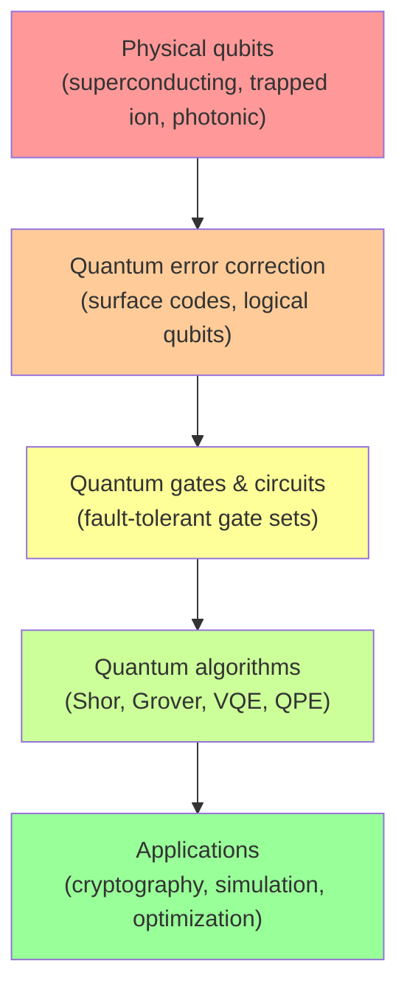

# Day 22 — The Road Ahead — Timelines, NISQ, and Fault Tolerance

> **Today's one idea:** We are in the NISQ era — real quantum hardware exists and is progressing rapidly, but fault-tolerant quantum computers capable of running the landmark algorithms are still a decade or more away, and the path requires solving both hardware and software problems that remain open.
> **Reading time:** ~35 min · **Prereqs:** Days 15–21
> **Primary source for today:** John Preskill, "Quantum Computing in the NISQ Era and Beyond," full paper, arXiv:1801.00862 (2018)

---

## The hook

In 1903, the Wright Brothers flew at Kitty Hawk for 12 seconds, covering 120 feet. By 1969, humans landed on the moon. Sixty-six years from first flight to lunar landing.

In 1994, Peter Shor published his factoring algorithm. In 2026, the largest number ever factored by a quantum computer is still smaller than typical RSA keys by many orders of magnitude. Thirty-two years and still counting.

Progress in quantum computing has been genuine and rapid — but the gap between demonstration and practical utility remains vast. Today's page gives you a calibrated map of where we are, what the key milestones are, and how to track progress without being misled by either optimism or pessimism.

---

## Building the intuition

### The three eras of quantum computing

```mermaid
timeline
    title Quantum Computing Eras
    section Era 1: Proof of concept (1994–2019)
        1994 : Shor's algorithm published
        2001 : IBM demonstrates 7-qubit NMR quantum computer
        2016 : IBM launches first cloud-accessible quantum computer (5 qubits)
        2019 : Google claims quantum supremacy (53 qubits)
    section Era 2: NISQ (2019–~2030)
        2023 : IBM Condor (1,121 qubits), Harvard/QuEra logical qubits (48)
        2024 : NIST post-quantum standards finalized
        2025 : Google Willow chip demonstrates below-threshold error correction
        2026 : Where we are now
    section Era 3: Fault tolerance (~2030–2040+)
        ~2030 : First fault-tolerant quantum computer (est.)
        ~2035 : First quantum advantage in chemistry/simulation (est.)
        ~2040 : Shor's algorithm breaks RSA at useful scale (est.)
```

### The NISQ era — an honest assessment

NISQ devices today can:
- Run quantum circuits with 50–1,000+ physical qubits
- Demonstrate quantum supremacy on synthetic tasks
- Run small chemistry simulations (VQE on H₂, LiH)
- Demonstrate early error correction (Google's Willow, 2024: first below-threshold surface code)
- Enable quantum cryptography (QKD commercially deployed)

NISQ devices today cannot:
- Run Shor's algorithm on RSA-relevant numbers (need millions of logical qubits)
- Run Grover's algorithm to useful depth without noise corruption
- Simulate practically useful molecules (nitrogenase needs ~100 logical qubits)
- Demonstrate quantum advantage on any commercially valuable problem

### The key milestones to watch

Rather than guessing at years (which everyone gets wrong), here are the *milestones* that indicate real progress:

**Milestone 1 — Below-threshold error correction at scale**
Definition: A quantum processor demonstrates that adding more physical qubits to an error-correction code actually *reduces* logical error rate (below the fault-tolerance threshold). 
Status: Google's Willow chip (2024) demonstrated this for the first time, with error rate suppression doubling for each code distance increase. This is a genuine milestone — the first time hardware crossed into the regime where error correction works as theoretically expected.

**Milestone 2 — 1,000 logical qubits with <0.1% logical error rate**
Definition: A machine operates with 1,000+ fault-tolerant logical qubits, each with logical error rate below 0.1% per gate.
Status: Not yet achieved. Current best: Google/IBM claim tens of nascent logical qubits; no large-scale logical qubit array demonstrated.
Significance: This would unlock the first practically interesting quantum chemistry simulations beyond classical capability.

**Milestone 3 — Quantum advantage in simulation or optimization**
Definition: A quantum computer solves a specific, practically relevant problem faster or more accurately than the best available classical method, independently verified.
Status: Not yet achieved. Most credible first domain: molecular simulation.
Significance: The first genuine return on the $50B+ invested in quantum computing globally.

**Milestone 4 — Fault-tolerant machine capable of running Shor's algorithm on RSA-2048**
Definition: A quantum computer with ~4 million physical qubits, running below-threshold error correction, completing the factoring of a 2048-bit RSA key.
Status: Requires advances in qubit count (3,000×), error rates, and error correction that are each individually challenging. Most credible expert estimate: 2035–2050, depending on breakthroughs.
Significance: The moment post-quantum cryptography migration becomes non-optional.

### The investment and geopolitical landscape

Quantum computing is now a national security priority. As of 2025:
- **US:** ~$3B federal investment via CHIPS Act + National Quantum Initiative; major players include IBM, Google, Microsoft, Amazon, IonQ, PsiQuantum.
- **China:** Estimated $15B+ government investment; Baidu, Alibaba, Origin Quantum competing nationally.
- **EU:** €1B+ via Quantum Flagship initiative.
- **UK:** £2.5B National Quantum Strategy.

The race is driven by: cryptographic applications (breaking RSA = national security advantage), simulation for drug/materials discovery, and quantum communication networks.

---

## The formal picture

**The quantum computing stack — from physics to application:**



Current state: Layer A (physical qubits) is mature. Layer B (error correction) is transitioning from theory to first demonstrations. Layers C–E remain theoretical for fault-tolerant systems.

**Expert consensus on timelines (2026 survey of leading researchers):**

| Milestone | Median estimate | Range |
|---|---|---|
| 100 logical qubits below threshold | 2028–2030 | 2027–2035 |
| First quantum chemistry advantage | 2030–2035 | 2027–2045 |
| Fault-tolerant machine capable of Shor | 2035–2040 | 2030–2060 |
| Quantum internet (continental scale) | 2030–2040 | 2028–2050 |

These ranges are wide because quantum computing timelines have historically been overoptimistic. Treat them as calibrated guesses, not predictions.

---

## Where it breaks / what it is not

**"Quantum computing is overhyped — it'll never work."**
No. Error correction demonstrations (Google Willow, 2024) are genuine scientific milestones. The physics is sound. The engineering challenges are extremely hard but not fundamentally impossible. "It'll never work" is as wrong as "it'll be ready in 5 years."

**"Quantum computing is on track to transform everything by 2030."**
No. The milestones above show that even the most optimistic timeline has fault-tolerant machines arriving in the 2030s, with practically useful advantage perhaps in the early 2030s for narrow problems. "Transform everything" — including AI, optimization, and logistics broadly — is decades further, if ever.

**"You should wait to act on post-quantum cryptography until quantum computers are capable."**
No. "Harvest now, decrypt later" attacks (Day 13) mean the threat timeline is earlier than the quantum computer arrival date. Organizations handling long-lived sensitive data should migrate to post-quantum cryptographic standards now. NIST's 2024 standards make this actionable today.

---

## Try it yourself

**1. Check understanding.**
What is the fault-tolerance threshold, and why does Google's 2024 Willow demonstration matter?

<details>
<summary>Answer</summary>
The fault-tolerance threshold is the physical error rate below which quantum error correction reduces logical error rates — meaning larger codes are more reliable, not less. Above the threshold, adding more physical qubits makes things worse (errors propagate through correction operations). Google's Willow chip demonstrated below-threshold operation: doubling the code distance (using more physical qubits) halved the logical error rate, matching theoretical predictions. This is the first time hardware demonstrated this crucial transition. It doesn't mean fault-tolerant quantum computers exist yet — but it confirms the engineering path is real.
</details>

**2. Apply.**
A CISO (Chief Information Security Officer) asks you: "Should we start migrating our encryption systems to post-quantum standards now, or wait until quantum computers are actually capable of breaking RSA?" What do you advise?

<details>
<summary>Answer</summary>
Start now. The reasons:
(1) "Harvest now, decrypt later" means adversaries may already be recording your encrypted traffic, to decrypt when quantum computers arrive. If your data has a 15+ year sensitivity requirement, the window is already closing.
(2) NIST finalized post-quantum standards in 2024 (CRYSTALS-Kyber, Dilithium). The standards are ready; implementation is underway in TLS 1.3, OpenSSH, and major cloud providers.
(3) Migration takes time — inventorying cryptographic dependencies, testing replacements, updating systems, and coordinating with partners can take 3–7 years for large organizations.
(4) The cost of early migration is manageable; the cost of being caught unprepared when a quantum computer arrives is potentially catastrophic for sensitive data.
</details>

**3. Stretch.**
Some researchers argue that the path from NISQ to fault-tolerant quantum computers is a "quantum winter" risk — that progress will stall before achieving practical utility, causing investment to collapse. What would a quantum winter look like, and what milestones would indicate it's occurring?

<details>
<summary>Answer</summary>
A quantum winter would look like: (1) Physical error rates stagnating above the fault-tolerance threshold despite engineering effort — suggesting fundamental materials or fabrication limits. (2) No quantum advantage demonstrated for any practically useful problem by 2030, causing enterprise customers to withdraw pilot investments. (3) A landmark dequantization result showing that quantum simulation advantages are also classically achievable (analogous to Tang's QML dequantization). (4) A new classical algorithm that factoring or simulation problems at scale that quantum computing was supposed to uniquely address.
Early warning indicators would include: qubit quality improvements slowing dramatically year-over-year; companies quietly downgrading their roadmap timelines; research publications shifting from "quantum advantage demonstrated" to "near-term challenges are more severe than expected." Note: quantum winters have happened before (1980s AI winter analog). They don't mean the field dies — they mean timelines extend and expectations recalibrate.
</details>

---

## Connect it back

You now have a complete, calibrated picture of quantum computing: the theory (Module 2), the hardware reality (Module 3), and the applications and timeline (Module 4). Tomorrow is the capstone — not a review, but a test of whether you can *use* this knowledge in three concrete writing tasks.

**The question you should now be able to answer:** What would it take for quantum computing to achieve practical advantage, and what is the most honest estimate of when this might occur?

---

## Suggested readings for today

**Required if you have 15 extra minutes:**
Preskill, "Quantum Computing in the NISQ Era and Beyond," full paper, arXiv:1801.00862. If you've only read sections so far, read it end-to-end today. It's 26 pages, and the final two sections ("The era beyond NISQ" and "Outlook") contain Preskill's own honest assessment of timelines and milestones.

**If you want the deep version:**
- McKinsey & Company, "Quantum Technology Monitor" (2024 edition). Search "McKinsey quantum technology monitor 2024." A rigorous annual survey of quantum computing investment, hardware progress, and application timelines from a business perspective. Good counterpoint to purely technical sources.
- Scott Aaronson's blog, scottaaronson.blog — his posts on Google's Willow chip (December 2024) and the 2024 NIST post-quantum standards are the most analytically precise public commentary available.

---

## Navigation

← **Previous:** [Day 21 — Quantum Machine Learning — Hype vs. Reality](./day-21-quantum-ml.md)
→ **Next:** [Day 23 — Capstone — Explain, Evaluate, Anticipate](./day-23-capstone.md)
