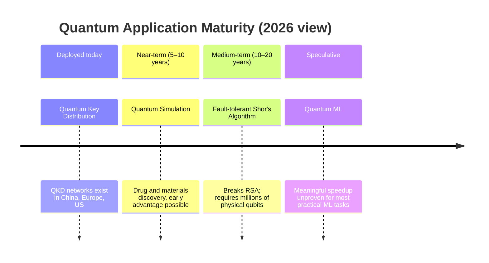

# Module 4 — Applications & Future (Days 19–23)

## What this module earns you

By the end of Day 23, you will be able to distinguish which quantum computing applications are real *now*, which are plausible *within a decade*, and which are hype — and you'll be able to justify that assessment. The capstone on Day 23 is the L1 finish line: three short writing challenges that force you to use everything the course built.

## The realism spectrum

This module deliberately arranges applications from most-proven to most-speculative:

## What ties it together

The through-line of Module 4 is a single question: **"Is this claim grounded in a known quantum speedup, or is it hand-waving?"** By Day 23, you should be able to answer that for any claim you encounter in a news article, a product announcement, or a board meeting.

## Days in this module

| Day | Title | Link |
|-----|-------|------|
| 19 | Quantum Cryptography — Unhackable by Physics | [→](days/day-19-quantum-cryptography.md) |
| 20 | Quantum Simulation — The Original Killer App | [→](days/day-20-quantum-simulation.md) |
| 21 | Quantum Machine Learning — Hype vs. Reality | [→](days/day-21-quantum-ml.md) |
| 22 | The Road Ahead — Timelines, NISQ, and Fault Tolerance | [→](days/day-22-road-ahead.md) |
| 23 | Capstone — Explain, Evaluate, Anticipate | [→](days/day-23-capstone.md) |

← [Back to course overview](../../README.md)
