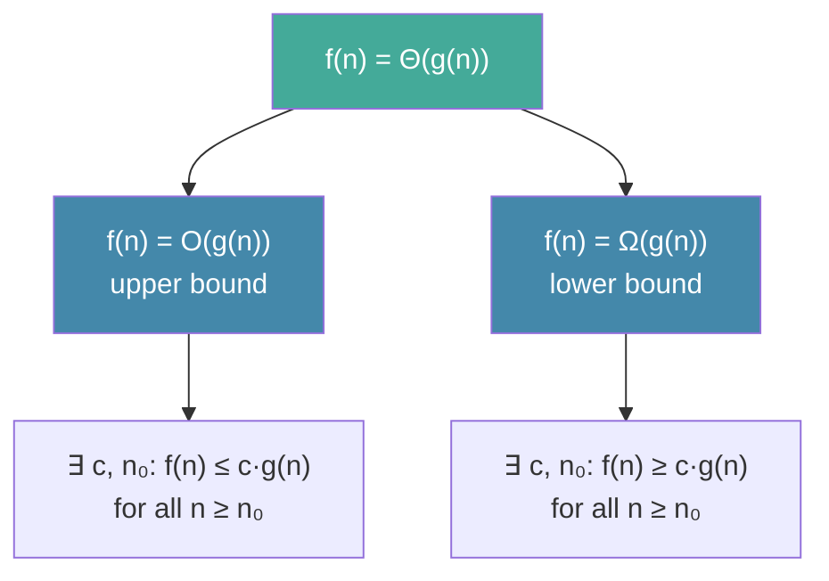

# Day 3 — Asymptotic Analysis — Big O from First Principles

> **Today's one idea:** O, Ω, and Θ are not about speed — they are about *shape*. They describe how an algorithm's cost grows relative to input size, independent of any particular machine.
> **Reading time:** ~38 min · **Prereqs:** Day 2
> **Primary source:** Knuth, *TAOCP* Vol. 1, §1.2.11 "Asymptotic Representations" (pp. 107–116, 3rd ed.)

---

## The hook

Imagine two colleagues both implement a search function. Colleague A's runs in 1 millisecond on their laptop. Colleague B's runs in 10 milliseconds on their laptop. Who wrote the better algorithm?

You cannot tell. A's laptop might be 10× faster. Or A might have searched a list of 10 items while B searched 1,000,000. Or A's function might be faster today but slower tomorrow when the dataset grows by 10×.

The question "how fast is this algorithm?" is unanswerable. The right question is: **as the input size n grows, how does the number of steps grow?**

That is what asymptotic notation captures. It throws away constants (those depend on hardware, compiler, and programmer skill) and focuses on the *shape* of growth: linear, quadratic, logarithmic, exponential.

---

## Building the intuition

### The race between functions

Consider three algorithms, each solving the same problem:

- **Algorithm A:** takes exactly $n^2$ steps.
- **Algorithm B:** takes exactly $100n$ steps.
- **Algorithm C:** takes exactly $n \log_2 n$ steps.

For small n, A can win:

| n | A: n² | B: 100n | C: n log₂n |
|---|-------|---------|-----------|
| 5 | 25 | 500 | ~12 |
| 10 | 100 | 1,000 | ~33 |
| 100 | 10,000 | 10,000 | ~664 |
| 1,000 | 1,000,000 | 100,000 | ~9,966 |
| 1,000,000 | 10¹² | 10⁸ | ~2×10⁷ |

At n=100, A and B tie. Beyond that, A becomes catastrophically worse. The constant 100 in B's formula is irrelevant at scale — what matters is that A grows as $n^2$ and B grows as $n$.

This is the core insight: **the dominant term wins, and constants become noise.**

---

### O notation — an upper bound

$f(n) = O(g(n))$ means: *f grows no faster than g, up to a constant factor, for large enough n.*

Formally: there exist constants $c > 0$ and $n_0$ such that $f(n) \leq c \cdot g(n)$ for all $n \geq n_0$.

```
Think of it as a race where you give O(g(n)) a head start of c laps.
No matter how big c is, eventually f(n) stays behind c·g(n).
```

**Examples:**
- $3n^2 + 7n + 100 = O(n^2)$ — the $n^2$ term dominates; the rest are noise for large n.
- $\log_2 n = O(n)$ — logarithm grows slower than linear.
- $2^n \neq O(n^{1000})$ — exponential eventually beats any polynomial.

**Common hierarchy (slowest to fastest growth):**

```
O(1) < O(log n) < O(n) < O(n log n) < O(n²) < O(n³) < O(2ⁿ) < O(n!)
```

---

### Ω notation — a lower bound

$f(n) = \Omega(g(n))$ means: *f grows at least as fast as g, up to a constant factor.*

Formally: there exist $c > 0$ and $n_0$ such that $f(n) \geq c \cdot g(n)$ for all $n \geq n_0$.

O gives a ceiling; Ω gives a floor. Together they sandwich the function.

---

### Θ notation — tight bound

$f(n) = \Theta(g(n))$ means: *f grows at the same rate as g* — it is both $O(g)$ and $\Omega(g)$.

Formally: $c_1 g(n) \leq f(n) \leq c_2 g(n)$ for all $n \geq n_0$ and some $c_1, c_2 > 0$.

**Example:** $\frac{n(n+1)}{2} = \Theta(n^2)$ — it is exactly quadratic. The $1/2$ constant vanishes; the $+n$ term vanishes. Only $n^2$ remains in the shape.

---

## The formal picture



**How Knuth uses it:** When Knuth says "Algorithm E uses $O(\log n)$ steps," he means: there is some constant $c$ such that, for all sufficiently large n, the step count never exceeds $c \log n$. He does not say the constant is 1, or 2, or 10 — that depends on the machine. He says the *shape* is logarithmic.

**The three-case analysis Knuth performs on every algorithm:**

| Case | What it means | Example |
|------|---------------|---------|
| Best case | Input that causes fewest steps | Already-sorted array for insertion sort |
| Worst case | Input that causes most steps; O(f(n)) guarantees hold for all inputs | Reverse-sorted array for insertion sort |
| Average case | Expected steps over all inputs (requires a probability model) | Random array for insertion sort |

For an L1 reader, worst case and average case are the two that matter most.

---

## Where it breaks / what it is not

**Misconception: O(f) means "the running time is f."**  
No. $O(n^2)$ means "the running time is *at most* proportional to $n^2$." The constant and lower-order terms are real costs — they matter for small n and for engineering. Asymptotic notation describes shape for large n, not absolute performance.

**Misconception: O(log n) is always fast.**  
For most practical n, yes. But if the constant hidden in O(log n) is $10^9$, it is slower than a $10^6$-step O(n) algorithm for n < $10^{18}$. Asymptotics are about the limit, not the near term.

**Misconception: The "average case" is the average of best and worst.**  
No. Average case requires a probabilistic model: you sum the step count for each possible input, weighted by the probability of that input occurring. Knuth is careful to state his probability model every time he claims an average case result.

**What Knuth's notation adds:** Knuth also uses $O$ on *error terms* — e.g., $\sum_{k=1}^n 1/k = \ln n + \gamma + O(1/n)$ where $\gamma$ is a constant. This use (expressing the precision of an approximation) is more sophisticated than the algorithmic-cost use, and you will see it from Day 28 onward.

---

## Try it yourself

**Exercise 1 — Check understanding:** For each pair, state whether f = O(g), g = O(f), or f = Θ(g):

a) f(n) = 3n + 7, g(n) = n  
b) f(n) = n², g(n) = n log n  
c) f(n) = log₂(n³), g(n) = log₂ n

<details>
<summary>Solution</summary>

a) f = Θ(g). 3n+7 ≤ 4n for n ≥ 7, and 3n+7 ≥ 3n for all n ≥ 1.  
b) g = O(f). n log n < n² for all n > 1. Also n² ≠ O(n log n), so not Θ.  
c) f = Θ(g). log₂(n³) = 3 log₂ n, which differs from log₂ n only by the constant 3.
</details>

---

**Exercise 2 — Apply:** The following Python function counts steps. What is its asymptotic step count?

```python
def mystery(n: int) -> int:
    count = 0
    i = 1
    while i <= n:
        j = 1
        while j <= i:
            count += 1
            j += 1
        i += 1
    return count
```

What does `mystery(n)` return? Express it using summation notation, then simplify to Θ(·).

<details>
<summary>Hint</summary>
The inner loop runs i times for each value of i. Sum i from 1 to n.
</details>

<details>
<summary>Solution</summary>

```
count = Σ(i=1 to n) i = n(n+1)/2
```

So `mystery(n)` returns n(n+1)/2. This is Θ(n²) — it grows like n² for large n. This is the exact cost of insertion sort on a reverse-sorted array.
</details>

---

**Exercise 3 — Stretch:** Prove from the definition that $n \log_2 n = O(n^{1.01})$. (Hint: $\log_2 n = O(n^{0.01})$ — can you argue why any polynomial beats any logarithm, eventually?)

<details>
<summary>Solution</summary>

For any ε > 0: $\log_2 n \leq n^\varepsilon / \varepsilon$ for all n ≥ 1 (this follows from L'Hôpital's rule or from the AM-GM inequality). Setting ε = 0.01: $\log_2 n = O(n^{0.01})$, so $n \log_2 n = O(n \cdot n^{0.01}) = O(n^{1.01})$. The constant hidden in O is $1/\varepsilon = 100$.
</details>

---

## Connect it back

On Day 1 you counted steps informally. On Day 2 you learned to write those counts precisely with summation notation. Today you learned to compare counts by their *shapes* rather than their exact values. These three skills together are Knuth's analytical toolkit — every algorithm analysis in TAOCP uses all three.

The specific result from Day 2 — $\sum_{k=1}^n k = n(n+1)/2$ — is now clearly $\Theta(n^2)$. Any algorithm whose step count has this form (like insertion sort on a reversed list) is quadratic, regardless of the constant.

**Tomorrow:** The MIX machine — Knuth's idealised computer that lets him assign specific costs to specific operations, so "O(log n)" can be made concrete: "at most 14 MIX instructions for n = 1000."

**One sharp question you can answer now:**  
*Why do two algorithms with costs $5n^2$ and $\frac{1}{100}n^2$ have the same asymptotic complexity, even though one is 500× slower?*

---

## Suggested readings for today

**Required if you have 15 extra minutes:**  
Knuth, *TAOCP* Vol. 1, §1.2.11 "Asymptotic Representations," pp. 107–116. Especially the discussion of O-notation on pp. 107–109 — Knuth's own warnings about the subtleties are valuable.

**If you want the deep version:**
- CLRS, 4th ed., Ch. 3 "Characterizing Running Times," pp. 49–76 — the standard modern treatment, with formal proofs of common O-Θ-Ω relationships. §3.1 (pp. 50–59) maps directly to today's page.
- Roughgarden, *Algorithms* (Coursera Part 1), Week 1 "Asymptotic Analysis" — a 40-minute video walkthrough of exactly this material. Search "Roughgarden Coursera asymptotic analysis."

---

## Navigation

← **Previous:** [Day 2 — Knuth's Mathematical Toolkit](day-02-mathematical-toolkit.md)  
→ **Next:** [Day 4 — How Knuth Describes Machines](day-04-mix-machine.md)
