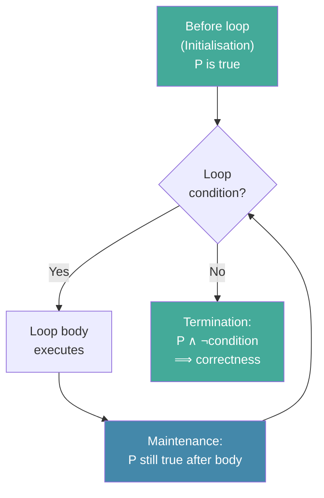

# Day 5 — Proof by Induction and Loop Invariants

> **Today's one idea:** A loop invariant is an inductive hypothesis wearing work clothes — a condition that is true before the loop starts, stays true after every iteration, and at termination hands you exactly the guarantee you need.
> **Reading time:** ~40 min · **Prereqs:** Days 2–4
> **Primary source:** Knuth, *TAOCP* Vol. 1, §1.2.1 "Mathematical Induction" (pp. 11–21, 3rd ed.)

---

## The hook

You write a loop. It terminates. The output looks right on the three test cases you tried. Is it correct?

Not necessarily. A loop can produce the right answer on specific inputs and the wrong answer on others. Testing shows the presence of bugs; it cannot show their absence.

Knuth does not test his algorithms. He *proves* them. The proof technique is mathematical induction, and when applied to loops it goes by the name of **loop invariant**. This is the single most important conceptual tool in all of TAOCP. Every correct algorithm in the series has an invariant, stated or implied.

---

## Building the intuition

### Induction on dominoes

Mathematical induction works like a row of dominoes. To show that all dominoes fall:

1. **Base case:** knock over the first one.
2. **Inductive step:** show that *if* domino k has fallen, *then* domino k+1 must fall too.

If both conditions hold, every domino falls — even the ones you never directly push.

Formally, to prove a statement P(n) holds for all integers n ≥ 1:
1. Prove P(1). *(Base case.)*
2. Assume P(k) is true for some arbitrary k ≥ 1. *(Inductive hypothesis.)*
3. Prove P(k+1) follows from P(k). *(Inductive step.)*

**Example:** Prove that $1 + 2 + 3 + \cdots + n = \frac{n(n+1)}{2}$.

- **Base case (n=1):** LHS = 1. RHS = 1·2/2 = 1. ✓
- **Inductive hypothesis:** Assume the formula holds for n=k: $\sum_{i=1}^k i = \frac{k(k+1)}{2}$.
- **Inductive step:** Show it holds for n = k+1:

$$\sum_{i=1}^{k+1} i = \underbrace{\sum_{i=1}^k i}_{\text{by hypothesis}} + (k+1) = \frac{k(k+1)}{2} + (k+1) = \frac{(k+1)(k+2)}{2}$$

That is exactly the formula with k+1 substituted for n. ✓

Induction does not tell you *where* the formula $\frac{n(n+1)}{2}$ came from — that required the pairing argument from Day 2. Induction *verifies* a claim you already believe to be true.

---

### The loop invariant as inductive hypothesis

A loop is just induction in motion. Each iteration is a "domino." The **loop invariant** is the property P that each iteration preserves.

**Structure of a loop invariant proof:**

```
1. INITIALISATION: P is true before the first iteration.
2. MAINTENANCE:    If P is true before iteration k, it is true after iteration k.
3. TERMINATION:    When the loop ends, P (together with the exit condition) implies correctness.
```

This is *exactly* base case + inductive step + conclusion.

---

### A concrete example: finding the maximum

```python
def find_max(A: list[int]) -> int:
    """Return the maximum element of non-empty list A."""
    max_so_far = A[0]
    for i in range(1, len(A)):
        if A[i] > max_so_far:
            max_so_far = A[i]
    return max_so_far
```

**Claimed invariant:** At the start of iteration i, `max_so_far` equals the maximum of `A[0..i-1]`.

Let's verify:

- **Initialisation (i=1):** `max_so_far = A[0]`, and the maximum of `A[0..0]` = `A[0]`. ✓
- **Maintenance:** Assume `max_so_far` = max of `A[0..i-1]`. After the if-statement, `max_so_far` = max(max_so_far, A[i]) = max of `A[0..i]`. ✓
- **Termination:** The loop ends with i = len(A). The invariant then says `max_so_far` = max of `A[0..len(A)-1]` = max of the whole list. ✓

The function is correct. Not "probably correct because it passed three tests" — provably correct for any non-empty list.

---

### Invariants in Euclid's algorithm

Return to Day 1's Algorithm E. The invariant is:

> **gcd(m, n) = gcd(original m, original n) throughout the loop.**

- **Initialisation:** trivially true.
- **Maintenance:** at each step, we set (m, n) ← (n, r) where r = m mod n. The mathematical fact that gcd(m, n) = gcd(n, m mod n) (Euclid's key lemma) is exactly the maintenance step.
- **Termination:** when n becomes 0, gcd(m, 0) = m. The invariant says this equals gcd(original m, original n). So the answer is correct.

The invariant *is* the algorithm's correctness argument. Once you see this, Knuth's step-by-step prose descriptions start to read differently — he is always, implicitly, naming the invariant.

---

## The formal picture



**Knuth's notation:** In TAOCP, Knuth labels invariants as assertions written in comments next to algorithm steps. For example in his sorting analysis: "A[1] ≤ A[2] ≤ ... ≤ A[j-1]" appears as an annotation on the outer loop of insertion sort. It *is* the invariant.

---

## Where it breaks / what it is not

**Misconception: Loop invariants only apply to `for` loops.**  
No. Every loop — `while`, `do-while`, `repeat-until`, recursive loops — has an invariant. For recursive algorithms, the invariant becomes the inductive hypothesis directly.

**Misconception: The invariant must be about the whole array.**  
The invariant is whatever condition lets you conclude correctness at termination. Sometimes it is about a partial result; sometimes about a pointer; sometimes about a count. Finding the right invariant is the creative part.

**Misconception: If no invariant comes to mind, test more inputs.**  
Testing cannot substitute for an invariant. If you cannot state the invariant, you do not yet understand *why* the algorithm is correct — and you will not be able to fix it when it breaks.

**Subtle trap:** The invariant must hold *at the start* of each iteration, not at the end. This distinction matters when the loop body modifies the relevant quantities mid-way before restoring them.

---

## Try it yourself

**Exercise 1 — Check understanding:** State the loop invariant for the following Python loop, then verify Initialisation, Maintenance, and Termination:

```python
def power(x: float, n: int) -> float:
    """Returns x**n for integer n >= 0."""
    result = 1.0
    for _ in range(n):
        result *= x
    return result
```

<details>
<summary>Solution</summary>

**Invariant:** After k iterations, `result` = x^k.

- **Init (k=0):** result = 1.0 = x⁰. ✓
- **Maintenance:** If result = x^k, then after `result *= x`, result = x^(k+1). ✓
- **Termination:** Loop runs n times; result = x^n; returned. ✓
</details>

---

**Exercise 2 — Apply:** Here is a well-known but subtly buggy binary search:

```python
def binary_search(A: list[int], target: int) -> int:
    lo, hi = 0, len(A) - 1
    while lo <= hi:
        mid = (lo + hi) // 2
        if A[mid] == target:
            return mid
        elif A[mid] < target:
            lo = mid + 1
        else:
            hi = mid - 1
    return -1
```

State the intended invariant (what property of `lo` and `hi` must hold at the start of each iteration?). Then verify: does `mid = (lo + hi) // 2` preserve it correctly? Is this version correct?

<details>
<summary>Solution</summary>

**Invariant:** If target is in A, it is in A[lo..hi].

- **Init:** lo=0, hi=len-1; the whole array. ✓
- **Maintenance:** We examine A[mid]. If A[mid] < target, target must be in A[mid+1..hi], so set lo=mid+1. If A[mid] > target, target must be in A[lo..mid-1], so set hi=mid-1. ✓
- **Termination:** lo > hi means the search range is empty → target not present → return -1. ✓

**Is this version correct?** Yes for Python (which has arbitrary-precision integers). In C or Java with fixed 32-bit integers, `(lo + hi)` can *overflow* when both are large. The safe form is `lo + (hi - lo) // 2`. This is the famous bug in Java's Arrays.binarySearch that went undetected for nearly a decade. The invariant is fine; the implementation of `mid` is the hazard.
</details>

---

**Exercise 3 — Stretch:** Prove by induction that Euclid's algorithm terminates in at most $2 \log_\phi n$ steps, where $\phi = (1+\sqrt{5})/2 \approx 1.618$ and n is the smaller of the two inputs. (Hint: what is the slowest-to-terminate input? Use the Fibonacci connection from Day 1 Exercise 3.)

<details>
<summary>Hint</summary>
Show that if the algorithm takes k steps, both inputs are at least as large as F(k) and F(k+1) (consecutive Fibonacci numbers). Then use F(k) ≥ φ^(k-1)/√5.
</details>

<details>
<summary>Solution (sketch)</summary>

By the result in Day 1 Exercise 3, worst-case inputs are consecutive Fibonacci numbers. F(k) ≥ φ^(k-2)/√5 for k ≥ 1. So if the smaller input is n, then n ≥ φ^(k-2)/√5, giving k ≤ log_φ(n√5) + 2 = O(log n). This is Lamé's Theorem (1844), and it is the first average-case analysis in the history of algorithm analysis. Knuth proves it fully in §1.2.8.
</details>

---

## Connect it back

You now have a complete proof of Euclid's algorithm: the invariant (gcd never changes) ensures correctness; the strict decrease in n ensures termination; the Fibonacci bound (Exercise 3) gives the O(log n) cost. That is a three-part structure — invariant + termination + cost — that Knuth applies to every algorithm in TAOCP.

From here, every time you encounter a new algorithm in this course, ask yourself immediately: *what is the invariant?* The answer will tell you why it is correct and will often suggest how to fix it when it is not.

**Tomorrow:** Generating functions — a technique for turning recurrence relations (like the Fibonacci connection in Exercise 3) into closed-form expressions. It is the power tool behind many of Knuth's analyses.

**One sharp question you can answer now:**  
*What are the three parts of a loop invariant proof, and which part corresponds to the base case of induction?*

---

## Suggested readings for today

**Required if you have 15 extra minutes:**  
Knuth, *TAOCP* Vol. 1, §1.2.1 "Mathematical Induction," pp. 11–21. Work through at least two of Knuth's own examples (the Fibonacci and the nim game). His proof style is a model for the rest of the series.

**If you want the deep version:**
- CLRS, 4th ed., §2.1 "Insertion sort" (pp. 19–29) — CLRS presents insertion sort entirely through its loop invariant, making the Day 5–Day 26 connection explicit. Reading this now prepares you for Module 4.
- David Gries. *The Science of Programming*. Springer, 1981 — the definitive treatment of loop invariants as a *design* tool, not just a verification tool. Chapter 4 is the key. Out of scope for L1, but worth knowing it exists.

---

## Navigation

← **Previous:** [Day 4 — How Knuth Describes Machines](day-04-mix-machine.md)  
→ **Next:** [Day 6 — Generating Functions](day-06-generating-functions.md)
