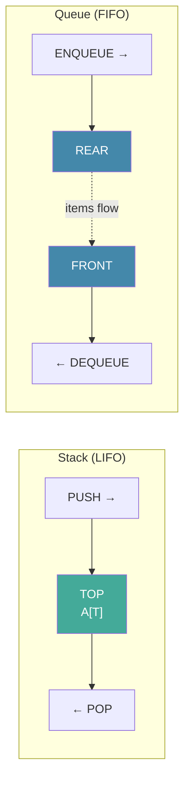

# Day 9 — Stacks and Queues — Sequential Allocation

> **Today's one idea:** A stack and a queue are not just "collections" — they are *disciplines* imposed on when items may be removed. That discipline determines everything about their cost, their correctness guarantees, and where they appear in algorithms.
> **Reading time:** ~35 min · **Prereqs:** Day 8
> **Primary source:** Knuth, *TAOCP* Vol. 1, §2.2.1 "Stacks, Queues, and Deques" (pp. 234–243, 3rd ed.)

---

## The hook

Think about two physical scenarios.

**Scenario A — The inbox tray.** You stack papers as they arrive. When you need to process one, you take from the *top* — the most recent arrival. The oldest papers sit forever at the bottom until everything above them is removed.

**Scenario B — The ticket queue.** People line up and are served in order of arrival. First in, first out. Nobody jumps ahead; nobody gets served from the back.

These two disciplines — last-in-first-out (LIFO) and first-in-first-out (FIFO) — are not just metaphors. They are the precise specifications of the stack and the queue. And as you will see throughout TAOCP, every algorithm that needs to "remember where to go back to" uses a stack, while every algorithm that needs to "process things in arrival order" uses a queue.

---

## Building the intuition

### The stack

A stack maintains a collection of items with two operations:
- **PUSH(S, x):** add item x to the top of stack S.
- **POP(S):** remove and return the top item of S.

The invariant is implicit: **the item returned by POP is always the most recently PUSHed item that has not yet been POPped.** That is LIFO.

**Implemented in an array:** Keep an integer T (the *top pointer*) that records how many items are currently on the stack. The items live at positions `A[1], A[2], ..., A[T]`.

```
Initial state (empty stack):
  T = 0
  A = [ _, _, _, _, _ ]   (underscores = unused)

After PUSH(A, 42):
  T = 1
  A = [42, _, _, _, _ ]

After PUSH(A, 17):
  T = 2
  A = [42, 17, _, _, _ ]

After POP(A):  → returns 17
  T = 1
  A = [42, _, _, _, _ ]   (17 is gone; T moved down)
```

**Algorithm (Knuth's S-notation):**

```
PUSH(S, X):                    POP(S):
  if T = M then OVERFLOW        if T = 0 then UNDERFLOW
  T ← T + 1                    X ← S[T]
  S[T] ← X                     T ← T - 1
                                return X
```

Where M is the maximum stack size. The invariant: **S[1..T] contains the current stack contents in push order.**

**Cost:** Every PUSH and POP is O(1) — one index increment and one array access. The stack is as efficient as a structure can be.

---

### Where stacks appear in algorithms

This is not abstract. Stacks are the hidden mechanism behind:
- **Function call management:** every time you call a function, its return address and local variables are *pushed* onto the call stack. When the function returns, they are *popped*. The "call stack" in a Python traceback is a literal stack.
- **Expression evaluation:** parsing `3 * (4 + 2)` uses a stack to handle parentheses.
- **Depth-first search** (which underlies tree traversal, Day 14) uses a stack, explicitly or via recursion.
- **Euclid's algorithm** (Days 1 and 5): the recursive form uses the call stack implicitly.

---

### The queue

A queue adds to the *rear* and removes from the *front* — FIFO.

- **ENQUEUE(Q, x):** add x to the rear.
- **DEQUEUE(Q):** remove and return the item at the front.

**Implemented as a circular array:** Use two pointers — F (front) and R (rear) — and wrap around when they reach the end of the array.

```
Array size = 5 (indices 0–4), initially empty: F=0, R=0

After ENQUEUE(Q, 'A'):  F=0, R=1,  Q=['A', _, _, _, _]
After ENQUEUE(Q, 'B'):  F=0, R=2,  Q=['A','B', _, _, _]
After DEQUEUE(Q):  → 'A',  F=1, R=2,  Q=[_,'B', _, _, _]
After ENQUEUE(Q, 'C'):  F=1, R=3,  Q=[_,'B','C', _, _]
After ENQUEUE(Q, 'D'):  F=1, R=4,  Q=[_,'B','C','D', _]
After ENQUEUE(Q, 'E'):  F=1, R=0,  Q=[_,'B','C','D','E']  ← R wraps around!
```

The modular arithmetic from Day 2 — specifically `R = (R + 1) mod M` — makes the circular wrap-around work cleanly.

**Cost:** ENQUEUE and DEQUEUE are each O(1).

---

### The deque (double-ended queue)

A **deque** (pronounced "deck") allows insertion and removal at *both* ends. It generalises both stack and queue. Knuth describes it in §2.2.1 as the general case; stack and queue are special cases where one end is sealed.

---

## The formal picture



**The critical difference:**

| Property | Stack | Queue |
|----------|-------|-------|
| Insertion point | Top | Rear |
| Removal point | Top | Front |
| Order discipline | LIFO | FIFO |
| Natural algorithm use | DFS, recursion unrolling | BFS, job scheduling |
| Array implementation | 1 pointer (T) | 2 pointers (F, R) with wrap |

---

## Where it breaks / what it is not

**Misconception: A stack is just an array.**  
An array is an implementation. A stack is a *contract*: you can only add and remove at one end. An array that allows access at arbitrary indices is not a stack — it offers too much freedom and thus provides none of the guarantees that make stacks useful in proofs and algorithms.

**Misconception: Queue overflow happens when F = R.**  
In a circular array with M slots, when F = R the queue *could* be either empty or full — you cannot tell. Knuth's standard solution: use M+1 slots and declare full when adding one more item would make R = F. Alternatively, maintain a count. This is a classic off-by-one trap.

**Misconception: Stacks and queues need arrays.**  
They can also be implemented as linked lists (you will have the tools for this after Day 10). Array implementations are faster in practice (cache-friendly); linked implementations are unbounded (no overflow). The trade-off matters.

---

## Try it yourself

**Exercise 1 — Check understanding:** Starting with an empty stack (max size 5), execute: PUSH 3, PUSH 7, PUSH 2, POP, PUSH 9, POP, POP. What is the final stack contents (bottom to top)? How many items remain?

<details>
<summary>Solution</summary>

```
PUSH 3 → [3]
PUSH 7 → [3, 7]
PUSH 2 → [3, 7, 2]
POP    → returns 2; stack = [3, 7]
PUSH 9 → [3, 7, 9]
POP    → returns 9; stack = [3, 7]
POP    → returns 7; stack = [3]
```
**1 item remains: [3]**
</details>

---

**Exercise 2 — Apply:** Implement a stack in Python using a list, with PUSH and POP as methods. Add overflow checking (max size = 5) and underflow checking. Then demonstrate the sequence from Exercise 1.

<details>
<summary>Solution</summary>

```python
class Stack:
    def __init__(self, max_size: int = 5):
        self._data: list = []
        self._max = max_size

    def push(self, x) -> None:
        if len(self._data) >= self._max:
            raise OverflowError("Stack overflow")
        self._data.append(x)

    def pop(self):
        if not self._data:
            raise UnderflowError("Stack underflow")
        return self._data.pop()

    def __repr__(self):
        return f"Stack(bottom→top: {self._data})"

class UnderflowError(Exception): pass

s = Stack()
for op in ["push 3", "push 7", "push 2", "pop", "push 9", "pop", "pop"]:
    if op.startswith("push"):
        s.push(int(op.split()[1]))
    else:
        print(f"POP → {s.pop()}")
print(s)  # Stack(bottom→top: [3])
```
</details>

---

**Exercise 3 — Stretch:** Implement a queue using *two stacks* (call them `inbox` and `outbox`). ENQUEUE always pushes onto inbox. DEQUEUE pops from outbox; if outbox is empty, pop everything from inbox and push onto outbox first. Show that the amortised cost per operation is O(1) even though some individual DEQUEUE calls are O(n).

<details>
<summary>Hint</summary>
Each item is pushed once and popped once from each stack — at most 2 pushes and 2 pops total over its lifetime. Amortised cost: 4 operations / item = O(1) per item.
</details>

<details>
<summary>Solution</summary>

```python
class TwoStackQueue:
    def __init__(self):
        self.inbox:  list = []
        self.outbox: list = []

    def enqueue(self, x) -> None:
        self.inbox.append(x)

    def dequeue(self):
        if not self.outbox:          # transfer all
            while self.inbox:
                self.outbox.append(self.inbox.pop())
        if not self.outbox:
            raise IndexError("Queue is empty")
        return self.outbox.pop()

q = TwoStackQueue()
for x in [1, 2, 3]: q.enqueue(x)
print(q.dequeue())  # 1  (FIFO)
q.enqueue(4)
print(q.dequeue())  # 2
print(q.dequeue())  # 3
print(q.dequeue())  # 4
```

**Amortised argument:** Over n operations, each item crosses from inbox to outbox at most once — O(n) total work for n enqueues, regardless of how the dequeues are distributed. O(n)/n = O(1) amortised per operation.
</details>

---

## Connect it back

Yesterday you learned the atoms: bytes, words, fields, pointers. Today you built two of the simplest structures from those atoms — stacks and queues — and saw that their simplicity is precisely their power. The discipline of "only insert/remove here" is what makes them provably correct and O(1) per operation.

Tomorrow you meet the structure that liberates nodes from contiguous memory: the **linked list**. A stack or queue implemented as a linked list never overflows (until you run out of memory entirely) and does not need contiguous space. The price is an extra LINK field in every node.

**Tomorrow:** Day 10 — Linked Lists. The pointer idea in its full generality.

**One sharp question you can answer now:**  
*Why does a circular queue require a special trick to distinguish between "empty" and "full," while a stack does not?*

---

## Suggested readings for today

**Required if you have 15 extra minutes:**  
Knuth, *TAOCP* Vol. 1, §2.2.1 pp. 234–243. Read Knuth's own PUSH/POP algorithms and the discussion of deques. Pay attention to footnote † on p. 238 — a characteristic Knuth aside about the word "stack" in different national traditions.

**If you want the deep version:**
- CLRS, 4th ed., §10.1 "Simple array-based data structures" (pp. 246–253) — a modern clean presentation of stack and queue with the same circular array technique. §10.1.3 (queues) maps exactly to today's page.

---

## Navigation

← **Previous:** [Day 8 — Numbers and Information](../../01-foundations/days/day-08-numbers-and-information.md)  
→ **Next:** [Day 10 — Linked Lists](day-10-linked-lists.md)
