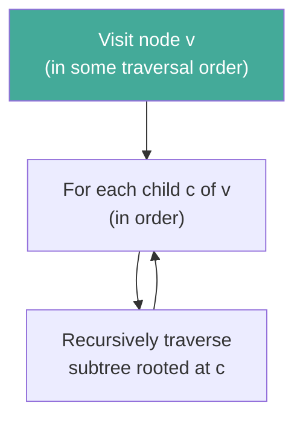

# Day 12 — Trees — Definitions and the Traversal Idea

> **Today's one idea:** A tree is a linked structure that branches — and the *order* in which you visit its nodes is not fixed by the structure itself, but by the *question* you are asking.
> **Reading time:** ~40 min · **Prereqs:** Day 11
> **Primary source:** Knuth, *TAOCP* Vol. 1, §2.3 "Trees" (pp. 308–328, 3rd ed.)

---

## The hook

A linked list is a chain: each node has exactly one successor. But many real structures branch. An organisation chart has one CEO, who has several VPs, each of whom has several directors. A file system has one root directory with subdirectories, each with their own subdirectories. An expression like `(3 + 4) × (2 − 1)` has a multiplication at the top, with additions and subtractions below.

All of these are trees. The linked list was the special case where every node branches to *at most one* successor. Now we remove that restriction.

The moment a structure can branch, a new question appears that never arose for lists: **in what order do you visit the nodes?** For a list there is only one sensible order — front to back. For a tree, there are at least three natural orders, each answering a different question. Choosing the right one is half the algorithm.

---

## Building the intuition

### The recursive definition

A **rooted tree** is defined recursively:
- An empty structure is a tree (the empty tree).
- A node r (the *root*) together with zero or more disjoint rooted trees $T_1, T_2, \ldots, T_k$ (the *subtrees* of r) is a tree.

This is not circular — each subtree is strictly smaller than the whole tree. The recursion terminates at leaves (nodes with zero subtrees).

Vocabulary:
- **Root:** the top node; the unique node with no parent.
- **Leaf:** a node with no children (zero subtrees).
- **Internal node:** a node with at least one child.
- **Parent / Child:** r is the parent of the roots of its subtrees; they are r's children.
- **Depth of a node:** number of edges from the root to that node. The root has depth 0.
- **Height of a tree:** maximum depth of any leaf.
- **Subtree rooted at v:** v together with all its descendants.

```
Example tree (height = 3):

          A           ← depth 0, root
        / | \
       B  C  D        ← depth 1
      / \    |
     E   F   G        ← depth 2
             |
             H        ← depth 3, leaf
```

A has children B, C, D. B has children E, F. D has child G. G has child H. E, F, C, H are leaves.

---

### Traversal — the central question

To **traverse** a tree means to visit every node exactly once. But *in what order*?

The three classic orders — which you will use constantly from Day 14 onward — are defined recursively and differ only in when you visit the root relative to its subtrees:

**Preorder (root → left subtree → right subtree):**
Visit the root *before* its subtrees. Natural for: copying a tree, printing a directory structure, prefix expressions.

**Inorder (left subtree → root → right subtree):**  
Visit the root *between* its subtrees. For a binary tree, this yields nodes in sorted order if the tree is a binary search tree — the single most important property in Module 5.

**Postorder (left subtree → right subtree → root):**  
Visit the root *after* its subtrees. Natural for: deleting a tree (delete children before parent), evaluating arithmetic expressions, computing sizes.

---

### Traced on the example tree

For a binary version of our example (just using A, B, D and their children):

```
      A
     / \
    B   D
   / \   \
  E   F   G
```

| Traversal | Visit order | Natural reading |
|-----------|-------------|-----------------|
| Preorder | A B E F D G | "I arrive at A, then explore left, then right" |
| Inorder | E B F A D G | "Left children first, then me, then right" |
| Postorder | E F B G D A | "Finish all children before me" |

**The expression tree connection:** for the expression `(3 + 4) × 2`:

```
      ×
     / \
    +   2
   / \
  3   4
```

- Postorder: `3 4 + 2 ×` — this is reverse Polish notation (stack-based evaluation)
- Inorder: `3 + 4 × 2` — this is the normal notation (requires parentheses for precedence)
- Preorder: `× + 3 4 2` — this is Polish prefix notation

The three traversals are not arbitrary orderings — each corresponds to a natural way of expressing or processing structured information.

---

## The formal picture

The recursive structure of traversal:



More precisely, for a binary tree where each node has a LEFT and RIGHT child (possibly Λ):

```python
def preorder(v):
    if v is None: return
    visit(v)           # ROOT first
    preorder(v.left)
    preorder(v.right)

def inorder(v):
    if v is None: return
    inorder(v.left)
    visit(v)           # ROOT in the middle
    inorder(v.right)

def postorder(v):
    if v is None: return
    postorder(v.left)
    postorder(v.right)
    visit(v)           # ROOT last
```

The only difference between the three is the position of `visit(v)`. This is the entire traversal idea compressed to one observation.

---

## Where it breaks / what it is not

**Misconception: "Tree" means binary tree.**  
A general tree can have any number of children per node. A binary tree is the special case of at most two children. Knuth treats the general case first. Day 13 will show how any general tree can be mapped to a binary tree.

**Misconception: Inorder traversal only makes sense for binary trees.**  
For a node with k children, "inorder" is not uniquely defined — there are k+1 positions where you could visit the root (before child 1, between child 1 and 2, ..., after child k). Inorder in the strict sense applies to binary trees. General trees use preorder and postorder.

**Misconception: Recursive traversal is the only way.**  
The recursive form is clean and matches the recursive definition. But recursion uses the call stack, which can overflow for very deep trees. An iterative version uses an explicit stack (see Exercise 3). Knuth discusses both in §2.3.1.

**Depth vs. height confusion:** The *depth* of a node is its distance from the root (root has depth 0). The *height* of a node is the length of the longest path from it to any leaf below it. The height of the *tree* is the height of the root. These are frequently confused; Knuth is careful to define both.

---

## Try it yourself

**Exercise 1 — Check understanding:** Write the preorder, inorder, and postorder traversals of the following tree:

```
        1
       / \
      2   3
     / \   \
    4   5   6
```

<details>
<summary>Solution</summary>

- **Preorder:** 1, 2, 4, 5, 3, 6
- **Inorder:** 4, 2, 5, 1, 3, 6
- **Postorder:** 4, 5, 2, 6, 3, 1
</details>

---

**Exercise 2 — Apply:** Build the tree from Exercise 1 in Python and implement all three traversals. Each should return a list of values.

<details>
<summary>Solution</summary>

```python
class TNode:
    def __init__(self, val, left=None, right=None):
        self.val = val
        self.left = left
        self.right = right

root = TNode(1,
    TNode(2, TNode(4), TNode(5)),
    TNode(3, right=TNode(6))
)

def preorder(v: TNode | None) -> list:
    if v is None: return []
    return [v.val] + preorder(v.left) + preorder(v.right)

def inorder(v: TNode | None) -> list:
    if v is None: return []
    return inorder(v.left) + [v.val] + inorder(v.right)

def postorder(v: TNode | None) -> list:
    if v is None: return []
    return postorder(v.left) + postorder(v.right) + [v.val]

print(preorder(root))   # [1, 2, 4, 5, 3, 6]
print(inorder(root))    # [4, 2, 5, 1, 3, 6]
print(postorder(root))  # [4, 5, 2, 6, 3, 1]
```
</details>

---

**Exercise 3 — Stretch:** Implement *iterative* preorder traversal using an explicit stack (a Python list). The recursive version uses the call stack implicitly — make that stack explicit. State the invariant of your loop.

<details>
<summary>Invariant and solution</summary>

**Invariant:** The stack contains exactly the nodes that have been reached but whose subtrees have not yet been fully visited, in the order we will visit them (top of stack = next to visit).

```python
def preorder_iterative(root: TNode | None) -> list:
    if root is None: return []
    result, stack = [], [root]
    while stack:                    # invariant holds here
        v = stack.pop()
        result.append(v.val)        # visit
        if v.right: stack.append(v.right)   # push right first
        if v.left:  stack.append(v.left)    # push left second (popped first)
    return result

print(preorder_iterative(root))  # [1, 2, 4, 5, 3, 6]  ✓
```

Push right before left: since we pop from the top, left will be popped (and thus visited) first. The explicit stack is exactly Knuth's "threaded tree" idea made concrete.
</details>

---

## Connect it back

Yesterday's doubly-linked list was a chain with two pointers per node. A tree node has two pointers too — LEFT and RIGHT — but the semantics differ fundamentally. In a list, NEXT and PREV go to the same level (siblings). In a tree, LEFT and RIGHT go *down* to children. Traversal is not linear anymore; it has a recursive structure that mirrors the tree's own recursive definition.

**Tomorrow:** The formal link between general trees and binary trees — Knuth's "natural correspondence" that lets him represent any forest as a binary tree. It is one of the most elegant ideas in the whole series.

**One sharp question you can answer now:**  
*Which traversal of a binary search tree visits all nodes in sorted (ascending) order — and why?*

---

## Suggested readings for today

**Required if you have 15 extra minutes:**  
Knuth, *TAOCP* Vol. 1, §2.3 "Trees," pp. 308–320. Read the recursive definition (p. 308–311) and the traversal discussion (pp. 318–320). Knuth's Figure 18 (p. 319) shows the three traversals on the same tree — more vivid than any description.

**If you want the deep version:**
- CLRS, 4th ed., §B.5 "Trees" (appendix, pp. 1177–1185) — a concise formal treatment of tree definitions. Short and clean.
- CLRS, §12.1 "What is a binary search tree?" (pp. 312–317) — previews Day 37 with full traversal context.

---

## Navigation

← **Previous:** [Day 11 — Doubly Linked and Circular Lists](day-11-doubly-linked-circular.md)  
→ **Next:** [Day 13 — Binary Trees and Representation](day-13-binary-trees.md)
