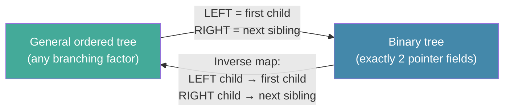

# Day 13 — Binary Trees and Representation

> **Today's one idea:** Any ordered forest — a collection of trees with any number of children per node — maps to a unique binary tree via a simple rule. One representation to rule them all.
> **Reading time:** ~35 min · **Prereqs:** Day 12
> **Primary source:** Knuth, *TAOCP* Vol. 1, §2.3.2 "Binary Tree Representation of Trees" (pp. 332–336, 3rd ed.)

---

## The hook

Yesterday you saw that a tree node can have *any* number of children — zero, one, two, ten, a hundred. In principle, you would need a variable-length list of child pointers per node. That is awkward to allocate and awkward to traverse.

Knuth shows a beautiful escape: *any ordered forest can be represented as a binary tree*, with every node having exactly two pointer fields. No variable-length arrays. No fuss.

The trick involves a rotation in perspective: the left pointer of a node connects to its **first child**, and the right pointer connects to its **next sibling**. A single, uniform representation covers all cases — including nodes with ten children, which simply become a chain of ten "next sibling" right pointers.

---

## Building the intuition

### Binary tree structure first

A **binary tree** is a tree where every node has at most a *left child* and a *right child*. Crucially, left and right are *distinct* — a node with only one child must specify whether it is the left or the right child.

```
Binary tree node:
  +-------+-------+-------+
  |  LEFT |  INFO |  RIGHT|
  +-------+-------+-------+
```

`LEFT(p)` = address of left child of node p, or Λ.  
`RIGHT(p)` = address of right child of node p, or Λ.

This is the standard representation for binary trees in memory — two pointer fields, exactly like the doubly-linked node from Day 11, but pointing *down* rather than left-right along a chain.

---

### The natural correspondence

Now the key idea. Given any ordered general tree, map it to a binary tree using this rule:

> **LEFT child of v in binary tree** = first child of v in the general tree  
> **RIGHT child of v in binary tree** = next sibling of v in the general tree

**Example:** Start with this general tree (root A, with three children B, C, D; B has children E, F):

```
General tree:          A
                     / | \
                    B  C  D
                   / \
                  E   F
```

Applying the rule:
- A's LEFT = B (A's first child). A's RIGHT = Λ (A has no sibling — it is the root).
- B's LEFT = E (B's first child). B's RIGHT = C (B's next sibling).
- C's LEFT = Λ (C has no children). C's RIGHT = D (C's next sibling).
- D's LEFT = Λ. D's RIGHT = Λ (last child, no sibling).
- E's LEFT = Λ. E's RIGHT = F (E's next sibling).
- F's LEFT = Λ. F's RIGHT = Λ.

```
Binary tree result:

        A
       /
      B
     / \
    E   C
     \   \
      F   D
```

This mapping is **bijective** (one-to-one and onto): every ordered forest has a unique binary tree representation, and every binary tree corresponds to a unique ordered forest. This is Knuth's "natural correspondence."

---

### Why it matters

1. **Uniform implementation:** every tree algorithm can be implemented with exactly two pointer fields per node. Memory allocators only need to handle fixed-size nodes.

2. **Binary trees are universal:** all tree algorithms in TAOCP — BSTs (Day 37), AVL trees (Day 38), heaps (Day 29) — are binary tree algorithms. The natural correspondence means they generalise to all trees.

3. **The correspondence preserves preorder:** the preorder traversal of the original general tree equals the preorder traversal of its binary tree representation. This is not a coincidence — it follows from the left-child / right-sibling structure directly.

---

### Special binary trees

**Full binary tree:** every node is either a leaf (0 children) or an internal node with exactly 2 children. No node with exactly 1 child.

**Complete binary tree:** all levels are fully filled except possibly the last, which is filled from left to right. This is the shape of a **heap** (Day 29).

```
Full:           Complete:
    A               A
   / \             / \
  B   C           B   C
 / \               \
D   E               (only left side fills)
```

**Perfect binary tree:** all leaves at the same depth, all internal nodes have 2 children. Height h → exactly $2^{h+1} - 1$ nodes.

These shapes have precise mathematical properties: heights, node counts, and leaf counts that determine algorithm costs in Modules 4 and 5.

---

## The formal picture

The natural correspondence, summarised:



**Key counts for a binary tree of n internal nodes:**

| Property | Value |
|----------|-------|
| Number of leaves (full binary tree) | n + 1 |
| Number of null pointers (Λ fields) | n + 1 |
| Height of a complete binary tree | ⌊log₂ n⌋ |
| Maximum height (degenerate/skewed) | n − 1 |

The "n+1 null pointers" result is a lovely identity: in any binary tree with n nodes, exactly n+1 of the 2n pointer fields are Λ. Proof by induction (Exercise 3).

---

## Where it breaks / what it is not

**Misconception: A binary tree is the same as an ordered tree with branching factor 2.**  
Not quite. In an ordered tree with branching factor 2, a node with one child does not distinguish left from right. In a proper binary tree, left and right are distinct. The distinction matters for search trees.

**Misconception: The natural correspondence changes the data.**  
It does not change the nodes or the information stored in them. It only reinterprets what the two pointer fields *mean*. The same physical node (LEFT, INFO, RIGHT) represents a first-child pointer in one reading and a left-child pointer in another.

**Misconception: Every binary tree comes from a general tree via this correspondence.**  
Yes — every binary tree *corresponds to* a unique forest. But when you design a binary search tree (Day 37), you are using the binary tree as a binary tree directly, not as an encoding of a general tree. The natural correspondence is a theoretical tool; not every binary tree you encounter is "hiding" a general tree.

---

## Try it yourself

**Exercise 1 — Check understanding:** Apply the natural correspondence to the following general tree and draw the resulting binary tree:

```
      R
    / | \
   A  B  C
  /\     |
 D  E    F
```

<details>
<summary>Solution</summary>

Applying LEFT = first child, RIGHT = next sibling:

```
R:  LEFT=A,  RIGHT=Λ
A:  LEFT=D,  RIGHT=B
B:  LEFT=Λ,  RIGHT=C
C:  LEFT=F,  RIGHT=Λ
D:  LEFT=Λ,  RIGHT=E
E:  LEFT=Λ,  RIGHT=Λ
F:  LEFT=Λ,  RIGHT=Λ

Binary tree:

    R
   /
  A
 / \
D   B
 \   \
  E   C
     /
    F
```
</details>

---

**Exercise 2 — Apply:** Write a Python function `general_to_binary(root)` that takes a general tree node (with a `children` list) and returns the root of the corresponding binary tree node (with `left` and `right` fields only).

<details>
<summary>Solution</summary>

```python
class GNode:   # General tree node
    def __init__(self, val, children=None):
        self.val = val
        self.children: list['GNode'] = children or []

class BNode:   # Binary tree node
    def __init__(self, val, left=None, right=None):
        self.val = val
        self.left = left
        self.right = right

def general_to_binary(g: GNode | None) -> BNode | None:
    if g is None: return None
    b = BNode(g.val)
    if g.children:
        # LEFT = first child (recursively converted)
        b.left = general_to_binary(g.children[0])
        # Chain remaining children as right siblings
        cur = b.left
        for sibling in g.children[1:]:
            cur.right = general_to_binary(sibling)
            cur = cur.right
    return b

# Test: R with children A, B, C; A has children D, E
tree = GNode('R', [
    GNode('A', [GNode('D'), GNode('E')]),
    GNode('B'),
    GNode('C', [GNode('F')])
])
bin_root = general_to_binary(tree)
print(bin_root.val)            # R
print(bin_root.left.val)       # A
print(bin_root.left.right.val) # B  (A's next sibling)
```
</details>

---

**Exercise 3 — Stretch:** Prove by induction that a binary tree with n nodes has exactly n+1 null (Λ) pointer fields.

<details>
<summary>Solution</summary>

**Base case (n=0):** empty tree has 0 nodes and 1 null pointer (the root itself is Λ). 0+1 = 1. ✓

**Inductive step:** Assume every binary tree with k nodes has k+1 null pointers. Take a binary tree T with n = k+1 nodes. Consider the root r: removing r splits T into left subtree $T_L$ with $k_L$ nodes and right subtree $T_R$ with $k_R$ nodes, where $k_L + k_R = k$.

By inductive hypothesis, $T_L$ has $k_L + 1$ null pointers and $T_R$ has $k_R + 1$ null pointers.

When we add r back: r's LEFT and RIGHT were previously Λ fields (counted in the totals above), but they now point to $T_L$ and $T_R$. So we *lose* 2 null pointers (r's LEFT and RIGHT are no longer Λ) but gain the null counts of $T_L$ and $T_R$.

Total null pointers in T = $(k_L + 1) + (k_R + 1) - 2 + 2$

Wait — more cleanly: the total pointer fields in T = 2n (two per node). The non-null ones = n − 1 (each non-root node has exactly one parent pointer pointing to it, so n−1 parent-to-child pointers are non-null). Null pointers = 2n − (n−1) = **n+1**. ✓
</details>

---

## Connect it back

You now have the complete representation toolkit: any tree, regardless of branching factor, fits into a binary tree structure with exactly two pointer fields per node. This is why every tree algorithm in TAOCP uses the same node layout.

Tomorrow's traversal algorithms (Day 14) work on this binary representation. And when you reach heaps (Day 29) and BSTs (Day 37), you will be using binary trees directly — not as encodings of general trees, but as structures designed from scratch for their specific search properties.

**Tomorrow:** Tree traversal algorithms — the three orders made algorithmic and efficient, plus a look at iterative traversal without recursion.

**One sharp question you can answer now:**  
*In the natural correspondence, what does a chain of right-child pointers in the binary tree represent in the original general tree?*

---

## Suggested readings for today

**Required if you have 15 extra minutes:**  
Knuth, *TAOCP* Vol. 1, §2.3.2 pp. 332–336. Read the natural correspondence and Knuth's proof that it is bijective. Figure 20 (p. 333) is the canonical diagram.

**If you want the deep version:**
- Knuth, *TAOCP* Vol. 1, §2.3.4 "Enumeration of Trees" (pp. 386–395) — how many binary trees with n nodes are there? Answer: the Catalan number $C_n = \binom{2n}{n}/(n+1)$. Generating functions (Day 6) make this derivable in a page.

---

## Navigation

← **Previous:** [Day 12 — Trees — Definitions and Traversal](day-12-trees.md)  
→ **Next:** [Day 14 — Tree Traversal Algorithms](day-14-tree-traversal.md)
